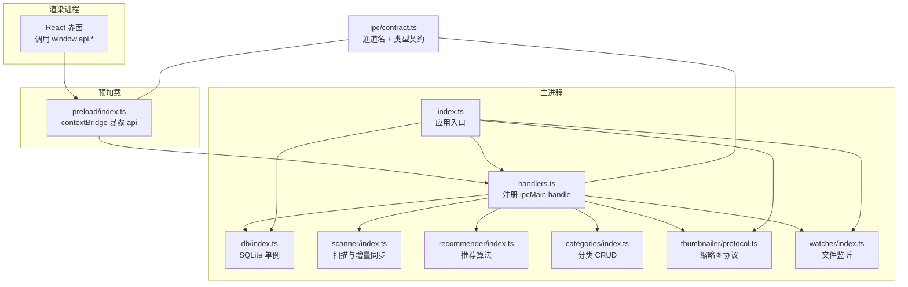
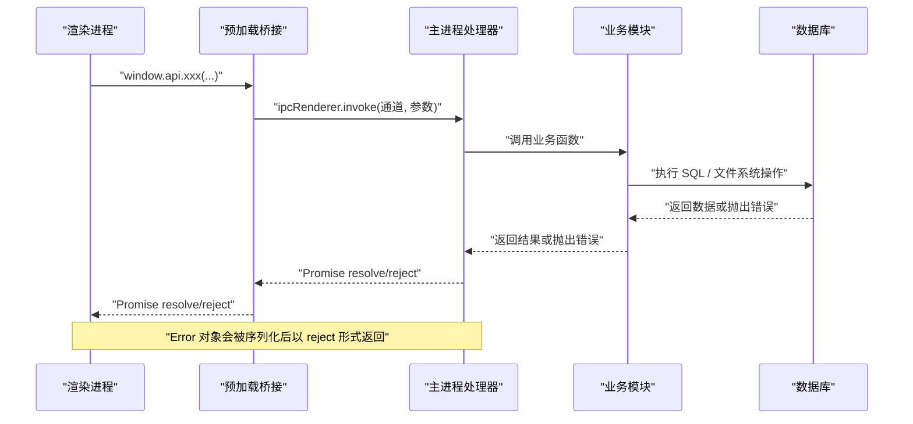
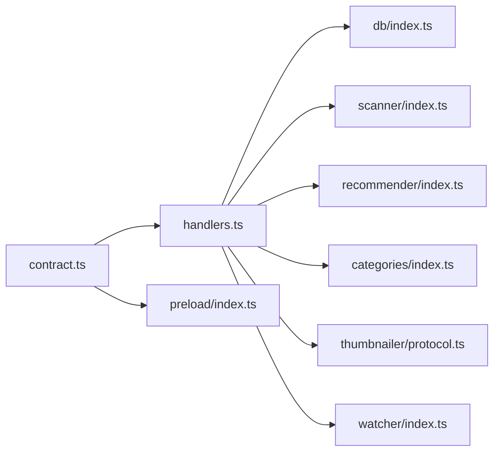

# IPC 错误处理机制

<cite>
**本文引用的文件列表**
- [src/main/ipc/contract.ts](file://src/main/ipc/contract.ts)
- [src/main/ipc/handlers.ts](file://src/main/ipc/handlers.ts)
- [src/preload/index.ts](file://src/preload/index.ts)
- [src/main/index.ts](file://src/main/index.ts)
- [src/main/db/index.ts](file://src/main/db/index.ts)
- [src/main/scanner/index.ts](file://src/main/scanner/index.ts)
- [src/main/recommender/index.ts](file://src/main/recommender/index.ts)
- [src/main/categories/index.ts](file://src/main/categories/index.ts)
- [src/main/watcher/index.ts](file://src/main/watcher/index.ts)
- [src/main/thumbnailer/protocol.ts](file://src/main/thumbnailer/protocol.ts)
</cite>

## 目录
1. [简介](#简介)
2. [项目结构](#项目结构)
3. [核心组件](#核心组件)
4. [架构总览](#架构总览)
5. [详细组件分析](#详细组件分析)
6. [依赖关系分析](#依赖关系分析)
7. [性能与可靠性考量](#性能与可靠性考量)
8. [故障诊断与调试指南](#故障诊断与调试指南)
9. [结论](#结论)

## 简介
本文件围绕 Serendip 应用的 IPC（主进程与渲染进程通信）错误处理机制进行系统化说明。重点覆盖：
- 错误分类与处理策略：网络错误、业务错误、系统错误在 IPC 链路中的定位与处置
- 错误传播机制：跨进程错误序列化、传递路径与客户端展示
- 重试与超时：指数退避与连接池管理建议
- 优雅降级与用户体验优化：失败时的可恢复行为与提示策略
- 日志记录与监控告警：关键错误埋点与可观测性
- 故障诊断与调试工具：如何快速定位问题

## 项目结构
Serendip 采用 Electron 三进程模型，IPC 契约由单一文件定义，主进程注册处理器，预加载脚本暴露类型安全的 API 给渲染层。

图表来源
- [src/main/ipc/handlers.ts:1-292](file://src/main/ipc/handlers.ts#L1-L292)
- [src/preload/index.ts:1-104](file://src/preload/index.ts#L1-L104)
- [src/main/ipc/contract.ts:1-130](file://src/main/ipc/contract.ts#L1-L130)
- [src/main/index.ts:1-134](file://src/main/index.ts#L1-L134)
- [src/main/db/index.ts:1-190](file://src/main/db/index.ts#L1-L190)
- [src/main/scanner/index.ts:1-323](file://src/main/scanner/index.ts#L1-L323)
- [src/main/recommender/index.ts:1-518](file://src/main/recommender/index.ts#L1-L518)
- [src/main/categories/index.ts:1-166](file://src/main/categories/index.ts#L1-L166)
- [src/main/watcher/index.ts:1-56](file://src/main/watcher/index.ts#L1-L56)
- [src/main/thumbnailer/protocol.ts:221-268](file://src/main/thumbnailer/protocol.ts#L221-L268)

章节来源
- [src/main/ipc/contract.ts:1-130](file://src/main/ipc/contract.ts#L1-L130)
- [src/main/ipc/handlers.ts:1-292](file://src/main/ipc/handlers.ts#L1-L292)
- [src/preload/index.ts:1-104](file://src/preload/index.ts#L1-L104)
- [src/main/index.ts:1-134](file://src/main/index.ts#L1-L134)

## 核心组件
- IPC 契约与通道常量：集中定义所有 IPC 方法签名与通道名，确保主/预加载/渲染三方类型一致
- 主进程处理器：将渲染层的 invoke 请求路由到具体业务模块，并返回 Promise 结果或抛出异常
- 预加载桥接：通过 contextBridge 暴露 window.api，封装 ipcRenderer.invoke 调用
- 数据库层：better-sqlite3 单例，WAL 模式，迁移脚本；提供事务能力
- 业务模块：扫描、推荐、分类、缩略图协议、文件监听等

章节来源
- [src/main/ipc/contract.ts:1-130](file://src/main/ipc/contract.ts#L1-L130)
- [src/main/ipc/handlers.ts:1-292](file://src/main/ipc/handlers.ts#L1-L292)
- [src/preload/index.ts:1-104](file://src/preload/index.ts#L1-L104)
- [src/main/db/index.ts:1-190](file://src/main/db/index.ts#L1-L190)

## 架构总览
下图展示了典型 IPC 调用链路与错误传播路径。Electron 的 ipcMain.handle 会将异步函数抛出的 Error 对象序列化为普通对象并通过 Promise reject 回传给渲染层。

图表来源
- [src/preload/index.ts:1-104](file://src/preload/index.ts#L1-L104)
- [src/main/ipc/handlers.ts:1-292](file://src/main/ipc/handlers.ts#L1-L292)
- [src/main/db/index.ts:1-190](file://src/main/db/index.ts#L1-L190)

## 详细组件分析

### 错误分类与处理策略
- 系统错误
  - 文件系统访问失败（如 stat 失败）、磁盘不可用、权限不足
  - SQLite 写入失败、锁冲突、约束违反
  - 平台特性不支持（如 Windows Controls Overlay 在 macOS 上）
- 业务错误
  - 参数校验失败（空名称、过长名称、不存在 ID）
  - 唯一约束冲突（重复分类名）
  - 资源失效标记（缩略图生成失败、文件缺失）
- 网络错误
  - 当前代码库未涉及外部网络请求；若未来引入，应统一归类为网络错误并纳入重试策略

处理原则
- 主进程侧尽量捕获底层错误，转换为明确、可读的业务错误信息
- 对可恢复错误（如临时锁冲突、IO 抖动）提供重试与降级
- 对不可恢复错误（如唯一约束冲突）直接向上抛出，由客户端提示用户修正输入

章节来源
- [src/main/categories/index.ts:34-76](file://src/main/categories/index.ts#L34-L76)
- [src/main/thumbnailer/protocol.ts:221-268](file://src/main/thumbnailer/protocol.ts#L221-L268)
- [src/main/index.ts:25-36](file://src/main/index.ts#L25-L36)

### 错误传播机制
- 序列化与跨进程传递
  - 使用 ipcMain.handle 注册的异步函数中抛出的 Error 会被 Electron 内部序列化为普通对象，并通过 Promise reject 返回给渲染层
  - 预加载层仅做透传，不吞掉错误
- 客户端错误显示
  - 渲染层应在调用处 try/catch，根据错误类型给出友好提示（例如“分类名已存在”、“文件不存在”）
  - 对于可恢复错误，可结合重试与降级策略提升体验

章节来源
- [src/preload/index.ts:1-104](file://src/preload/index.ts#L1-L104)
- [src/main/ipc/handlers.ts:1-292](file://src/main/ipc/handlers.ts#L1-L292)

### 重试机制与超时处理
- 指数退避建议
  - 针对 I/O 抖动、SQLite 锁冲突等场景，可在调用方实现指数退避重试（初始间隔、最大重试次数、最大间隔上限）
  - 注意幂等性与副作用控制，避免重复写入导致状态不一致
- 超时控制建议
  - 对长耗时操作（如扫描根目录、批量更新）增加超时保护，防止阻塞 UI
  - 使用 AbortController 或自定义超时包装器，配合进度回调及时中断
- 连接池管理建议
  - better-sqlite3 是同步 API，适合单线程；如需并发写，建议使用队列串行化写入，避免竞争
  - 对高频读操作可考虑内存缓存热点数据，降低数据库压力

[本节为通用指导，不直接分析具体文件]

### 优雅降级与用户体验优化
- 缩略图生成失败
  - 在主进程协议层捕获错误并标记文件为“不可用”，同时记录原因，避免影响整体浏览流程
- 文件缺失
  - 打开文件或显示文件夹时检测文件是否存在，不存在则自动标记失效，避免后续反复尝试
- 分类名冲突
  - 向用户提示“分类名已存在”，引导修改名称
- 扫描失败
  - 启动阶段静默扫描失败时记录日志，不影响窗口创建；用户可手动触发重新扫描

章节来源
- [src/main/thumbnailer/protocol.ts:221-268](file://src/main/thumbnailer/protocol.ts#L221-L268)
- [src/main/ipc/handlers.ts:156-185](file://src/main/ipc/handlers.ts#L156-L185)
- [src/main/categories/index.ts:34-76](file://src/main/categories/index.ts#L34-L76)
- [src/main/index.ts:104-125](file://src/main/index.ts#L104-L125)

### 错误日志记录与监控告警
- 控制台日志
  - 启动阶段扫描失败、文件监听错误、协议层标记不可用失败等均有 console.error 输出
- 结构化日志建议
  - 为关键错误添加上下文（操作名、参数、时间戳、错误码），便于检索与分析
- 监控告警建议
  - 将关键错误上报至本地日志文件或远程监控系统（如 Sentry），按严重级别分级告警

章节来源
- [src/main/index.ts:115-117](file://src/main/index.ts#L115-L117)
- [src/main/watcher/index.ts:36](file://src/main/watcher/index.ts#L36)
- [src/main/thumbnailer/protocol.ts:229-231](file://src/main/thumbnailer/protocol.ts#L229-L231)

### 故障诊断与调试工具
- 启用开发模式
  - 使用 npm run dev 启动，便于查看控制台日志与断点调试
- 检查数据库状态
  - 确认 WAL 模式与迁移是否成功执行，必要时导出 serendip.db 进行分析
- 验证 IPC 通道
  - 在预加载层打印通道名与参数，确认调用是否正确
- 文件监听与缩略图
  - 观察 watcher 的错误事件与缩略图协议错误，定位 IO 或格式问题

章节来源
- [src/main/db/index.ts:18-28](file://src/main/db/index.ts#L18-L28)
- [src/main/watcher/index.ts:32-37](file://src/main/watcher/index.ts#L32-L37)
- [src/main/thumbnailer/protocol.ts:221-268](file://src/main/thumbnailer/protocol.ts#L221-L268)

## 依赖关系分析
IPC 相关依赖集中在三个位置：契约、处理器、预加载桥接。业务模块通过处理器间接被调用。

图表来源
- [src/main/ipc/contract.ts:1-130](file://src/main/ipc/contract.ts#L1-L130)
- [src/main/ipc/handlers.ts:1-292](file://src/main/ipc/handlers.ts#L1-L292)
- [src/preload/index.ts:1-104](file://src/preload/index.ts#L1-L104)

章节来源
- [src/main/ipc/contract.ts:1-130](file://src/main/ipc/contract.ts#L1-L130)
- [src/main/ipc/handlers.ts:1-292](file://src/main/ipc/handlers.ts#L1-L292)
- [src/preload/index.ts:1-104](file://src/preload/index.ts#L1-L104)

## 性能与可靠性考量
- 数据库事务与批处理
  - 大量写入使用事务包裹，减少磁盘 I/O 次数，提高吞吐
- 扫描增量同步
  - 基于 mtime/size 差异判断更新，避免全量重算
- 文件监听合并
  - 使用队列与定时器合并变更，降低频繁刷新带来的开销
- 缩略图懒加载
  - 首次访问时才生成缩略图，避免扫描阶段阻塞

章节来源
- [src/main/scanner/index.ts:123-132](file://src/main/scanner/index.ts#L123-L132)
- [src/main/scanner/index.ts:194-207](file://src/main/scanner/index.ts#L194-L207)
- [src/main/watcher/index.ts:16-37](file://src/main/watcher/index.ts#L16-L37)
- [src/main/thumbnailer/protocol.ts:238-268](file://src/main/thumbnailer/protocol.ts#L238-L268)

## 故障诊断与调试指南
- 常见问题定位
  - 分类名冲突：检查 createCategory/renameCategory 的错误分支
  - 文件缺失：检查 REVEAL_IN_FOLDER/OPEN_FILE 的路径存在性判断
  - 缩略图失败：检查 ensureThumb 与 markUnavailable 的错误处理
  - 扫描失败：检查启动阶段的 scanRoot 与 watcher 初始化
- 调试步骤
  - 在 handlers 对应通道处打断点，观察入参与返回值
  - 在业务模块关键路径添加日志，记录错误上下文
  - 导出数据库文件，核对 schema 与数据一致性

章节来源
- [src/main/categories/index.ts:34-76](file://src/main/categories/index.ts#L34-L76)
- [src/main/ipc/handlers.ts:156-185](file://src/main/ipc/handlers.ts#L156-L185)
- [src/main/thumbnailer/protocol.ts:221-268](file://src/main/thumbnailer/protocol.ts#L221-L268)
- [src/main/index.ts:104-125](file://src/main/index.ts#L104-L125)

## 结论
Serendip 的 IPC 错误处理遵循“主进程捕获并转换、预加载透传、渲染层展示”的分层策略。当前代码库已具备基础的系统错误与业务错误处理能力，并在多处实现了优雅降级（如缩略图失败标记、文件缺失自动失效）。建议在后续迭代中补充统一的错误类型体系、重试与超时策略、以及更完善的日志与监控方案，以提升系统的可观测性与鲁棒性。