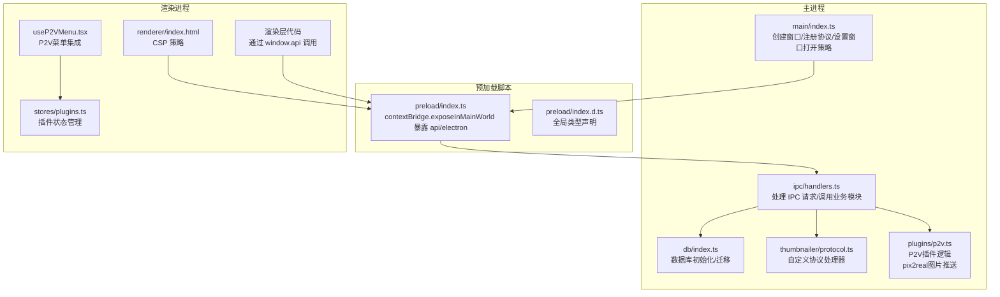
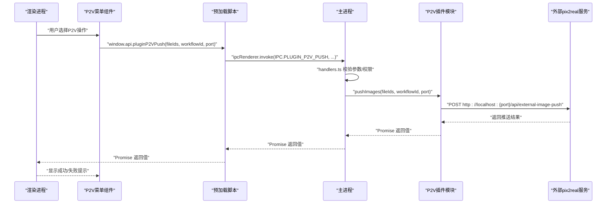
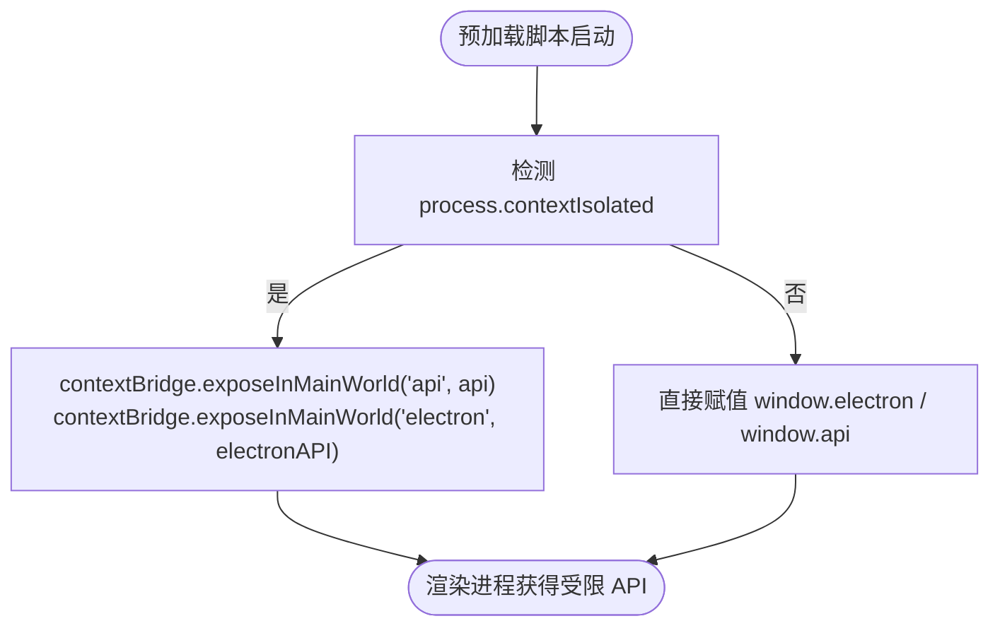
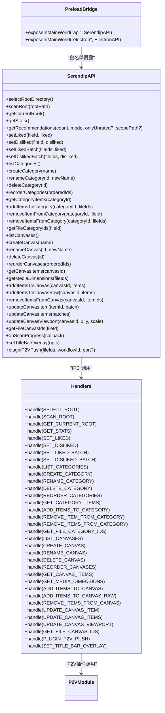
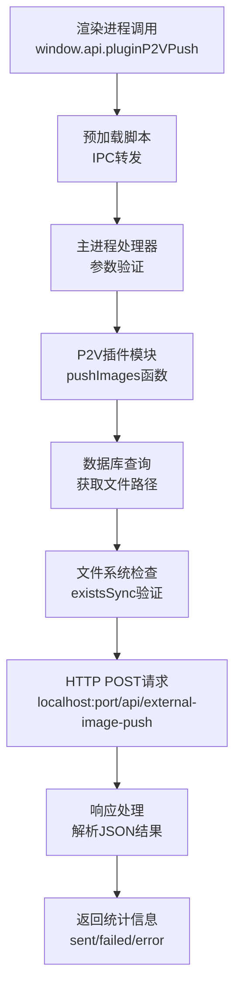
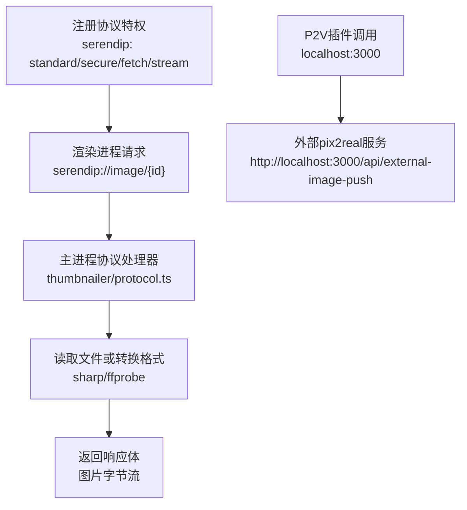
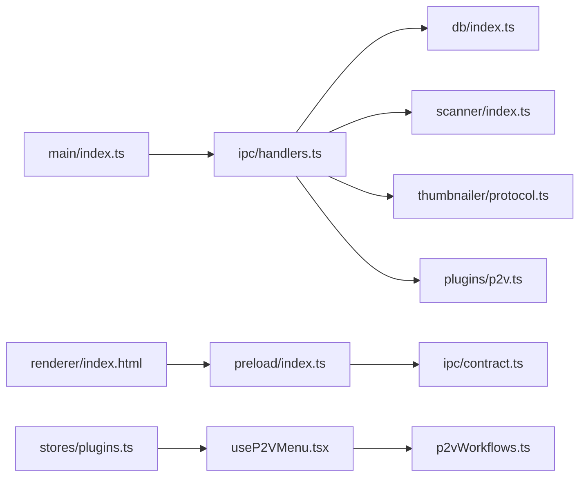

# 预加载脚本安全机制

<cite>
**本文引用的文件**   
- [src/main/index.ts](file://src/main/index.ts)
- [src/preload/index.ts](file://src/preload/index.ts)
- [src/preload/index.d.ts](file://src/preload/index.d.ts)
- [src/main/ipc/contract.ts](file://src/main/ipc/contract.ts)
- [src/main/ipc/handlers.ts](file://src/main/ipc/handlers.ts)
- [src/renderer/index.html](file://src/renderer/index.html)
- [src/main/db/index.ts](file://src/main/db/index.ts)
- [src/main/scanner/index.ts](file://src/main/scanner/index.ts)
- [src/main/thumbnailer/protocol.ts](file://src/main/thumbnailer/protocol.ts)
- [src/main/plugins/p2v.ts](file://src/main/plugins/p2v.ts)
- [src/renderer/src/hooks/useP2VMenu.tsx](file://src/renderer/src/hooks/useP2VMenu.tsx)
- [src/renderer/src/lib/p2vWorkflows.ts](file://src/renderer/src/lib/p2vWorkflows.ts)
- [src/renderer/src/stores/plugins.ts](file://src/renderer/src/stores/plugins.ts)
</cite>

## 更新摘要
**变更内容**   
- 新增P2V插件API暴露章节，详细说明pix2real图片推送功能的IPC通信机制
- 更新API白名单列表，包含pluginP2VPush方法的安全实现
- 扩展架构图表，展示P2V插件的完整通信链路
- 增加P2V插件的安全考虑和防护措施说明

## 目录
1. [简介](#简介)
2. [项目结构](#项目结构)
3. [核心组件](#核心组件)
4. [架构总览](#架构总览)
5. [详细组件分析](#详细组件分析)
6. [依赖关系分析](#依赖关系分析)
7. [性能与安全权衡](#性能与安全权衡)
8. [故障排查指南](#故障排查指南)
9. [结论](#结论)
10. [附录：最佳实践与审计清单](#附录最佳实践与审计清单)

## 简介
本文件围绕 Serendip 应用的"预加载脚本安全机制"展开，系统性阐述 Electron 的安全隔离模型、预加载脚本的作用域限制、API 暴露策略（白名单、权限控制、访问验证）、上下文隔离的实现原理与安全边界保障，并结合本项目实际代码给出安全的 API 封装示例。同时覆盖跨域安全与内容安全策略（CSP）配置、常见漏洞防护与代码审计要点，帮助读者在保持功能可用的前提下最大化安全性。

**更新** 新增了P2V插件API的安全暴露机制，为渲染进程提供安全的pix2real图片推送能力。

## 项目结构
Serendip 采用典型的主进程-预加载脚本-渲染进程三层架构：
- 主进程负责窗口管理、协议注册、IPC 路由与系统能力调用。
- 预加载脚本作为受信任桥接层，仅暴露最小必要 API 给渲染进程。
- 渲染进程通过受限的 window.api 与 window.electron 与主进程交互。

**图示来源**
- [src/main/index.ts:25-90](file://src/main/index.ts#L25-L90)
- [src/main/ipc/handlers.ts:40-120](file://src/main/ipc/handlers.ts#L40-L120)
- [src/preload/index.ts:91-103](file://src/preload/index.ts#L91-L103)
- [src/renderer/index.html:6-9](file://src/renderer/index.html#L6-L9)
- [src/main/plugins/p2v.ts:19-105](file://src/main/plugins/p2v.ts#L19-L105)
- [src/renderer/src/hooks/useP2VMenu.tsx:32-88](file://src/renderer/src/hooks/useP2VMenu.tsx#L32-L88)
- [src/renderer/src/stores/plugins.ts:13-28](file://src/renderer/src/stores/plugins.ts#L13-L28)

章节来源
- [src/main/index.ts:25-90](file://src/main/index.ts#L25-L90)
- [src/preload/index.ts:91-103](file://src/preload/index.ts#L91-L103)
- [src/renderer/index.html:6-9](file://src/renderer/index.html#L6-L9)

## 核心组件
- 主进程入口与窗口配置：注册自定义协议特权、创建 BrowserWindow、设置 preload、禁用 sandbox、拦截新窗口打开。
- 预加载脚本：使用 contextBridge 将最小 API 集暴露到 window.api；兼容非隔离环境回退。
- IPC 契约与处理器：以 contract.ts 为真源定义接口与通道名；handlers.ts 实现具体逻辑并调用业务模块。
- 渲染进程 CSP：在 index.html 中声明严格的内容安全策略，限制脚本、样式、媒体与连接来源。
- **新增** P2V插件模块：提供安全的pix2real图片推送功能，支持工作流选择和端口配置。

章节来源
- [src/main/index.ts:25-90](file://src/main/index.ts#L25-L90)
- [src/preload/index.ts:1-103](file://src/preload/index.ts#L1-L103)
- [src/main/ipc/contract.ts:1-130](file://src/main/ipc/contract.ts#L1-L130)
- [src/main/ipc/handlers.ts:40-120](file://src/main/ipc/handlers.ts#L40-L120)
- [src/renderer/index.html:6-9](file://src/renderer/index.html#L6-L9)
- [src/main/plugins/p2v.ts:1-106](file://src/main/plugins/p2v.ts#L1-L106)

## 架构总览
下图展示从渲染进程发起 API 调用到主进程执行业务逻辑的完整链路，以及关键安全点。

**图示来源**
- [src/preload/index.ts:78-80](file://src/preload/index.ts#L78-L80)
- [src/main/ipc/handlers.ts:254-256](file://src/main/ipc/handlers.ts#L254-L256)
- [src/main/plugins/p2v.ts:19-105](file://src/main/plugins/p2v.ts#L19-L105)
- [src/renderer/src/hooks/useP2VMenu.tsx:74-81](file://src/renderer/src/hooks/useP2VMenu.tsx#L74-L81)

## 详细组件分析

### 安全隔离模型与上下文隔离
- 上下文隔离启用：预加载脚本通过 process.contextIsolated 判断是否处于隔离上下文，并使用 contextBridge.exposeInMainWorld 暴露最小 API 集合。
- 作用域限制：渲染进程无法直接访问 Node.js 或 Electron 主进程对象，只能通过预加载脚本提供的白名单方法间接调用。
- 兼容性回退：在非隔离环境下，预加载脚本会直接挂载 window.electron 与 window.api，但应尽量避免此模式。

**图示来源**
- [src/preload/index.ts:94-106](file://src/preload/index.ts#L94-L106)

章节来源
- [src/preload/index.ts:94-106](file://src/preload/index.ts#L94-L106)

### API 暴露策略：白名单、权限控制与访问验证
- 白名单机制：仅在 preload/index.ts 中显式定义的函数会被暴露，未列出的方法不可被渲染进程调用。
- 权限控制：所有敏感操作（如打开文件、打开文件夹、修改数据库状态、P2V插件调用）均在主进程 handlers.ts 中集中处理，避免在渲染进程直接执行。
- 访问验证：对路径、ID、批量 ID 列表等输入进行基本校验与转义（例如 LIKE 查询中的特殊字符转义），防止注入与越权。

**更新** 新增了P2V插件API的安全暴露：

**图示来源**
- [src/main/ipc/contract.ts:13-83](file://src/main/ipc/contract.ts#L13-L83)
- [src/preload/index.ts:9-92](file://src/preload/index.ts#L9-L92)
- [src/main/ipc/handlers.ts:40-290](file://src/main/ipc/handlers.ts#L40-L290)
- [src/main/plugins/p2v.ts:19-105](file://src/main/plugins/p2v.ts#L19-L105)

章节来源
- [src/main/ipc/contract.ts:13-83](file://src/main/ipc/contract.ts#L13-L83)
- [src/preload/index.ts:9-92](file://src/preload/index.ts#L9-L92)
- [src/main/ipc/handlers.ts:40-290](file://src/main/ipc/handlers.ts#L40-L290)

### P2V插件API安全机制
**新增** P2V（pix2real）插件提供了安全的图片推送功能，允许用户将本地媒体文件推送到外部图像处理服务。

#### 安全设计原则
- **最小暴露原则**：仅暴露 pluginP2VPush 方法，不直接暴露网络请求能力
- **参数验证**：在主进程中验证文件ID有效性、工作流ID范围、端口号合法性
- **超时保护**：网络请求设置8秒超时，防止长时间阻塞
- **错误隔离**：单个文件推送失败不影响其他文件的处理
- **本地服务限制**：强制使用 localhost 地址，禁止外部域名访问

#### 插件工作流程

**图示来源**
- [src/preload/index.ts:78-80](file://src/preload/index.ts#L78-L80)
- [src/main/ipc/handlers.ts:254-256](file://src/main/ipc/handlers.ts#L254-L256)
- [src/main/plugins/p2v.ts:19-105](file://src/main/plugins/p2v.ts#L19-L105)

#### 安全配置选项
- **端口配置**：默认3000端口，可通过渲染进程设置，支持1-65535范围
- **工作流选择**：预定义11个工作流（ID 0-10），防止任意工作流ID
- **文件过滤**：仅支持已扫描入库的文件，防止路径遍历攻击
- **错误处理**：首次连接失败时立即返回错误，避免无效重试

章节来源
- [src/main/plugins/p2v.ts:1-106](file://src/main/plugins/p2v.ts#L1-L106)
- [src/main/ipc/handlers.ts:254-256](file://src/main/ipc/handlers.ts#L254-L256)
- [src/renderer/src/hooks/useP2VMenu.tsx:32-88](file://src/renderer/src/hooks/useP2VMenu.tsx#L32-L88)
- [src/renderer/src/lib/p2vWorkflows.ts:1-19](file://src/renderer/src/lib/p2vWorkflows.ts#L1-L19)

### 上下文隔离与安全边界保障
- 最小暴露原则：仅暴露必要的 API，避免直接暴露 ipcRenderer 实例或 Node 模块。
- 事件订阅安全：扫描进度回调通过 onScanProgress 提供订阅/取消订阅能力，避免全局监听泄露。
- 窗口装饰控制：setTitleBarOverlay 通过 IPC 调用，确保只在主进程调整 UI 行为。
- **新增** 插件API安全：P2V插件调用完全在主进程执行，渲染进程仅能传递参数。

章节来源
- [src/preload/index.ts:78-89](file://src/preload/index.ts#L78-L89)
- [src/main/ipc/handlers.ts:259-289](file://src/main/ipc/handlers.ts#L259-L289)

### 安全的 API 封装示例（基于现有实现）
- 选择根目录与扫描：渲染进程通过 window.api.selectRootDirectory 与 window.api.scanRoot 触发主进程对话框与增量同步流程，并在 handlers.ts 中推送进度事件。
- 喜欢/不感兴趣标记：通过 setLiked/setDisliked 与批量版本更新数据库状态，使用事务提升性能与一致性。
- 分类与画布管理：统一通过 IPC 通道调用，避免渲染进程直接访问数据库或文件系统。
- **新增** P2V插件调用：通过 pluginP2VPush 方法安全地推送图片到外部服务，支持工作流选择和端口配置。

章节来源
- [src/main/ipc/handlers.ts:42-60](file://src/main/ipc/handlers.ts#L42-L60)
- [src/main/ipc/handlers.ts:94-125](file://src/main/ipc/handlers.ts#L94-L125)
- [src/main/ipc/handlers.ts:188-250](file://src/main/ipc/handlers.ts#L188-L250)
- [src/main/plugins/p2v.ts:19-105](file://src/main/plugins/p2v.ts#L19-L105)

### 跨域安全与内容安全策略（CSP）配置
- 自定义协议：主进程注册 serendip 协议特权，允许标准 URL、安全上下文、Fetch API 与流式传输，用于缩略图与全分辨率图片服务。
- CSP 策略：渲染进程 index.html 中声明 default-src 'self'，script-src 'self'，style-src 允许内联样式，img-src/media-src 允许本地与自定义协议，connect-src 允许 ws/wss。
- 外部链接拦截：主进程通过 setWindowOpenHandler 拦截新窗口打开，统一交由系统浏览器打开，防止应用内导航到不受信站点。
- **新增** 本地服务限制：P2V插件强制使用 localhost 地址，防止跨域访问风险。

**图示来源**
- [src/main/index.ts:25-36](file://src/main/index.ts#L25-L36)
- [src/main/thumbnailer/protocol.ts:155-187](file://src/main/thumbnailer/protocol.ts#L155-L187)
- [src/renderer/index.html:6-9](file://src/renderer/index.html#L6-L9)
- [src/main/plugins/p2v.ts:25-55](file://src/main/plugins/p2v.ts#L25-L55)

章节来源
- [src/main/index.ts:25-36](file://src/main/index.ts#L25-L36)
- [src/renderer/index.html:6-9](file://src/renderer/index.html#L6-L9)
- [src/main/thumbnailer/protocol.ts:155-187](file://src/main/thumbnailer/protocol.ts#L155-L187)
- [src/main/plugins/p2v.ts:25-55](file://src/main/plugins/p2v.ts#L25-L55)

### 常见安全漏洞防护与代码审计要点
- SQL 注入防护：在 LIKE 查询中对反斜杠、百分号、下划线进行转义，避免恶意路径导致注入。
- 路径与 ID 校验：对 openFile/openFolder/revealInFolder 等方法传入的路径与 ID 进行存在性检查与有效性判断。
- 批量操作事务化：批量更新喜欢/不感兴趣使用事务，保证一致性与性能。
- 资源清理：缩略图生成失败时标记 unavailable，并在后续扫描中解封或清理。
- 外部链接控制：禁止应用内打开任意 URL，统一由系统浏览器处理。
- **新增** 网络请求安全：P2V插件使用 AbortController 设置超时，防止长时间阻塞；强制 localhost 访问，避免跨域风险。
- **新增** 参数验证：工作流ID限制在0-10范围内，端口号验证1-65535范围。

章节来源
- [src/main/ipc/handlers.ts:128-146](file://src/main/ipc/handlers.ts#L128-L146)
- [src/main/ipc/handlers.ts:157-185](file://src/main/ipc/handlers.ts#L157-L185)
- [src/main/ipc/handlers.ts:106-125](file://src/main/ipc/handlers.ts#L106-L125)
- [src/main/scanner/index.ts:319-322](file://src/main/scanner/index.ts#L319-L322)
- [src/main/index.ts:80-84](file://src/main/index.ts#L80-L84)
- [src/main/plugins/p2v.ts:57-99](file://src/main/plugins/p2v.ts#L57-L99)

## 依赖关系分析
- 主进程依赖：Electron 核心模块（app、BrowserWindow、protocol、shell、ipcMain）、better-sqlite3、fdir、sharp、fluent-ffmpeg 等。
- 预加载脚本依赖：@electron-toolkit/preload 提供的 ElectronAPI，以及共享的 IPC 契约类型。
- 渲染进程依赖：React 生态与 Zustand 状态管理，通过 window.api 与主进程通信。
- **新增** P2V插件依赖：fs.existsSync 用于文件存在性检查，fetch API 用于HTTP请求。

**图示来源**
- [src/main/index.ts:25-90](file://src/main/index.ts#L25-L90)
- [src/main/ipc/handlers.ts:40-120](file://src/main/ipc/handlers.ts#L40-L120)
- [src/preload/index.ts:1-10](file://src/preload/index.ts#L1-L10)
- [src/renderer/index.html:6-9](file://src/renderer/index.html#L6-L9)
- [src/main/plugins/p2v.ts:1-106](file://src/main/plugins/p2v.ts#L1-L106)
- [src/renderer/src/stores/plugins.ts:1-34](file://src/renderer/src/stores/plugins.ts#L1-L34)
- [src/renderer/src/hooks/useP2VMenu.tsx:1-91](file://src/renderer/src/hooks/useP2VMenu.tsx#L1-L91)
- [src/renderer/src/lib/p2vWorkflows.ts:1-19](file://src/renderer/src/lib/p2vWorkflows.ts#L1-L19)

章节来源
- [src/main/index.ts:25-90](file://src/main/index.ts#L25-L90)
- [src/main/ipc/handlers.ts:40-120](file://src/main/ipc/handlers.ts#L40-L120)
- [src/preload/index.ts:1-10](file://src/preload/index.ts#L1-L10)
- [src/renderer/index.html:6-9](file://src/renderer/index.html#L6-L9)
- [src/main/plugins/p2v.ts:1-106](file://src/main/plugins/p2v.ts#L1-L106)

## 性能与安全权衡
- 关闭 sandbox：当前配置禁用 sandbox 以提升性能与兼容性，但需强化预加载脚本白名单与主进程权限控制。
- 事务批写：批量更新使用事务减少 I/O 开销，提高一致性。
- 增量扫描：通过 diff 与批量写入降低全量扫描成本，结合进度推送改善用户体验。
- 自定义协议：使用 serendip 协议提供高效媒体访问，避免跨域限制与额外网络开销。
- **新增** P2V插件性能优化：使用 AbortController 设置8秒超时，避免长时间阻塞；首次连接失败时立即返回，避免无效重试。

章节来源
- [src/main/index.ts:61-64](file://src/main/index.ts#L61-L64)
- [src/main/ipc/handlers.ts:106-125](file://src/main/ipc/handlers.ts#L106-L125)
- [src/main/scanner/index.ts:36-239](file://src/main/scanner/index.ts#L36-L239)
- [src/main/index.ts:25-36](file://src/main/index.ts#L25-L36)
- [src/main/plugins/p2v.ts:57-99](file://src/main/plugins/p2v.ts#L57-L99)

## 故障排查指南
- 协议未生效：确认在 app.whenReady 之前注册了 protocol.registerSchemesAsPrivileged。
- CSP 阻止资源：检查 img-src/media-src/connect-src 是否包含所需来源（如 serendip:、ws/wss）。
- IPC 无响应：核对 contract.ts 中的通道名与 handlers.ts 中的 handle 是否一致，并确保 preload 正确暴露对应方法。
- 数据库异常：查看 WAL 模式与迁移是否成功执行，必要时检查表结构与索引。
- 外部链接打开：确认 setWindowOpenHandler 已拦截并交由 shell.openExternal。
- **新增** P2V插件问题：检查pix2real服务是否在指定端口运行；确认文件路径有效且文件存在；查看控制台日志中的[P2V]前缀输出。

章节来源
- [src/main/index.ts:25-36](file://src/main/index.ts#L25-L36)
- [src/renderer/index.html:6-9](file://src/renderer/index.html#L6-L9)
- [src/main/ipc/contract.ts:85-139](file://src/main/ipc/contract.ts#L85-L139)
- [src/main/ipc/handlers.ts:40-120](file://src/main/ipc/handlers.ts#L40-L120)
- [src/main/db/index.ts:8-28](file://src/main/db/index.ts#L8-L28)
- [src/main/index.ts:80-84](file://src/main/index.ts#L80-L84)
- [src/main/plugins/p2v.ts:24-92](file://src/main/plugins/p2v.ts#L24-L92)

## 结论
Serendip 通过严格的预加载脚本白名单、集中化的主进程 IPC 处理、最小化 API 暴露与合理的 CSP 配置，构建了较为完善的安全边界。尽管当前禁用了 sandbox，但通过上下文隔离与白名单机制有效限制了渲染进程的访问面。新增的P2V插件API进一步扩展了应用功能，同时保持了良好的安全设计，包括参数验证、超时保护和本地服务限制。建议在未来引入更细粒度的权限控制与输入校验框架，进一步提升整体安全性与可维护性。

## 附录：最佳实践与审计清单
- 始终使用 contextBridge 暴露最小 API，避免直接暴露 ipcRenderer 或 Node 模块。
- 对所有用户输入进行类型校验与转义，特别是路径与 SQL LIKE 参数。
- 使用事务处理批量写操作，确保一致性与性能。
- 对外部链接统一拦截，交由系统浏览器打开。
- 定期审查 CSP 策略，确保只允许必要的来源。
- 对自定义协议进行最小权限配置，避免过度开放。
- **新增** 插件API安全：限制网络请求到本地服务，设置合理的超时时间，验证所有输入参数。
- **新增** 错误处理：为异步操作提供适当的错误处理和用户反馈机制。

[本节为通用指导，不直接分析具体文件]