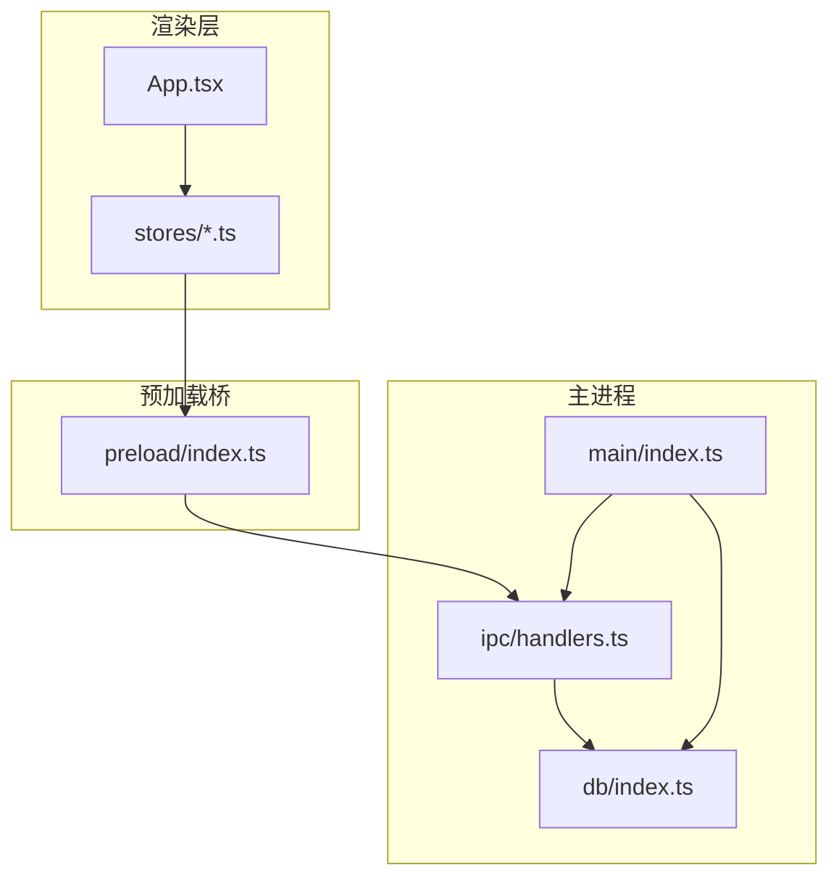
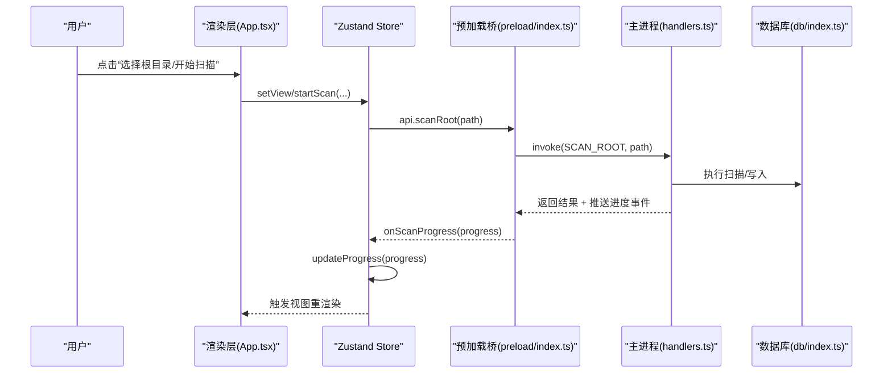
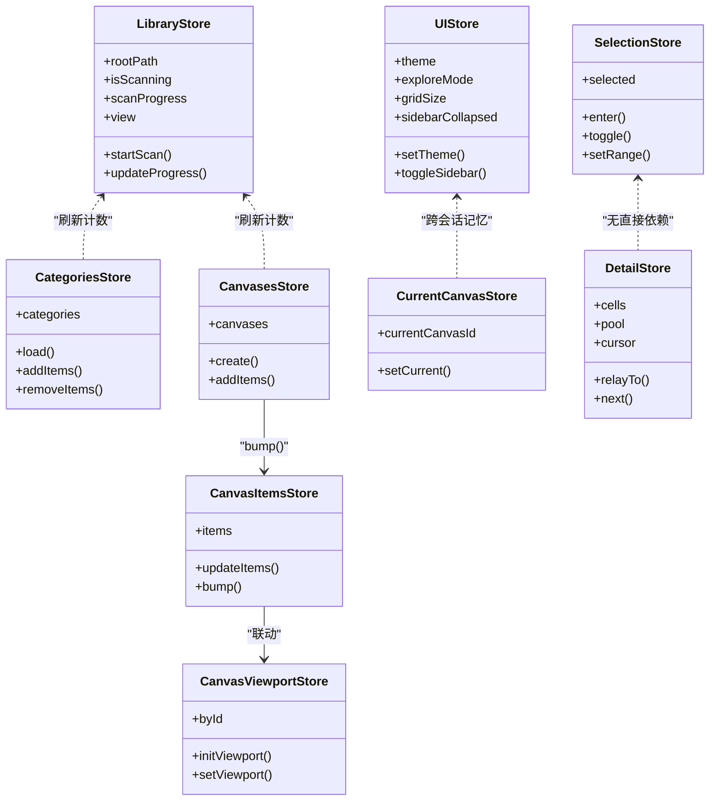
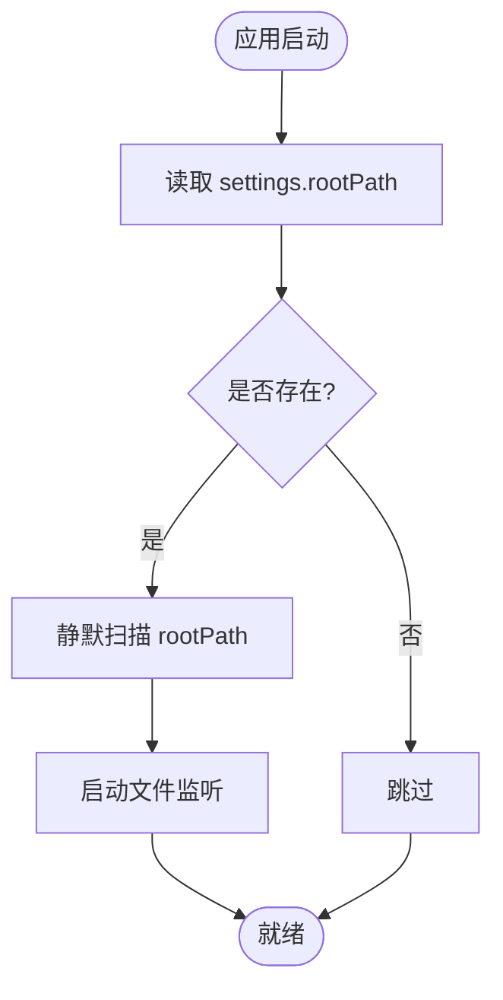
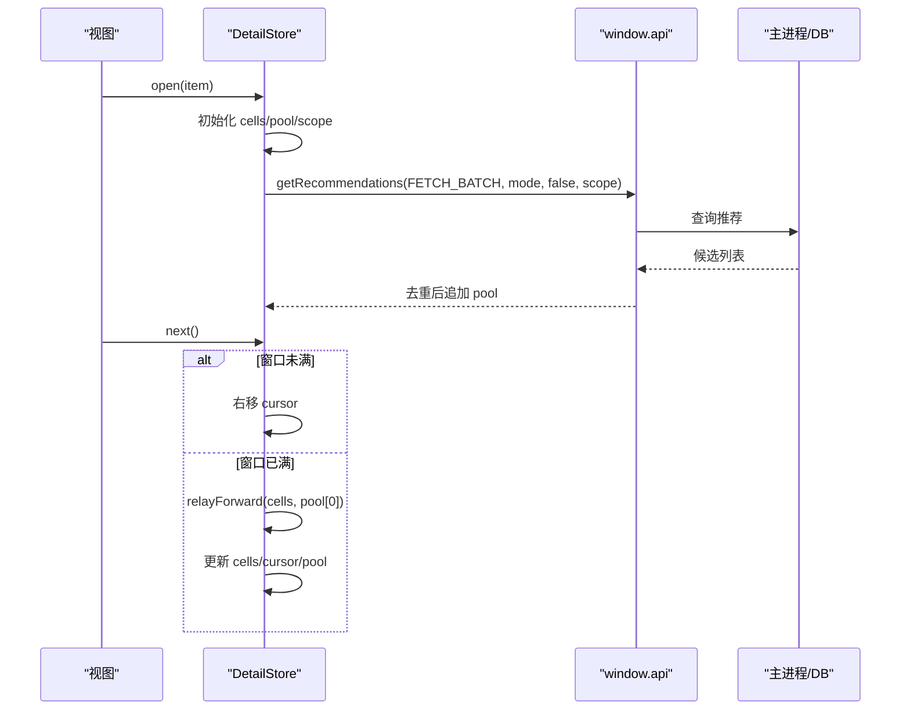
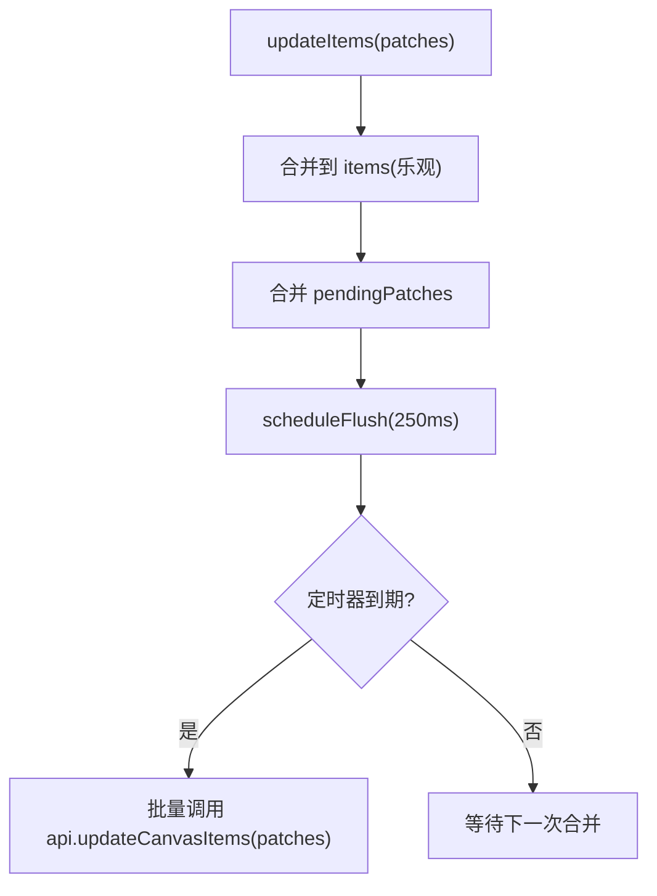
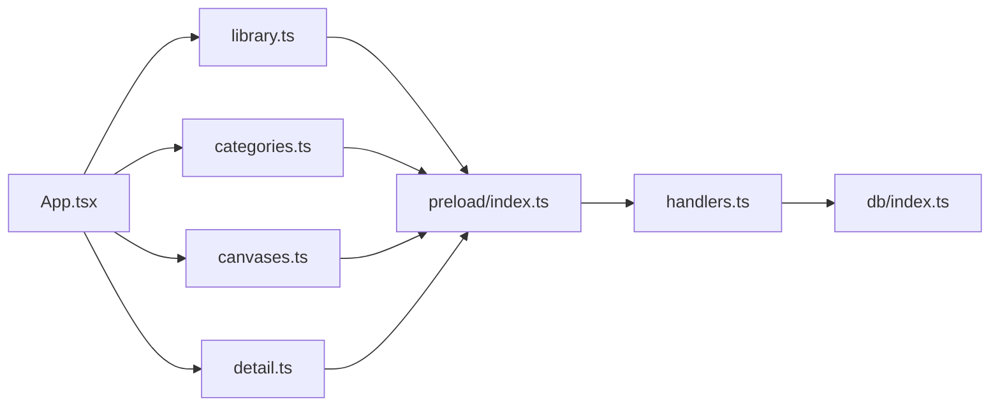

# 数据流设计

<cite>
**本文引用的文件**
- [README.md](file://README.md)
- [main.tsx](file://src/renderer/src/main.tsx)
- [App.tsx](file://src/renderer/src/App.tsx)
- [ui.ts](file://src/renderer/src/stores/ui.ts)
- [library.ts](file://src/renderer/src/stores/library.ts)
- [categories.ts](file://src/renderer/src/stores/categories.ts)
- [canvases.ts](file://src/renderer/src/stores/canvases.ts)
- [canvasItems.ts](file://src/renderer/src/stores/canvasItems.ts)
- [currentCanvas.ts](file://src/renderer/src/stores/currentCanvas.ts)
- [selection.ts](file://src/renderer/src/stores/selection.ts)
- [canvasSelection.ts](file://src/renderer/src/stores/canvasSelection.ts)
- [canvasViewport.ts](file://src/renderer/src/stores/canvasViewport.ts)
- [detail.ts](file://src/renderer/src/stores/detail.ts)
- [index.ts（主进程）](file://src/main/index.ts)
- [handlers.ts](file://src/main/ipc/handlers.ts)
- [index.ts（数据库）](file://src/main/db/index.ts)
- [index.ts（预加载）](file://src/preload/index.ts)
</cite>

## 目录
1. [引言](#引言)
2. [项目结构](#项目结构)
3. [核心组件](#核心组件)
4. [架构总览](#架构总览)
5. [详细组件分析](#详细组件分析)
6. [依赖关系分析](#依赖关系分析)
7. [性能考量](#性能考量)
8. [故障排查指南](#故障排查指南)
9. [结论](#结论)
10. [附录](#附录)

## 引言
本文件面向 Serendip 应用的数据流与状态管理设计，聚焦以下目标：
- 从用户交互到数据存储的完整单向数据流链路
- Zustand 状态切片、中间件与持久化策略
- 增量同步机制（变更检测、冲突解决、一致性保证）
- 关键业务流程的数据流与时序图
- 性能优化策略（虚拟滚动、懒加载、内存管理）
- 面向开发者的最佳实践建议

## 项目结构
Serendip 采用 Electron + React 的三层架构：渲染层（React + Zustand）、预加载桥（contextBridge）、主进程（IPC 处理 + SQLite）。Zustand store 按领域切分为多个独立模块，UI 设置与业务状态分离，并通过 IPC 与主进程进行读写。

图表来源
- [App.tsx:1-120](file://src/renderer/src/App.tsx#L1-L120)
- [ui.ts:1-40](file://src/renderer/src/stores/ui.ts#L1-L40)
- [index.ts（预加载）:1-40](file://src/preload/index.ts#L1-L40)
- [handlers.ts:1-60](file://src/main/ipc/handlers.ts#L1-L60)
- [index.ts（主进程）:93-125](file://src/main/index.ts#L93-L125)
- [index.ts（数据库）:1-35](file://src/main/db/index.ts#L1-L35)

章节来源
- [README.md:1-66](file://README.md#L1-L66)
- [main.tsx:1-12](file://src/renderer/src/main.tsx#L1-L12)

## 核心组件
- 渲染入口与根组件
  - main.tsx 创建 React 根节点并挂载 App
  - App.tsx 组织视图、侧栏、拖拽、弹窗等，协调各 store 与 IPC
- 状态管理（Zustand）
  - ui.ts：主题、探索模式、网格尺寸、侧栏折叠等 UI 偏好，使用 persist 中间件持久化
  - library.ts：根目录、扫描进度、统计、当前视图、评审进度
  - categories.ts：收藏分类 CRUD、排序、批量增删项
  - canvases.ts：画布 CRUD、排序、批量添加元素（含布局计算）
  - canvasItems.ts：画布元素列表、乐观更新 + 防抖落库
  - currentCanvas.ts：当前画布 ID（persist）
  - selection.ts / canvasSelection.ts：媒体与画布的多选状态与区间选择
  - canvasViewport.ts：画布视口缓存与防抖落库
  - detail.ts：详情页“缩略图条”缓冲池、接力前进、范围预取
- 预加载桥
  - index.ts（预加载）：将 window.api 暴露给渲染层，封装所有 IPC 调用
- 主进程
  - index.ts（主进程）：窗口初始化、协议注册、启动时增量同步、监听器启停
  - handlers.ts：IPC 处理器，统一访问数据库与业务逻辑
  - db/index.ts：SQLite 初始化、迁移、WAL 模式

章节来源
- [main.tsx:1-12](file://src/renderer/src/main.tsx#L1-L12)
- [App.tsx:1-120](file://src/renderer/src/App.tsx#L1-L120)
- [ui.ts:1-98](file://src/renderer/src/stores/ui.ts#L1-L98)
- [library.ts:1-100](file://src/renderer/src/stores/library.ts#L1-L100)
- [categories.ts:1-95](file://src/renderer/src/stores/categories.ts#L1-L95)
- [canvases.ts:1-115](file://src/renderer/src/stores/canvases.ts#L1-L115)
- [canvasItems.ts:1-94](file://src/renderer/src/stores/canvasItems.ts#L1-L94)
- [currentCanvas.ts:1-18](file://src/renderer/src/stores/currentCanvas.ts#L1-L18)
- [selection.ts:1-141](file://src/renderer/src/stores/selection.ts#L1-L141)
- [canvasSelection.ts:1-62](file://src/renderer/src/stores/canvasSelection.ts#L1-L62)
- [canvasViewport.ts:1-53](file://src/renderer/src/stores/canvasViewport.ts#L1-L53)
- [detail.ts:1-120](file://src/renderer/src/stores/detail.ts#L1-L120)
- [index.ts（预加载）:1-104](file://src/preload/index.ts#L1-L104)
- [index.ts（主进程）:1-134](file://src/main/index.ts#L1-L134)
- [handlers.ts:1-120](file://src/main/ipc/handlers.ts#L1-L120)
- [index.ts（数据库）:1-190](file://src/main/db/index.ts#L1-L190)

## 架构总览
整体为“渲染层 → 预加载桥 → 主进程 → 数据库”的单向数据流。Zustand store 负责局部状态与副作用编排，通过 window.api 调用 IPC；主进程 handlers 执行业务逻辑与持久化，必要时向渲染层推送事件（如扫描进度）。

图表来源
- [App.tsx:233-251](file://src/renderer/src/App.tsx#L233-L251)
- [library.ts:58-81](file://src/renderer/src/stores/library.ts#L58-L81)
- [index.ts（预加载）:10-12](file://src/preload/index.ts#L10-L12)
- [handlers.ts:52-60](file://src/main/ipc/handlers.ts#L52-L60)
- [index.ts（数据库）:1-35](file://src/main/db/index.ts#L1-L35)

## 详细组件分析

### 状态切片与中间件
- 持久化中间件
  - ui.ts：使用 persist(name='serendip-ui') 保存主题、探索模式、网格尺寸、侧栏折叠等
  - currentCanvas.ts：使用 persist(name='serendip-current-canvas') 保存当前画布 ID
- 非持久化切片
  - library.ts：运行时视图与扫描进度
  - categories.ts / canvases.ts：集合型数据，按需拉取与局部更新
  - selection.ts / canvasSelection.ts：临时多选态
  - canvasViewport.ts：按画布缓存视口，防抖落库
  - canvasItems.ts：元素级 patch 合并与 250ms 防抖落库
  - detail.ts：详情页缓冲池与接力算法

图表来源
- [ui.ts:1-98](file://src/renderer/src/stores/ui.ts#L1-L98)
- [library.ts:1-100](file://src/renderer/src/stores/library.ts#L1-L100)
- [categories.ts:1-95](file://src/renderer/src/stores/categories.ts#L1-L95)
- [canvases.ts:1-115](file://src/renderer/src/stores/canvases.ts#L1-L115)
- [canvasItems.ts:1-94](file://src/renderer/src/stores/canvasItems.ts#L1-L94)
- [currentCanvas.ts:1-18](file://src/renderer/src/stores/currentCanvas.ts#L1-L18)
- [selection.ts:1-141](file://src/renderer/src/stores/selection.ts#L1-L141)
- [canvasViewport.ts:1-53](file://src/renderer/src/stores/canvasViewport.ts#L1-L53)
- [detail.ts:1-120](file://src/renderer/src/stores/detail.ts#L1-L120)

章节来源
- [ui.ts:1-98](file://src/renderer/src/stores/ui.ts#L1-L98)
- [currentCanvas.ts:1-18](file://src/renderer/src/stores/currentCanvas.ts#L1-L18)

### 增量同步机制
- 启动自动同步
  - 主进程读取 settings.rootPath，若存在则静默扫描，完成后启动 chokidar 监听
- 手动扫描
  - 渲染层调用 startScan(path)，订阅 SCAN_PROGRESS 事件，更新 library.store 的 scanProgress
- 变更检测与一致性
  - 主进程在扫描后启动 watcher；当文件变化时，可触发增量 diff（由主进程实现），渲染层通过事件或重新拉取保持 UI 一致
  - 分类/画布的 itemCount 采用乐观更新 + 后端确认，避免整表重拉

图表来源
- [index.ts（主进程）:104-118](file://src/main/index.ts#L104-L118)
- [handlers.ts:52-60](file://src/main/ipc/handlers.ts#L52-L60)
- [library.ts:58-81](file://src/renderer/src/stores/library.ts#L58-L81)

章节来源
- [index.ts（主进程）:104-118](file://src/main/index.ts#L104-L118)
- [handlers.ts:52-60](file://src/main/ipc/handlers.ts#L52-L60)
- [library.ts:58-81](file://src/renderer/src/stores/library.ts#L58-L81)

### 详情页推荐与接力（detail.ts）
- 缓冲池与接力
  - cells 为可见窗口（≤ BUFFER_SIZE），pool 为预取储备
  - relayForward 在窗口满时回收最左未锁定格，新图入队尾，锁定格原位不动
- 预取策略
  - scopeLocked=true：严格限定目录范围，兜底允许重复但避免紧邻重复
  - 预取阈值 PREFETCH_THRESHOLD 控制何时再次触发
- 切换 scope
  - 保留历史与锁定格，清旧 pool，预取完成后自动接力一张到新 scope

图表来源
- [detail.ts:34-60](file://src/renderer/src/stores/detail.ts#L34-L60)
- [detail.ts:193-271](file://src/renderer/src/stores/detail.ts#L193-L271)
- [index.ts（预加载）:15-18](file://src/preload/index.ts#L15-L18)
- [handlers.ts:84-91](file://src/main/ipc/handlers.ts#L84-L91)

章节来源
- [detail.ts:1-120](file://src/renderer/src/stores/detail.ts#L1-L120)
- [detail.ts:193-271](file://src/renderer/src/stores/detail.ts#L193-L271)

### 画布元素与视口（canvasItems.ts + canvasViewport.ts）
- 画布元素
  - 乐观更新：updateItems 立即合并 patches，250ms 防抖批量 flush 到 DB
  - bump：外部增删触发 load 刷新
- 画布视口
  - byId 缓存每个画布的视口，setViewport 触发 500ms 防抖落库
  - flushViewportNow：卸载前强制落库，避免丢失最后一次平移/缩放

图表来源
- [canvasItems.ts:18-32](file://src/renderer/src/stores/canvasItems.ts#L18-L32)
- [canvasItems.ts:66-85](file://src/renderer/src/stores/canvasItems.ts#L66-L85)
- [canvasViewport.ts:14-34](file://src/renderer/src/stores/canvasViewport.ts#L14-L34)

章节来源
- [canvasItems.ts:1-94](file://src/renderer/src/stores/canvasItems.ts#L1-L94)
- [canvasViewport.ts:1-53](file://src/renderer/src/stores/canvasViewport.ts#L1-L53)

### 分类与画布操作（categories.ts + canvases.ts）
- 分类
  - reorder：乐观更新本地顺序，再调用后端持久化
  - addItems/removeItems：仅增量更新 itemCount，避免全量重拉
- 画布
  - addItems：根据 fileIds 的真实宽高比计算等高行布局，定位空白区域插入，Raw 写入 x/y/w/h/z，减少主进程二次计算
  - removeItems：乐观更新 itemCount，并通知 canvasItemsStore.bump()

章节来源
- [categories.ts:47-93](file://src/renderer/src/stores/categories.ts#L47-L93)
- [canvases.ts:58-99](file://src/renderer/src/stores/canvases.ts#L58-L99)

### 多选与工具条（selection.ts）
- 点选/长按进入多选，Shift 区间选择基于当前视图顺序
- 提供 useGridSelection hook 封装区间计算与全选/清空等操作

章节来源
- [selection.ts:1-141](file://src/renderer/src/stores/selection.ts#L1-L141)

## 依赖关系分析
- 渲染层对预加载桥的依赖集中在 window.api 方法调用
- 主进程 handlers 集中处理 IPC，并依赖 db/index.ts 提供的数据库实例
- 启动流程中，主进程先完成数据库初始化与迁移，再注册协议与 IPC，最后创建窗口

图表来源
- [App.tsx:1-120](file://src/renderer/src/App.tsx#L1-L120)
- [index.ts（预加载）:1-104](file://src/preload/index.ts#L1-L104)
- [handlers.ts:1-120](file://src/main/ipc/handlers.ts#L1-L120)
- [index.ts（数据库）:1-35](file://src/main/db/index.ts#L1-L35)

章节来源
- [App.tsx:1-120](file://src/renderer/src/App.tsx#L1-L120)
- [index.ts（预加载）:1-104](file://src/preload/index.ts#L1-L104)
- [handlers.ts:1-120](file://src/main/ipc/handlers.ts#L1-L120)
- [index.ts（数据库）:1-35](file://src/main/db/index.ts#L1-L35)

## 性能考量
- 虚拟滚动与瀑布流
  - 使用 masonic 实现无限瀑布流，结合 ScrollContainerProvider 将滚动容器限定在主区，避免全局滚动带来的抖动与重排
- 懒加载与预取
  - 详情页使用缓冲池与阈值预取，减少频繁 IO；小目录场景允许重复填充以维持滚动反馈
- 防抖与批写
  - 画布元素与视口分别采用 250ms/500ms 防抖，降低高频操作的落库压力
- 内存管理
  - 画布 items 仅在当前画布激活时加载，切换时 unload 释放
  - 多选状态不持久化，离开视图时 clear，避免长期驻留
- 数据库优化
  - WAL 模式、NORMAL 同步级别、必要索引，提升并发与查询性能

章节来源
- [App.tsx:744-780](file://src/renderer/src/App.tsx#L744-L780)
- [detail.ts:193-271](file://src/renderer/src/stores/detail.ts#L193-L271)
- [canvasItems.ts:18-32](file://src/renderer/src/stores/canvasItems.ts#L18-L32)
- [canvasViewport.ts:14-34](file://src/renderer/src/stores/canvasViewport.ts#L14-L34)
- [index.ts（数据库）:19-27](file://src/main/db/index.ts#L19-L27)

## 故障排查指南
- 扫描失败
  - 检查 startScan 的异常分支是否清理 isScanning 与事件订阅
  - 确认主进程 scanRoot 是否正确返回结果并启动 watcher
- 分类/画布计数不同步
  - 确认 addItems/removeItems 的乐观更新路径与后端返回值一致
  - 若跨视图移动，确保 bumpCategoryRefresh 被调用以触发重载
- 画布元素未落库
  - 检查 scheduleFlush 定时器是否被正确调度与清理
  - 在组件卸载时调用 flushViewportNow 确保最后一次变更落库
- 详情页预取卡住
  - 检查 fetching 标志与 _pendingScopeJump 状态流转
  - 确认 scope 为空时的回退逻辑与重复填充策略

章节来源
- [library.ts:58-81](file://src/renderer/src/stores/library.ts#L58-L81)
- [categories.ts:61-93](file://src/renderer/src/stores/categories.ts#L61-L93)
- [canvasItems.ts:66-85](file://src/renderer/src/stores/canvasItems.ts#L66-L85)
- [canvasViewport.ts:26-34](file://src/renderer/src/stores/canvasViewport.ts#L26-L34)
- [detail.ts:193-271](file://src/renderer/src/stores/detail.ts#L193-L271)

## 结论
Serendip 的数据流遵循清晰的单向模型：渲染层通过 Zustand 切片维护状态，借助预加载桥调用主进程 IPC，主进程统一访问数据库并推送事件。通过持久化中间件、乐观更新与防抖批写，系统在用户体验与一致性之间取得平衡。详情页的缓冲池与接力算法、画布元素的布局计算与增量落库，共同支撑了大数据量下的流畅体验。后续可在增量同步阶段完善 watcher 驱动的变更检测与冲突解决策略，进一步提升实时性与一致性。

## 附录
- 术语
  - 单向数据流：状态变更只通过 store 的 action 发起，视图被动响应
  - 乐观更新：先更新本地状态，再异步落库，失败时回滚
  - 防抖：在高频事件中合并多次更新，减少 I/O 与渲染开销
- 最佳实践
  - 将 UI 偏好与业务数据拆分到不同 store，便于持久化与复用
  - 对高频落库操作采用防抖与批写，降低磁盘压力
  - 对大列表使用虚拟滚动与懒加载，按需加载与卸载资源
  - 在跨视图操作中引入 nonce/bump 机制，确保视图间数据一致性
  - 在组件卸载时显式清理定时器与事件订阅，避免内存泄漏