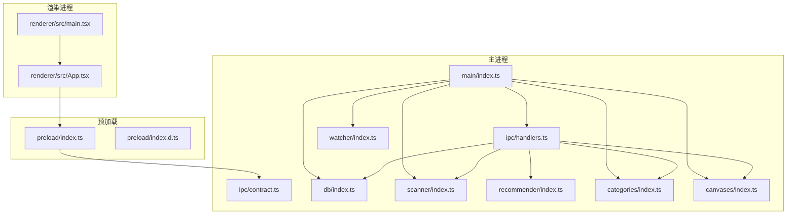
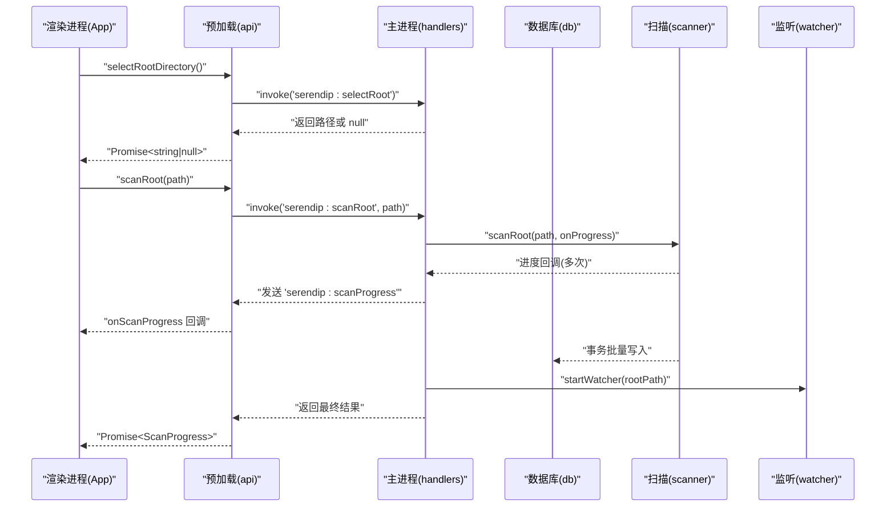
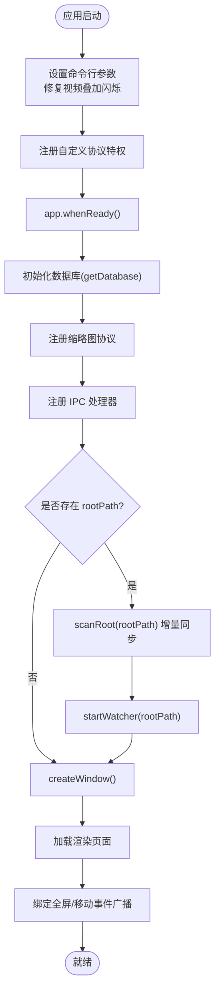
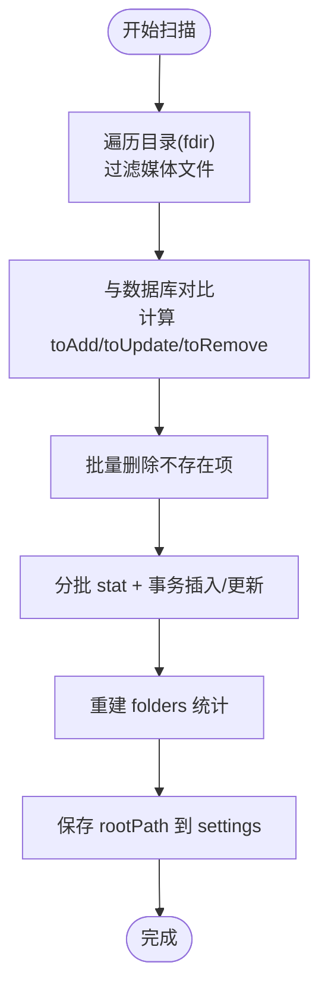
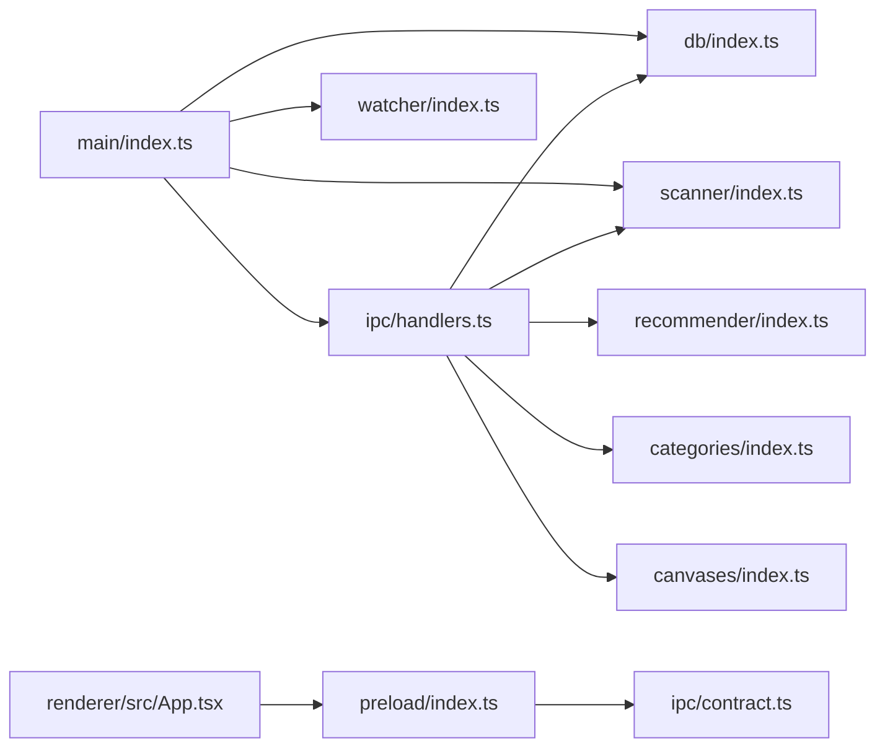

# 整体架构概览

<cite>
**本文引用的文件**   
- [src/main/index.ts](file://src/main/index.ts)
- [src/preload/index.ts](file://src/preload/index.ts)
- [src/preload/index.d.ts](file://src/preload/index.d.ts)
- [src/renderer/src/main.tsx](file://src/renderer/src/main.tsx)
- [src/renderer/src/App.tsx](file://src/renderer/src/App.tsx)
- [src/main/ipc/contract.ts](file://src/main/ipc/contract.ts)
- [src/main/ipc/handlers.ts](file://src/main/ipc/handlers.ts)
- [src/main/db/index.ts](file://src/main/db/index.ts)
- [src/main/scanner/index.ts](file://src/main/scanner/index.ts)
- [src/main/recommender/index.ts](file://src/main/recommender/index.ts)
- [src/main/watcher/index.ts](file://src/main/watcher/index.ts)
- [src/main/categories/index.ts](file://src/main/categories/index.ts)
- [src/main/canvases/index.ts](file://src/main/canvases/index.ts)
- [package.json](file://package.json)
- [README.md](file://README.md)
</cite>

## 目录
1. [简介](#简介)
2. [项目结构](#项目结构)
3. [核心组件](#核心组件)
4. [架构总览](#架构总览)
5. [详细组件分析](#详细组件分析)
6. [依赖关系分析](#依赖关系分析)
7. [性能考量](#性能考量)
8. [故障排查指南](#故障排查指南)
9. [结论](#结论)
10. [附录](#附录)

## 简介
Serendip 是一款基于 Electron 的本地智能相册应用，采用主进程、预加载脚本与渲染进程的分层架构。主进程负责系统能力（窗口、文件系统、数据库、缩略图协议等），预加载脚本通过 contextBridge 暴露最小化 API，渲染进程使用 React + Zustand 构建 UI 并调用桥接 API。应用启动时完成数据库初始化、自定义协议注册、IPC 处理器注册、增量扫描与监听器启动，随后创建主窗口并加载渲染页面。

## 项目结构
- src/main：Electron 主进程代码，包含入口、IPC 契约与处理器、数据库、扫描、推荐算法、文件监听、分类与画布等业务模块。
- src/preload：预加载脚本，定义 window.api 与 window.electron 类型，并通过 ipcRenderer.invoke/on 转发到主进程。
- src/renderer：React 渲染层，包含入口、根组件、视图、状态管理（Zustand）、工具库与样式。
- package.json：应用元信息、脚本命令与依赖声明。
- README.md：技术栈与开发说明。



图表来源
- [src/main/index.ts:1-134](file://src/main/index.ts#L1-L134)
- [src/main/ipc/handlers.ts:1-292](file://src/main/ipc/handlers.ts#L1-L292)
- [src/main/ipc/contract.ts:1-130](file://src/main/ipc/contract.ts#L1-L130)
- [src/main/db/index.ts:1-190](file://src/main/db/index.ts#L1-L190)
- [src/main/scanner/index.ts:1-323](file://src/main/scanner/index.ts#L1-L323)
- [src/main/recommender/index.ts:1-518](file://src/main/recommender/index.ts#L1-L518)
- [src/main/watcher/index.ts:1-117](file://src/main/watcher/index.ts#L1-L117)
- [src/main/categories/index.ts:1-166](file://src/main/categories/index.ts#L1-L166)
- [src/main/canvases/index.ts:1-320](file://src/main/canvases/index.ts#L1-L320)
- [src/preload/index.ts:1-104](file://src/preload/index.ts#L1-L104)
- [src/preload/index.d.ts:1-10](file://src/preload/index.d.ts#L1-L10)
- [src/renderer/src/main.tsx:1-12](file://src/renderer/src/main.tsx#L1-L12)
- [src/renderer/src/App.tsx:1-800](file://src/renderer/src/App.tsx#L1-L800)

章节来源
- [README.md:1-66](file://README.md#L1-L66)
- [package.json:1-70](file://package.json#L1-L70)

## 核心组件
- 主进程入口：负责应用生命周期、窗口创建、协议注册、IPC 处理器注册、数据库初始化、启动扫描与监听、全屏/移动事件广播等。
- IPC 契约与处理器：集中定义通道名与 API 类型；在 handlers 中实现具体逻辑，组合数据库、扫描、推荐、分类、画布等模块。
- 预加载桥：通过 contextBridge 暴露 window.api 与 window.electron，限定可访问能力，避免直接暴露 Node/Electron 对象。
- 渲染进程：React 应用，使用 Zustand 管理全局状态，通过 window.api 调用主进程能力，处理拖拽、视图切换、主题与标题栏覆盖等交互。
- 数据与业务模块：
  - 数据库：better-sqlite3，WAL 模式，迁移脚本维护 schema。
  - 扫描：fdir 遍历 + 增量 diff + 事务批量写入，推送进度。
  - 推荐：两级加权抽样（文件夹级 + 文件级），支持分层路径推荐。
  - 监听：chokidar 实时变更聚合，定时批量落库。
  - 收藏分类：CRUD、排序、多对多关联。
  - 画布：CRUD、项变换持久化、视口保存、批量维度查询。

章节来源
- [src/main/index.ts:1-134](file://src/main/index.ts#L1-L134)
- [src/main/ipc/contract.ts:1-130](file://src/main/ipc/contract.ts#L1-L130)
- [src/main/ipc/handlers.ts:1-292](file://src/main/ipc/handlers.ts#L1-L292)
- [src/preload/index.ts:1-104](file://src/preload/index.ts#L1-L104)
- [src/preload/index.d.ts:1-10](file://src/preload/index.d.ts#L1-L10)
- [src/renderer/src/main.tsx:1-12](file://src/renderer/src/main.tsx#L1-L12)
- [src/renderer/src/App.tsx:1-800](file://src/renderer/src/App.tsx#L1-L800)
- [src/main/db/index.ts:1-190](file://src/main/db/index.ts#L1-L190)
- [src/main/scanner/index.ts:1-323](file://src/main/scanner/index.ts#L1-L323)
- [src/main/recommender/index.ts:1-518](file://src/main/recommender/index.ts#L1-L518)
- [src/main/watcher/index.ts:1-117](file://src/main/watcher/index.ts#L1-L117)
- [src/main/categories/index.ts:1-166](file://src/main/categories/index.ts#L1-L166)
- [src/main/canvases/index.ts:1-320](file://src/main/canvases/index.ts#L1-L320)

## 架构总览
应用遵循“主进程 — 预加载 — 渲染进程”三层分离：
- 主进程：拥有完整 Node/Electron 权限，封装所有系统能力与业务逻辑，通过 IPC 暴露最小 API。
- 预加载：仅暴露必要方法，严格限制上下文隔离下的能力边界。
- 渲染进程：纯前端，使用 React + Zustand，专注 UI 与交互，通过 window.api 调用主进程。



图表来源
- [src/renderer/src/App.tsx:233-247](file://src/renderer/src/App.tsx#L233-L247)
- [src/preload/index.ts:9-11](file://src/preload/index.ts#L9-L11)
- [src/main/ipc/handlers.ts:52-60](file://src/main/ipc/handlers.ts#L52-L60)
- [src/main/scanner/index.ts:36-239](file://src/main/scanner/index.ts#L36-L239)
- [src/main/watcher/index.ts:16-37](file://src/main/watcher/index.ts#L16-L37)
- [src/main/db/index.ts:8-28](file://src/main/db/index.ts#L8-L28)

## 详细组件分析

### 主进程与窗口生命周期
- 启动流程：
  - 设置命令行开关以规避 Windows 视频叠加导致的闪烁问题。
  - 注册自定义协议（如缩略图协议）特权。
  - app.whenReady 后设置应用标识、监听窗口快捷键、初始化数据库、注册缩略图协议与 IPC 处理器。
  - 若存在 rootPath，执行一次静默扫描并启动文件监听器。
  - 创建主窗口，配置自绘标题栏与 WCO 覆盖，绑定全屏/移动事件广播。
  - 根据环境加载开发 URL 或打包 HTML。
- 生命周期事件：
  - activate：无窗口时重建主窗口。
  - window-all-closed：停止监听、关闭数据库，非 macOS 退出应用。



图表来源
- [src/main/index.ts:17-36](file://src/main/index.ts#L17-L36)
- [src/main/index.ts:93-125](file://src/main/index.ts#L93-L125)
- [src/main/index.ts:127-134](file://src/main/index.ts#L127-L134)

章节来源
- [src/main/index.ts:1-134](file://src/main/index.ts#L1-L134)

### IPC 契约与处理器
- 契约：
  - 统一导出 SerendipAPI 接口与 IPC 常量，供预加载与渲染进程共享类型。
  - 涵盖库管理、推荐浏览、收藏分类、画布、进度订阅、窗口装饰等能力。
- 处理器：
  - 将每个 IPC 通道映射到具体实现，组合数据库、扫描、推荐、分类、画布等模块。
  - 批量操作使用事务提升性能（如批量喜欢/不感兴趣）。
  - 打开文件/目录、显示在资源管理器中使用 shell API。
  - 标题栏覆盖（WCO）按主题派生颜色，兼容不支持平台静默失败。

```mermaid
classDiagram
class SerendipAPI {
+selectRootDirectory() Promise~string|null~
+scanRoot(path) Promise~ScanProgress~
+getCurrentRoot() Promise~string|null~
+getStats() Promise~{totalFiles,totalFolders,liked}~
+getRecommendations(count,mode,...) Promise~MediaItem[]~
+setLiked(fileId,liked) Promise~void~
+listCategories() Promise~Category[]~
+createCanvas(name) Promise~number~
+addItemsToCanvas(canvasId,items) Promise~number[]~
+onScanProgress(cb) () => void
+setTitleBarOverlay(opts) Promise~void~
}
class Handlers {
+registerIpcHandlers() void
}
class Database {
+getDatabase() Database
+closeDatabase() void
}
class Scanner {
+scanRoot(path,onProgress) Promise~ScanProgress~
}
class Recommender {
+recommend(options) MediaItem[]
+getHierarchicalRecommendations(options) MediaItem[]
}
class Categories {
+listCategories() Category[]
+createCategory(name) number
+renameCategory(id,name) void
+deleteCategory(id) void
+reorderCategories(ids) void
+getCategoryItems(id) MediaItem[]
+addItemsToCategory(id,ids) number
+removeItemFromCategory(id,fileId) void
+removeItemsFromCategory(id,ids) void
+getFileCategoryIds(fileId) number[]
}
class Canvases {
+listCanvases() Canvas[]
+createCanvas(name) number
+renameCanvas(id,name) void
+deleteCanvas(id) void
+reorderCanvases(ids) void
+getCanvasItems(id) CanvasItem[]
+addItemsToCanvas(id,items) number[]
+addItemsToCanvasRaw(id,items) number[]
+removeItemsFromCanvas(id,ids) void
+updateCanvasItem(id,patch) void
+updateCanvasItems(patches) void
+updateCanvasViewport(id,x,y,scale) void
+getFileCanvasIds(fileId) number[]
+getMediaDimensions(ids) {id,width,height}[]
}
Handlers --> Database : "使用"
Handlers --> Scanner : "调用"
Handlers --> Recommender : "调用"
Handlers --> Categories : "调用"
Handlers --> Canvases : "调用"
```

图表来源
- [src/main/ipc/contract.ts:13-75](file://src/main/ipc/contract.ts#L13-L75)
- [src/main/ipc/handlers.ts:40-284](file://src/main/ipc/handlers.ts#L40-L284)
- [src/main/db/index.ts:8-28](file://src/main/db/index.ts#L8-L28)
- [src/main/scanner/index.ts:36-239](file://src/main/scanner/index.ts#L36-L239)
- [src/main/recommender/index.ts:57-149](file://src/main/recommender/index.ts#L57-L149)
- [src/main/categories/index.ts:21-166](file://src/main/categories/index.ts#L21-L166)
- [src/main/canvases/index.ts:76-320](file://src/main/canvases/index.ts#L76-L320)

章节来源
- [src/main/ipc/contract.ts:1-130](file://src/main/ipc/contract.ts#L1-L130)
- [src/main/ipc/handlers.ts:1-292](file://src/main/ipc/handlers.ts#L1-L292)

### 预加载桥与安全边界
- 通过 contextBridge.exposeInMainWorld 暴露 window.api 与 window.electron。
- 仅暴露必要的 IPC 方法，避免直接暴露 Node/Electron 对象，降低安全风险。
- 提供 onScanProgress 订阅机制，支持取消订阅，防止内存泄漏。

章节来源
- [src/preload/index.ts:1-104](file://src/preload/index.ts#L1-L104)
- [src/preload/index.d.ts:1-10](file://src/preload/index.d.ts#L1-L10)

### 渲染进程与状态管理
- 入口 main.tsx 使用 React 18 createRoot 挂载 App。
- App.tsx 组织全局布局、侧栏、顶栏、视图路由、拖拽、主题与 WCO 配色同步、全屏事件监听等。
- 使用 Zustand 管理库状态（根目录、扫描进度、统计、当前视图等），通过 window.api 与主进程通信。

章节来源
- [src/renderer/src/main.tsx:1-12](file://src/renderer/src/main.tsx#L1-L12)
- [src/renderer/src/App.tsx:1-800](file://src/renderer/src/App.tsx#L1-L800)

### 数据库与迁移
- 使用 better-sqlite3，启用 WAL 模式与外键约束，提升并发与一致性。
- 迁移表 _migrations 记录版本，依次执行 up 脚本，新增媒体文件、文件夹、收藏分类、设置、画布等表结构与索引。
- 提供 closeDatabase 用于优雅关闭。

章节来源
- [src/main/db/index.ts:1-190](file://src/main/db/index.ts#L1-L190)

### 扫描与增量同步
- fdir 高性能遍历，过滤缓存与隐藏目录，仅收集图片/视频。
- 与数据库现有记录做 diff，计算新增、更新、删除集合。
- 分批 stat + 事务批量插入/更新，推送阶段进度（walking/diffing/inserting/done）。
- 重建 folders 统计表，保存 rootPath 到 settings。



图表来源
- [src/main/scanner/index.ts:36-239](file://src/main/scanner/index.ts#L36-L239)
- [src/main/scanner/index.ts:274-317](file://src/main/scanner/index.ts#L274-L317)

章节来源
- [src/main/scanner/index.ts:1-323](file://src/main/scanner/index.ts#L1-L323)

### 智能随机推荐算法
- 两级加权抽样：先选文件夹，再在文件夹内选文件。
- 权重策略：
  - 文件夹基础权重 1/file_count^α，抑制大文件夹虹吸效应。
  - 冷却因子：最近被抽过的文件夹/文件降权，半衰期衰减。
  - liked 加成与 shown_count 惩罚，鼓励发现新内容。
  - 探索程度（prefer/balanced/explore）调节偏好与探索强度。
- 分层路径推荐：从当前文件夹向上父链放宽采样，按文件数分配各层数量，最后 Fisher-Yates 打乱顺序。

章节来源
- [src/main/recommender/index.ts:1-518](file://src/main/recommender/index.ts#L1-L518)

### 文件监听与实时同步
- chokidar 监听根目录变化，忽略缓存与系统目录。
- 变更队列聚合，500ms 定时器批量 flush。
- 新增/变更：stat 获取 mtime/size，INSERT OR REPLACE 更新；删除：DELETE。
- 事务包裹，减少 IO 开销。

章节来源
- [src/main/watcher/index.ts:1-117](file://src/main/watcher/index.ts#L1-L117)

### 收藏分类与画布模块
- 收藏分类：
  - categories 表存储名称与位置，category_items 多对多关联。
  - 支持 CRUD、重排、批量添加/移除、查询文件所属分类。
- 画布：
  - canvases 表存储名称、位置与视口；canvas_items 存储项坐标、尺寸、旋转、层级、裁剪多边形等。
  - 支持批量添加（自动按比例计算宽高或原样复制）、批量更新、视口持久化、批量维度查询。

章节来源
- [src/main/categories/index.ts:1-166](file://src/main/categories/index.ts#L1-L166)
- [src/main/canvases/index.ts:1-320](file://src/main/canvases/index.ts#L1-L320)

## 依赖关系分析
- 主进程入口依赖：IPC 处理器、数据库、缩略图协议、扫描、监听、画布与分类模块。
- IPC 处理器依赖：数据库、扫描、推荐、分类、画布、系统 shell/dialog。
- 预加载依赖：IPC 契约类型与 electron-toolkit preload。
- 渲染进程依赖：React、Zustand、dnd-kit、lucide-react、Tailwind 等。



图表来源
- [src/main/index.ts:1-134](file://src/main/index.ts#L1-L134)
- [src/main/ipc/handlers.ts:1-292](file://src/main/ipc/handlers.ts#L1-L292)
- [src/main/ipc/contract.ts:1-130](file://src/main/ipc/contract.ts#L1-L130)
- [src/preload/index.ts:1-104](file://src/preload/index.ts#L1-L104)
- [src/renderer/src/App.tsx:1-800](file://src/renderer/src/App.tsx#L1-L800)

章节来源
- [package.json:1-70](file://package.json#L1-L70)

## 性能考量
- 数据库：
  - WAL 模式与 NORMAL 同步级别提升并发与写入吞吐。
  - 批量操作使用事务，减少磁盘 IO 次数。
- 扫描：
  - fdir 异步遍历，过滤无关目录，提高 I/O 效率。
  - 分批 stat 与批量写入，控制内存峰值与 IO 压力。
- 监听：
  - 变更聚合与延迟 flush，避免频繁触发写操作。
- 推荐算法：
  - 两级抽样与冷却机制，避免重复与热点倾斜。
  - 分层路径推荐减少不必要的全局搜索范围。
- 渲染：
  - 虚拟瀑布流（masonic）与按需缩略图，降低首屏与滚动压力。
  - 独立滚动容器保留滚动位置，减少重绘。

[本节为通用指导，无需源码引用]

## 故障排查指南
- 扫描失败：
  - 检查 rootPath 是否有效，确认权限与路径合法性。
  - 查看控制台错误日志，关注 scanRoot 异常与数据库连接状态。
- 文件失效：
  - 标记 unavailable 的场景包括缩略图生成失败、文件缺失或损坏。
  - 重新扫描可能解封因临时锁导致失败的条目。
- 监听未生效：
  - 确认 ignored 列表与 awaitWriteFinish 配置是否符合预期。
  - 检查 flushChanges 是否被调度与执行。
- 标题栏覆盖异常：
  - macOS 等平台不支持 WCO，调用会静默失败，属正常行为。
  - 主题切换时需同步 color/symbolColor，确保 hover 高亮可见。

章节来源
- [src/main/ipc/handlers.ts:148-185](file://src/main/ipc/handlers.ts#L148-L185)
- [src/main/scanner/index.ts:117-122](file://src/main/scanner/index.ts#L117-L122)
- [src/main/watcher/index.ts:16-37](file://src/main/watcher/index.ts#L16-L37)
- [src/main/index.ts:259-283](file://src/main/index.ts#L259-L283)

## 结论
Serendip 采用清晰的分层架构与模块化设计，主进程封装系统能力与业务逻辑，预加载桥限定了安全边界，渲染进程专注 UI 与交互。通过事务批写、增量扫描、监听聚合与智能推荐算法，系统在大数据量场景下具备良好的性能与用户体验。未来可在空/加载/错误态打磨、压测调优等方面继续完善。

[本节为总结性内容，无需源码引用]

## 附录
- 技术栈与开发命令参见 README 与 package.json。
- 关键类型与通道名集中在 IPC 契约文件中，便于扩展与维护。

章节来源
- [README.md:1-66](file://README.md#L1-L66)
- [package.json:1-70](file://package.json#L1-L70)
- [src/main/ipc/contract.ts:84-130](file://src/main/ipc/contract.ts#L84-L130)