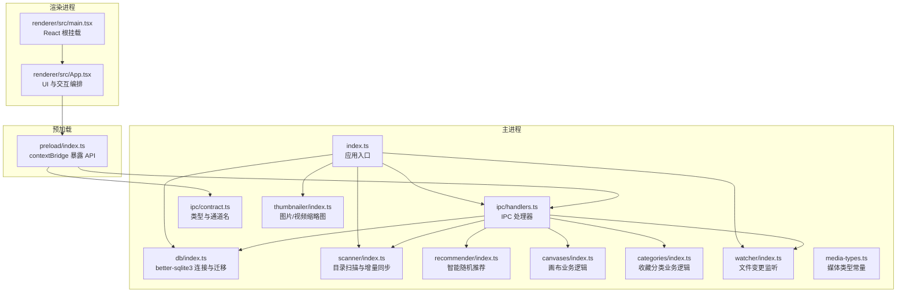
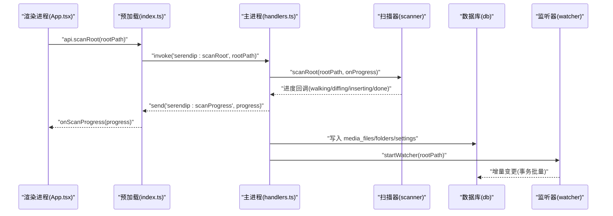
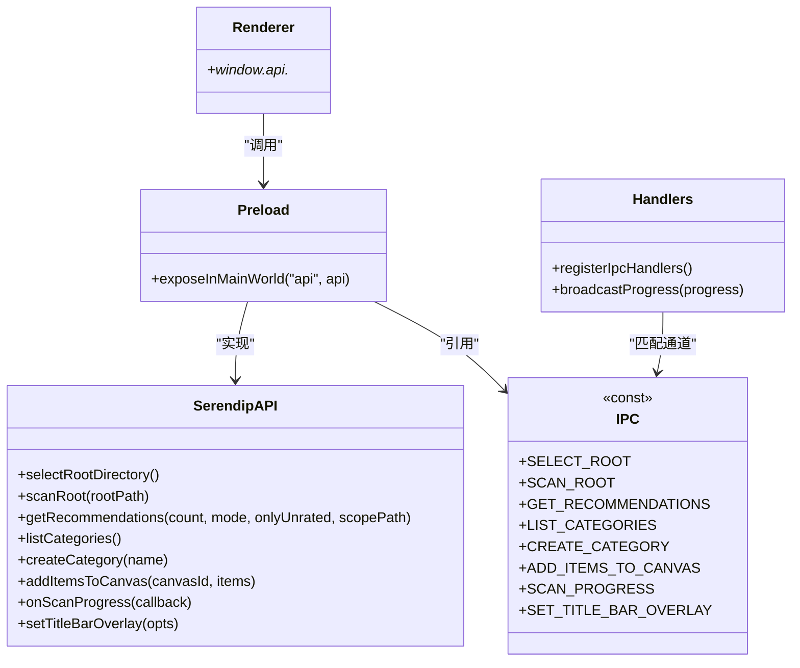
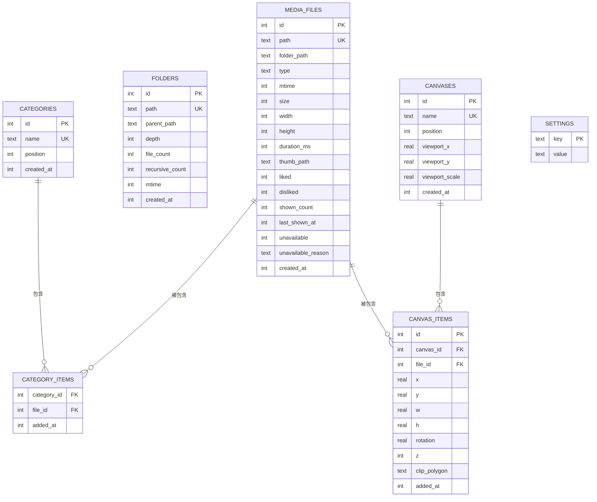
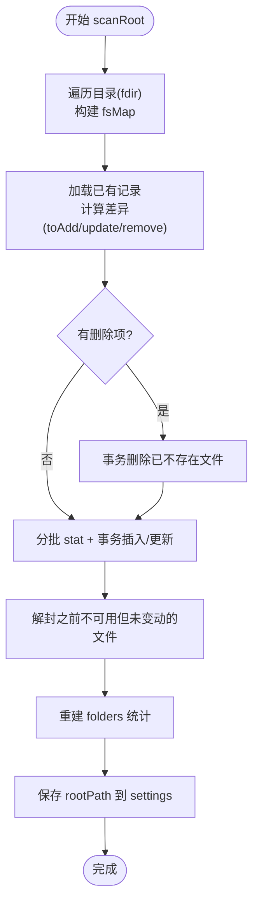
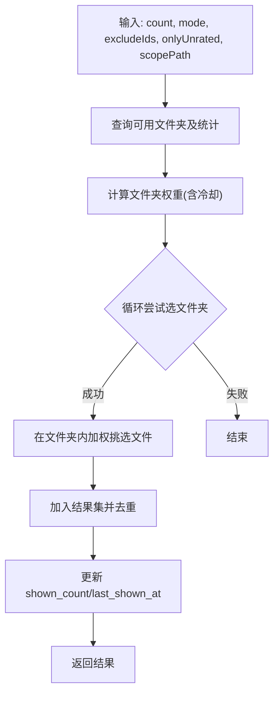
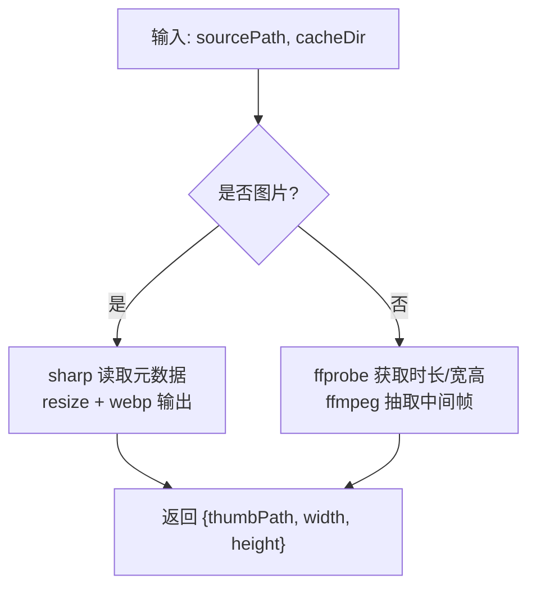
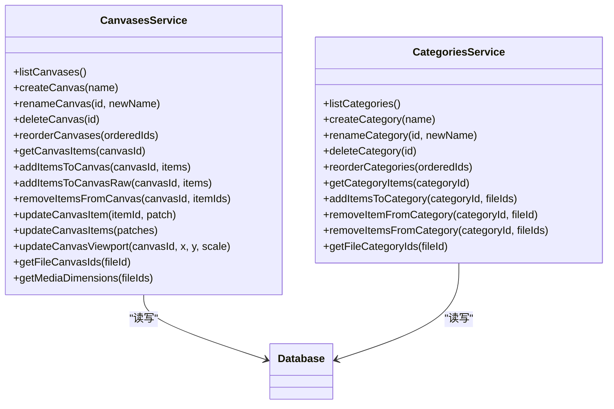
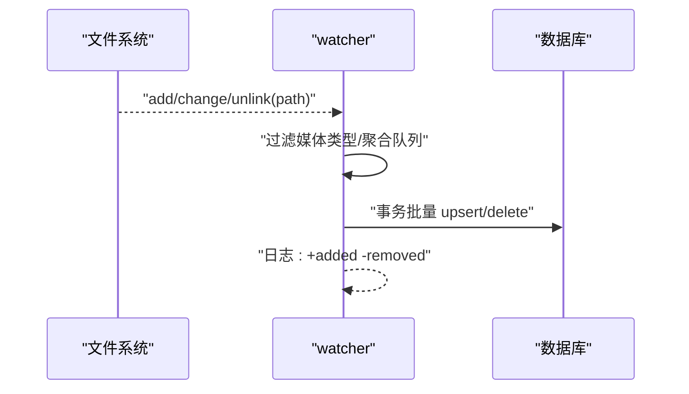
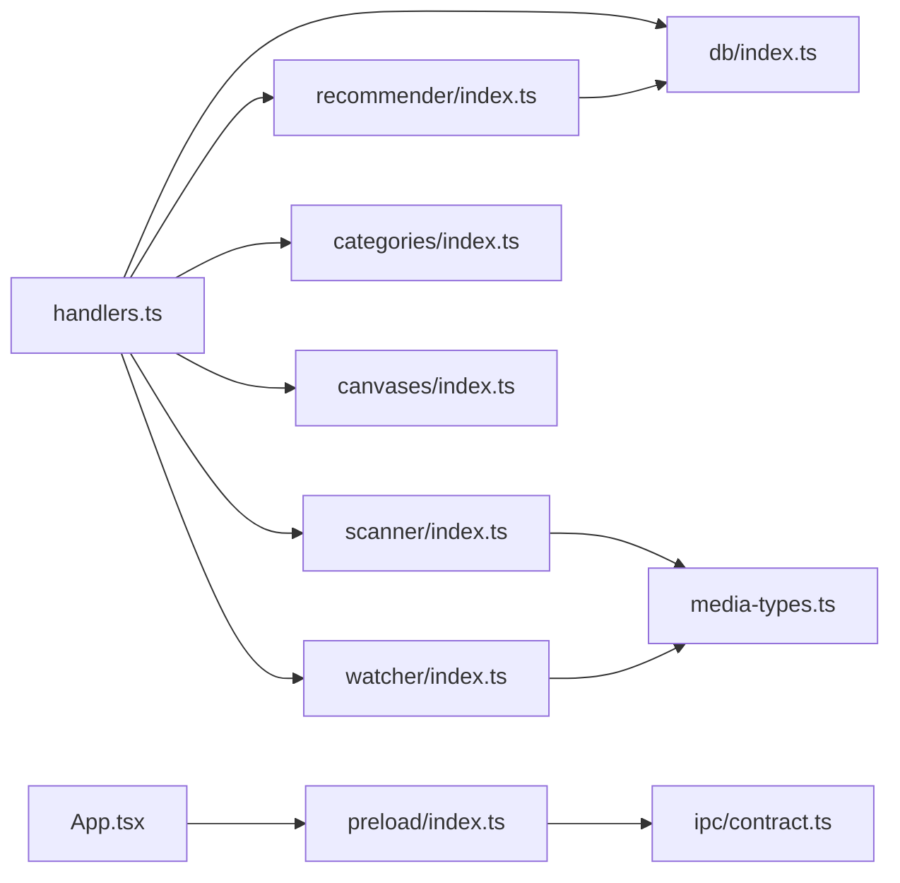

# 架构设计

<cite>
**本文引用的文件**   
- [src/main/index.ts](file://src/main/index.ts)
- [src/preload/index.ts](file://src/preload/index.ts)
- [src/renderer/src/main.tsx](file://src/renderer/src/main.tsx)
- [src/renderer/src/App.tsx](file://src/renderer/src/App.tsx)
- [src/main/ipc/contract.ts](file://src/main/ipc/contract.ts)
- [src/main/ipc/handlers.ts](file://src/main/ipc/handlers.ts)
- [src/main/db/index.ts](file://src/main/db/index.ts)
- [src/main/scanner/index.ts](file://src/main/scanner/index.ts)
- [src/main/recommender/index.ts](file://src/main/recommender/index.ts)
- [src/main/thumbnailer/index.ts](file://src/main/thumbnailer/index.ts)
- [src/main/canvases/index.ts](file://src/main/canvases/index.ts)
- [src/main/categories/index.ts](file://src/main/categories/index.ts)
- [src/main/watcher/index.ts](file://src/main/watcher/index.ts)
- [src/main/media-types.ts](file://src/main/media-types.ts)
- [package.json](file://package.json)
</cite>

## 目录
1. [简介](#简介)
2. [项目结构](#项目结构)
3. [核心组件](#核心组件)
4. [架构总览](#架构总览)
5. [详细组件分析](#详细组件分析)
6. [依赖关系分析](#依赖关系分析)
7. [性能考量](#性能考量)
8. [故障排查指南](#故障排查指南)
9. [结论](#结论)
10. [附录](#附录)

## 简介
Serendip 是一款基于 Electron 的本地媒体浏览与组织应用，采用主进程、预加载脚本与渲染进程的分层架构。通过 IPC 契约暴露稳定的 API，将数据库、扫描器、推荐算法、缩略图生成、画布与分类等模块解耦为独立服务，提供高性能、可扩展且安全的桌面体验。

## 项目结构
- 主进程（main）：负责应用生命周期、窗口管理、IPC 路由、文件系统访问、数据库初始化与迁移、缩略图协议注册、文件监听与增量同步。
- 预加载（preload）：通过 contextBridge 安全暴露最小化 API 给渲染进程，屏蔽底层 Electron 能力。
- 渲染进程（renderer）：React + TypeScript 前端，使用 Zustand 进行状态管理，实现探索、评审、喜欢、分类、画布等视图。

图表来源
- [src/main/index.ts:1-134](file://src/main/index.ts#L1-L134)
- [src/main/ipc/handlers.ts:1-292](file://src/main/ipc/handlers.ts#L1-L292)
- [src/main/ipc/contract.ts:1-130](file://src/main/ipc/contract.ts#L1-L130)
- [src/main/db/index.ts:1-190](file://src/main/db/index.ts#L1-L190)
- [src/main/scanner/index.ts:1-323](file://src/main/scanner/index.ts#L1-L323)
- [src/main/recommender/index.ts:1-518](file://src/main/recommender/index.ts#L1-L518)
- [src/main/thumbnailer/index.ts:1-138](file://src/main/thumbnailer/index.ts#L1-L138)
- [src/main/canvases/index.ts:1-320](file://src/main/canvases/index.ts#L1-L320)
- [src/main/categories/index.ts:1-166](file://src/main/categories/index.ts#L1-L166)
- [src/main/watcher/index.ts:1-117](file://src/main/watcher/index.ts#L1-L117)
- [src/main/media-types.ts:1-38](file://src/main/media-types.ts#L1-L38)
- [src/preload/index.ts:1-104](file://src/preload/index.ts#L1-L104)
- [src/renderer/src/main.tsx:1-12](file://src/renderer/src/main.tsx#L1-L12)
- [src/renderer/src/App.tsx:1-800](file://src/renderer/src/App.tsx#L1-L800)

章节来源
- [src/main/index.ts:1-134](file://src/main/index.ts#L1-L134)
- [src/preload/index.ts:1-104](file://src/preload/index.ts#L1-L104)
- [src/renderer/src/main.tsx:1-12](file://src/renderer/src/main.tsx#L1-L12)
- [src/renderer/src/App.tsx:1-800](file://src/renderer/src/App.tsx#L1-L800)

## 核心组件
- 主进程入口：注册自定义协议、创建窗口、启动数据库、注册缩略图协议、注册 IPC 处理器、启动时自动扫描并开启文件监听。
- 预加载桥接：集中定义 SerendipAPI，统一调用 ipcRenderer.invoke/on，向 window.api 暴露方法，同时注入 electron API。
- 渲染进程 UI：React 应用，使用 Zustand 管理库、分类、画布、当前画布、选择、UI 等状态；通过 window.api 调用后端能力。
- IPC 契约：集中声明所有通道名与 API 类型，确保主/渲染两端类型一致。
- 数据库层：基于 better-sqlite3，WAL 模式、外键约束、迁移系统，维护媒体文件、文件夹统计、分类、设置、画布等表。
- 扫描器：fdir 遍历目录，计算差异后批量事务写入，重建文件夹统计，保存根路径。
- 推荐器：两级加权抽样（文件夹级与文件级），支持 prefer/balanced/explore 模式与分层推荐。
- 缩略图生成器：sharp 处理图片，ffmpeg-static + ffprobe 抽取视频中间帧，缓存到 .serendip-cache。
- 画布与分类：独立的 CRUD 与多对多关联，支持拖拽排序、批量操作、视口持久化。
- 文件监听：chokidar 监听增删改，聚合后批量事务更新数据库。

章节来源
- [src/main/index.ts:1-134](file://src/main/index.ts#L1-L134)
- [src/preload/index.ts:1-104](file://src/preload/index.ts#L1-L104)
- [src/renderer/src/App.tsx:1-800](file://src/renderer/src/App.tsx#L1-L800)
- [src/main/ipc/contract.ts:1-130](file://src/main/ipc/contract.ts#L1-L130)
- [src/main/db/index.ts:1-190](file://src/main/db/index.ts#L1-L190)
- [src/main/scanner/index.ts:1-323](file://src/main/scanner/index.ts#L1-L323)
- [src/main/recommender/index.ts:1-518](file://src/main/recommender/index.ts#L1-L518)
- [src/main/thumbnailer/index.ts:1-138](file://src/main/thumbnailer/index.ts#L1-L138)
- [src/main/canvases/index.ts:1-320](file://src/main/canvases/index.ts#L1-L320)
- [src/main/categories/index.ts:1-166](file://src/main/categories/index.ts#L1-L166)
- [src/main/watcher/index.ts:1-117](file://src/main/watcher/index.ts#L1-L117)

## 架构总览
下图展示从渲染进程发起请求到主进程执行业务逻辑、读写数据库与文件系统，再返回结果或推送进度的完整链路。

图表来源
- [src/renderer/src/App.tsx:1-800](file://src/renderer/src/App.tsx#L1-L800)
- [src/preload/index.ts:1-104](file://src/preload/index.ts#L1-L104)
- [src/main/ipc/handlers.ts:1-292](file://src/main/ipc/handlers.ts#L1-L292)
- [src/main/scanner/index.ts:1-323](file://src/main/scanner/index.ts#L1-L323)
- [src/main/db/index.ts:1-190](file://src/main/db/index.ts#L1-L190)
- [src/main/watcher/index.ts:1-117](file://src/main/watcher/index.ts#L1-L117)

## 详细组件分析

### 主进程与 IPC 通信
- 职责分离
  - 主进程：窗口、协议、IPC 路由、系统交互（打开文件/文件夹）、数据库与文件系统访问。
  - 预加载：仅暴露必要 API，避免直接暴露 Electron 内部对象。
  - 渲染进程：纯 UI 与状态管理，不直接访问文件系统或数据库。
- 数据流向
  - 渲染进程通过 window.api 调用 invoke，主进程 handlers 根据通道名分发到具体服务。
  - 异步进度通过 send 事件推送至渲染进程订阅者。
- 安全策略
  - 使用 contextIsolated + contextBridge，白名单式暴露 API。
  - 自定义协议 serendip 启用标准与安全特性，用于缩略图流式读取。

图表来源
- [src/main/ipc/contract.ts:1-130](file://src/main/ipc/contract.ts#L1-L130)
- [src/main/ipc/handlers.ts:1-292](file://src/main/ipc/handlers.ts#L1-L292)
- [src/preload/index.ts:1-104](file://src/preload/index.ts#L1-L104)
- [src/renderer/src/App.tsx:1-800](file://src/renderer/src/App.tsx#L1-L800)

章节来源
- [src/main/index.ts:1-134](file://src/main/index.ts#L1-L134)
- [src/main/ipc/contract.ts:1-130](file://src/main/ipc/contract.ts#L1-L130)
- [src/main/ipc/handlers.ts:1-292](file://src/main/ipc/handlers.ts#L1-L292)
- [src/preload/index.ts:1-104](file://src/preload/index.ts#L1-L104)
- [src/renderer/src/App.tsx:1-800](file://src/renderer/src/App.tsx#L1-L800)

### 数据库层（better-sqlite3）
- 设计要点
  - WAL 模式提升并发读性能，NORMAL 同步策略平衡安全与吞吐。
  - 外键约束保证分类与画布关联一致性。
  - 迁移系统按版本执行，支持新增字段与索引。
- 关键表
  - media_files：媒体元数据与评分、显示计数、失效标记。
  - folders：文件夹层级与统计，辅助推荐算法。
  - categories / category_items：收藏分类及其内容。
  - canvases / canvas_items：画布与媒体项布局信息。
  - settings：应用配置（如 rootPath）。

图表来源
- [src/main/db/index.ts:1-190](file://src/main/db/index.ts#L1-L190)

章节来源
- [src/main/db/index.ts:1-190](file://src/main/db/index.ts#L1-L190)

### 扫描器（增量同步）
- 流程
  - walking：遍历目录，过滤媒体类型，构建 fsMap。
  - diffing：对比 dbMap，计算 toAdd/toUpdate/toRemove。
  - inserting：分批 stat + 事务插入/更新，解封之前标记不可用的记录。
  - done：重建 folders 统计，保存 rootPath，推送最终进度。
- 优化
  - fdir 高性能遍历，跳过缓存与隐藏目录。
  - 批量事务写入，减少磁盘 IO 次数。
  - 进度回调实时反馈，便于 UI 展示。

图表来源
- [src/main/scanner/index.ts:1-323](file://src/main/scanner/index.ts#L1-L323)
- [src/main/media-types.ts:1-38](file://src/main/media-types.ts#L1-L38)

章节来源
- [src/main/scanner/index.ts:1-323](file://src/main/scanner/index.ts#L1-L323)
- [src/main/media-types.ts:1-38](file://src/main/media-types.ts#L1-L38)

### 推荐器（智能随机）
- 两级加权
  - 文件夹级：基础权重 1/file_count^α，结合冷却因子抑制重复曝光。
  - 文件级：liked 加成、最近显示冷却、显示次数惩罚。
- 模式参数
  - prefer：偏好放大、冷却弱、文件夹平均化弱。
  - balanced：折中策略。
  - explore：高度均权、冷却强、忽略 liked。
- 分层推荐
  - 以当前路径为锚点，向上父链放宽采样，按文件数动态分配各层数量。

图表来源
- [src/main/recommender/index.ts:1-518](file://src/main/recommender/index.ts#L1-L518)

章节来源
- [src/main/recommender/index.ts:1-518](file://src/main/recommender/index.ts#L1-L518)

### 缩略图生成器
- 图片：sharp 读取元数据并生成 WebP 缩略图，自动 EXIF 旋转。
- 视频：ffprobe 获取时长与宽高，ffmpeg 抽取中间帧生成缩略图。
- 缓存：基于路径哈希命名，落盘到 .serendip-cache，存在即复用。

图表来源
- [src/main/thumbnailer/index.ts:1-138](file://src/main/thumbnailer/index.ts#L1-L138)

章节来源
- [src/main/thumbnailer/index.ts:1-138](file://src/main/thumbnailer/index.ts#L1-L138)

### 画布与分类服务
- 画布
  - 支持创建、重命名、删除、重排、添加/移除项目、批量更新变换属性、视口持久化。
  - 支持按文件真实宽高比例自动计算布局尺寸，或原样复制粘贴保真。
- 分类
  - 支持创建、重命名、删除、重排、批量添加/移除、查询文件所属分类。
  - 多对多关联，删除分类级联清理。

图表来源
- [src/main/canvases/index.ts:1-320](file://src/main/canvases/index.ts#L1-L320)
- [src/main/categories/index.ts:1-166](file://src/main/categories/index.ts#L1-L166)
- [src/main/db/index.ts:1-190](file://src/main/db/index.ts#L1-L190)

章节来源
- [src/main/canvases/index.ts:1-320](file://src/main/canvases/index.ts#L1-L320)
- [src/main/categories/index.ts:1-166](file://src/main/categories/index.ts#L1-L166)

### 文件监听与增量同步
- chokidar 监听 add/change/unlink，过滤非媒体类型与系统目录。
- 聚合 500ms 批次，stat 获取最新 mtime/size，事务批量 upsert 或删除。
- 与初始扫描保持一致的数据模型，确保一致性。

图表来源
- [src/main/watcher/index.ts:1-117](file://src/main/watcher/index.ts#L1-L117)
- [src/main/media-types.ts:1-38](file://src/main/media-types.ts#L1-L38)

章节来源
- [src/main/watcher/index.ts:1-117](file://src/main/watcher/index.ts#L1-L117)
- [src/main/media-types.ts:1-38](file://src/main/media-types.ts#L1-L38)

## 依赖关系分析
- 模块耦合
  - handlers 作为路由层，依赖 scanner、recommender、categories、canvases、watcher、db。
  - scanner 与 watcher 共享 media-types 与 db。
  - recommender 依赖 db 的 media_files 与 folders 统计。
  - thumbnailer 独立于其他服务，供外部按需调用。
- 外部依赖
  - better-sqlite3：本地数据库。
  - sharp/fluent-ffmpeg：图像处理与视频抽帧。
  - chokidar：文件监听。
  - fdir：高性能目录遍历。
  - zustand：渲染端状态管理。

图表来源
- [src/main/ipc/handlers.ts:1-292](file://src/main/ipc/handlers.ts#L1-L292)
- [src/main/db/index.ts:1-190](file://src/main/db/index.ts#L1-L190)
- [src/main/scanner/index.ts:1-323](file://src/main/scanner/index.ts#L1-L323)
- [src/main/recommender/index.ts:1-518](file://src/main/recommender/index.ts#L1-L518)
- [src/main/categories/index.ts:1-166](file://src/main/categories/index.ts#L1-L166)
- [src/main/canvases/index.ts:1-320](file://src/main/canvases/index.ts#L1-L320)
- [src/main/watcher/index.ts:1-117](file://src/main/watcher/index.ts#L1-L117)
- [src/main/media-types.ts:1-38](file://src/main/media-types.ts#L1-L38)
- [src/preload/index.ts:1-104](file://src/preload/index.ts#L1-L104)
- [src/renderer/src/App.tsx:1-800](file://src/renderer/src/App.tsx#L1-L800)

章节来源
- [src/main/ipc/handlers.ts:1-292](file://src/main/ipc/handlers.ts#L1-L292)
- [src/main/db/index.ts:1-190](file://src/main/db/index.ts#L1-L190)
- [src/main/scanner/index.ts:1-323](file://src/main/scanner/index.ts#L1-L323)
- [src/main/recommender/index.ts:1-518](file://src/main/recommender/index.ts#L1-L518)
- [src/main/categories/index.ts:1-166](file://src/main/categories/index.ts#L1-L166)
- [src/main/canvases/index.ts:1-320](file://src/main/canvases/index.ts#L1-L320)
- [src/main/watcher/index.ts:1-117](file://src/main/watcher/index.ts#L1-L117)
- [src/main/media-types.ts:1-38](file://src/main/media-types.ts#L1-L38)
- [src/preload/index.ts:1-104](file://src/preload/index.ts#L1-L104)
- [src/renderer/src/App.tsx:1-800](file://src/renderer/src/App.tsx#L1-L800)

## 性能考量
- 数据库
  - WAL 模式与 NORMAL 同步策略提升并发读与写吞吐。
  - 批量事务写入减少磁盘 IO，提高扫描与批量更新效率。
  - 选择性索引（如 liked/disliked/unavailable 部分索引）加速常用查询。
- 文件系统
  - fdir 异步遍历与过滤，避免不必要 IO。
  - chokidar 聚合 500ms 批处理，降低高频事件抖动影响。
- 多媒体
  - sharp 与 ffmpeg-static 组合，利用原生二进制提升处理速度。
  - 缩略图缓存命中复用，避免重复生成。
- 渲染
  - Zustand 轻量高效，适合细粒度状态更新。
  - 视图独立滚动容器，保留滚动位置与已加载内容，减少重绘。

[本节为通用指导，无需源码引用]

## 故障排查指南
- 常见问题
  - 扫描失败：检查根路径权限与可访问性；查看控制台错误日志。
  - 缩略图生成失败：确认 sharp/ffmpeg 二进制可用；检查源文件完整性。
  - 文件监听无响应：确认 chokidar 忽略规则未误过滤目标路径。
  - 推荐结果为空：确认存在可用文件（disliked=0 且 unavailable=0）。
- 定位建议
  - 在主进程 handlers 与对应服务中添加日志输出。
  - 使用 SQLite 客户端检查相关表数据与索引。
  - 验证 IPC 通道名与类型定义一致性。

章节来源
- [src/main/ipc/handlers.ts:1-292](file://src/main/ipc/handlers.ts#L1-L292)
- [src/main/scanner/index.ts:1-323](file://src/main/scanner/index.ts#L1-L323)
- [src/main/thumbnailer/index.ts:1-138](file://src/main/thumbnailer/index.ts#L1-L138)
- [src/main/watcher/index.ts:1-117](file://src/main/watcher/index.ts#L1-L117)
- [src/main/recommender/index.ts:1-518](file://src/main/recommender/index.ts#L1-L518)

## 结论
Serendip 通过清晰的分层与模块化设计，将复杂功能解耦为独立服务，借助 IPC 契约保障前后端类型一致性与安全性。数据库与文件系统的高性能策略、缩略图缓存与增量同步机制共同支撑了良好的用户体验。未来可在推荐算法参数调优、缩略图并行度与内存占用方面继续优化。

[本节为总结，无需源码引用]

## 附录
- 技术决策权衡
  - 为什么选择 Zustand：轻量、易上手、细粒度订阅，适合中等规模桌面应用的状态管理需求。
  - 为什么选择 better-sqlite3：同步 API 简化事务与迁移逻辑，WAL 模式满足高并发读场景，零配置部署。
  - 为什么使用 fdir/chokidar/sharp/ffmpeg：各自在目录遍历、文件监听、图像处理与视频抽帧领域具备成熟生态与高性能表现。
- 安全考虑
  - 预加载白名单暴露 API，避免直接暴露 Electron 内部对象。
  - 自定义协议 serendip 启用标准与安全特性，限制资源访问范围。
  - 对外部路径（如 openFile/openFolder）进行存在性校验与失效标记。

章节来源
- [package.json:1-70](file://package.json#L1-L70)
- [src/preload/index.ts:1-104](file://src/preload/index.ts#L1-L104)
- [src/main/index.ts:1-134](file://src/main/index.ts#L1-L134)
- [src/main/ipc/handlers.ts:1-292](file://src/main/ipc/handlers.ts#L1-L292)