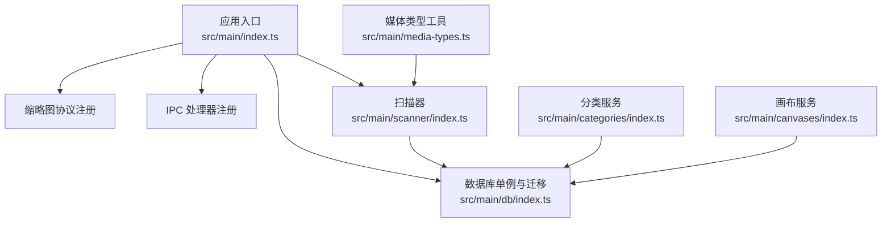
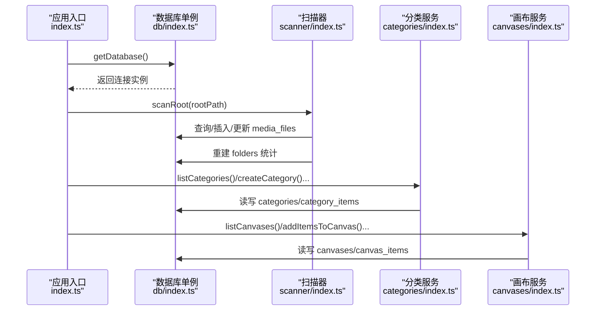
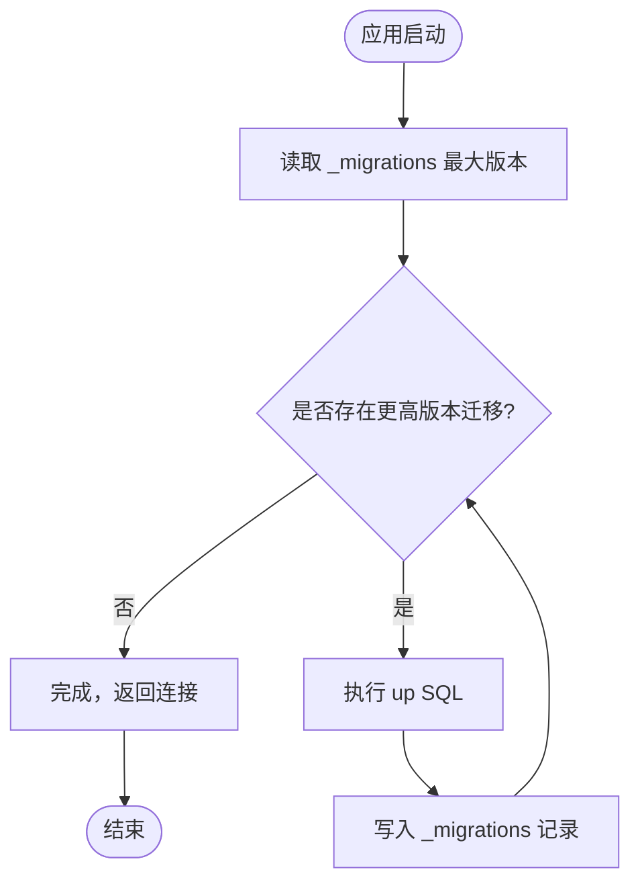
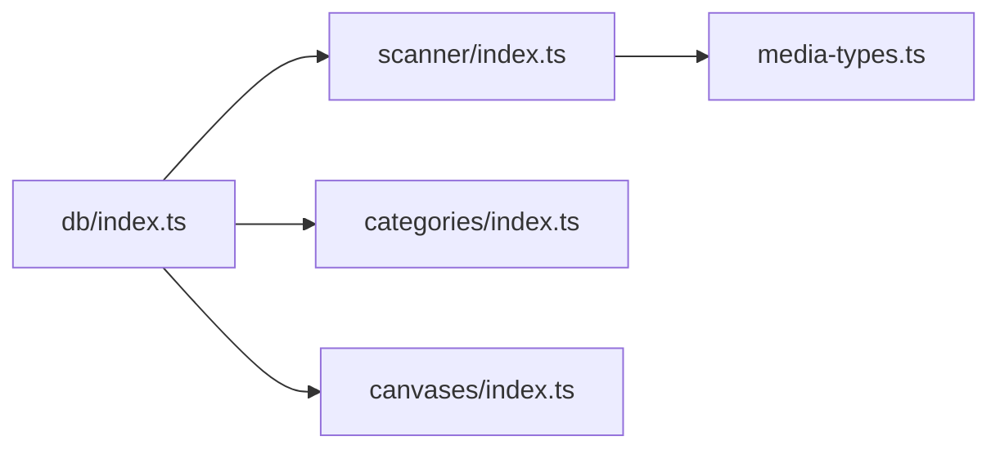

# 数据库层设计

<cite>
**本文引用的文件**
- [src/main/db/index.ts](file://src/main/db/index.ts)
- [src/main/index.ts](file://src/main/index.ts)
- [src/main/scanner/index.ts](file://src/main/scanner/index.ts)
- [src/main/categories/index.ts](file://src/main/categories/index.ts)
- [src/main/canvases/index.ts](file://src/main/canvases/index.ts)
- [src/main/media-types.ts](file://src/main/media-types.ts)
</cite>

## 目录
1. [简介](#简介)
2. [项目结构](#项目结构)
3. [核心组件](#核心组件)
4. [架构总览](#架构总览)
5. [详细组件分析](#详细组件分析)
6. [依赖关系分析](#依赖关系分析)
7. [性能考虑](#性能考虑)
8. [故障排查指南](#故障排查指南)
9. [结论](#结论)
10. [附录](#附录)

## 简介
本设计文档聚焦 Serendip 应用的数据库层，基于 better-sqlite3 实现本地 SQLite 数据库。文档涵盖：
- 单例连接与 WAL 模式配置、并发优化策略
- 迁移系统设计与版本管理（含回滚机制说明）
- 核心数据表结构与索引/外键约束
- 连接管理、事务处理与错误恢复
- 性能优化技巧与最佳实践

## 项目结构
数据库相关代码集中在 main 进程模块中，采用“按功能域拆分”的组织方式：
- 数据库连接与迁移：src/main/db/index.ts
- 应用启动与生命周期集成：src/main/index.ts
- 媒体扫描与增量同步：src/main/scanner/index.ts
- 收藏分类业务：src/main/categories/index.ts
- 画布业务：src/main/canvases/index.ts
- 媒体类型常量：src/main/media-types.ts

图表来源
- [src/main/index.ts:93-134](file://src/main/index.ts#L93-L134)
- [src/main/db/index.ts:1-35](file://src/main/db/index.ts#L1-L35)
- [src/main/scanner/index.ts:1-40](file://src/main/scanner/index.ts#L1-L40)
- [src/main/categories/index.ts:1-20](file://src/main/categories/index.ts#L1-L20)
- [src/main/canvases/index.ts:1-20](file://src/main/canvases/index.ts#L1-L20)
- [src/main/media-types.ts:1-38](file://src/main/media-types.ts#L1-L38)

章节来源
- [src/main/index.ts:93-134](file://src/main/index.ts#L93-L134)
- [src/main/db/index.ts:1-35](file://src/main/db/index.ts#L1-L35)

## 核心组件
- 数据库单例与初始化
  - 通过 getDatabase() 提供全局唯一连接实例，首次调用时创建并配置 PRAGMA；closeDatabase() 在应用退出时关闭连接。
  - 启用 WAL 模式、NORMAL 同步级别、开启外键约束，确保读写并发与一致性。
- 迁移系统
  - 使用 _migrations 表记录已执行迁移版本；每次启动按版本号顺序执行未执行的 up 脚本。
  - 当前实现为单向迁移（无 down 脚本），新增字段或表通过 ALTER TABLE/CREATE TABLE 追加。
- 业务模块
  - scanner：增量扫描文件系统，计算差异后批量写入 media_files，重建 folders 统计。
  - categories：分类的增删改查与多对多关联维护。
  - canvases：画布的增删改查与画布项位置/变换持久化。

章节来源
- [src/main/db/index.ts:6-35](file://src/main/db/index.ts#L6-L35)
- [src/main/db/index.ts:37-190](file://src/main/db/index.ts#L37-L190)
- [src/main/scanner/index.ts:36-239](file://src/main/scanner/index.ts#L36-L239)
- [src/main/categories/index.ts:21-166](file://src/main/categories/index.ts#L21-L166)
- [src/main/canvases/index.ts:76-320](file://src/main/canvases/index.ts#L76-L320)

## 架构总览
下图展示了从应用启动到数据库访问的关键流程，包括连接建立、迁移执行、扫描与业务操作。

图表来源
- [src/main/index.ts:93-134](file://src/main/index.ts#L93-L134)
- [src/main/db/index.ts:8-28](file://src/main/db/index.ts#L8-L28)
- [src/main/scanner/index.ts:36-239](file://src/main/scanner/index.ts#L36-L239)
- [src/main/categories/index.ts:21-166](file://src/main/categories/index.ts#L21-L166)
- [src/main/canvases/index.ts:76-320](file://src/main/canvases/index.ts#L76-L320)

## 详细组件分析

### 数据库连接与 WAL 配置
- 单例模式
  - 模块级变量保存连接实例，getDatabase() 保证同一进程内仅一个连接。
  - closeDatabase() 在应用退出时释放资源。
- PRAGMA 配置
  - journal_mode=WAL：提升并发读性能，允许读写并行。
  - synchronous=NORMAL：平衡安全与性能。
  - foreign_keys=ON：强制外键约束，保障引用完整性。
- 路径与存储
  - 使用 Electron app.getPath('userData') 定位用户数据目录，数据库文件名为 serendip.db。

章节来源
- [src/main/db/index.ts:6-28](file://src/main/db/index.ts#L6-L28)
- [src/main/index.ts:100-134](file://src/main/index.ts#L100-L134)

### 迁移系统设计与实现
- 版本管理
  - _migrations(version, applied_at) 记录已执行迁移。
  - 启动时读取 MAX(version)，依次执行大于当前版本的迁移。
- 迁移脚本结构
  - 以数组形式集中定义，每个迁移包含 version 与 up SQL。
  - 当前包含 4 个迁移：初始 schema、失效标记、分类排序、画布与画布项。
- 回滚机制
  - 当前实现为单向迁移（无 down 脚本）。如需回滚，应扩展迁移系统支持 down 逻辑，并在升级前备份数据库。
- 幂等性
  - 使用 CREATE TABLE IF NOT EXISTS、ALTER TABLE ADD COLUMN 等语句保证多次运行不破坏状态。

图表来源
- [src/main/db/index.ts:37-190](file://src/main/db/index.ts#L37-L190)

章节来源
- [src/main/db/index.ts:37-190](file://src/main/db/index.ts#L37-L190)

### 核心数据模型与约束
- 媒体文件 media_files
  - 主键 id，唯一路径 path，文件夹路径 folder_path，类型 type（image/video），mtime/size，宽高、时长，缩略图路径，点赞/点踩计数，展示计数与时间戳，不可用标记 unavailable 及原因 unavailable_reason。
  - 索引：folder_path、type、liked/disliked 部分索引、last_shown_at。
- 文件夹权重 folders
  - 主键 id，唯一路径 path，父路径 parent_path，深度 depth，文件数 file_count，递归计数 recursive_count，mtime。
  - 索引：parent_path、depth。
- 收藏分类 categories
  - 主键 id，唯一名称 name，position 用于排序，created_at。
  - 索引：position。
- 分类关联 category_items
  - 复合主键 (category_id, file_id)，外键指向 categories(id)、media_files(id)，删除级联。
  - 索引：file_id。
- 画布 canvases
  - 主键 id，唯一名称 name，position，视口坐标 viewport_x/y/scale，created_at。
  - 索引：position。
- 画布项目 canvas_items
  - 主键 id，外键 canvas_id、file_id，位置/尺寸/旋转/层级 z，裁剪多边形 clip_polygon，added_at。
  - 索引：canvas_id、file_id。
- 设置 settings
  - key/value 键值对，用于存储 rootPath 等配置。

```mermaid
erDiagram
MEDIA_FILES {
integer id PK
text path UK
text folder_path
text type
integer mtime
integer size
integer width
integer height
integer duration_ms
text thumb_path
integer liked
integer disliked
integer shown_count
integer last_shown_at
integer created_at
integer unavailable
text unavailable_reason
}
FOLDERS {
integer id PK
text path UK
text parent_path
integer depth
integer file_count
integer recursive_count
integer mtime
integer created_at
}
CATEGORIES {
integer id PK
text name UK
integer position
integer created_at
}
CATEGORY_ITEMS {
integer category_id FK
integer file_id FK
integer added_at
}
CANVASES {
integer id PK
text name UK
integer position
real viewport_x
real viewport_y
real viewport_scale
integer created_at
}
CANVAS_ITEMS {
integer id PK
integer canvas_id FK
integer file_id FK
real x
real y
real w
real h
real rotation
integer z
text clip_polygon
integer added_at
}
SETTINGS {
text key PK
text value
}
CATEGORIES ||--o{ CATEGORY_ITEMS : "一对多"
MEDIA_FILES ||--o{ CATEGORY_ITEMS : "一对多"
CANVASES ||--o{ CANVAS_ITEMS : "一对多"
MEDIA_FILES ||--o{ CANVAS_ITEMS : "一对多"
```

图表来源
- [src/main/db/index.ts:53-176](file://src/main/db/index.ts#L53-L176)

章节来源
- [src/main/db/index.ts:53-176](file://src/main/db/index.ts#L53-L176)

### 索引策略与查询优化
- 常用过滤与排序
  - media_files.folder_path、type、last_shown_at 用于列表筛选与推荐排序。
  - categories.position、canvases.position 用于 UI 拖拽排序。
  - category_items.file_id、canvas_items.canvas_id/file_id 用于快速反查归属。
- 条件索引
  - media_files.liked/disliked/unavailable 使用部分索引（WHERE 条件）减少索引体积，加速热点查询。
- 建议
  - 针对高频组合查询可考虑复合索引（如 folder_path + type）。
  - 大表分页查询建议使用 last_shown_at 或 id 游标式分页。

章节来源
- [src/main/db/index.ts:73-77](file://src/main/db/index.ts#L73-L77)
- [src/main/db/index.ts:124-127](file://src/main/db/index.ts#L124-L127)
- [src/main/db/index.ts:134](file://src/main/db/index.ts#L134)
- [src/main/db/index.ts:154](file://src/main/db/index.ts#L154)
- [src/main/db/index.ts:173-174](file://src/main/db/index.ts#L173-L174)

### 事务处理与批量写入
- 扫描器
  - 使用 db.transaction 包裹批量 INSERT/UPDATE，显著降低磁盘 I/O 次数。
  - 分批 stat + 批量插入，避免单次事务过大导致内存峰值过高。
- 分类与画布
  - 重排 position、批量添加/移除项目均使用事务，保证一致性与原子性。
- 建议
  - 将多个写操作合并到单一事务中提交。
  - 合理控制批次大小，兼顾吞吐与内存占用。

章节来源
- [src/main/scanner/index.ts:124-132](file://src/main/scanner/index.ts#L124-L132)
- [src/main/scanner/index.ts:195-207](file://src/main/scanner/index.ts#L195-L207)
- [src/main/scanner/index.ts:275-317](file://src/main/scanner/index.ts#L275-L317)
- [src/main/categories/index.ts:88-94](file://src/main/categories/index.ts#L88-L94)
- [src/main/categories/index.ts:128-135](file://src/main/categories/index.ts#L128-L135)
- [src/main/canvases/index.ts:143-149](file://src/main/canvases/index.ts#L143-L149)
- [src/main/canvases/index.ts:194-208](file://src/main/canvases/index.ts#L194-L208)
- [src/main/canvases/index.ts:281-288](file://src/main/canvases/index.ts#L281-L288)

### 错误处理与恢复
- 唯一约束冲突
  - categories.name、canvases.name 唯一约束冲突时抛出明确错误信息。
- 外键约束
  - category_items、canvas_items 的外键 ON DELETE CASCADE 自动清理关联，避免脏数据。
- 失效标记与解封
  - media_files.unavailable/unavailable_reason 标记临时不可用（如缩略图失败），扫描时若文件仍存在且属性未变则解封。
- 异常捕获
  - 扫描时对 stat 失败进行容错，跳过异常条目，不影响整体进度。

章节来源
- [src/main/categories/index.ts:45-56](file://src/main/categories/index.ts#L45-L56)
- [src/main/categories/index.ts:66-75](file://src/main/categories/index.ts#L66-L75)
- [src/main/canvases/index.ts:100-111](file://src/main/canvases/index.ts#L100-L111)
- [src/main/canvases/index.ts:121-130](file://src/main/canvases/index.ts#L121-L130)
- [src/main/scanner/index.ts:176-192](file://src/main/scanner/index.ts#L176-L192)
- [src/main/scanner/index.ts:119-121](file://src/main/scanner/index.ts#L119-L121)

### 数据完整性保证
- 外键约束
  - 所有关联表均声明 FOREIGN KEY，删除父记录时级联删除子记录。
- 唯一性约束
  - media_files.path、folders.path、categories.name、canvases.name 保证实体唯一。
- 检查约束
  - media_files.type 限定为 image/video。
- 默认值与时间戳
  - 多处使用 DEFAULT (unixepoch()) 统一时间来源。

章节来源
- [src/main/db/index.ts:55-176](file://src/main/db/index.ts#L55-L176)

## 依赖关系分析
- 模块耦合
  - db/index.ts 被 scanner、categories、canvases 直接依赖，作为唯一数据源。
  - scanner 依赖 media-types 确定支持的媒体扩展名。
- 外部依赖
  - better-sqlite3 提供同步 API 与事务封装。
  - Electron app.getPath('userData') 决定数据库文件位置。

图表来源
- [src/main/db/index.ts:1-28](file://src/main/db/index.ts#L1-L28)
- [src/main/scanner/index.ts:1-10](file://src/main/scanner/index.ts#L1-L10)
- [src/main/categories/index.ts:1-10](file://src/main/categories/index.ts#L1-L10)
- [src/main/canvases/index.ts:1-10](file://src/main/canvases/index.ts#L1-L10)
- [src/main/media-types.ts:1-38](file://src/main/media-types.ts#L1-L38)

章节来源
- [src/main/db/index.ts:1-28](file://src/main/db/index.ts#L1-L28)
- [src/main/scanner/index.ts:1-10](file://src/main/scanner/index.ts#L1-L10)
- [src/main/categories/index.ts:1-10](file://src/main/categories/index.ts#L1-L10)
- [src/main/canvases/index.ts:1-10](file://src/main/canvases/index.ts#L1-L10)
- [src/main/media-types.ts:1-38](file://src/main/media-types.ts#L1-L38)

## 性能考虑
- WAL 模式与同步级别
  - WAL 提升并发读能力；synchronous=NORMAL 在可靠性与性能间折中。
- 事务批量化
  - 扫描器与业务模块广泛使用 db.transaction 包裹批量写，减少 fsync 次数。
- 索引选择
  - 使用部分索引缩小索引体积，提高命中率；对高频过滤字段建立合适索引。
- 分批处理
  - 扫描器按固定批次大小处理新增/更新，避免一次性加载过多数据。
- 统计重建
  - folders 统计通过聚合 media_files 重建，避免复杂维护成本。

[本节为通用指导，无需具体文件引用]

## 故障排查指南
- 连接问题
  - 确认 userData 目录存在且可写；应用退出时调用 closeDatabase() 释放连接。
- 迁移失败
  - 检查 _migrations 表是否损坏；必要时备份数据库后重新初始化。
- 唯一约束冲突
  - 分类/画布名称重复会抛错，需在前端去重提示。
- 外键约束错误
  - 删除父记录时应触发级联删除；若出现外键错误，检查关联数据是否已被手动修改。
- 扫描异常
  - 个别文件 stat 失败会被忽略，不影响整体扫描；可在日志中定位具体路径。

章节来源
- [src/main/index.ts:127-134](file://src/main/index.ts#L127-L134)
- [src/main/db/index.ts:37-190](file://src/main/db/index.ts#L37-L190)
- [src/main/categories/index.ts:45-56](file://src/main/categories/index.ts#L45-L56)
- [src/main/canvases/index.ts:100-111](file://src/main/canvases/index.ts#L100-L111)
- [src/main/scanner/index.ts:176-192](file://src/main/scanner/index.ts#L176-L192)

## 结论
Serendip 的数据库层以 better-sqlite3 为核心，采用单例连接与 WAL 模式，结合迁移系统与严格的外键/唯一性约束，实现了高并发、强一致性的本地数据存储。扫描器与业务模块通过事务批量化与合理索引策略，保证了良好的性能表现。未来可扩展迁移系统的回滚能力，并持续优化索引与查询计划。

[本节为总结性内容，无需具体文件引用]

## 附录
- 关键实现片段路径
  - 连接与迁移：[src/main/db/index.ts:8-28](file://src/main/db/index.ts#L8-L28), [src/main/db/index.ts:37-190](file://src/main/db/index.ts#L37-L190)
  - 扫描与批量写入：[src/main/scanner/index.ts:124-132](file://src/main/scanner/index.ts#L124-L132), [src/main/scanner/index.ts:195-207](file://src/main/scanner/index.ts#L195-L207)
  - 分类事务操作：[src/main/categories/index.ts:88-94](file://src/main/categories/index.ts#L88-L94), [src/main/categories/index.ts:128-135](file://src/main/categories/index.ts#L128-L135)
  - 画布事务操作：[src/main/canvases/index.ts:143-149](file://src/main/canvases/index.ts#L143-L149), [src/main/canvases/index.ts:194-208](file://src/main/canvases/index.ts#L194-L208)