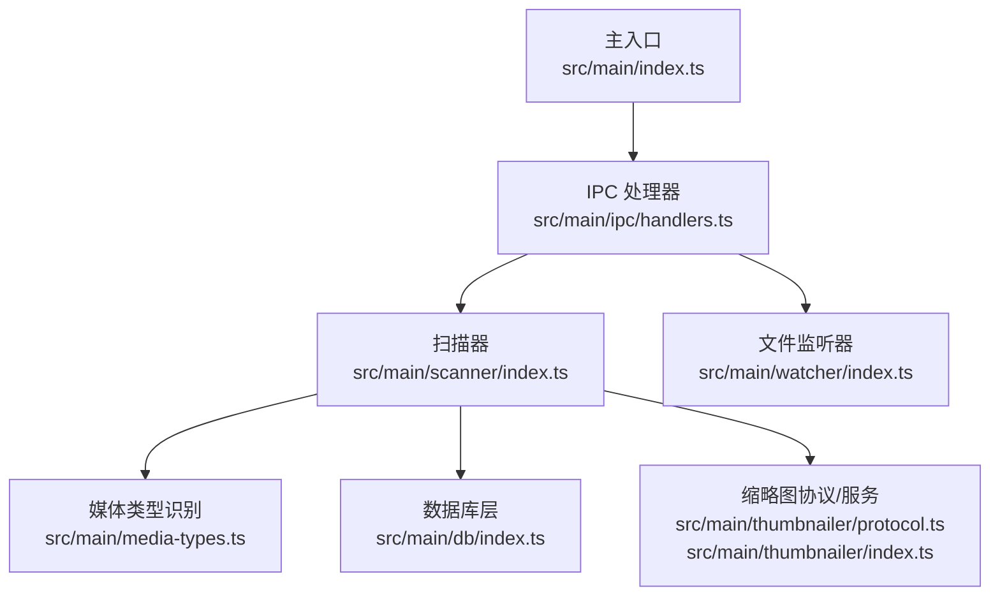
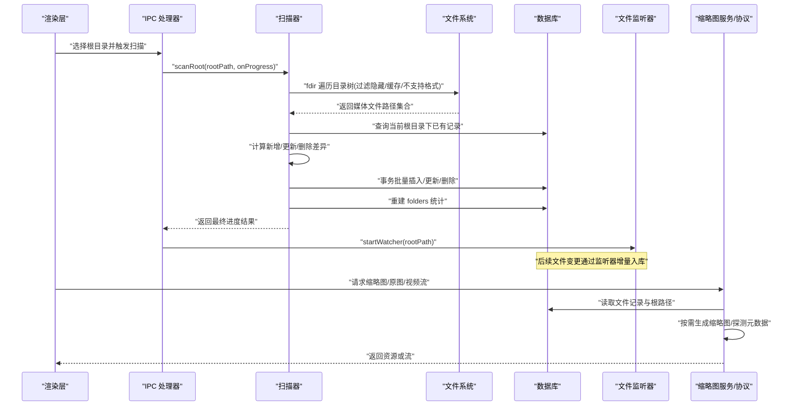
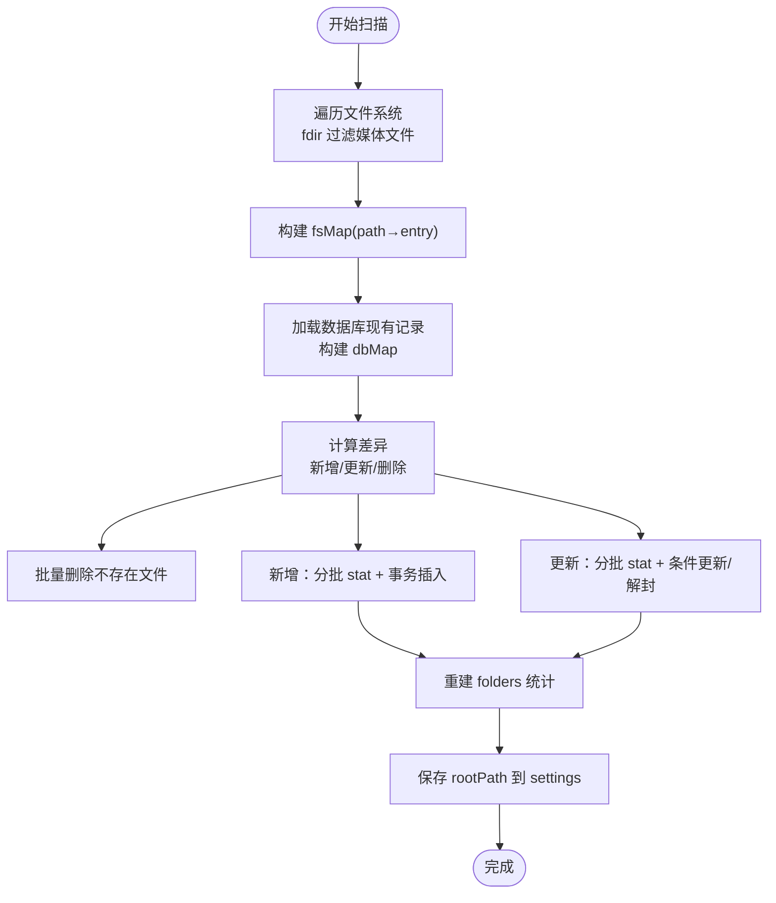
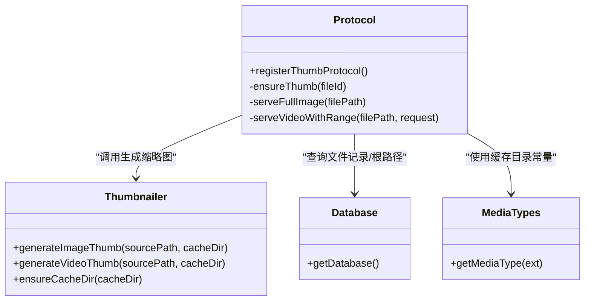
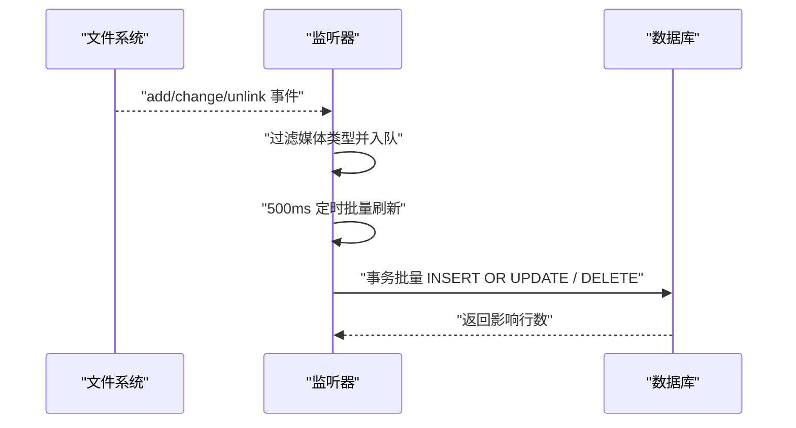
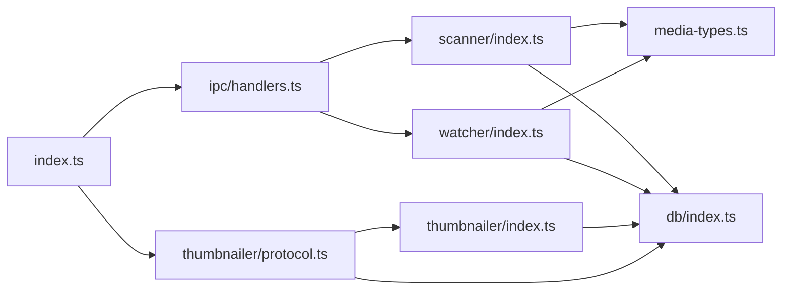

# 文件扫描器模块

<cite>
**本文引用的文件列表**
- [src/main/scanner/index.ts](file://src/main/scanner/index.ts)
- [src/main/media-types.ts](file://src/main/media-types.ts)
- [src/main/watcher/index.ts](file://src/main/watcher/index.ts)
- [src/main/thumbnailer/index.ts](file://src/main/thumbnailer/index.ts)
- [src/main/thumbnailer/protocol.ts](file://src/main/thumbnailer/protocol.ts)
- [src/main/db/index.ts](file://src/main/db/index.ts)
- [src/main/ipc/handlers.ts](file://src/main/ipc/handlers.ts)
- [src/main/index.ts](file://src/main/index.ts)
</cite>

## 目录
1. [简介](#简介)
2. [项目结构](#项目结构)
3. [核心组件](#核心组件)
4. [架构总览](#架构总览)
5. [详细组件分析](#详细组件分析)
6. [依赖关系分析](#依赖关系分析)
7. [性能考量与调优](#性能考量与调优)
8. [故障排除指南](#故障排除指南)
9. [结论](#结论)

## 简介
本文件为 Serendip 应用的文件扫描器模块实现文档，聚焦以下目标：
- 增量同步算法设计原理：文件系统遍历策略、变更检测与差异计算机制
- 媒体类型识别系统：图片（JPEG、PNG、GIF、WebP 等）与视频（MP4、MOV、MKV、WebM、M4V 等）的自动识别
- 元数据提取流程：尺寸、时长、修改时间等信息的获取与处理
- 扫描性能优化策略：并行处理、内存管理与进度反馈
- 配置项、错误处理与重试逻辑的实现细节
- 大目录扫描的性能调优与故障排除方法

## 项目结构
扫描器位于主进程侧，围绕“扫描根目录 → 增量差异 → 批量写入 → 重建文件夹统计”的主流程展开，并与数据库、缩略图生成、实时监听等模块协作。

图表来源
- [src/main/index.ts:93-125](file://src/main/index.ts#L93-L125)
- [src/main/ipc/handlers.ts:52-60](file://src/main/ipc/handlers.ts#L52-L60)
- [src/main/scanner/index.ts:36-239](file://src/main/scanner/index.ts#L36-L239)
- [src/main/media-types.ts:1-38](file://src/main/media-types.ts#L1-L38)
- [src/main/db/index.ts:1-190](file://src/main/db/index.ts#L1-L190)
- [src/main/thumbnailer/protocol.ts:33-92](file://src/main/thumbnailer/protocol.ts#L33-L92)
- [src/main/thumbnailer/index.ts:27-94](file://src/main/thumbnailer/index.ts#L27-L94)
- [src/main/watcher/index.ts:16-37](file://src/main/watcher/index.ts#L16-L37)

章节来源
- [src/main/index.ts:93-125](file://src/main/index.ts#L93-L125)
- [src/main/ipc/handlers.ts:52-60](file://src/main/ipc/handlers.ts#L52-L60)

## 核心组件
- 扫描器（scanner）：负责根目录扫描、增量差异计算、批量入库与文件夹统计重建
- 媒体类型识别（media-types）：维护图片/视频扩展名集合与类型判定函数
- 数据库（db）：SQLite 初始化、迁移、WAL 模式与索引
- 缩略图服务（thumbnailer）：图片/视频缩略图生成、元数据探测、缓存目录管理
- 协议层（thumbnailer/protocol）：自定义协议提供缩略图、原图与带 Range 的视频流
- 文件监听器（watcher）：基于 chokidar 的增量事件聚合与批处理入库
- IPC 处理器（ipc/handlers）：暴露前端可调用的接口，串联扫描、监听与协议注册

章节来源
- [src/main/scanner/index.ts:36-239](file://src/main/scanner/index.ts#L36-L239)
- [src/main/media-types.ts:1-38](file://src/main/media-types.ts#L1-L38)
- [src/main/db/index.ts:1-190](file://src/main/db/index.ts#L1-L190)
- [src/main/thumbnailer/index.ts:27-94](file://src/main/thumbnailer/index.ts#L27-L94)
- [src/main/thumbnailer/protocol.ts:33-92](file://src/main/thumbnailer/protocol.ts#L33-L92)
- [src/main/watcher/index.ts:16-37](file://src/main/watcher/index.ts#L16-L37)
- [src/main/ipc/handlers.ts:52-60](file://src/main/ipc/handlers.ts#L52-L60)

## 架构总览
扫描器采用“全量遍历 + 增量差异 + 事务批量写入”的策略，结合 chokidar 的事件监听进行后续增量更新；缩略图按需生成并通过自定义协议响应渲染层请求。

图表来源
- [src/main/ipc/handlers.ts:52-60](file://src/main/ipc/handlers.ts#L52-L60)
- [src/main/scanner/index.ts:36-239](file://src/main/scanner/index.ts#L36-L239)
- [src/main/watcher/index.ts:16-37](file://src/main/watcher/index.ts#L16-L37)
- [src/main/thumbnailer/protocol.ts:33-92](file://src/main/thumbnailer/protocol.ts#L33-L92)
- [src/main/thumbnailer/index.ts:27-94](file://src/main/thumbnailer/index.ts#L27-L94)

## 详细组件分析

### 增量同步算法与差异计算
- 遍历策略
  - 使用 fdir 异步遍历整棵目录树，按扩展名过滤出支持的媒体文件，同时跳过缓存目录、隐藏目录与系统特殊目录
  - 将遍历结果构建为 Map<path, FileEntry>，便于后续与数据库对比
- 差异计算
  - 从数据库加载当前根目录下的所有媒体文件记录，构建 dbMap
  - 对 fsMap 与 dbMap 做集合差集与交集比较：
    - 在 fs 不在 db：标记为新增
    - 在 db 不在 fs：标记为删除
    - 都在：暂标记为待检查，后续再 stat 比对 mtime/size
- 批量写入
  - 删除操作直接执行 IN 批量删除
  - 新增：分批 stat 获取 mtime/size，使用事务批量插入
  - 更新：分批 stat 后仅当 mtime 或 size 变化才更新；若之前被标记不可用但状态未变则解封
- 文件夹统计重建
  - 清空当前根目录范围下的 folders 记录，然后按 folder_path 聚合统计，修正 parent_path 与 depth

图表来源
- [src/main/scanner/index.ts:36-239](file://src/main/scanner/index.ts#L36-L239)
- [src/main/scanner/index.ts:245-268](file://src/main/scanner/index.ts#L245-L268)
- [src/main/scanner/index.ts:274-317](file://src/main/scanner/index.ts#L274-L317)

章节来源
- [src/main/scanner/index.ts:36-239](file://src/main/scanner/index.ts#L36-L239)
- [src/main/scanner/index.ts:245-268](file://src/main/scanner/index.ts#L245-L268)
- [src/main/scanner/index.ts:274-317](file://src/main/scanner/index.ts#L274-L317)

### 媒体类型识别系统
- 支持格式
  - 图片：jpg/jpeg、png、gif、webp、bmp、avif、heic/heif
  - 视频：mp4、mov、mkv、webm、m4v
- 识别方式
  - 通过扩展名小写匹配预定义集合，返回 image/video 类型
- 用途
  - 扫描阶段用于过滤非媒体文件
  - 监听器阶段用于快速判断是否处理该事件
  - 缩略图服务根据类型决定生成策略

章节来源
- [src/main/media-types.ts:1-38](file://src/main/media-types.ts#L1-L38)
- [src/main/scanner/index.ts:258-261](file://src/main/scanner/index.ts#L258-L261)
- [src/main/watcher/index.ts:52-56](file://src/main/watcher/index.ts#L52-56)

### 文件元数据提取流程
- 图片
  - 使用 sharp 读取 metadata 获取 width/height，并按 EXIF 旋转后生成缩略图（固定宽度、质量参数），结果以 webp 存储于缓存目录
- 视频
  - 使用 ffprobe 一次探测 durationMs、width、height
  - 抽取中间帧作为缩略图（固定宽度、质量参数），结果以 webp 存储于缓存目录
- 缩略图缓存
  - 基于源路径哈希命名，避免重复生成
  - 首次访问时按需生成，命中缓存则直接返回
- 协议层
  - 自定义 serendip://thumb/<id> 返回缩略图
  - serendip://image/<id> 返回原图（HEIC/HEIF 转高质量 JPEG 并缓存）
  - serendip://video/<id> 返回带 Range 的流式视频，秒开播放

图表来源
- [src/main/thumbnailer/index.ts:27-94](file://src/main/thumbnailer/index.ts#L27-L94)
- [src/main/thumbnailer/protocol.ts:33-92](file://src/main/thumbnailer/protocol.ts#L33-L92)
- [src/main/thumbnailer/protocol.ts:177-209](file://src/main/thumbnailer/protocol.ts#L177-L209)
- [src/main/thumbnailer/protocol.ts:99-149](file://src/main/thumbnailer/protocol.ts#L99-L149)
- [src/main/media-types.ts:28](file://src/main/media-types.ts#L28)
- [src/main/db/index.ts:8-28](file://src/main/db/index.ts#L8-L28)

章节来源
- [src/main/thumbnailer/index.ts:27-94](file://src/main/thumbnailer/index.ts#L27-L94)
- [src/main/thumbnailer/protocol.ts:33-92](file://src/main/thumbnailer/protocol.ts#L33-L92)
- [src/main/thumbnailer/protocol.ts:99-149](file://src/main/thumbnailer/protocol.ts#L99-L149)
- [src/main/thumbnailer/protocol.ts:177-209](file://src/main/thumbnailer/protocol.ts#L177-L209)

### 文件监听器与增量更新
- 监听策略
  - 使用 chokidar 监听 add/change/unlink 事件，忽略隐藏目录、node_modules、缓存目录与系统目录
  - awaitWriteFinish 合并频繁写入，减少抖动
- 事件聚合
  - 将事件推入队列，500ms 定时器批量刷新
  - 对新增/变更事件 stat 获取 mtime/size，使用 ON CONFLICT 幂等写入
  - 对删除事件直接删除记录
- 与扫描器的协同
  - 启动时先执行一次 scanRoot，随后 startWatcher 保持增量同步

图表来源
- [src/main/watcher/index.ts:16-37](file://src/main/watcher/index.ts#L16-L37)
- [src/main/watcher/index.ts:52-64](file://src/main/watcher/index.ts#L52-64)
- [src/main/watcher/index.ts:66-116](file://src/main/watcher/index.ts#L66-L116)

章节来源
- [src/main/watcher/index.ts:16-37](file://src/main/watcher/index.ts#L16-L37)
- [src/main/watcher/index.ts:52-64](file://src/main/watcher/index.ts#L52-64)
- [src/main/watcher/index.ts:66-116](file://src/main/watcher/index.ts#L66-L116)

### IPC 集成与启动流程
- 选择根目录与扫描
  - 前端通过 IPC 选择目录并触发扫描，扫描完成后启动监听器
- 启动时自动同步
  - 应用启动时读取 settings.rootPath，静默执行 scanRoot，成功后启动 watcher
- 协议注册
  - 在 app.whenReady 前注册 serendip 协议特权，确保缩略图/原图/视频流可用

章节来源
- [src/main/ipc/handlers.ts:52-60](file://src/main/ipc/handlers.ts#L52-L60)
- [src/main/index.ts:93-125](file://src/main/index.ts#L93-L125)
- [src/main/index.ts:26-36](file://src/main/index.ts#L26-L36)

## 依赖关系分析
- 外部库
  - fdir：高性能目录遍历
  - better-sqlite3：本地 SQLite 数据库，启用 WAL 提升并发
  - chokidar：文件系统事件监听
  - sharp：图片元数据与缩略图生成
  - fluent-ffmpeg + ffmpeg-static + @ffprobe-installer/ffprobe：视频元数据探测与帧抽取
- 内部耦合
  - scanner 依赖 media-types 与 db
  - thumbnailer 依赖 db 与 media-types
  - watcher 依赖 db 与 media-types
  - ipc/handlers 协调 scanner、watcher、db、thumbnailer

图表来源
- [src/main/scanner/index.ts:36-239](file://src/main/scanner/index.ts#L36-L239)
- [src/main/media-types.ts:1-38](file://src/main/media-types.ts#L1-L38)
- [src/main/db/index.ts:1-190](file://src/main/db/index.ts#L1-L190)
- [src/main/watcher/index.ts:16-37](file://src/main/watcher/index.ts#L16-L37)
- [src/main/thumbnailer/index.ts:27-94](file://src/main/thumbnailer/index.ts#L27-L94)
- [src/main/thumbnailer/protocol.ts:33-92](file://src/main/thumbnailer/protocol.ts#L33-L92)
- [src/main/ipc/handlers.ts:52-60](file://src/main/ipc/handlers.ts#L52-L60)
- [src/main/index.ts:93-125](file://src/main/index.ts#L93-L125)

章节来源
- [package.json:23-41](file://package.json#L23-L41)

## 性能考量与调优
- 遍历与过滤
  - fdir 异步遍历，配合 extname 与 getMediaType 过滤，避免无效 IO
  - 跳过 .serendip-cache、隐藏目录、node_modules、System Volume Information、$RECYCLE.BIN
- 差异计算
  - 使用 Map 结构 O(1) 查找，降低 diff 复杂度
  - 仅在需要时 stat，避免不必要的元数据读取
- 批量写入
  - 使用 SQLite 事务包裹批量插入/更新，显著降低磁盘 I/O 次数
  - 新增与更新均按批次处理，控制内存峰值
- 并行处理
  - 新增与更新阶段使用 Promise.all 并行 stat，提高吞吐
  - 注意：stat 是阻塞型系统调用，在高并发下可能成为瓶颈，建议根据磁盘类型调整批次大小
- 内存管理
  - 分批处理 toAdd/toUpdate，避免一次性加载全部统计信息
  - 缩略图按需生成，命中缓存即返回，减少重复计算
- 进度反馈
  - 扫描过程分阶段推送 walking/diffing/inserting/done，包含 scanned/total/added/removed/updated/currentPath
- 数据库优化
  - 启用 WAL 模式与 NORMAL 同步级别，提升并发读写性能
  - 针对常用查询建立索引（folder_path、type、liked/disliked、last_shown_at、unavailable）

章节来源
- [src/main/scanner/index.ts:124-218](file://src/main/scanner/index.ts#L124-L218)
- [src/main/db/index.ts:19-28](file://src/main/db/index.ts#L19-L28)
- [src/main/db/index.ts:54-176](file://src/main/db/index.ts#L54-L176)
- [src/main/thumbnailer/protocol.ts:99-149](file://src/main/thumbnailer/protocol.ts#L99-L149)

## 故障排除指南
- 缩略图生成失败
  - 现象：缩略图无法显示，文件被标记 unavailable
  - 排查：检查 sharp/ffmpeg 二进制可用性、源文件是否损坏、权限问题
  - 恢复：重新触发扫描或手动修复文件后，下次访问会重新生成缩略图并解封
- 视频无法秒开
  - 现象：视频首帧加载慢
  - 排查：确认协议层是否正确返回 Range 响应头与 Content-Range
  - 优化：确保服务端正确设置 Accept-Ranges 与 206 状态码
- 监听器不生效
  - 现象：新增/删除文件未入库
  - 排查：检查 ignored 规则是否误过滤、awaitWriteFinish 配置是否合理
  - 恢复：重启应用或手动触发一次 scanRoot
- 大目录扫描缓慢
  - 现象：扫描耗时过长
  - 调优：增大 BATCH_SIZE、减少并行 stat 数量、关闭不必要日志输出
  - 监控：关注 progress 回调中的 currentPath 定位卡点目录
- 数据库锁竞争
  - 现象：并发写入时报错
  - 排查：确认 WAL 模式已启用、避免长时间事务
  - 优化：拆分事务、减少单事务内语句数

章节来源
- [src/main/thumbnailer/protocol.ts:48-53](file://src/main/thumbnailer/protocol.ts#L48-L53)
- [src/main/thumbnailer/protocol.ts:99-149](file://src/main/thumbnailer/protocol.ts#L99-L149)
- [src/main/watcher/index.ts:16-37](file://src/main/watcher/index.ts#L16-L37)
- [src/main/scanner/index.ts:124-218](file://src/main/scanner/index.ts#L124-L218)
- [src/main/db/index.ts:19-28](file://src/main/db/index.ts#L19-L28)

## 结论
Serendip 的文件扫描器模块通过高效的目录遍历、精确的差异计算与事务化批量写入，实现了稳定可靠的增量同步。结合 chokidar 的实时监听与缩略图按需生成，系统在用户体验与性能之间取得良好平衡。对于大目录场景，可通过调整批次大小、并行度与数据库参数进一步优化。完善的错误处理与解封机制确保了系统的鲁棒性。