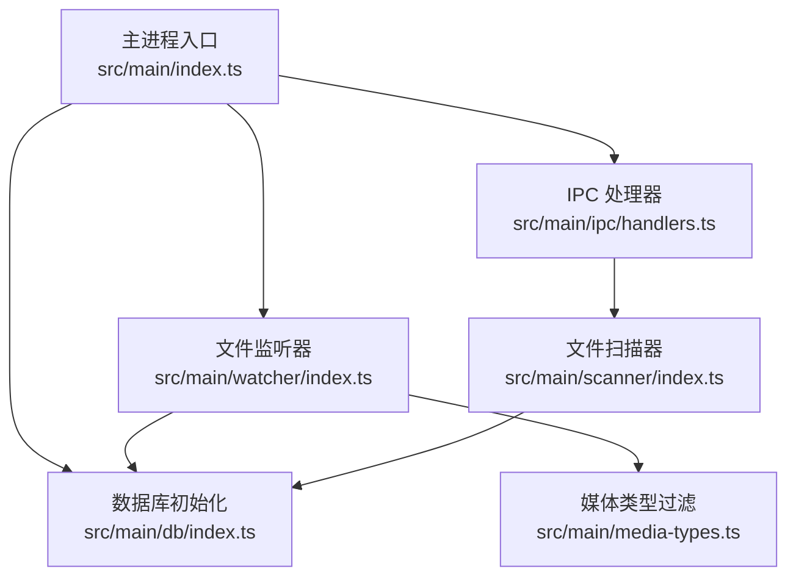
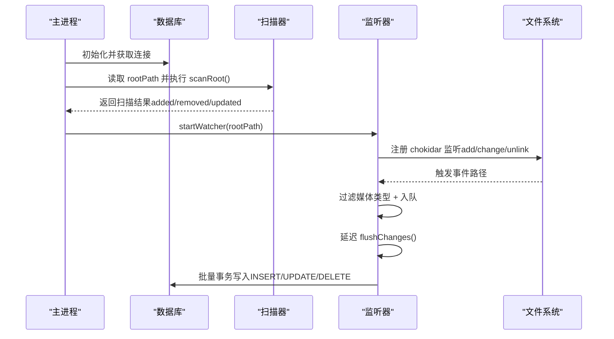
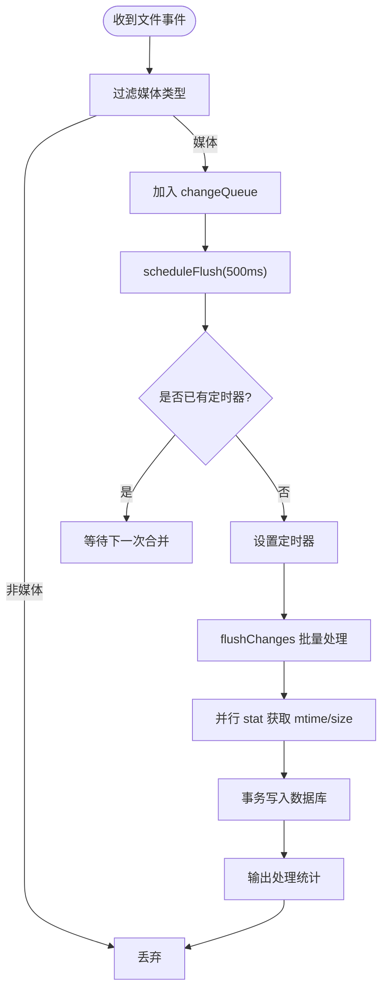
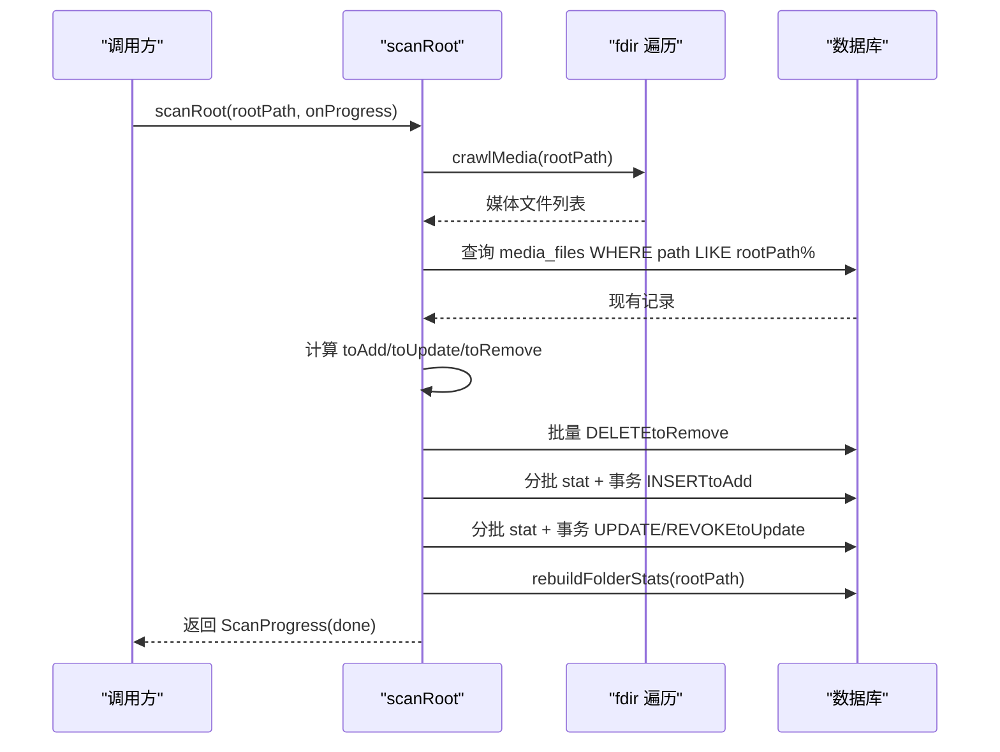
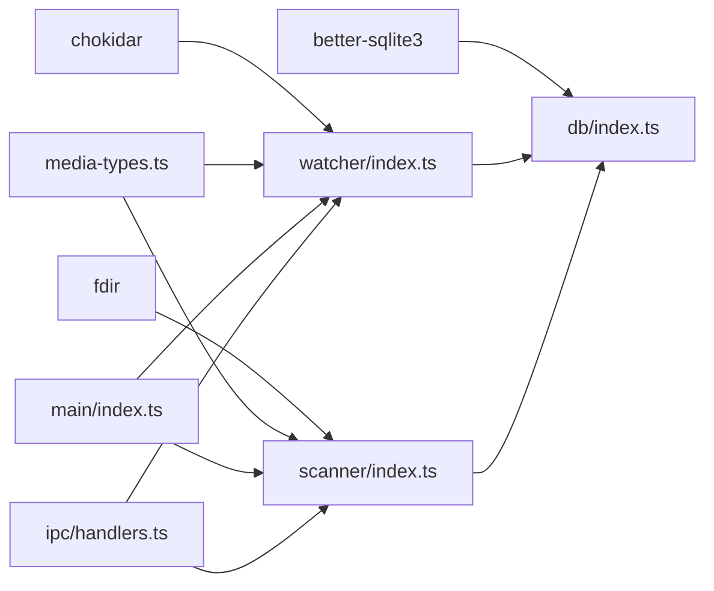

# 文件监听器

<cite>
**本文引用的文件**   
- [src/main/watcher/index.ts](file://src/main/watcher/index.ts)
- [src/main/scanner/index.ts](file://src/main/scanner/index.ts)
- [src/main/db/index.ts](file://src/main/db/index.ts)
- [src/main/media-types.ts](file://src/main/media-types.ts)
- [src/main/ipc/handlers.ts](file://src/main/ipc/handlers.ts)
- [src/main/index.ts](file://src/main/index.ts)
- [package.json](file://package.json)
</cite>

## 目录
1. [简介](#简介)
2. [项目结构](#项目结构)
3. [核心组件](#核心组件)
4. [架构总览](#架构总览)
5. [详细组件分析](#详细组件分析)
6. [依赖关系分析](#依赖关系分析)
7. [性能考量](#性能考量)
8. [故障排查指南](#故障排查指南)
9. [结论](#结论)
10. [附录](#附录)

## 简介
本文件为 Serendip 应用的文件监听器模块实现文档，聚焦于基于 chokidar 的实时文件系统事件监听机制与增量同步策略。内容涵盖：
- 文件创建、修改、删除事件的捕获与处理流程
- 增量同步触发策略（事件去重、批量处理、延迟执行）
- 与文件扫描器的集成方案，确保文件系统变化及时反映到数据库
- 监听范围配置（根目录监控、递归子目录、忽略规则）
- 性能优化（事件节流、内存泄漏防护、大目录监控优化）
- 跨平台兼容性与错误恢复机制
- 调试工具与监控指标的配置方法

## 项目结构
Serendip 的主进程负责启动数据库、注册 IPC 处理器、在应用启动时进行初始扫描并启动文件监听器；监听器通过 chokidar 监听媒体根目录下的文件变更，将变更事件入队、节流合并后批量写入数据库；扫描器用于首次全量/增量扫描并与数据库做差异对比。

图表来源
- [src/main/index.ts:93-134](file://src/main/index.ts#L93-L134)
- [src/main/ipc/handlers.ts:40-60](file://src/main/ipc/handlers.ts#L40-L60)
- [src/main/db/index.ts:1-35](file://src/main/db/index.ts#L1-L35)
- [src/main/watcher/index.ts:16-37](file://src/main/watcher/index.ts#L16-L37)
- [src/main/scanner/index.ts:36-56](file://src/main/scanner/index.ts#L36-L56)
- [src/main/media-types.ts:32-37](file://src/main/media-types.ts#L32-L37)

章节来源
- [src/main/index.ts:93-134](file://src/main/index.ts#L93-L134)
- [src/main/ipc/handlers.ts:40-60](file://src/main/ipc/handlers.ts#L40-L60)
- [src/main/db/index.ts:1-35](file://src/main/db/index.ts#L1-L35)
- [src/main/watcher/index.ts:16-37](file://src/main/watcher/index.ts#L16-L37)
- [src/main/scanner/index.ts:36-56](file://src/main/scanner/index.ts#L36-L56)
- [src/main/media-types.ts:32-37](file://src/main/media-types.ts#L32-L37)

## 核心组件
- 文件监听器（watcher）
  - 使用 chokidar 监听根目录及子目录的文件 add/change/unlink 事件
  - 对非媒体文件进行快速过滤，避免无效 IO
  - 采用队列 + 定时器实现事件节流与批量处理
  - 批量统计 mtime/size 并通过事务写入数据库
- 文件扫描器（scanner）
  - 使用 fdir 高性能遍历目录树，过滤媒体文件
  - 与数据库现有记录做 diff，计算新增、更新、删除集合
  - 分批 stat + 事务批量写入，重建文件夹统计
- 数据库（db）
  - 使用 better-sqlite3，启用 WAL 模式提升并发性能
  - 提供迁移脚本，维护 media_files/folders/settings 等表结构
- 媒体类型（media-types）
  - 定义支持的图片/视频扩展名集合与缓存目录名
  - 提供 getMediaType 工具函数用于统一类型判断

章节来源
- [src/main/watcher/index.ts:16-117](file://src/main/watcher/index.ts#L16-L117)
- [src/main/scanner/index.ts:36-239](file://src/main/scanner/index.ts#L36-L239)
- [src/main/db/index.ts:1-190](file://src/main/db/index.ts#L1-L190)
- [src/main/media-types.ts:1-38](file://src/main/media-types.ts#L1-L38)

## 架构总览
下图展示了从应用启动到文件变更落库的整体流程，包括初始扫描、监听器启动、事件入队与批量落库。

图表来源
- [src/main/index.ts:104-118](file://src/main/index.ts#L104-L118)
- [src/main/scanner/index.ts:36-56](file://src/main/scanner/index.ts#L36-L56)
- [src/main/watcher/index.ts:16-37](file://src/main/watcher/index.ts#L16-L37)
- [src/main/watcher/index.ts:66-116](file://src/main/watcher/index.ts#L66-L116)
- [src/main/db/index.ts:1-28](file://src/main/db/index.ts#L1-L28)

## 详细组件分析

### 文件监听器（watcher）
- 事件捕获
  - 监听 add/change/unlink 三类事件，仅对媒体文件进行处理
  - 使用 extname 与 getMediaType 快速过滤非媒体文件，减少后续 IO
- 增量同步触发策略
  - 事件去重：同一批次内不显式去重，但通过 awaitWriteFinish 降低重复 change 事件
  - 批量处理：changeQueue 收集事件，scheduleFlush 使用 setTimeout 500ms 延迟合并
  - 延迟执行：flushChanges 一次性处理队列，避免频繁 IO 和事务开销
- 与数据库集成
  - 对 add/change 事件并行 stat 获取 mtime/size，失败则跳过（文件消失场景）
  - 使用事务包裹 INSERT/UPDATE/DELETE，保证一致性
  - 使用 ON CONFLICT 幂等插入，避免重复键冲突
- 监听范围配置
  - ignored 规则包含隐藏目录、node_modules、缓存目录、系统回收站等
  - ignoreInitial: true 避免启动时的全量事件风暴
  - persistent: true 保持监听生命周期
  - awaitWriteFinish 参数稳定阈值与轮询间隔，降低写放大
- 错误处理与资源清理
  - stopWatcher 会清除定时器、关闭 watcher、清空队列，防止内存泄漏
  - error 事件打印日志便于定位问题

图表来源
- [src/main/watcher/index.ts:16-37](file://src/main/watcher/index.ts#L16-L37)
- [src/main/watcher/index.ts:52-64](file://src/main/watcher/index.ts#L52-L64)
- [src/main/watcher/index.ts:66-116](file://src/main/watcher/index.ts#L66-L116)

章节来源
- [src/main/watcher/index.ts:16-117](file://src/main/watcher/index.ts#L16-L117)
- [src/main/media-types.ts:32-37](file://src/main/media-types.ts#L32-L37)

### 文件扫描器（scanner）
- 扫描策略
  - 使用 fdir 异步遍历目录树，自动排除缓存与隐藏目录
  - 过滤出支持的媒体文件，构建 fsMap
  - 加载数据库中当前根目录下的记录，构建 dbMap
  - 计算差异：新增（fs 有 db 无）、更新（mtime/size 变化）、删除（db 有 fs 无）
- 批量写入与性能优化
  - 分批 stat（BATCH_SIZE=200），减少单次 IO 压力
  - 使用事务批量 INSERT/UPDATE，提升写入吞吐
  - 对之前标记 unavailable 的记录，若 mtime/size 未变也解封
- 文件夹统计重建
  - 清空当前根目录范围的 folders 记录
  - 聚合 media_files 生成 folder_path/file_count/recursive_count/mtime
  - 修正 parent_path 与 depth，支持层级展示
- 进度回调
  - 提供 walking/diffing/inserting/done 阶段进度，便于 UI 反馈

图表来源
- [src/main/scanner/index.ts:36-56](file://src/main/scanner/index.ts#L36-L56)
- [src/main/scanner/index.ts:59-92](file://src/main/scanner/index.ts#L59-L92)
- [src/main/scanner/index.ts:101-218](file://src/main/scanner/index.ts#L101-L218)
- [src/main/scanner/index.ts:274-317](file://src/main/scanner/index.ts#L274-L317)

章节来源
- [src/main/scanner/index.ts:36-239](file://src/main/scanner/index.ts#L36-L239)
- [src/main/scanner/index.ts:245-268](file://src/main/scanner/index.ts#L245-L268)
- [src/main/scanner/index.ts:274-317](file://src/main/scanner/index.ts#L274-L317)

### 数据库（db）
- 连接与性能
  - 使用 better-sqlite3，开启 WAL 模式、NORMAL 同步、外键约束
  - 单例模式管理连接，避免重复打开
- 迁移与表结构
  - 维护 _migrations 表，按版本顺序执行 up 脚本
  - 关键表：media_files、folders、categories、category_items、settings、canvases、canvas_items
  - 索引设计覆盖常用查询路径（folder_path、type、liked/disliked、last_shown_at、unavailable、parent/depth 等）

章节来源
- [src/main/db/index.ts:1-190](file://src/main/db/index.ts#L1-L190)

### 媒体类型（media-types）
- 支持的图片/视频扩展名集合
- 缓存目录名常量 .serendip-cache
- getMediaType 工具函数用于统一类型判断

章节来源
- [src/main/media-types.ts:1-38](file://src/main/media-types.ts#L1-L38)

### 应用启动与 IPC 集成
- 启动流程
  - 读取 settings.rootPath，若存在则静默执行 scanRoot，完成后启动 startWatcher
  - 窗口创建与协议注册在 app.whenReady 之后执行
- IPC 集成
  - 渲染层可通过 IPC.SCAN_ROOT 选择根目录并触发扫描，扫描完成后自动启动监听器
  - 其他业务逻辑（分类、画布、推荐等）与监听器解耦

章节来源
- [src/main/index.ts:93-134](file://src/main/index.ts#L93-L134)
- [src/main/ipc/handlers.ts:40-60](file://src/main/ipc/handlers.ts#L40-L60)

## 依赖关系分析
- 外部依赖
  - chokidar：文件系统事件监听
  - fdir：高性能目录遍历
  - better-sqlite3：本地数据库
- 内部依赖
  - watcher 依赖 media-types 进行扩展名过滤，依赖 db 进行数据持久化
  - scanner 依赖 media-types 与 db，负责初始/增量同步
  - main 进程协调 scanner 与 watcher 的生命周期

图表来源
- [package.json:23-42](file://package.json#L23-L42)
- [src/main/watcher/index.ts:1-6](file://src/main/watcher/index.ts#L1-L6)
- [src/main/scanner/index.ts:1-6](file://src/main/scanner/index.ts#L1-L6)
- [src/main/db/index.ts:1-5](file://src/main/db/index.ts#L1-L5)
- [src/main/index.ts:9-10](file://src/main/index.ts#L9-L10)
- [src/main/ipc/handlers.ts:5-6](file://src/main/ipc/handlers.ts#L5-L6)

章节来源
- [package.json:23-42](file://package.json#L23-L42)
- [src/main/watcher/index.ts:1-6](file://src/main/watcher/index.ts#L1-L6)
- [src/main/scanner/index.ts:1-6](file://src/main/scanner/index.ts#L1-L6)
- [src/main/db/index.ts:1-5](file://src/main/db/index.ts#L1-L5)
- [src/main/index.ts:9-10](file://src/main/index.ts#L9-L10)
- [src/main/ipc/handlers.ts:5-6](file://src/main/ipc/handlers.ts#L5-L6)

## 性能考量
- 事件节流与批量处理
  - 使用 500ms 延迟合并事件，减少频繁 IO 与事务开销
  - 批量 stat 与事务写入，提高吞吐
- 内存泄漏防护
  - stopWatcher 清理定时器、关闭 watcher、清空队列
  - 避免长时间持有大对象引用
- 大目录监控优化
  - awaitWriteFinish 降低写放大
  - ignored 规则排除无关目录，减少事件数量
  - 扫描器分批处理，避免一次性加载过多数据
- 数据库性能
  - WAL 模式提升并发读写性能
  - 合理索引减少查询成本

[本节为通用性能建议，不直接分析具体文件]

## 故障排查指南
- 常见问题
  - 事件丢失或延迟：检查 awaitWriteFinish 配置与 flush 延迟时间
  - 大量无用事件：确认 ignored 规则是否覆盖 node_modules、缓存目录、系统目录
  - 数据库写入失败：查看事务异常与 SQL 约束冲突
- 日志与调试
  - 监听器 error 事件输出错误信息
  - 处理完成输出统计日志（+/- 计数）
  - 扫描器提供阶段性进度回调，可用于前端进度条
- 恢复机制
  - 文件消失场景：stat 失败跳过，unlink 事件正常删除
  - 失效记录解封：扫描器对 unavailable 记录进行解封

章节来源
- [src/main/watcher/index.ts:32-37](file://src/main/watcher/index.ts#L32-L37)
- [src/main/watcher/index.ts:111-114](file://src/main/watcher/index.ts#L111-L114)
- [src/main/scanner/index.ts:170-218](file://src/main/scanner/index.ts#L170-L218)

## 结论
Serendip 的文件监听器模块通过 chokidar 捕获文件系统事件，结合事件去重、批量处理与延迟执行策略，实现了高效稳定的增量同步。与扫描器协同工作，确保初始与后续变更都能及时反映到数据库。通过合理的忽略规则、WAL 模式与事务批写，系统在大规模媒体库下仍具备良好性能与稳定性。

[本节为总结性内容，不直接分析具体文件]

## 附录

### 监听范围配置说明
- 根目录监控：startWatcher(rootPath) 指定监控根目录
- 子目录递归：chokidar 默认递归监听
- 忽略规则：
  - 隐藏目录（以 . 开头）
  - node_modules
  - .serendip-cache
  - System Volume Information
  - $RECYCLE.BIN

章节来源
- [src/main/watcher/index.ts:19-30](file://src/main/watcher/index.ts#L19-L30)

### 调试工具与监控指标
- 控制台日志
  - 监听器处理统计（+/- 计数）
  - 扫描器阶段进度（walking/diffing/inserting/done）
- 前端进度
  - 通过 IPC.SCAN_PROGRESS 推送进度，可驱动 UI 进度条
- 指标建议
  - 事件入队速率、flush 频率、事务写入耗时、失败重试次数

章节来源
- [src/main/watcher/index.ts:111-114](file://src/main/watcher/index.ts#L111-L114)
- [src/main/scanner/index.ts:43-56](file://src/main/scanner/index.ts#L43-L56)
- [src/main/ipc/handlers.ts:52-60](file://src/main/ipc/handlers.ts#L52-L60)