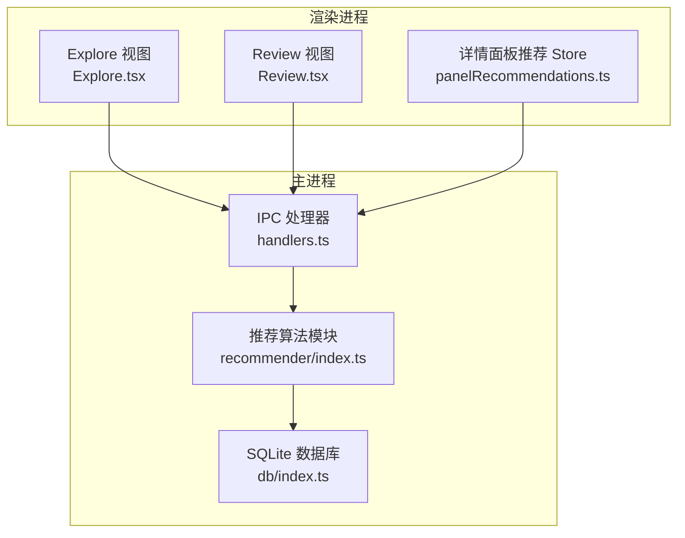
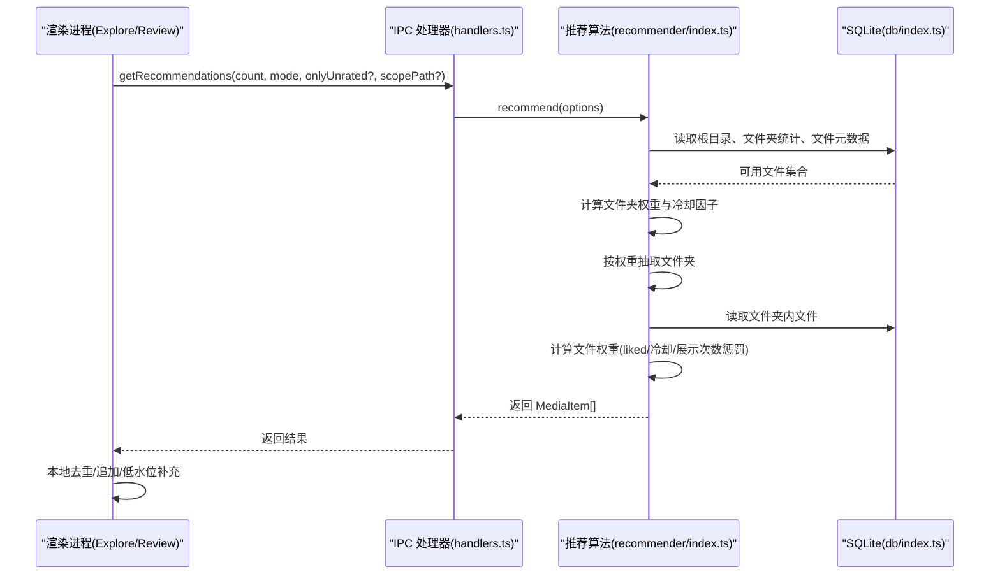
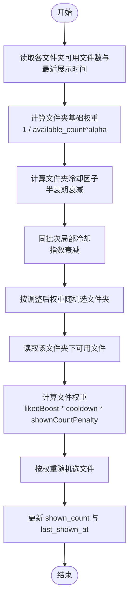
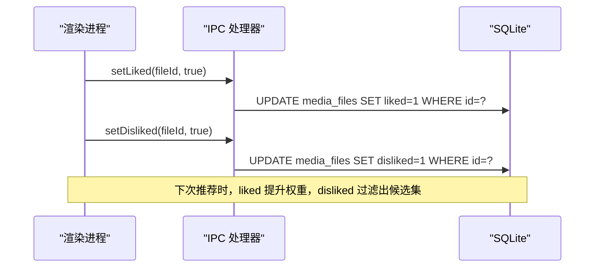
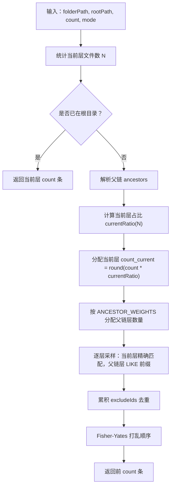
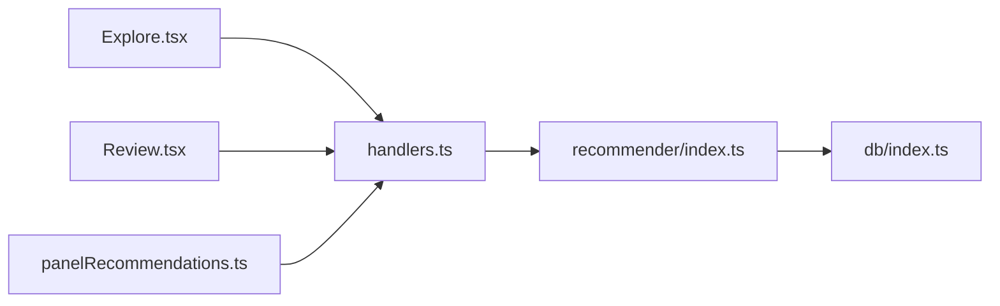

# 智能推荐系统

<cite>
**本文引用的文件列表**
- [src/main/recommender/index.ts](file://src/main/recommender/index.ts)
- [src/main/ipc/handlers.ts](file://src/main/ipc/handlers.ts)
- [src/main/ipc/contract.ts](file://src/main/ipc/contract.ts)
- [src/main/db/index.ts](file://src/main/db/index.ts)
- [src/renderer/src/stores/panelRecommendations.ts](file://src/renderer/src/stores/panelRecommendations.ts)
- [src/renderer/src/views/Explore.tsx](file://src/renderer/src/views/Explore.tsx)
- [src/renderer/src/views/Review.tsx](file://src/renderer/src/views/Review.tsx)
</cite>

## 目录
1. [简介](#简介)
2. [项目结构](#项目结构)
3. [核心组件](#核心组件)
4. [架构总览](#架构总览)
5. [详细组件分析](#详细组件分析)
6. [依赖关系分析](#依赖关系分析)
7. [性能考量](#性能考量)
8. [故障排查指南](#故障排查指南)
9. [结论](#结论)
10. [附录](#附录)

## 简介
本文件为 Serendip 应用的双级加权推荐系统的算法文档，聚焦以下目标：
- 解释两级加权抽样算法的核心原理：文件夹级权重计算与文件级权重调整机制。
- 详细说明权重计算公式，包括文件夹大小抑制、冷却机制、展示频率惩罚和用户偏好学习（点赞/点踩）。
- 阐述分层路径推荐策略（详情页右侧面板）的实现思路。
- 提供参数调优指南、性能分析与扩展新推荐策略的方法。
- 涵盖推荐结果缓存与批量推荐优化的技术细节。

## 项目结构
与推荐系统直接相关的代码分布在主进程与渲染进程两侧：
- 主进程负责数据库访问、IPC 处理与推荐算法实现。
- 渲染进程负责用户交互、界面状态管理与批量加载控制。

图表来源
- [src/main/ipc/handlers.ts:84-91](file://src/main/ipc/handlers.ts#L84-L91)
- [src/main/recommender/index.ts:57-149](file://src/main/recommender/index.ts#L57-L149)
- [src/main/db/index.ts:1-28](file://src/main/db/index.ts#L1-L28)
- [src/renderer/src/views/Explore.tsx:65-91](file://src/renderer/src/views/Explore.tsx#L65-L91)
- [src/renderer/src/views/Review.tsx:73-96](file://src/renderer/src/views/Review.tsx#L73-L96)
- [src/renderer/src/stores/panelRecommendations.ts:88-127](file://src/renderer/src/stores/panelRecommendations.ts#L88-L127)

章节来源
- [src/main/ipc/handlers.ts:84-91](file://src/main/ipc/handlers.ts#L84-L91)
- [src/main/recommender/index.ts:57-149](file://src/main/recommender/index.ts#L57-L149)
- [src/main/db/index.ts:1-28](file://src/main/db/index.ts#L1-L28)
- [src/renderer/src/views/Explore.tsx:65-91](file://src/renderer/src/views/Explore.tsx#L65-L91)
- [src/renderer/src/views/Review.tsx:73-96](file://src/renderer/src/views/Review.tsx#L73-L96)
- [src/renderer/src/stores/panelRecommendations.ts:88-127](file://src/renderer/src/stores/panelRecommendations.ts#L88-L127)

## 核心组件
- 推荐算法模块：实现两级加权抽样、分层路径推荐、冷却函数、模式参数选择等。
- IPC 处理器：暴露推荐接口、点赞/点踩接口、批量操作接口给渲染进程。
- 数据库层：维护媒体文件元数据、评分、展示计数与最近展示时间戳等字段。
- 渲染侧：探索页与评审页负责批量拉取、去重、低水位补充；详情面板推荐 Store 负责分层推荐的批加载与防抖。

章节来源
- [src/main/recommender/index.ts:57-149](file://src/main/recommender/index.ts#L57-L149)
- [src/main/ipc/handlers.ts:94-125](file://src/main/ipc/handlers.ts#L94-L125)
- [src/main/db/index.ts:54-77](file://src/main/db/index.ts#L54-L77)
- [src/renderer/src/views/Explore.tsx:65-91](file://src/renderer/src/views/Explore.tsx#L65-L91)
- [src/renderer/src/views/Review.tsx:73-96](file://src/renderer/src/views/Review.tsx#L73-L96)
- [src/renderer/src/stores/panelRecommendations.ts:31-61](file://src/renderer/src/stores/panelRecommendations.ts#L31-L61)

## 架构总览
推荐系统采用“主进程算法 + SQLite 持久化 + 渲染进程 UI”的三层架构。渲染进程通过 IPC 调用主进程的推荐接口，主进程在数据库中查询候选集并执行两级加权抽样，返回结果后由渲染进程进行本地去重与增量加载。

图表来源
- [src/main/ipc/handlers.ts:84-91](file://src/main/ipc/handlers.ts#L84-L91)
- [src/main/recommender/index.ts:57-149](file://src/main/recommender/index.ts#L57-L149)
- [src/main/db/index.ts:54-77](file://src/main/db/index.ts#L54-L77)

## 详细组件分析

### 双级加权抽样算法
- 第一级：文件夹级权重
  - 基础权重：基于可用文件数量的幂次抑制，避免大文件夹虹吸效应。
  - 冷却因子：根据该文件夹最近被抽中的时间间隔，使用半衰期衰减函数降低近期频繁出现的文件夹权重。
  - 局部冷却：同一批次内对已抽过的文件夹进一步降权，提升多样性。
- 第二级：文件级权重
  - 用户偏好加成：若文件被标记为喜欢，则乘以偏好放大系数。
  - 冷却因子：基于文件最近展示时间的半衰期衰减，防止重复曝光。
  - 展示次数惩罚：对历史展示次数较多的文件施加幂次惩罚，鼓励发现新内容。
  - 过滤条件：排除不感兴趣或不可用的文件；评审模式下仅返回未评级文件。

图表来源
- [src/main/recommender/index.ts:79-113](file://src/main/recommender/index.ts#L79-L113)
- [src/main/recommender/index.ts:364-389](file://src/main/recommender/index.ts#L364-L389)
- [src/main/recommender/index.ts:394-448](file://src/main/recommender/index.ts#L394-L448)
- [src/main/recommender/index.ts:454-460](file://src/main/recommender/index.ts#L454-L460)
- [src/main/recommender/index.ts:137-146](file://src/main/recommender/index.ts#L137-L146)

章节来源
- [src/main/recommender/index.ts:57-149](file://src/main/recommender/index.ts#L57-L149)
- [src/main/recommender/index.ts:364-389](file://src/main/recommender/index.ts#L364-L389)
- [src/main/recommender/index.ts:394-448](file://src/main/recommender/index.ts#L394-L448)
- [src/main/recommender/index.ts:454-460](file://src/main/recommender/index.ts#L454-L460)
- [src/main/recommender/index.ts:137-146](file://src/main/recommender/index.ts#L137-L146)

### 权重计算公式与参数
- 文件夹级权重
  - 基础权重：W_folder_base = 1 / (available_count ^ alpha)
  - 冷却因子：C_folder = max(0.05, 1 - 0.95 * 0.5^(sinceSec / halfLife))
  - 局部冷却：W_folder_adj = W_folder_base * C_folder * localDecay^(localShownCount)
- 文件级权重
  - 偏好加成：若 liked=1，则乘以 likedBoost
  - 冷却因子：C_file = max(0.05, 1 - 0.95 * 0.5^(sinceSec / halfLife))
  - 展示次数惩罚：P_shown = 1 / (1 + shown_count)^penalty
  - 最终权重：W_file = (liked ? likedBoost : 1) * C_file * P_shown
- 模式参数
  - prefer：偏好放大强、冷却弱、文件夹平均化弱
  - explore：文件夹高度均权、冷却强、liked 不加成
  - balanced：折中配置

章节来源
- [src/main/recommender/index.ts:462-504](file://src/main/recommender/index.ts#L462-L504)
- [src/main/recommender/index.ts:454-460](file://src/main/recommender/index.ts#L454-L460)
- [src/main/recommender/index.ts:310-332](file://src/main/recommender/index.ts#L310-L332)
- [src/main/recommender/index.ts:422-433](file://src/main/recommender/index.ts#L422-L433)

### 冷却机制与重复曝光控制
- 半衰期式冷却函数：时间越短，返回值越低；时间越长，返回值趋近于 1。
- 下限裁剪：最小值不低于 0.05，确保即使刚展示过也有极低概率再次出现。
- 双层冷却：文件夹级与文件级分别独立冷却，避免同一文件夹或同一文件短期内重复曝光。
- 批次内局部冷却：同批次内对文件夹多次抽取进行指数衰减，增强多样性。

章节来源
- [src/main/recommender/index.ts:454-460](file://src/main/recommender/index.ts#L454-L460)
- [src/main/recommender/index.ts:364-389](file://src/main/recommender/index.ts#L364-L389)

### 用户反馈收集与动态权重调整
- 点赞/点踩操作
  - 点赞：将 liked 字段置为 1，影响后续文件级权重（乘以 likedBoost）。
  - 点踩：将 disliked 字段置为 1，使该文件不再参与推荐（过滤条件）。
- 批量操作
  - 支持批量设置点赞/点踩，使用事务批写减少 IO 开销。
- 评审模式
  - 仅返回未评级文件（onlyUnrated=true），用于快速筛选与标注。

图表来源
- [src/main/ipc/handlers.ts:94-125](file://src/main/ipc/handlers.ts#L94-L125)
- [src/main/db/index.ts:54-77](file://src/main/db/index.ts#L54-L77)

章节来源
- [src/main/ipc/handlers.ts:94-125](file://src/main/ipc/handlers.ts#L94-L125)
- [src/main/recommender/index.ts:422-433](file://src/main/recommender/index.ts#L422-L433)
- [src/main/recommender/index.ts:404-411](file://src/main/recommender/index.ts#L404-L411)

### 分层路径推荐（详情页右侧面板）
- 目标：以当前文件夹为锚点，逐级向上层路径放宽采样，兼顾当前层与父链层的曝光比例。
- 策略：
  - 当前层权重随文件数量 N 变化：N<=2 时不采当前层；N 越大，当前层占比越高，上限约 50%。
  - 父链层分配：前几层按固定比例递减（如 60%/25%/15%），余量归最后一层。
  - 精确匹配与模糊匹配：当前层使用精确 folder_path 匹配；父链层使用 LIKE 前缀匹配子目录。
  - 去重与打乱：累积 excludeIds 去重，最终 Fisher-Yates 打乱顺序。

图表来源
- [src/main/recommender/index.ts:155-206](file://src/main/recommender/index.ts#L155-L206)
- [src/main/recommender/index.ts:211-274](file://src/main/recommender/index.ts#L211-L274)
- [src/main/recommender/index.ts:279-359](file://src/main/recommender/index.ts#L279-L359)

章节来源
- [src/main/recommender/index.ts:155-206](file://src/main/recommender/index.ts#L155-L206)
- [src/main/recommender/index.ts:211-274](file://src/main/recommender/index.ts#L211-L274)
- [src/main/recommender/index.ts:279-359](file://src/main/recommender/index.ts#L279-L359)

### 渲染端批量加载与去重
- Explore 视图
  - 初始加载一批（默认 30），滚动触底继续加载。
  - 使用本地 Set 记录 seenIds，避免重复显示。
  - 当队列长度低于阈值且仍有更多时自动补充。
- Review 视图
  - 评审模式只拉取未评级文件（onlyUnrated=true）。
  - 低水位缓冲（LOW_WATER）触发预取，保持流畅体验。
- 详情面板推荐 Store
  - 防抖初始加载（200ms），分批加载（默认 20），滚动加载更多（每次 10）。
  - AbortController 取消未完成请求，避免竞态。

章节来源
- [src/renderer/src/views/Explore.tsx:65-91](file://src/renderer/src/views/Explore.tsx#L65-L91)
- [src/renderer/src/views/Review.tsx:73-96](file://src/renderer/src/views/Review.tsx#L73-L96)
- [src/renderer/src/stores/panelRecommendations.ts:31-61](file://src/renderer/src/stores/panelRecommendations.ts#L31-L61)
- [src/renderer/src/stores/panelRecommendations.ts:88-127](file://src/renderer/src/stores/panelRecommendations.ts#L88-L127)

## 依赖关系分析
- 主进程内部依赖
  - handlers.ts 依赖 recommender/index.ts 与 db/index.ts。
  - recommender/index.ts 依赖 db/index.ts 获取媒体元数据与统计信息。
- 渲染进程依赖
  - Explore.tsx 与 Review.tsx 通过 window.api 调用 handlers.ts 暴露的 IPC 接口。
  - panelRecommendations.ts 调用分层推荐接口，管理本地状态与去重。

图表来源
- [src/main/ipc/handlers.ts:84-91](file://src/main/ipc/handlers.ts#L84-L91)
- [src/main/recommender/index.ts:57-149](file://src/main/recommender/index.ts#L57-L149)
- [src/main/db/index.ts:1-28](file://src/main/db/index.ts#L1-L28)
- [src/renderer/src/views/Explore.tsx:65-91](file://src/renderer/src/views/Explore.tsx#L65-L91)
- [src/renderer/src/views/Review.tsx:73-96](file://src/renderer/src/views/Review.tsx#L73-L96)
- [src/renderer/src/stores/panelRecommendations.ts:88-127](file://src/renderer/src/stores/panelRecommendations.ts#L88-L127)

章节来源
- [src/main/ipc/handlers.ts:84-91](file://src/main/ipc/handlers.ts#L84-L91)
- [src/main/recommender/index.ts:57-149](file://src/main/recommender/index.ts#L57-L149)
- [src/main/db/index.ts:1-28](file://src/main/db/index.ts#L1-L28)
- [src/renderer/src/views/Explore.tsx:65-91](file://src/renderer/src/views/Explore.tsx#L65-L91)
- [src/renderer/src/views/Review.tsx:73-96](file://src/renderer/src/views/Review.tsx#L73-L96)
- [src/renderer/src/stores/panelRecommendations.ts:88-127](file://src/renderer/src/stores/panelRecommendations.ts#L88-L127)

## 性能考量
- 数据库优化
  - 启用 WAL 模式与 NORMAL 同步级别，提升并发读写性能。
  - 针对常用查询建立索引：folder_path、type、liked、disliked、last_shown_at、unavailable。
- 批量写入
  - 点赞/点踩批量操作使用事务批写，减少磁盘 IO。
- 内存与 CPU
  - 两级加权抽样在内存中进行权重计算与随机选择，复杂度与候选集规模线性相关。
  - 建议限制单次推荐数量，避免过大候选集导致延迟。
- 网络与 IPC
  - 渲染端使用 AbortController 取消旧请求，避免多余计算与渲染。
  - 防抖与低水位预取减少频繁 IPC 调用。

章节来源
- [src/main/db/index.ts:19-27](file://src/main/db/index.ts#L19-L27)
- [src/main/db/index.ts:54-77](file://src/main/db/index.ts#L54-L77)
- [src/main/ipc/handlers.ts:106-125](file://src/main/ipc/handlers.ts#L106-L125)
- [src/renderer/src/stores/panelRecommendations.ts:88-127](file://src/renderer/src/stores/panelRecommendations.ts#L88-L127)

## 故障排查指南
- 无推荐结果
  - 检查根目录是否设置（settings.rootPath）。
  - 确认存在可用文件（disliked=0 且 unavailable=0）。
- 重复曝光过多
  - 调整 fileCooldownHalfLifeSec 增大冷却时间。
  - 提高 shownCountPenalty 加大展示次数惩罚。
- 偏好效果不明显
  - 增大 likedBoost 提升喜欢文件的权重。
  - 切换至 prefer 模式以获得更强的偏好放大。
- 评审模式无法加载
  - 确认 onlyUnrated=true 且存在未评级文件。
- 详情面板推荐卡顿
  - 降低每批加载数量（默认 20），增加防抖时间。
  - 检查是否有大量未关闭的请求（AbortController）。

章节来源
- [src/main/recommender/index.ts:65-74](file://src/main/recommender/index.ts#L65-L74)
- [src/main/recommender/index.ts:404-411](file://src/main/recommender/index.ts#L404-L411)
- [src/main/recommender/index.ts:471-504](file://src/main/recommender/index.ts#L471-L504)
- [src/renderer/src/stores/panelRecommendations.ts:31-61](file://src/renderer/src/stores/panelRecommendations.ts#L31-L61)

## 结论
Serendip 的双级加权推荐系统通过文件夹级与文件级的双重权重控制，结合冷却机制与展示次数惩罚，有效平衡了偏好与探索。分层路径推荐增强了详情页右侧面板的内容相关性。渲染端的批量加载与去重策略提升了用户体验。通过合理调参与性能优化，系统可在不同场景下稳定运行并提供高质量的推荐结果。

## 附录

### 参数调优指南
- 权重系数
  - folderAlpha：控制文件夹大小抑制强度，越大越趋向均匀分布。
  - likedBoost：偏好放大系数，越大越偏向喜欢文件。
  - shownCountPenalty：展示次数惩罚指数，越大越鼓励发现新内容。
- 冷却时间
  - folderCooldownHalfLifeSec：文件夹冷却半衰期，越大冷却越强。
  - fileCooldownHalfLifeSec：文件冷却半衰期，越大冷却越强。
- 探索比例
  - prefer：偏好放大强、冷却弱、文件夹平均化弱。
  - balanced：折中配置。
  - explore：文件夹高度均权、冷却强、liked 不加成。

章节来源
- [src/main/recommender/index.ts:471-504](file://src/main/recommender/index.ts#L471-L504)

### 扩展新推荐策略
- 新增维度
  - 可引入媒体类型（image/video）、时长、分辨率等特征作为权重因子。
  - 可引入分类标签（categories）或画布（canvases）关联度。
- 实现方式
  - 在 pickFileInFolder 或 pickFilesFromFolderExact 中增加新的权重项。
  - 在 ModeParams 中新增对应参数，并在 getModeParams 中为不同模式提供默认值。
  - 在 IPC 层暴露新的推荐接口，供渲染端调用。

章节来源
- [src/main/recommender/index.ts:394-448](file://src/main/recommender/index.ts#L394-L448)
- [src/main/recommender/index.ts:462-504](file://src/main/recommender/index.ts#L462-L504)
- [src/main/ipc/handlers.ts:84-91](file://src/main/ipc/handlers.ts#L84-L91)

### 推荐结果缓存与批量推荐优化
- 本地缓存
  - 渲染端使用 Set 记录 seenIds，避免重复显示。
  - 详情面板推荐 Store 维护 _seenIds 与 hasMore 状态。
- 批量优化
  - 批量点赞/点踩使用事务批写。
  - 低水位预取与防抖减少频繁 IPC 调用。
  - AbortController 取消旧请求，避免竞态。

章节来源
- [src/renderer/src/views/Explore.tsx:65-91](file://src/renderer/src/views/Explore.tsx#L65-L91)
- [src/renderer/src/stores/panelRecommendations.ts:88-127](file://src/renderer/src/stores/panelRecommendations.ts#L88-L127)
- [src/main/ipc/handlers.ts:106-125](file://src/main/ipc/handlers.ts#L106-L125)