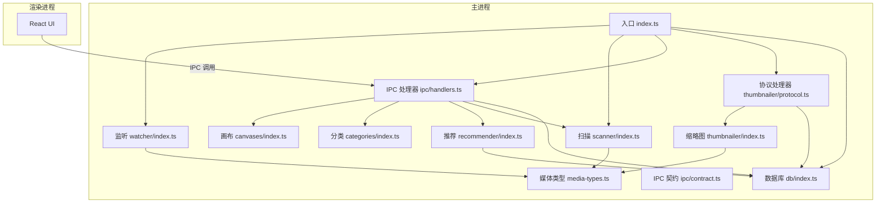
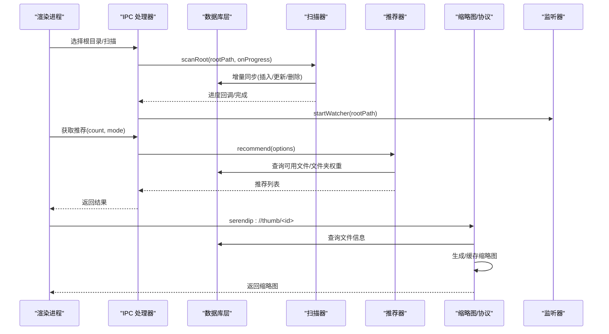
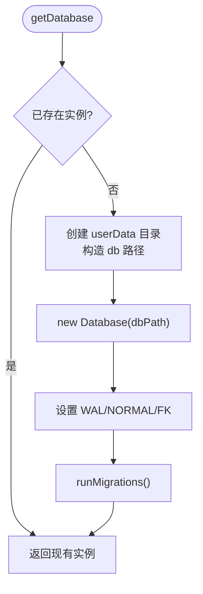
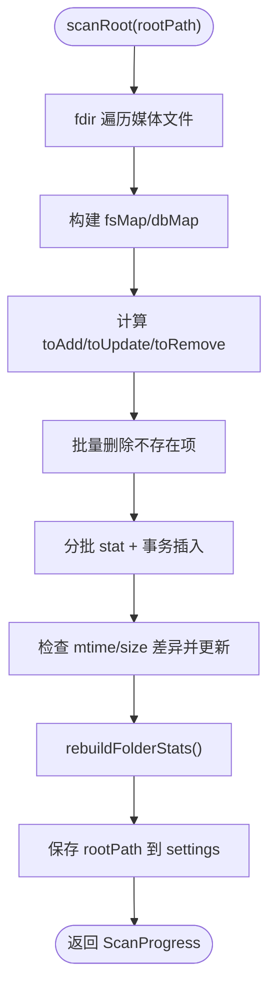
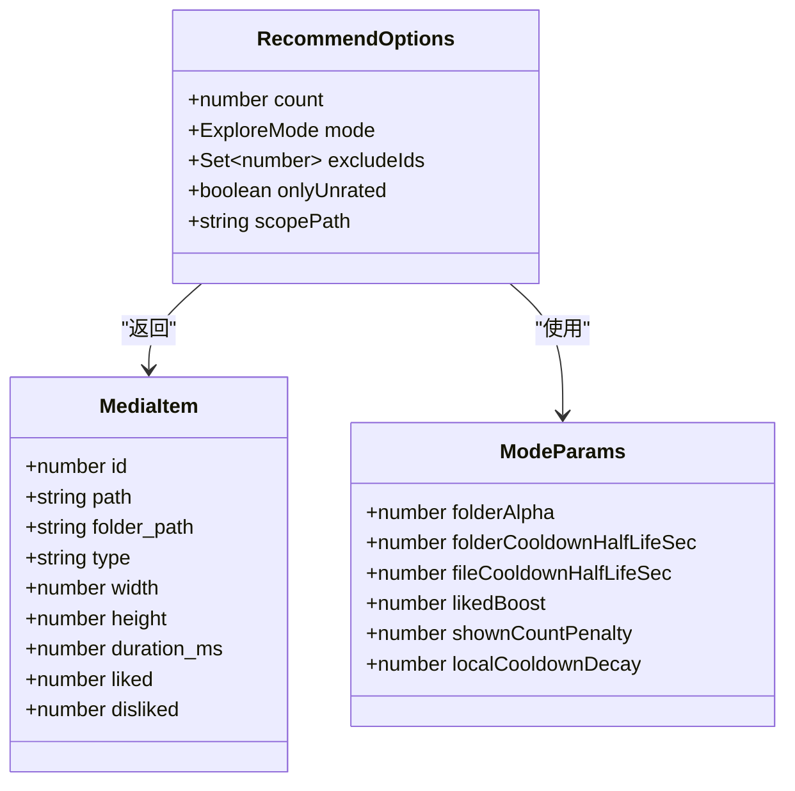
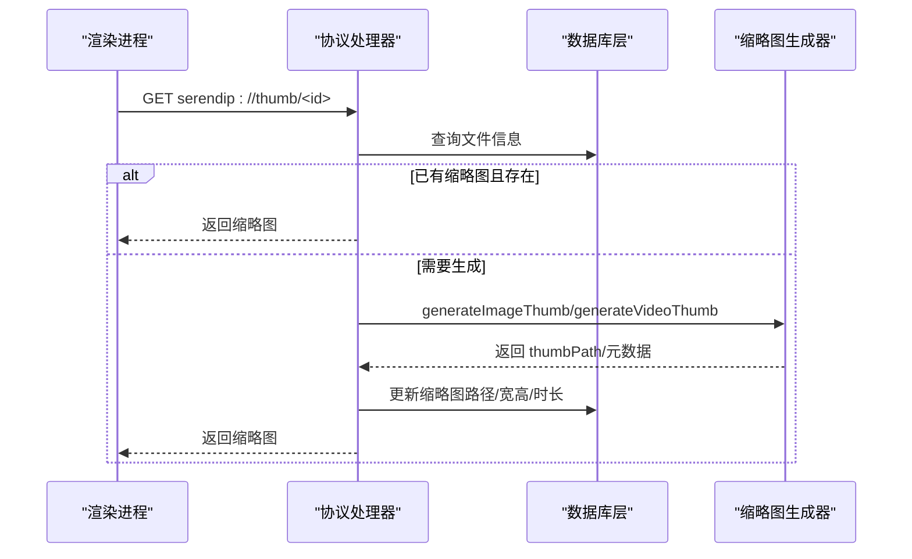
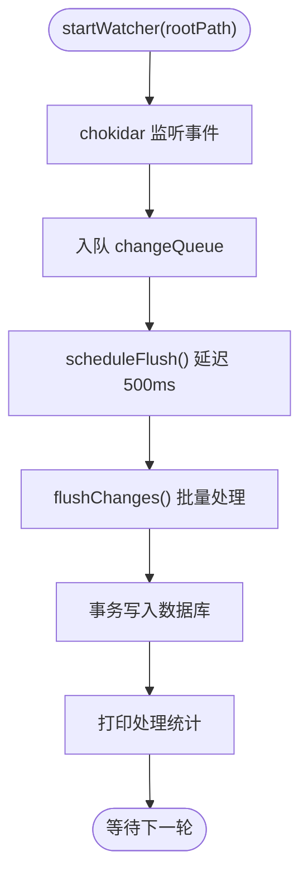
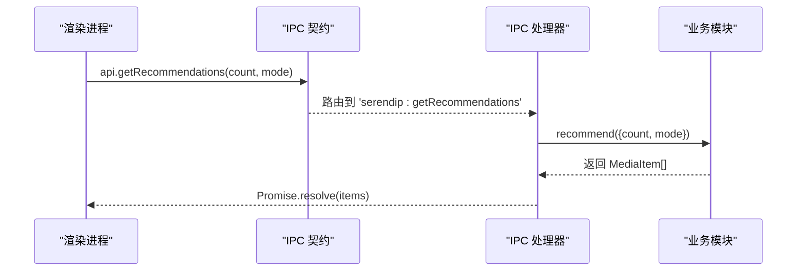
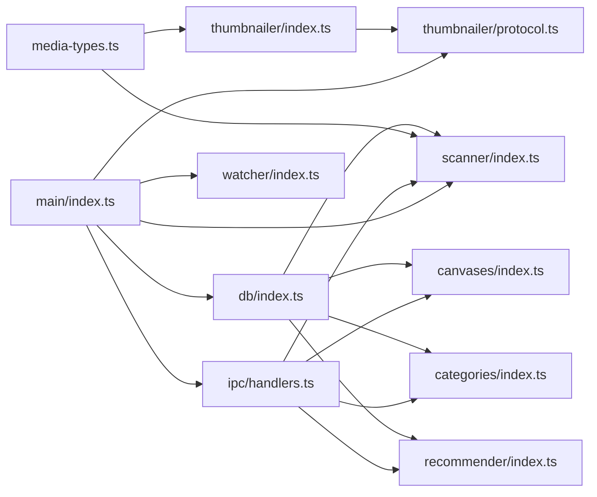

# 模块化架构设计

<cite>
**本文引用的文件**   
- [src/main/index.ts](file://src/main/index.ts)
- [src/main/db/index.ts](file://src/main/db/index.ts)
- [src/main/scanner/index.ts](file://src/main/scanner/index.ts)
- [src/main/recommender/index.ts](file://src/main/recommender/index.ts)
- [src/main/thumbnailer/index.ts](file://src/main/thumbnailer/index.ts)
- [src/main/thumbnailer/protocol.ts](file://src/main/thumbnailer/protocol.ts)
- [src/main/watcher/index.ts](file://src/main/watcher/index.ts)
- [src/main/ipc/handlers.ts](file://src/main/ipc/handlers.ts)
- [src/main/ipc/contract.ts](file://src/main/ipc/contract.ts)
- [src/main/media-types.ts](file://src/main/media-types.ts)
- [src/main/categories/index.ts](file://src/main/categories/index.ts)
- [src/main/canvases/index.ts](file://src/main/canvases/index.ts)
- [README.md](file://README.md)
- [package.json](file://package.json)
</cite>

## 目录
1. [简介](#简介)
2. [项目结构](#项目结构)
3. [核心组件](#核心组件)
4. [架构总览](#架构总览)
5. [详细组件分析](#详细组件分析)
6. [依赖关系分析](#依赖关系分析)
7. [性能考量](#性能考量)
8. [故障排查指南](#故障排查指南)
9. [结论](#结论)
10. [附录：模块扩展指南](#附录模块扩展指南)

## 简介
本文件面向开发者，系统化阐述 Serendip 应用的模块化架构。重点覆盖数据库层、文件扫描器、智能推荐器、缩略图生成器与文件监听器等核心服务模块的设计理念、职责边界、内部结构与外部接口；说明模块间依赖与交互模式，解释如何通过 IPC 契约实现松耦合；描述生命周期管理、初始化流程与资源清理机制；并提供模块扩展、测试策略、错误隔离与日志记录指导。

## 项目结构
应用采用 Electron 主进程 + 渲染进程架构。主进程负责系统能力（文件系统、数据库、媒体处理、协议注册、IPC 路由），渲染进程通过预加载脚本暴露类型安全的 API 进行调用。

图表来源
- [src/main/index.ts:1-134](file://src/main/index.ts#L1-L134)
- [src/main/db/index.ts:1-190](file://src/main/db/index.ts#L1-L190)
- [src/main/scanner/index.ts:1-323](file://src/main/scanner/index.ts#L1-L323)
- [src/main/recommender/index.ts:1-518](file://src/main/recommender/index.ts#L1-L518)
- [src/main/thumbnailer/index.ts:1-138](file://src/main/thumbnailer/index.ts#L1-L138)
- [src/main/thumbnailer/protocol.ts:1-298](file://src/main/thumbnailer/protocol.ts#L1-L298)
- [src/main/watcher/index.ts:1-117](file://src/main/watcher/index.ts#L1-L117)
- [src/main/ipc/handlers.ts:1-292](file://src/main/ipc/handlers.ts#L1-L292)
- [src/main/ipc/contract.ts:1-130](file://src/main/ipc/contract.ts#L1-L130)
- [src/main/media-types.ts:1-38](file://src/main/media-types.ts#L1-L38)
- [src/main/categories/index.ts:1-166](file://src/main/categories/index.ts#L1-L166)
- [src/main/canvases/index.ts:1-320](file://src/main/canvases/index.ts#L1-L320)

章节来源
- [README.md:1-66](file://README.md#L1-L66)
- [package.json:1-70](file://package.json#L1-L70)

## 核心组件
- 数据库层（db）：基于 better-sqlite3，提供单例连接、WAL 并发优化、迁移与关闭。
- 文件扫描器（scanner）：递归遍历媒体文件，增量同步到数据库，重建文件夹统计。
- 智能推荐器（recommender）：两级加权抽样（文件夹级 + 文件级），支持偏好/平衡/探索三种模式与分层路径推荐。
- 缩略图生成器（thumbnailer）：图片用 sharp 生成 WebP 缩略图并读取宽高；视频用 ffprobe/fluent-ffmpeg 抽取中间帧并获取时长与尺寸。
- 协议处理器（thumbnailer/protocol）：注册自定义协议 serendip://thumb|image|video，按需生成缩略图、流式返回原图/视频（支持 Range）。
- 文件监听器（watcher）：基于 chokidar 监听根目录变化，批量合并变更并事务写入数据库。
- IPC 层（ipc）：定义通道契约与处理器，将渲染进程请求路由至业务模块。
- 领域模块（categories、canvases）：收藏分类与画布的业务逻辑，均通过 IPC 暴露给前端。

章节来源
- [src/main/db/index.ts:1-190](file://src/main/db/index.ts#L1-L190)
- [src/main/scanner/index.ts:1-323](file://src/main/scanner/index.ts#L1-L323)
- [src/main/recommender/index.ts:1-518](file://src/main/recommender/index.ts#L1-L518)
- [src/main/thumbnailer/index.ts:1-138](file://src/main/thumbnailer/index.ts#L1-L138)
- [src/main/thumbnailer/protocol.ts:1-298](file://src/main/thumbnailer/protocol.ts#L1-L298)
- [src/main/watcher/index.ts:1-117](file://src/main/watcher/index.ts#L1-L117)
- [src/main/ipc/handlers.ts:1-292](file://src/main/ipc/handlers.ts#L1-L292)
- [src/main/ipc/contract.ts:1-130](file://src/main/ipc/contract.ts#L1-L130)
- [src/main/categories/index.ts:1-166](file://src/main/categories/index.ts#L1-L166)
- [src/main/canvases/index.ts:1-320](file://src/main/canvases/index.ts#L1-L320)

## 架构总览
整体采用“主进程服务化 + IPC 契约”的松耦合设计。渲染进程仅通过类型化的 API 调用，不直接访问文件系统或数据库。关键数据流如下：
- 启动时：初始化数据库 → 注册协议 → 注册 IPC → 自动扫描根目录 → 启动监听器 → 创建窗口。
- 浏览推荐：渲染进程请求推荐 → IPC 路由 → 推荐器查询数据库 → 更新展示计数 → 返回结果。
- 缩略图/媒体：渲染进程通过自定义协议请求 → 协议处理器按需生成缩略图或流式返回原内容。
- 实时同步：监听器收集变更 → 定时批量刷新 → 事务写入数据库。

图表来源
- [src/main/index.ts:93-134](file://src/main/index.ts#L93-L134)
- [src/main/ipc/handlers.ts:40-91](file://src/main/ipc/handlers.ts#L40-L91)
- [src/main/scanner/index.ts:36-239](file://src/main/scanner/index.ts#L36-L239)
- [src/main/recommender/index.ts:57-149](file://src/main/recommender/index.ts#L57-L149)
- [src/main/thumbnailer/protocol.ts:33-92](file://src/main/thumbnailer/protocol.ts#L33-L92)
- [src/main/watcher/index.ts:16-50](file://src/main/watcher/index.ts#L16-L50)

## 详细组件分析

### 数据库层（db）
- 职责：提供单例数据库连接、启用 WAL 提升并发、执行迁移、安全关闭。
- 关键点：
  - 单例模式避免重复打开句柄。
  - WAL 模式 + NORMAL 同步策略提升读写吞吐。
  - 迁移表 _migrations 控制版本演进，按序执行 up SQL。
  - 对外暴露 getDatabase() 与 closeDatabase()。
- 复杂度：初始化 O(1)，迁移为 O(M)（M 为待执行迁移数）。
- 错误处理：迁移失败会抛出异常，由上层捕获；关闭前确保存在再关闭。

图表来源
- [src/main/db/index.ts:8-35](file://src/main/db/index.ts#L8-L35)
- [src/main/db/index.ts:37-189](file://src/main/db/index.ts#L37-L189)

章节来源
- [src/main/db/index.ts:1-190](file://src/main/db/index.ts#L1-L190)

### 文件扫描器（scanner）
- 职责：递归遍历媒体文件，计算差异并批量写入数据库，重建文件夹统计，保存根目录。
- 算法要点：
  - fdir 高性能遍历，过滤隐藏/缓存目录与不支持格式。
  - 构建 fsMap 与 dbMap，计算 toAdd/toUpdate/toRemove。
  - 分批 stat + 事务批量 INSERT OR REPLACE / UPDATE，解封失效项。
  - rebuildFolderStats 聚合 folder_path 统计并修正 parent_path/depth。
- 复杂度：遍历 O(N)，diff O(N+M)，批写 O(K)（K 为有效变更数）。
- 错误处理：stat 失败跳过；LIKE 转义防止注入。

图表来源
- [src/main/scanner/index.ts:36-239](file://src/main/scanner/index.ts#L36-L239)
- [src/main/scanner/index.ts:245-323](file://src/main/scanner/index.ts#L245-L323)

章节来源
- [src/main/scanner/index.ts:1-323](file://src/main/scanner/index.ts#L1-L323)

### 智能推荐器（recommender）
- 职责：根据用户偏好与历史曝光，在文件夹与文件两级进行加权随机抽样，支持分层路径推荐。
- 算法要点：
  - 两级权重：文件夹基础权重 1/file_count^α，结合冷却因子；文件级考虑 liked 加成、冷却、显示次数惩罚。
  - 模式参数：prefer/balanced/explore 调整 α、冷却半衰期、likedBoost、shownCountPenalty、局部冷却衰减。
  - 分层推荐：以当前文件夹为锚点，向上父链分配采样配额，打乱顺序输出。
- 复杂度：每次推荐 O(F + Σn_i)（F 为文件夹数，n_i 为候选文件数），更新 shown_count 为 O(k)。
- 错误处理：无可用文件时返回空数组；scopePath 越界回退到 rootPath。

图表来源
- [src/main/recommender/index.ts:17-46](file://src/main/recommender/index.ts#L17-L46)
- [src/main/recommender/index.ts:462-504](file://src/main/recommender/index.ts#L462-L504)

章节来源
- [src/main/recommender/index.ts:1-518](file://src/main/recommender/index.ts#L1-L518)

### 缩略图生成器（thumbnailer）
- 职责：为图片/视频生成缩略图并缓存，同时提供全分辨率图片与视频流式响应。
- 关键点：
  - 图片：sharp 读取元数据并生成 WebP 缩略图，自动 EXIF 旋转，固定宽度缩放。
  - 视频：ffprobe 获取时长与尺寸，fluent-ffmpeg 抽取中间帧生成缩略图。
  - 协议：serendip://thumb/<id> 按需生成缩略图；serendip://image/<id> 返回原图（HEIC/HEIF 转 jpeg 缓存）；serendip://video/<id> 支持 Range 流式播放。
  - 缓存：缩略图与全分辨率转换产物存放于 .serendip-cache 下对应子目录。
- 错误处理：生成失败标记 unavailable；Range 解析失败回退整文件；网络断开时销毁 Node stream 避免 fd 泄漏。

图表来源
- [src/main/thumbnailer/protocol.ts:33-92](file://src/main/thumbnailer/protocol.ts#L33-L92)
- [src/main/thumbnailer/protocol.ts:238-297](file://src/main/thumbnailer/protocol.ts#L238-L297)
- [src/main/thumbnailer/index.ts:27-94](file://src/main/thumbnailer/index.ts#L27-L94)

章节来源
- [src/main/thumbnailer/index.ts:1-138](file://src/main/thumbnailer/index.ts#L1-L138)
- [src/main/thumbnailer/protocol.ts:1-298](file://src/main/thumbnailer/protocol.ts#L1-L298)

### 文件监听器（watcher）
- 职责：监听根目录变化，去重合并变更，批量事务写入数据库。
- 关键点：
  - 忽略隐藏/缓存/系统目录，awaitWriteFinish 合并快速连续写入。
  - 队列 + 定时器节流，统一 flushChanges 批量处理 add/change/unlink。
  - 对新增/变更执行 ON CONFLICT 更新，对删除执行精确删除。
- 错误处理：stat 失败跳过；非媒体类型直接丢弃。

图表来源
- [src/main/watcher/index.ts:16-50](file://src/main/watcher/index.ts#L16-L50)
- [src/main/watcher/index.ts:52-116](file://src/main/watcher/index.ts#L52-L116)

章节来源
- [src/main/watcher/index.ts:1-117](file://src/main/watcher/index.ts#L1-L117)

### IPC 层（handlers + contract）
- 职责：定义主/渲染进程共享的类型与通道名，集中注册处理器，转发请求到业务模块。
- 关键点：
  - 契约：SerendipAPI 定义所有对外方法签名，便于类型安全调用。
  - 处理器：封装 UI 操作（如选择目录、扫描、推荐、喜欢/不感兴趣、分类/画布 CRUD、窗口装饰等）。
  - 广播：提供 broadcastProgress 向所有窗口推送进度。
- 错误处理：缺失文件或无效 ID 返回相应状态码或空结果。

图表来源
- [src/main/ipc/contract.ts:13-75](file://src/main/ipc/contract.ts#L13-L75)
- [src/main/ipc/handlers.ts:84-91](file://src/main/ipc/handlers.ts#L84-L91)

章节来源
- [src/main/ipc/contract.ts:1-130](file://src/main/ipc/contract.ts#L1-L130)
- [src/main/ipc/handlers.ts:1-292](file://src/main/ipc/handlers.ts#L1-L292)

### 领域模块（categories、canvases）
- 收藏分类：CRUD + 拖拽排序 + 多对多关联，删除级联清理。
- 画布：CRUD + 视口持久化 + 项目变换属性（位置/尺寸/旋转/Z/裁剪多边形），支持批量更新与维度批量查询。
- 共同点：严格校验输入（名称长度/唯一性），使用事务保证一致性。

章节来源
- [src/main/categories/index.ts:1-166](file://src/main/categories/index.ts#L1-L166)
- [src/main/canvases/index.ts:1-320](file://src/main/canvases/index.ts#L1-L320)

## 依赖关系分析
- 低耦合：各模块通过函数导出与 IPC 契约解耦，避免直接跨模块强引用。
- 共享依赖：media-types.ts 提供媒体类型常量与工具；db 作为基础设施被多个模块复用。
- 外部依赖：better-sqlite3、sharp、fluent-ffmpeg、chokidar、fdir 等。

图表来源
- [src/main/index.ts:93-134](file://src/main/index.ts#L93-L134)
- [src/main/ipc/handlers.ts:40-91](file://src/main/ipc/handlers.ts#L40-L91)
- [src/main/media-types.ts:1-38](file://src/main/media-types.ts#L1-L38)

章节来源
- [package.json:23-41](file://package.json#L23-L41)

## 性能考量
- 数据库：WAL 模式 + NORMAL 同步减少锁竞争；批量事务写入显著降低 IO 开销。
- 扫描：fdir 异步遍历 + 分批 stat + 事务批写，避免阻塞与频繁磁盘写入。
- 推荐：两级抽样 + 本地冷却 Map 减少重复，fisher-yates 洗牌保证视觉随机性。
- 缩略图：按需生成 + 哈希命名避免冲突；视频 Range 流式传输提升首屏速度。
- 监听：awaitWriteFinish 合并抖动写入，定时器节流批量刷新。

[本节为通用性能建议，无需特定文件引用]

## 故障排查指南
- 缩略图/媒体不可用：
  - 现象：缩略图请求 404 或视频无法播放。
  - 定位：协议层 catch 分支会调用 markUnavailable 标记失效；检查 unavailable_reason。
  - 恢复：重新扫描或触发生成后，扫描器会在 mtime/size 未变情况下解封失效项。
- 数据库迁移失败：
  - 现象：启动时报错。
  - 定位：runMigrations 中执行 up SQL 抛错；检查 _migrations 表当前版本。
- 监听器无响应：
  - 现象：文件变更后未入库。
  - 定位：检查 ignored 规则是否误拦截；查看 flushChanges 日志；确认 awaitWriteFinish 配置。
- 推荐结果为空：
  - 现象：推荐接口返回空数组。
  - 定位：检查 rootPath 是否存在；确认筛选条件（disliked/unavailable/onlyUnrated/scopePath）。

章节来源
- [src/main/thumbnailer/protocol.ts:48-53](file://src/main/thumbnailer/protocol.ts#L48-L53)
- [src/main/thumbnailer/protocol.ts:223-232](file://src/main/thumbnailer/protocol.ts#L223-L232)
- [src/main/db/index.ts:37-189](file://src/main/db/index.ts#L37-L189)
- [src/main/watcher/index.ts:52-116](file://src/main/watcher/index.ts#L52-L116)
- [src/main/recommender/index.ts:57-149](file://src/main/recommender/index.ts#L57-L149)

## 结论
Serendip 的模块化架构以“数据库为中心、IPC 为契约、服务模块解耦”为核心思想，实现了高内聚、低耦合的系统组织。通过 WAL 与事务批写、按需缩略图与 Range 流式传输、增量扫描与监听合并，系统在大数据量场景下仍保持良好性能与可维护性。未来可通过扩展新的领域模块与 IPC 接口平滑增强功能。

[本节为总结性内容，无需特定文件引用]

## 附录：模块扩展指南
- 新增领域模块步骤：
  1. 在 src/main 下新建模块目录与 index.ts，定义对外函数与类型。
  2. 在 ipc/contract.ts 中扩展 SerendipAPI 与 IPC 通道名。
  3. 在 ipc/handlers.ts 中注册处理器，转发到模块函数。
  4. 如需数据库表，编写迁移脚本并在 runMigrations 中添加新版本。
  5. 在 main/index.ts 中按需初始化（如协议、监听器、扫描器等）。
- 测试策略：
  - 单元测试：针对纯函数（如推荐算法、媒体类型判断）进行断言。
  - 集成测试：模拟 SQLite 文件与临时目录，验证扫描/监听/缩略图生成链路。
  - 端到端测试：通过 electron-builder 打包后，驱动 UI 调用 IPC 接口验证完整流程。
- 错误隔离与日志：
  - 模块内部 try/catch 包裹外部 IO 与第三方库调用，抛出明确错误消息。
  - 关键路径添加 console.log/console.error 日志，便于定位问题。
  - 协议层兜底标记 unavailable，避免脏数据持续影响推荐。
- 最佳实践：
  - 使用事务保证一致性，避免部分成功导致的数据不一致。
  - 对外接口尽量幂等，便于重试与容错。
  - 谨慎处理路径与 LIKE 转义，防止注入与匹配异常。

[本节为通用开发指导，无需特定文件引用]