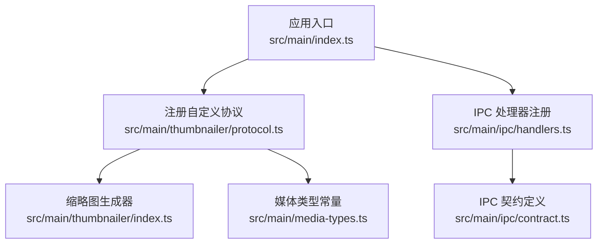
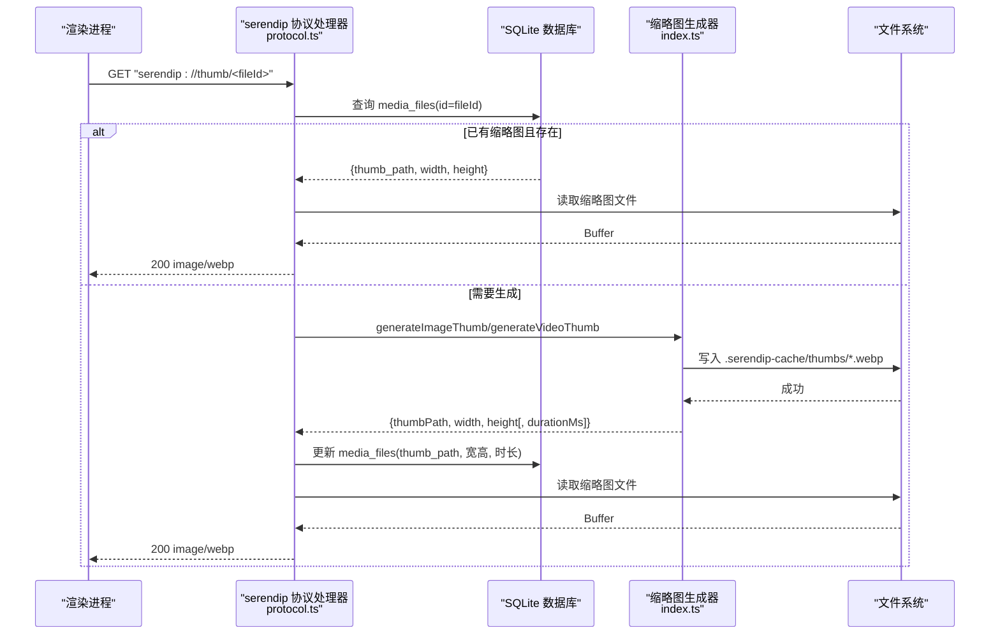
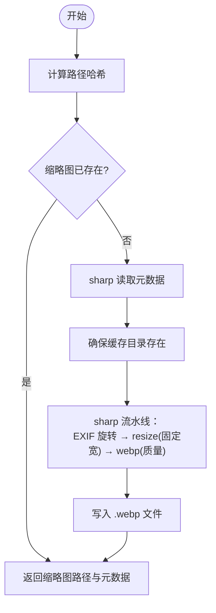
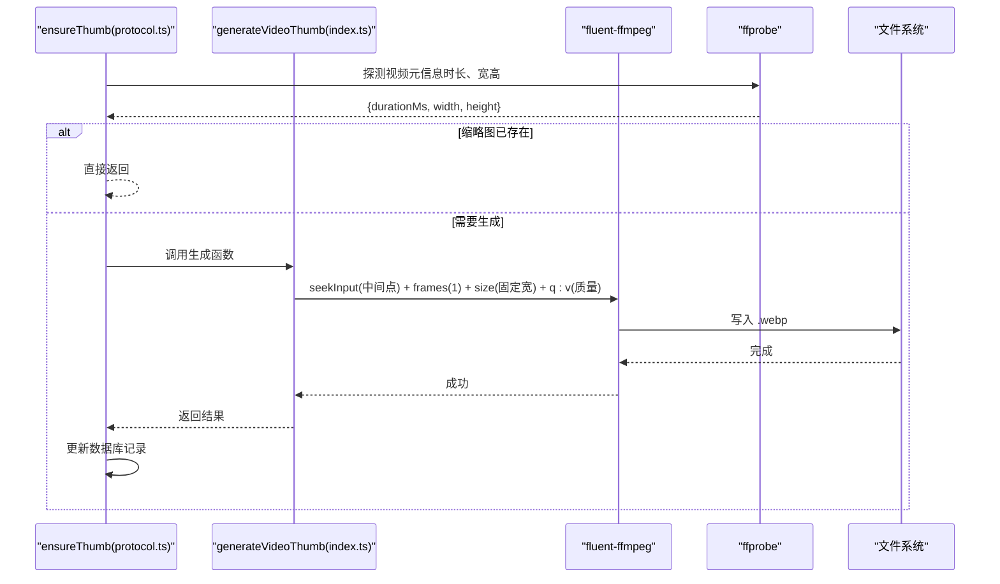
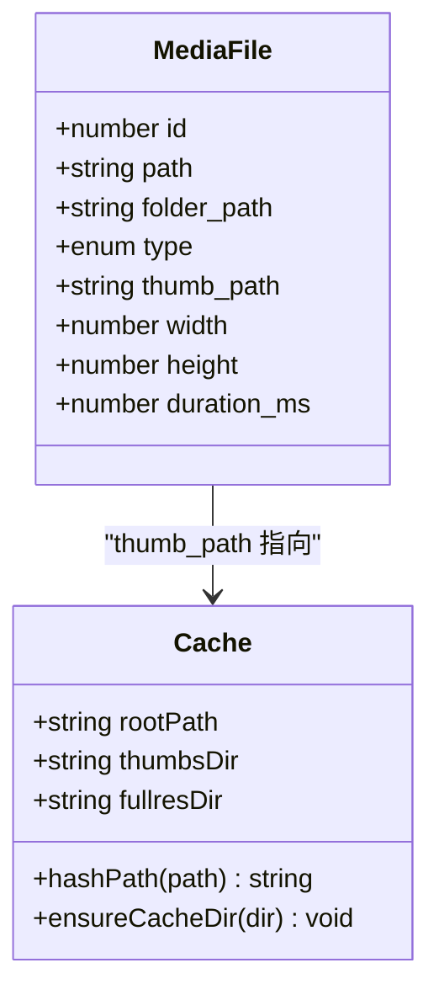
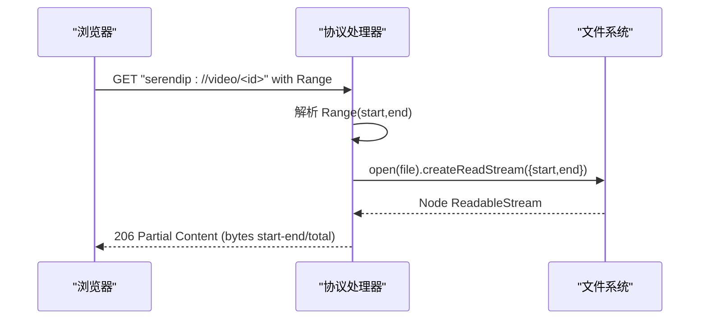
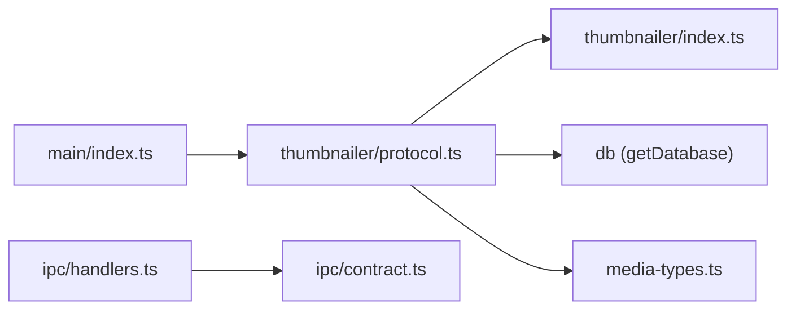
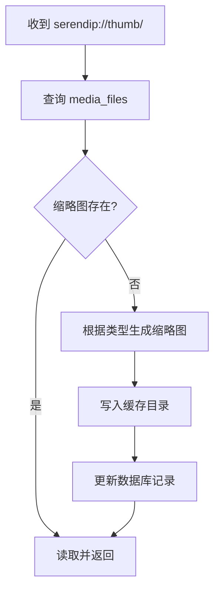

# 缩略图生成服务

<cite>
**本文引用的文件**
- [src/main/thumbnailer/index.ts](file://src/main/thumbnailer/index.ts)
- [src/main/thumbnailer/protocol.ts](file://src/main/thumbnailer/protocol.ts)
- [src/main/ipc/handlers.ts](file://src/main/ipc/handlers.ts)
- [src/main/ipc/contract.ts](file://src/main/ipc/contract.ts)
- [src/main/media-types.ts](file://src/main/media-types.ts)
- [src/main/index.ts](file://src/main/index.ts)
</cite>

## 目录
1. [简介](#简介)
2. [项目结构](#项目结构)
3. [核心组件](#核心组件)
4. [架构总览](#架构总览)
5. [详细组件分析](#详细组件分析)
6. [依赖关系分析](#依赖关系分析)
7. [性能考量](#性能考量)
8. [故障排查指南](#故障排查指南)
9. [结论](#结论)
10. [附录](#附录)

## 简介
本技术文档聚焦于 Serendip 应用的“缩略图生成服务”，围绕以下目标展开：
- 基于 sharp 的图片处理流水线（格式转换、尺寸调整、压缩优化）
- 视频缩略图提取机制（帧选择算法与时间戳定位）
- 缩略图缓存系统（路径映射、过期策略、存储空间管理）
- IPC 通信协议（请求/响应数据结构）
- 异步任务队列（优先级、并发控制、错误重试）
- 图像处理性能优化（内存复用、批处理）
- 异常处理与降级方案

该服务运行在 Electron 主进程，通过自定义协议 serendip:// 提供按需生成的缩略图与流式媒体访问能力。

## 项目结构
与缩略图服务相关的代码主要分布在 main 进程的 thumbnailer 模块与 protocol 层，并通过 IPC 与渲染层交互。



图表来源
- [src/main/index.ts:25-36](file://src/main/index.ts#L25-L36)
- [src/main/thumbnailer/protocol.ts:33-92](file://src/main/thumbnailer/protocol.ts#L33-L92)
- [src/main/thumbnailer/index.ts:1-17](file://src/main/thumbnailer/index.ts#L1-L17)
- [src/main/media-types.ts:27-28](file://src/main/media-types.ts#L27-L28)
- [src/main/ipc/handlers.ts:40-49](file://src/main/ipc/handlers.ts#L40-L49)
- [src/main/ipc/contract.ts:84-129](file://src/main/ipc/contract.ts#L84-L129)

章节来源
- [src/main/index.ts:25-36](file://src/main/index.ts#L25-L36)
- [src/main/thumbnailer/protocol.ts:33-92](file://src/main/thumbnailer/protocol.ts#L33-L92)
- [src/main/thumbnailer/index.ts:1-17](file://src/main/thumbnailer/index.ts#L1-L17)
- [src/main/media-types.ts:27-28](file://src/main/media-types.ts#L27-L28)
- [src/main/ipc/handlers.ts:40-49](file://src/main/ipc/handlers.ts#L40-L49)
- [src/main/ipc/contract.ts:84-129](file://src/main/ipc/contract.ts#L84-L129)

## 核心组件
- 缩略图生成器（图片/视频）
  - 图片：使用 sharp 读取元数据并生成固定宽度、质量可控的 WebP 缩略图，自动按 EXIF 旋转。
  - 视频：使用 fluent-ffmpeg + ffprobe 获取时长与宽高，抽取中间帧生成缩略图。
- 自定义协议层
  - 注册 serendip:// 协议，支持 thumb/image/video 三种子域路由。
  - 按需生成缩略图并返回；对视频提供 Range 流式响应以支持秒开播放。
- IPC 层
  - 暴露一系列 API（扫描、推荐、分类、画布等），并提供“标记失效”接口用于缩略图失败后的降级。
- 媒体类型与缓存目录
  - 统一图片/视频扩展名集合与缓存目录名常量。

章节来源
- [src/main/thumbnailer/index.ts:27-52](file://src/main/thumbnailer/index.ts#L27-L52)
- [src/main/thumbnailer/index.ts:59-94](file://src/main/thumbnailer/index.ts#L59-L94)
- [src/main/thumbnailer/protocol.ts:33-92](file://src/main/thumbnailer/protocol.ts#L33-L92)
- [src/main/ipc/handlers.ts:148-154](file://src/main/ipc/handlers.ts#L148-L154)
- [src/main/media-types.ts:5-25](file://src/main/media-types.ts#L5-L25)
- [src/main/media-types.ts:27-28](file://src/main/media-types.ts#L27-L28)

## 架构总览
下图展示了从浏览器发起请求到最终返回缩略图或原媒体的完整链路。



图表来源
- [src/main/thumbnailer/protocol.ts:33-92](file://src/main/thumbnailer/protocol.ts#L33-L92)
- [src/main/thumbnailer/protocol.ts:238-297](file://src/main/thumbnailer/protocol.ts#L238-L297)
- [src/main/thumbnailer/index.ts:27-52](file://src/main/thumbnailer/index.ts#L27-L52)
- [src/main/thumbnailer/index.ts:59-94](file://src/main/thumbnailer/index.ts#L59-L94)

## 详细组件分析

### 图片缩略图生成（sharp 流水线）
- 输入：源图片路径、缓存目录
- 流程要点
  - 计算路径哈希作为缩略图文件名前缀，避免冲突
  - 使用 sharp 读取元数据（宽/高），若缩略图不存在则生成
  - 自动 EXIF 旋转，固定宽度缩放（不放大），输出 WebP，质量参数可调
- 输出：相对路径、原始宽高



图表来源
- [src/main/thumbnailer/index.ts:27-52](file://src/main/thumbnailer/index.ts#L27-L52)

章节来源
- [src/main/thumbnailer/index.ts:27-52](file://src/main/thumbnailer/index.ts#L27-L52)

### 视频缩略图提取（ffprobe + ffmpeg）
- 输入：源视频路径、缓存目录
- 流程要点
  - 一次 ffprobe 获取时长（毫秒）、宽高
  - 若缩略图不存在，seek 到中间时间点抽取一帧
  - 使用 ffmpeg 输出指定宽度（保持纵横比），质量参数控制
- 输出：缩略图路径、时长、宽高



图表来源
- [src/main/thumbnailer/protocol.ts:238-297](file://src/main/thumbnailer/protocol.ts#L238-L297)
- [src/main/thumbnailer/index.ts:59-94](file://src/main/thumbnailer/index.ts#L59-L94)
- [src/main/thumbnailer/index.ts:99-119](file://src/main/thumbnailer/index.ts#L99-L119)

章节来源
- [src/main/thumbnailer/index.ts:59-94](file://src/main/thumbnailer/index.ts#L59-L94)
- [src/main/thumbnailer/index.ts:99-119](file://src/main/thumbnailer/index.ts#L99-L119)
- [src/main/thumbnailer/protocol.ts:238-297](file://src/main/thumbnailer/protocol.ts#L238-L297)

### 缩略图缓存系统设计
- 存储位置
  - 根目录下 .serendip-cache/thumbs 存放缩略图
  - 全分辨率图片缓存位于 .serendip-cache/fullres（HEIC/HEIF 转码后）
- 路径映射
  - 缩略图文件名由源路径 SHA256 前缀构成，保证唯一性与可复现性
  - 数据库 media_files 表维护 thumb_path、width、height、duration_ms 等字段
- 过期策略
  - 当前未实现主动过期清理；当缩略图文件丢失时，ensureThumb 会重新生成
- 空间管理
  - 当前未实现容量上限与 LRU 淘汰；可按需引入定时清理或配额限制



图表来源
- [src/main/thumbnailer/protocol.ts:238-297](file://src/main/thumbnailer/protocol.ts#L238-L297)
- [src/main/thumbnailer/index.ts:121-137](file://src/main/thumbnailer/index.ts#L121-L137)
- [src/main/media-types.ts:27-28](file://src/main/media-types.ts#L27-L28)

章节来源
- [src/main/thumbnailer/protocol.ts:238-297](file://src/main/thumbnailer/protocol.ts#L238-L297)
- [src/main/thumbnailer/index.ts:121-137](file://src/main/thumbnailer/index.ts#L121-L137)
- [src/main/media-types.ts:27-28](file://src/main/media-types.ts#L27-L28)

### 自定义协议与流式响应
- 协议注册
  - 在应用启动前将 serendip 注册为特权协议，启用标准、安全、Fetch 与流式支持
- 路由
  - thumb/<id>：返回缩略图（image/webp）
  - image/<id>：返回全分辨率图片（HEIC/HEIF 转 jpeg 并缓存）
  - video/<id>：返回原视频，支持 Range 头进行分片传输
- Range 支持
  - 解析 bytes=start-end，返回 206 部分响应，附带 Content-Range/Accept-Ranges
  - 无 Range 时返回完整文件（200）



图表来源
- [src/main/index.ts:25-36](file://src/main/index.ts#L25-L36)
- [src/main/thumbnailer/protocol.ts:99-149](file://src/main/thumbnailer/protocol.ts#L99-L149)

章节来源
- [src/main/index.ts:25-36](file://src/main/index.ts#L25-L36)
- [src/main/thumbnailer/protocol.ts:99-149](file://src/main/thumbnailer/protocol.ts#L99-L149)

### IPC 通信协议
- 通道命名
  - 所有通道名集中在 IPC 常量中，便于前后端一致引用
- 关键接口（与缩略图相关）
  - markUnavailable(fileId, reason)：标记文件不可用（缩略图生成失败/文件缺失/损坏）
  - getMediaDimensions(fileIds[])：批量获取媒体宽高（用于布局）
- 其他常用接口
  - selectRootDirectory、scanRoot、getStats、listLiked 等

```mermaid
classDiagram
class SerendipAPI {
+selectRootDirectory() Promise<string|null>
+scanRoot(rootPath) Promise<ScanProgress>
+getCurrentRoot() Promise<string|null>
+getStats() Promise<{totalFiles,totalFolders,liked}>
+markUnavailable(fileId, reason) Promise<void>
+getMediaDimensions(fileIds) Promise<Array<{id,width,height}>>
+... // 更多方法
}
class IPC {
<<const>>
+SELECT_ROOT
+SCAN_ROOT
+MARK_UNAVAILABLE
+GET_MEDIA_DIMENSIONS
+...
}
SerendipAPI --> IPC : "使用通道名"
```

图表来源
- [src/main/ipc/contract.ts:13-75](file://src/main/ipc/contract.ts#L13-L75)
- [src/main/ipc/contract.ts:84-129](file://src/main/ipc/contract.ts#L84-L129)
- [src/main/ipc/handlers.ts:148-154](file://src/main/ipc/handlers.ts#L148-L154)

章节来源
- [src/main/ipc/contract.ts:13-75](file://src/main/ipc/contract.ts#L13-L75)
- [src/main/ipc/contract.ts:84-129](file://src/main/ipc/contract.ts#L84-L129)
- [src/main/ipc/handlers.ts:148-154](file://src/main/ipc/handlers.ts#L148-L154)

## 依赖关系分析
- 外部库
  - sharp：高性能图像编解码与处理
  - fluent-ffmpeg + ffmpeg-static：视频探测与帧抽取
  - @ffprobe-installer/ffprobe：视频元信息探测
  - electron.protocol：自定义协议注册与处理
- 内部模块
  - db：SQLite 数据库访问（通过 getDatabase）
  - media-types：媒体类型与缓存目录常量
  - ipc：IPC 通道与处理器



图表来源
- [src/main/index.ts:100-102](file://src/main/index.ts#L100-L102)
- [src/main/thumbnailer/protocol.ts:6-8](file://src/main/thumbnailer/protocol.ts#L6-L8)
- [src/main/thumbnailer/index.ts:1-8](file://src/main/thumbnailer/index.ts#L1-L8)
- [src/main/ipc/handlers.ts:1-6](file://src/main/ipc/handlers.ts#L1-L6)
- [src/main/ipc/contract.ts:1-10](file://src/main/ipc/contract.ts#L1-L10)

章节来源
- [src/main/index.ts:100-102](file://src/main/index.ts#L100-L102)
- [src/main/thumbnailer/protocol.ts:6-8](file://src/main/thumbnailer/protocol.ts#L6-L8)
- [src/main/thumbnailer/index.ts:1-8](file://src/main/thumbnailer/index.ts#L1-L8)
- [src/main/ipc/handlers.ts:1-6](file://src/main/ipc/handlers.ts#L1-L6)
- [src/main/ipc/contract.ts:1-10](file://src/main/ipc/contract.ts#L1-L10)

## 性能考量
- 图片处理
  - 使用 sharp 流水线减少中间缓冲，避免多次 I/O
  - 固定宽度缩放（withoutEnlargement）降低大图的计算开销
  - WebP 输出兼顾体积与兼容性
- 视频处理
  - 单次 ffprobe 同时获取时长与宽高，减少额外 IO
  - 抽取中间帧而非首帧，提升代表性
  - 使用 -q:v 控制质量，平衡体积与清晰度
- 流式响应
  - 视频采用 Range 分片传输，避免一次性加载大文件
  - Node ReadableStream 转换为 Web ReadableStream，零拷贝传递
- 缓存命中
  - 缩略图存在即直接返回，避免重复生成
  - HEIC/HEIF 全分辨率转码结果缓存，后续请求命中更快
- 建议优化（可扩展）
  - 内存池复用：对频繁处理的图片对象进行复用（例如共享 sharp 实例配置）
  - 批处理策略：批量生成缩略图时合并 I/O 与编码任务
  - 并发控制：限制同时运行的 ffmpeg/sharp 任务数，防止 CPU/IO 饱和
  - 过期与清理：引入 LRU 或定时任务清理旧缩略图，控制磁盘占用

[本节为通用性能建议，不直接分析具体文件]

## 故障排查指南
- 常见问题
  - 缩略图生成失败：检查源文件是否可读、sharp/ffmpeg 二进制是否正常
  - 视频无法播放：确认 Range 头是否正确解析，Content-Range 与 Accept-Ranges 是否设置
  - 缩略图缺失：ensureThumb 会在检测到文件丢失时重新生成
- 降级与兜底
  - 协议层捕获异常后，调用 markUnavailable 标记文件不可用，避免继续推荐
  - 渲染层可通过 IPC 的 markUnavailable 主动触发降级
- 日志与诊断
  - 协议层打印错误日志，包含 file ID 与错误原因
  - 数据库 unavailable/unavailable_reason 字段可用于统计与审计

章节来源
- [src/main/thumbnailer/protocol.ts:48-53](file://src/main/thumbnailer/protocol.ts#L48-L53)
- [src/main/thumbnailer/protocol.ts:223-232](file://src/main/thumbnailer/protocol.ts#L223-L232)
- [src/main/ipc/handlers.ts:148-154](file://src/main/ipc/handlers.ts#L148-L154)

## 结论
Serendip 的缩略图生成服务以 sharp 与 ffmpeg 为核心，结合自定义协议与流式响应，实现了高效、稳定的缩略图与媒体访问能力。当前版本具备完善的按需生成与基础降级机制，未来可在缓存过期、并发控制与批处理方面进一步增强，以提升大规模媒体库下的性能与稳定性。

[本节为总结性内容，不直接分析具体文件]

## 附录

### 缩略图生成流程图（端到端）


图表来源
- [src/main/thumbnailer/protocol.ts:238-297](file://src/main/thumbnailer/protocol.ts#L238-L297)
- [src/main/thumbnailer/index.ts:27-52](file://src/main/thumbnailer/index.ts#L27-L52)
- [src/main/thumbnailer/index.ts:59-94](file://src/main/thumbnailer/index.ts#L59-L94)