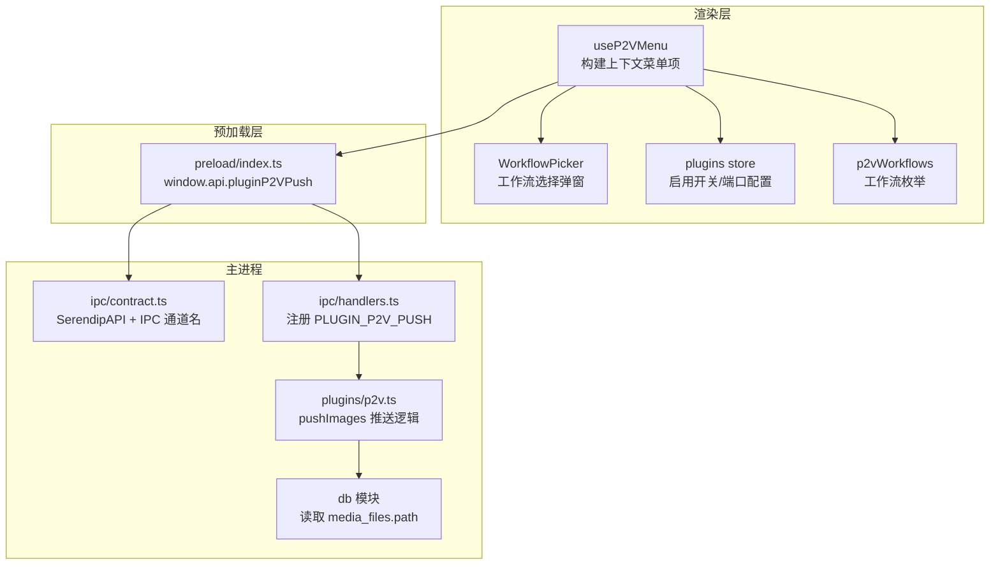
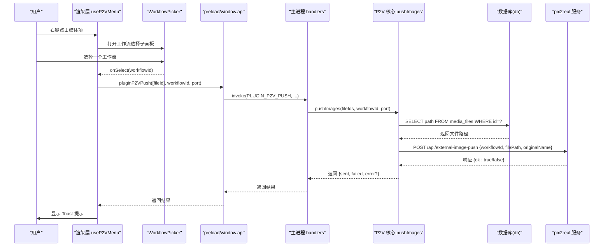
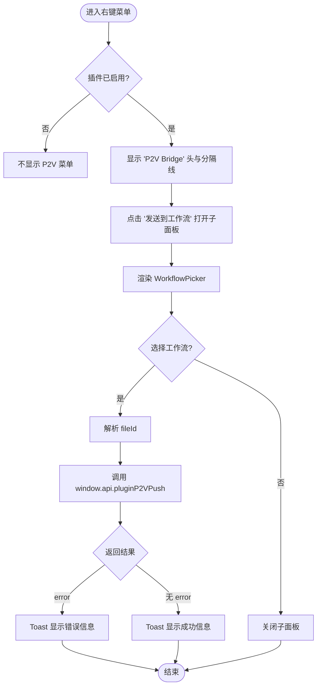
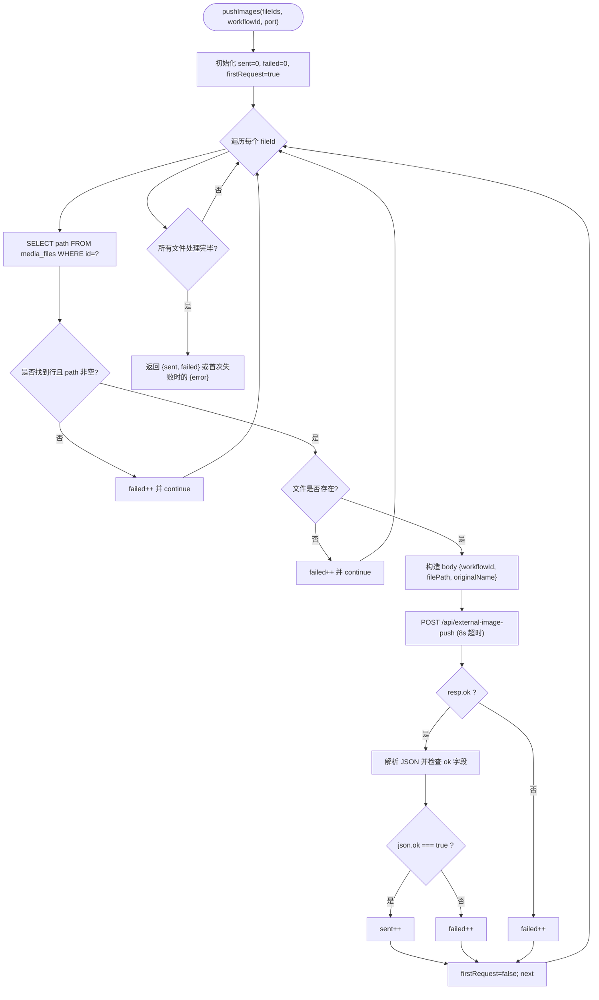
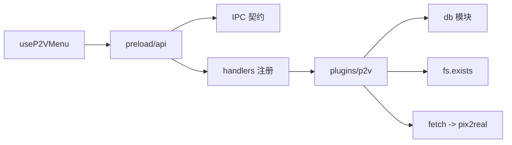

# P2V 桥接插件系统

<cite>
**本文引用的文件列表**
- [src/main/plugins/p2v.ts](file://src/main/plugins/p2v.ts)
- [src/main/ipc/handlers.ts](file://src/main/ipc/handlers.ts)
- [src/main/ipc/contract.ts](file://src/main/ipc/contract.ts)
- [src/preload/index.ts](file://src/preload/index.ts)
- [src/renderer/src/hooks/useP2VMenu.tsx](file://src/renderer/src/hooks/useP2VMenu.tsx)
- [src/renderer/src/components/WorkflowPicker.tsx](file://src/renderer/src/components/WorkflowPicker.tsx)
- [src/renderer/src/lib/p2vWorkflows.ts](file://src/renderer/src/lib/p2vWorkflows.ts)
- [src/renderer/src/stores/plugins.ts](file://src/renderer/src/stores/plugins.ts)
- [src/main/index.ts](file://src/main/index.ts)
</cite>

## 目录
1. [简介](#简介)
2. [项目结构](#项目结构)
3. [核心组件](#核心组件)
4. [架构总览](#架构总览)
5. [详细组件分析](#详细组件分析)
6. [依赖关系分析](#依赖关系分析)
7. [性能与可靠性](#性能与可靠性)
8. [故障排查指南](#故障排查指南)
9. [结论](#结论)

## 简介
本文件聚焦于“P2V 桥接插件系统”，该系统将本地媒体库中的图片/视频通过 IPC 桥接到外部服务 pix2real，以触发其工作流处理。整体流程由渲染层用户交互触发，经 Electron 预加载脚本暴露的 API 调用主进程处理器，再由主进程查询数据库、校验文件存在性并发起 HTTP 请求到本地运行的 pix2real 服务，最终将结果回传给渲染层进行提示。

## 项目结构
围绕 P2V 插件的关键代码分布在以下模块：
- 主进程侧：IPC 处理器注册、P2V 推送逻辑
- 预加载侧：向渲染层暴露统一 API（含 P2V 推送）
- 渲染层侧：右键菜单集成、工作流选择弹窗、状态管理、工作流常量

图表来源
- [src/renderer/src/hooks/useP2VMenu.tsx:1-91](file://src/renderer/src/hooks/useP2VMenu.tsx#L1-L91)
- [src/renderer/src/components/WorkflowPicker.tsx:1-116](file://src/renderer/src/components/WorkflowPicker.tsx#L1-L116)
- [src/renderer/src/stores/plugins.ts:1-35](file://src/renderer/src/stores/plugins.ts#L1-L35)
- [src/renderer/src/lib/p2vWorkflows.ts:1-19](file://src/renderer/src/lib/p2vWorkflows.ts#L1-L19)
- [src/preload/index.ts:1-107](file://src/preload/index.ts#L1-L107)
- [src/main/ipc/contract.ts:1-139](file://src/main/ipc/contract.ts#L1-L139)
- [src/main/ipc/handlers.ts:1-298](file://src/main/ipc/handlers.ts#L1-L298)
- [src/main/plugins/p2v.ts:1-106](file://src/main/plugins/p2v.ts#L1-L106)

章节来源
- [src/main/index.ts:1-134](file://src/main/index.ts#L1-L134)

## 核心组件
- 渲染层 Hook：在右键菜单中注入“P2V Bridge”入口，打开工作流选择子面板，并在选择后通过 window.api.pluginP2VPush 发起推送。
- 工作流选择器：根据锚点坐标计算弹出位置，支持 submenu 模式下的左右翻转与边界保护。
- 插件状态存储：持久化保存 P2V 插件启用状态与目标端口。
- 预加载桥：将 pluginP2VPush 方法暴露给渲染层，内部使用 ipcRenderer.invoke 调用主进程。
- 主进程处理器：注册 PLUGIN_P2V_PUSH 通道，转发至 pushImages。
- P2V 推送核心：按 ID 遍历文件，从数据库解析路径，校验文件存在后 POST 到 http://localhost:{port}/api/external-image-push，统计成功/失败数量；首次连接失败直接返回错误提示。

章节来源
- [src/renderer/src/hooks/useP2VMenu.tsx:1-91](file://src/renderer/src/hooks/useP2VMenu.tsx#L1-L91)
- [src/renderer/src/components/WorkflowPicker.tsx:1-116](file://src/renderer/src/components/WorkflowPicker.tsx#L1-L116)
- [src/renderer/src/stores/plugins.ts:1-35](file://src/renderer/src/stores/plugins.ts#L1-L35)
- [src/preload/index.ts:1-107](file://src/preload/index.ts#L1-L107)
- [src/main/ipc/handlers.ts:1-298](file://src/main/ipc/handlers.ts#L1-L298)
- [src/main/plugins/p2v.ts:1-106](file://src/main/plugins/p2v.ts#L1-L106)

## 架构总览
下图展示了从用户操作到外部服务调用的完整时序。

图表来源
- [src/renderer/src/hooks/useP2VMenu.tsx:1-91](file://src/renderer/src/hooks/useP2VMenu.tsx#L1-L91)
- [src/renderer/src/components/WorkflowPicker.tsx:1-116](file://src/renderer/src/components/WorkflowPicker.tsx#L1-L116)
- [src/preload/index.ts:1-107](file://src/preload/index.ts#L1-L107)
- [src/main/ipc/handlers.ts:1-298](file://src/main/ipc/handlers.ts#L1-L298)
- [src/main/plugins/p2v.ts:1-106](file://src/main/plugins/p2v.ts#L1-L106)

## 详细组件分析

### 渲染层：右键菜单与工作流选择
- 行为要点
  - 仅在插件启用时注入“P2V Bridge”菜单项。
  - 打开子面板时记录 DOMRect 坐标，用于 WorkflowPicker 定位。
  - 选择工作流后，取 fileId（优先 fileId，其次 id），通过 window.api.pluginP2VPush 发送。
  - 根据返回结果展示成功或失败提示。
- 数据与状态
  - 使用 useP2VEnabled 和 useP2VPort 获取插件开关与端口。
  - 工作流枚举来自 p2vWorkflows.ts。
- 交互细节
  - 子面板关闭时机包含点击外部区域、按下 Escape、窗口移动等。

图表来源
- [src/renderer/src/hooks/useP2VMenu.tsx:1-91](file://src/renderer/src/hooks/useP2VMenu.tsx#L1-L91)
- [src/renderer/src/components/WorkflowPicker.tsx:1-116](file://src/renderer/src/components/WorkflowPicker.tsx#L1-L116)
- [src/renderer/src/lib/p2vWorkflows.ts:1-19](file://src/renderer/src/lib/p2vWorkflows.ts#L1-L19)
- [src/renderer/src/stores/plugins.ts:1-35](file://src/renderer/src/stores/plugins.ts#L1-L35)

章节来源
- [src/renderer/src/hooks/useP2VMenu.tsx:1-91](file://src/renderer/src/hooks/useP2VMenu.tsx#L1-L91)
- [src/renderer/src/components/WorkflowPicker.tsx:1-116](file://src/renderer/src/components/WorkflowPicker.tsx#L1-L116)
- [src/renderer/src/lib/p2vWorkflows.ts:1-19](file://src/renderer/src/lib/p2vWorkflows.ts#L1-L19)
- [src/renderer/src/stores/plugins.ts:1-35](file://src/renderer/src/stores/plugins.ts#L1-L35)

### 预加载桥：window.api.pluginP2VPush
- 职责
  - 将渲染层的 pluginP2VPush 调用映射到主进程通道 PLUGIN_P2V_PUSH。
  - 透传参数 fileIds、workflowId、port。
- 类型契约
  - 通过 SerendipAPI 接口定义方法与返回类型，确保两端类型一致。

章节来源
- [src/preload/index.ts:1-107](file://src/preload/index.ts#L1-L107)
- [src/main/ipc/contract.ts:1-139](file://src/main/ipc/contract.ts#L1-L139)

### 主进程：IPC 处理器与 P2V 推送核心
- 处理器注册
  - 在 registerIpcHandlers 中监听 PLUGIN_P2V_PUSH，并将参数转发至 pushImages。
- 推送核心 pushImages
  - 输入：fileIds、workflowId、port（默认 3000）。
  - 步骤：
    - 构造 base URL 为 http://localhost:{port}。
    - 逐条查询 media_files.path。
    - 若行不存在或路径为空，计入 failed 并跳过。
    - 若文件不存在，计入 failed 并跳过。
    - 发起 POST 请求到 /api/external-image-push，携带 {workflowId, filePath, originalName}。
    - 超时控制：单次请求 8 秒超时。
    - 首次请求即连接失败：视为 pix2real 未运行，直接返回带 error 的结果。
    - 非首次异常：仅计入 failed 并继续后续文件。
    - 返回 {sent, failed} 或 {sent:0, failed:N, error:'...'}。

图表来源
- [src/main/plugins/p2v.ts:1-106](file://src/main/plugins/p2v.ts#L1-L106)
- [src/main/ipc/handlers.ts:1-298](file://src/main/ipc/handlers.ts#L1-L298)

章节来源
- [src/main/ipc/handlers.ts:1-298](file://src/main/ipc/handlers.ts#L1-L298)
- [src/main/plugins/p2v.ts:1-106](file://src/main/plugins/p2v.ts#L1-L106)

### 工作流枚举与 UI 定位
- 工作流枚举
  - 提供一组固定工作流 id 与名称，供渲染层展示与传递。
- 弹窗定位
  - 根据 placement 与父菜单坐标计算 left/top，并进行屏幕边界保护与反向展开。

章节来源
- [src/renderer/src/lib/p2vWorkflows.ts:1-19](file://src/renderer/src/lib/p2vWorkflows.ts#L1-L19)
- [src/renderer/src/components/WorkflowPicker.tsx:1-116](file://src/renderer/src/components/WorkflowPicker.tsx#L1-L116)

## 依赖关系分析
- 耦合关系
  - 渲染层通过 preload 暴露的 API 与主进程解耦，仅依赖 IPC 通道名与类型契约。
  - 主进程处理器集中注册，P2V 逻辑独立在 plugins/p2v.ts，便于扩展其他插件。
- 外部依赖
  - 数据库：better-sqlite3（通过 getDatabase 访问）。
  - 文件系统：fs.existsSync 校验文件存在。
  - 网络：fetch 调用本地 pix2real 服务。
- 潜在循环依赖
  - 当前未见循环引用；IPC 通道名集中在 contract.ts，避免硬编码字符串散落各处。

图表来源
- [src/main/ipc/contract.ts:1-139](file://src/main/ipc/contract.ts#L1-L139)
- [src/main/ipc/handlers.ts:1-298](file://src/main/ipc/handlers.ts#L1-L298)
- [src/main/plugins/p2v.ts:1-106](file://src/main/plugins/p2v.ts#L1-L106)
- [src/preload/index.ts:1-107](file://src/preload/index.ts#L1-L107)

章节来源
- [src/main/ipc/contract.ts:1-139](file://src/main/ipc/contract.ts#L1-L139)
- [src/main/ipc/handlers.ts:1-298](file://src/main/ipc/handlers.ts#L1-L298)
- [src/main/plugins/p2v.ts:1-106](file://src/main/plugins/p2v.ts#L1-L106)
- [src/preload/index.ts:1-107](file://src/preload/index.ts#L1-L107)

## 性能与可靠性
- 批量推送策略
  - 当前实现为串行逐个请求，适合小批量场景；若未来需要大批量推送，可考虑并发限制与重试队列。
- 超时与容错
  - 单次请求设置 8 秒超时，避免阻塞；首次连接失败快速失败，减少无效等待。
- 资源校验
  - 先查数据库再校验文件存在，避免不必要的网络开销。
- 用户体验
  - 渲染层即时反馈（Toast），提升感知速度。

[本节为通用建议，无需源码引用]

## 故障排查指南
- 现象：点击“发送到工作流”无任何反应或提示“无法连接 P2V”
  - 可能原因：pix2real 服务未启动或端口不一致。
  - 排查步骤：
    - 确认插件启用开关已打开。
    - 确认端口配置与 pix2real 实际监听端口一致。
    - 手动访问 http://localhost:{port}/api/external-image-push 验证可达性。
- 现象：部分文件推送失败
  - 可能原因：对应文件已被删除或路径变更。
  - 排查步骤：
    - 检查数据库中 media_files.path 是否正确。
    - 在文件系统中确认文件存在。
- 现象：UI 工作流弹窗位置异常
  - 可能原因：窗口尺寸变化或缩放导致坐标计算偏差。
  - 排查步骤：
    - 观察 WorkflowPicker 的定位逻辑与边界保护。
    - 尝试重置窗口大小或重新打开菜单。

章节来源
- [src/main/plugins/p2v.ts:1-106](file://src/main/plugins/p2v.ts#L1-L106)
- [src/renderer/src/components/WorkflowPicker.tsx:1-116](file://src/renderer/src/components/WorkflowPicker.tsx#L1-L116)

## 结论
P2V 桥接插件系统以清晰的层次划分实现了从渲染层到外部服务的可靠通信：渲染层负责交互与状态，预加载层提供安全桥接，主进程负责业务编排与外部调用。该设计具备良好的可扩展性，便于后续接入更多插件与优化批量处理能力。