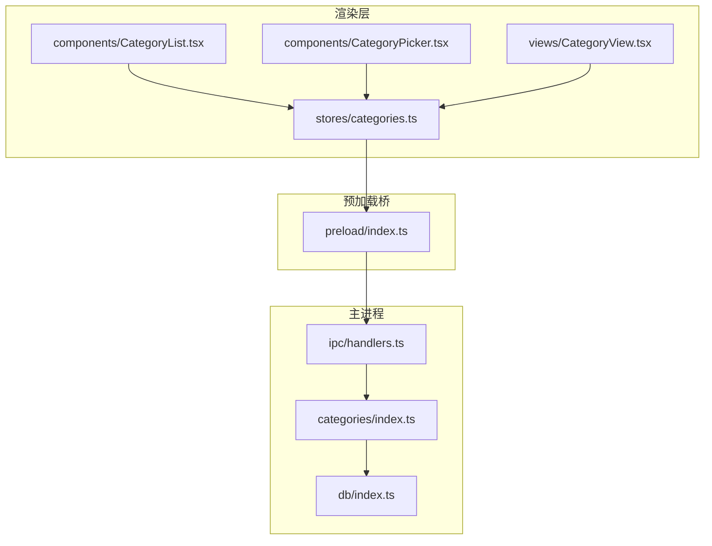
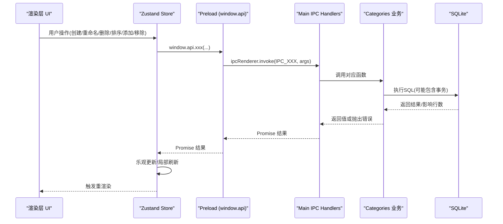
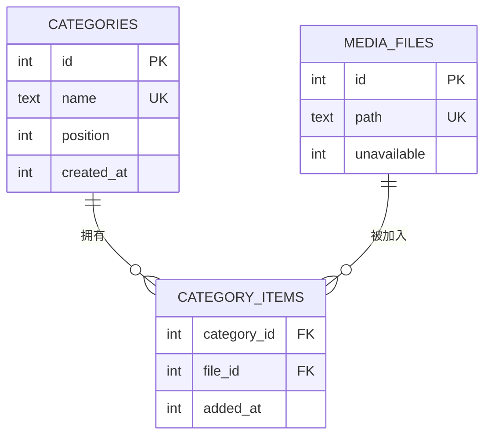
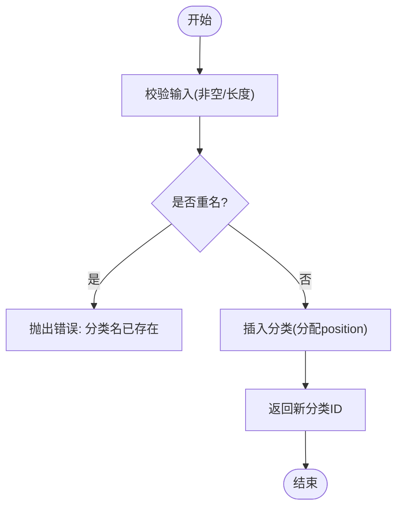
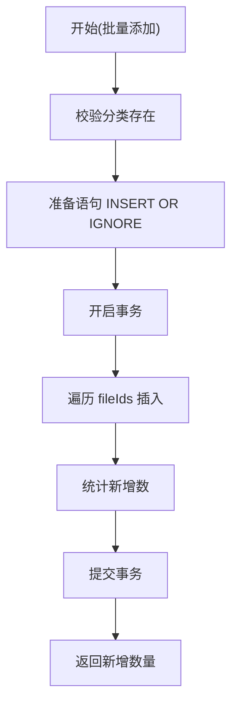
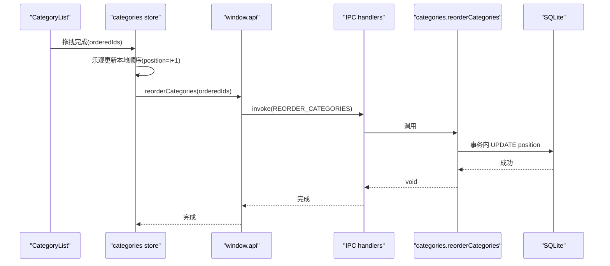
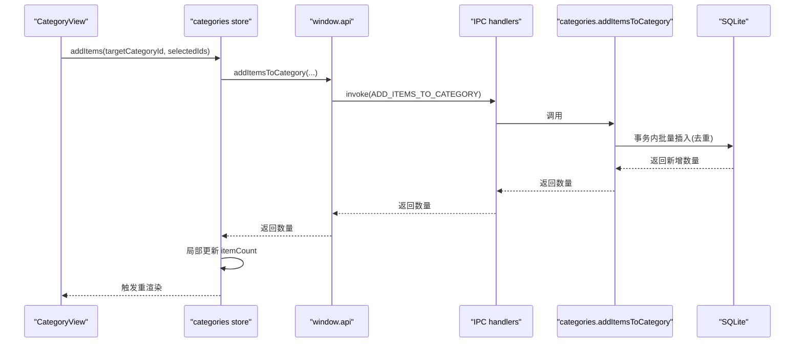
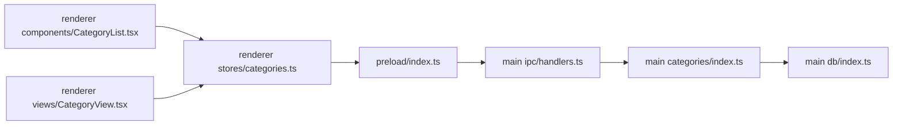

# 分类管理系统

<cite>
**本文引用的文件列表**
- [src/main/categories/index.ts](file://src/main/categories/index.ts)
- [src/main/db/index.ts](file://src/main/db/index.ts)
- [src/main/ipc/handlers.ts](file://src/main/ipc/handlers.ts)
- [src/main/ipc/contract.ts](file://src/main/ipc/contract.ts)
- [src/preload/index.ts](file://src/preload/index.ts)
- [src/renderer/src/stores/categories.ts](file://src/renderer/src/stores/categories.ts)
- [src/renderer/src/components/CategoryList.tsx](file://src/renderer/src/components/CategoryList.tsx)
- [src/renderer/src/components/CategoryPicker.tsx](file://src/renderer/src/components/CategoryPicker.tsx)
- [src/renderer/src/views/CategoryView.tsx](file://src/renderer/src/views/CategoryView.tsx)
- [README.md](file://README.md)
</cite>

## 目录
1. [简介](#简介)
2. [项目结构](#项目结构)
3. [核心组件](#核心组件)
4. [架构总览](#架构总览)
5. [详细组件分析](#详细组件分析)
6. [依赖关系分析](#依赖关系分析)
7. [性能与一致性](#性能与一致性)
8. [故障排查指南](#故障排查指南)
9. [结论](#结论)
10. [附录：API 接口文档](#附录api-接口文档)

## 简介
本文件面向开发者，系统性梳理 Serendip 应用的“收藏分类”子系统，覆盖以下主题：
- 分类的 CRUD 操作（创建、编辑、删除、查询）
- 分类与媒体文件的关联管理（批量添加、移除、去重与计数）
- 分类排序（拖拽重排、位置更新、顺序保持）
- 数据持久化策略（SQLite、事务、外键级联、WAL）
- IPC 层 API 契约与调用链路
- 前端交互（侧栏列表、选择器、分类视图、多选批量操作）
- 使用示例与扩展建议
- 导入导出与迁移说明（现状与实现建议）

## 项目结构
分类系统贯穿主进程业务逻辑、IPC 桥接、渲染层状态与 UI 组件。关键路径如下：
- 主进程：categories 业务层 → db 数据库访问
- IPC：handlers 注册通道 → contract 定义类型与通道名
- Preload：暴露 window.api 给渲染层
- 渲染层：Zustand store 封装异步调用 + 乐观更新；UI 组件负责交互与展示

图表来源
- [src/renderer/src/stores/categories.ts:1-95](file://src/renderer/src/stores/categories.ts#L1-L95)
- [src/renderer/src/components/CategoryList.tsx:1-212](file://src/renderer/src/components/CategoryList.tsx#L1-L212)
- [src/renderer/src/components/CategoryPicker.tsx:1-173](file://src/renderer/src/components/CategoryPicker.tsx#L1-L173)
- [src/renderer/src/views/CategoryView.tsx:1-414](file://src/renderer/src/views/CategoryView.tsx#L1-L414)
- [src/preload/index.ts:1-104](file://src/preload/index.ts#L1-L104)
- [src/main/ipc/handlers.ts:1-292](file://src/main/ipc/handlers.ts#L1-L292)
- [src/main/categories/index.ts:1-166](file://src/main/categories/index.ts#L1-L166)
- [src/main/db/index.ts:1-190](file://src/main/db/index.ts#L1-L190)

章节来源
- [README.md:1-66](file://README.md#L1-L66)

## 核心组件
- 主进程分类业务模块：提供分类的增删改查、排序、关联管理等函数，直接操作 SQLite。
- IPC 处理器：将渲染层的请求转发到业务模块，并返回结果。
- 预加载桥：将主进程能力以 window.api 形式暴露给渲染层。
- 渲染层 Store：封装异步调用，维护分类列表与计数，支持乐观更新与局部刷新。
- 渲染层 UI：侧栏分类列表（可拖拽）、分类选择器（搜索/新建）、分类内容视图（多选与批量操作）。

章节来源
- [src/main/categories/index.ts:1-166](file://src/main/categories/index.ts#L1-L166)
- [src/main/ipc/handlers.ts:187-211](file://src/main/ipc/handlers.ts#L187-L211)
- [src/preload/index.ts:34-50](file://src/preload/index.ts#L34-L50)
- [src/renderer/src/stores/categories.ts:1-95](file://src/renderer/src/stores/categories.ts#L1-L95)
- [src/renderer/src/components/CategoryList.tsx:1-212](file://src/renderer/src/components/CategoryList.tsx#L1-L212)
- [src/renderer/src/components/CategoryPicker.tsx:1-173](file://src/renderer/src/components/CategoryPicker.tsx#L1-L173)
- [src/renderer/src/views/CategoryView.tsx:1-414](file://src/renderer/src/views/CategoryView.tsx#L1-L414)

## 架构总览
分类系统的端到端调用链：
- 渲染层通过 window.api 调用 IPC 方法
- 主进程 handlers 路由到 categories 业务函数
- 业务函数通过 better-sqlite3 执行 SQL，利用事务保证一致性
- 渲染层 store 在成功后进行本地状态更新（含乐观更新）

图表来源
- [src/renderer/src/stores/categories.ts:22-94](file://src/renderer/src/stores/categories.ts#L22-L94)
- [src/preload/index.ts:34-50](file://src/preload/index.ts#L34-L50)
- [src/main/ipc/handlers.ts:187-211](file://src/main/ipc/handlers.ts#L187-L211)
- [src/main/categories/index.ts:20-166](file://src/main/categories/index.ts#L20-L166)
- [src/main/db/index.ts:1-190](file://src/main/db/index.ts#L1-L190)

## 详细组件分析

### 数据模型与存储
- 分类表 categories：id、name（唯一）、position（用于排序）、created_at
- 关联表 category_items：category_id、file_id（复合主键）、added_at
- 外键约束：删除分类或媒体时级联清理关联
- 索引：按 position、file_id 建立索引提升查询与排序性能
- WAL 模式与外键开启，保障并发与一致性

图表来源
- [src/main/db/index.ts:94-111](file://src/main/db/index.ts#L94-L111)
- [src/main/db/index.ts:129-138](file://src/main/db/index.ts#L129-L138)

章节来源
- [src/main/db/index.ts:94-138](file://src/main/db/index.ts#L94-L138)

### 分类 CRUD 与排序
- 列出分类：按 position 升序，附带 itemCount
- 创建分类：校验名称长度，分配最大 position+1，重复名称抛错
- 重命名：校验名称，存在性检查，重复名称抛错
- 删除：级联清理关联
- 重排：传入有序 id 列表，事务内重写 position

图表来源
- [src/main/categories/index.ts:34-57](file://src/main/categories/index.ts#L34-L57)

章节来源
- [src/main/categories/index.ts:20-94](file://src/main/categories/index.ts#L20-L94)

### 分类与媒体关联管理
- 添加媒体项：批量 INSERT OR IGNORE，返回新增数量
- 移除单个/批量：DELETE FROM category_items，批量走事务
- 获取分类下媒体：JOIN media_files，过滤 unavailable=0，按 added_at 倒序
- 获取文件所属分类：返回分类 id 列表

图表来源
- [src/main/categories/index.ts:117-136](file://src/main/categories/index.ts#L117-L136)

章节来源
- [src/main/categories/index.ts:96-166](file://src/main/categories/index.ts#L96-L166)

### 拖拽重排与位置更新
- 前端：CategoryList 使用 @dnd-kit 的 SortableContext 与 useSortable，行内拖拽更新本地顺序
- Store：reorder 先乐观更新本地 position，再调用后端 reorderCategories
- 后端：reorderCategories 使用事务按顺序写入 position

图表来源
- [src/renderer/src/components/CategoryList.tsx:131-141](file://src/renderer/src/components/CategoryList.tsx#L131-L141)
- [src/renderer/src/stores/categories.ts:47-59](file://src/renderer/src/stores/categories.ts#L47-L59)
- [src/main/ipc/handlers.ts:194-196](file://src/main/ipc/handlers.ts#L194-L196)
- [src/main/categories/index.ts:84-94](file://src/main/categories/index.ts#L84-L94)

章节来源
- [src/renderer/src/components/CategoryList.tsx:1-212](file://src/renderer/src/components/CategoryList.tsx#L1-L212)
- [src/renderer/src/stores/categories.ts:47-59](file://src/renderer/src/stores/categories.ts#L47-L59)
- [src/main/categories/index.ts:84-94](file://src/main/categories/index.ts#L84-L94)

### 分类视图与批量操作
- 分类视图：加载分类下的媒体，支持喜欢切换、打开文件、显示在文件夹、右键菜单
- 多选工具栏：批量喜欢、批量添加到分类/画布、批量从分类移除
- 分类选择器：支持搜索现有分类、快速新建并加入

图表来源
- [src/renderer/src/views/CategoryView.tsx:173-185](file://src/renderer/src/views/CategoryView.tsx#L173-L185)
- [src/renderer/src/stores/categories.ts:61-72](file://src/renderer/src/stores/categories.ts#L61-L72)
- [src/main/ipc/handlers.ts:200-202](file://src/main/ipc/handlers.ts#L200-L202)
- [src/main/categories/index.ts:117-136](file://src/main/categories/index.ts#L117-L136)

章节来源
- [src/renderer/src/views/CategoryView.tsx:1-414](file://src/renderer/src/views/CategoryView.tsx#L1-L414)
- [src/renderer/src/components/CategoryPicker.tsx:1-173](file://src/renderer/src/components/CategoryPicker.tsx#L1-L173)

## 依赖关系分析
- 渲染层依赖 preload 暴露的 window.api
- preload 依赖 IPC 通道常量与类型契约
- 主进程 handlers 依赖 categories 业务与 db 访问
- categories 业务依赖 db 提供的 getDatabase 与 better-sqlite3

图表来源
- [src/renderer/src/stores/categories.ts:1-95](file://src/renderer/src/stores/categories.ts#L1-L95)
- [src/preload/index.ts:1-104](file://src/preload/index.ts#L1-L104)
- [src/main/ipc/handlers.ts:1-292](file://src/main/ipc/handlers.ts#L1-L292)
- [src/main/categories/index.ts:1-166](file://src/main/categories/index.ts#L1-L166)
- [src/main/db/index.ts:1-190](file://src/main/db/index.ts#L1-L190)

章节来源
- [src/main/ipc/contract.ts:1-130](file://src/main/ipc/contract.ts#L1-L130)

## 性能与一致性
- 事务处理：批量添加/移除、重排均使用事务，减少磁盘 IO 与锁竞争
- 去重机制：INSERT OR IGNORE 避免重复关联，提高幂等性
- 计数优化：store 对 itemCount 做局部增量更新，避免整表重拉
- 索引优化：position、file_id 索引加速排序与查询
- WAL 模式：提升并发读性能，降低写阻塞

章节来源
- [src/main/categories/index.ts:84-94](file://src/main/categories/index.ts#L84-L94)
- [src/main/categories/index.ts:117-136](file://src/main/categories/index.ts#L117-L136)
- [src/main/db/index.ts:19-28](file://src/main/db/index.ts#L19-L28)
- [src/renderer/src/stores/categories.ts:61-93](file://src/renderer/src/stores/categories.ts#L61-L93)

## 故障排查指南
- 分类名重复：创建/重命名时若出现唯一约束冲突，会抛出错误提示“分类名已存在”
- 分类不存在：重命名时若未找到记录，抛出“分类不存在”
- 分类不存在于添加流程：添加前校验分类存在，否则抛错
- 媒体失效：分类视图加载时过滤 unavailable=0；缩略图失败会标记为不可用并从列表移除
- 拖拽重排异常：若后端事务失败，前端需回滚乐观更新（当前实现未显式回滚，建议在调用失败后重新 load）

章节来源
- [src/main/categories/index.ts:34-76](file://src/main/categories/index.ts#L34-L76)
- [src/main/categories/index.ts:117-122](file://src/main/categories/index.ts#L117-L122)
- [src/renderer/src/views/CategoryView.tsx:122-129](file://src/renderer/src/views/CategoryView.tsx#L122-L129)

## 结论
分类系统采用清晰的分层架构：渲染层负责交互与状态，IPC 作为稳定契约，主进程承载业务与持久化。通过事务、去重、索引与 WAL 模式，系统在易用性与性能之间取得平衡。后续可在导入导出、审计日志、权限控制等方面进一步扩展。

## 附录：API 接口文档
以下为分类相关 IPC 接口（由 preload 暴露至 window.api），供渲染层调用：

- listCategories(): Promise<Category[]>
  - 描述：列出所有分类，按 position 升序，附带 itemCount
  - 参数：无
  - 返回：分类数组

- createCategory(name: string): Promise<number>
  - 描述：创建分类，返回新分类 id；名称重复抛错
  - 参数：name（字符串，非空且长度不超过限制）
  - 返回：新分类 id

- renameCategory(id: number, newName: string): Promise<void>
  - 描述：重命名分类；名称重复或分类不存在抛错
  - 参数：id（数字），newName（字符串）
  - 返回：无

- deleteCategory(id: number): Promise<void>
  - 描述：删除分类（级联清理关联）
  - 参数：id（数字）
  - 返回：无

- reorderCategories(orderedIds: number[]): Promise<void>
  - 描述：按传入 id 顺序重写 position（事务）
  - 参数：orderedIds（数字数组）
  - 返回：无

- getCategoryItems(categoryId: number): Promise<MediaItem[]>
  - 描述：获取分类下的媒体项（过滤 unavailable=0，按 added_at 倒序）
  - 参数：categoryId（数字）
  - 返回：媒体项数组

- addItemsToCategory(categoryId: number, fileIds: number[]): Promise<number>
  - 描述：批量添加媒体到分类（去重），返回新增数量
  - 参数：categoryId（数字），fileIds（数字数组）
  - 返回：新增数量

- removeItemFromCategory(categoryId: number, fileId: number): Promise<void>
  - 描述：从分类移除一个媒体项
  - 参数：categoryId（数字），fileId（数字）
  - 返回：无

- removeItemsFromCategory(categoryId: number, fileIds: number[]): Promise<void>
  - 描述：批量从分类移除媒体项（事务）
  - 参数：categoryId（数字），fileIds（数字数组）
  - 返回：无

- getFileCategoryIds(fileId: number): Promise<number[]>
  - 描述：返回某个文件所属的所有分类 id（评审视图高亮用）
  - 参数：fileId（数字）
  - 返回：分类 id 数组

章节来源
- [src/main/ipc/contract.ts:38-50](file://src/main/ipc/contract.ts#L38-L50)
- [src/preload/index.ts:34-50](file://src/preload/index.ts#L34-L50)
- [src/main/ipc/handlers.ts:187-211](file://src/main/ipc/handlers.ts#L187-L211)

## 使用示例

- 创建分类并立即查看
  - 步骤：调用 createCategory("旅行") → 等待返回 id → 调用 listCategories() 刷新列表
  - 参考路径
    - [src/renderer/src/stores/categories.ts:31-35](file://src/renderer/src/stores/categories.ts#L31-L35)
    - [src/main/ipc/handlers.ts:189-190](file://src/main/ipc/handlers.ts#L189-L190)

- 拖拽重排分类
  - 步骤：在 CategoryList 中拖拽行 → Store.reorder 乐观更新 → 调用 reorderCategories
  - 参考路径
    - [src/renderer/src/components/CategoryList.tsx:131-141](file://src/renderer/src/components/CategoryList.tsx#L131-L141)
    - [src/renderer/src/stores/categories.ts:47-59](file://src/renderer/src/stores/categories.ts#L47-L59)
    - [src/main/categories/index.ts:84-94](file://src/main/categories/index.ts#L84-L94)

- 批量添加媒体到分类
  - 步骤：在多选模式下选择若干媒体 → 调用 addItemsToCategory → 根据返回数量局部更新 itemCount
  - 参考路径
    - [src/renderer/src/views/CategoryView.tsx:173-185](file://src/renderer/src/views/CategoryView.tsx#L173-L185)
    - [src/renderer/src/stores/categories.ts:61-72](file://src/renderer/src/stores/categories.ts#L61-L72)
    - [src/main/categories/index.ts:117-136](file://src/main/categories/index.ts#L117-L136)

- 从分类移除媒体（单条/批量）
  - 步骤：调用 removeItemFromCategory 或 removeItemsFromCategory → Store 局部更新 itemCount
  - 参考路径
    - [src/renderer/src/stores/categories.ts:74-93](file://src/renderer/src/stores/categories.ts#L74-L93)
    - [src/main/categories/index.ts:138-156](file://src/main/categories/index.ts#L138-L156)

## 导入导出与迁移

- 现状
  - 代码库中未发现专门的分类导入/导出功能实现
  - 数据持久化基于 SQLite，可通过备份 .db 文件实现整体备份与恢复
  - 应用内置迁移机制（_migrations 表），可按版本演进 schema

- 建议方案
  - 导出：读取 categories 与 category_items 表，生成 JSON 或 CSV 文件
  - 导入：解析文件，校验数据完整性，使用事务批量写入
  - 迁移：在 db/index.ts 的 runMigrations 中增加新版本迁移脚本，确保向后兼容

章节来源
- [src/main/db/index.ts:37-190](file://src/main/db/index.ts#L37-L190)