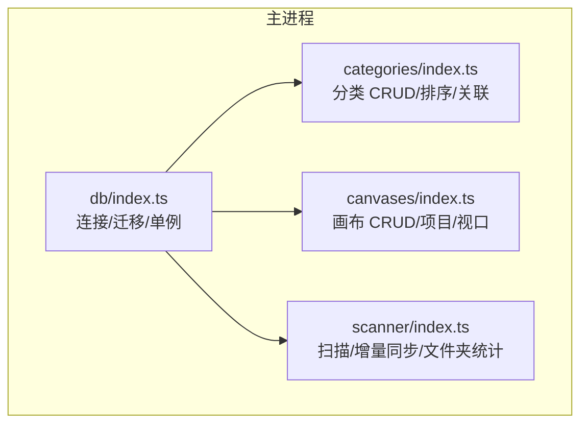
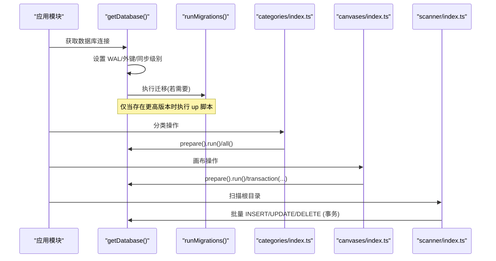
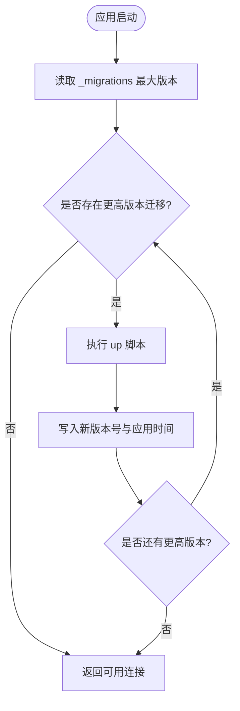
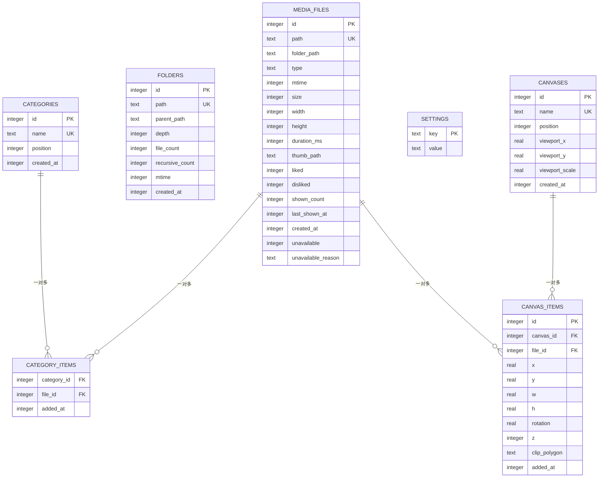
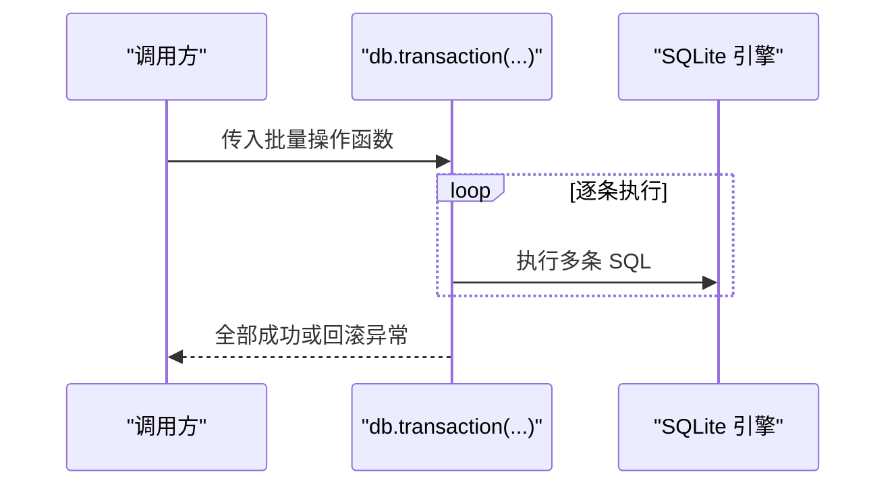
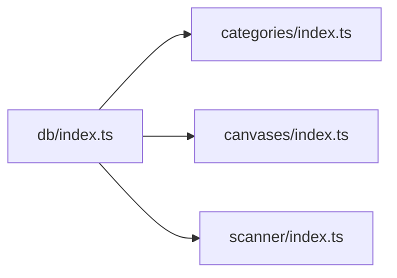

# 数据库层设计

<cite>
**本文引用的文件**
- [src/main/db/index.ts](file://src/main/db/index.ts)
- [src/main/categories/index.ts](file://src/main/categories/index.ts)
- [src/main/canvases/index.ts](file://src/main/canvases/index.ts)
- [src/main/scanner/index.ts](file://src/main/scanner/index.ts)
</cite>

## 目录
1. [简介](#简介)
2. [项目结构](#项目结构)
3. [核心组件](#核心组件)
4. [架构总览](#架构总览)
5. [详细组件分析](#详细组件分析)
6. [依赖关系分析](#依赖关系分析)
7. [性能考量](#性能考量)
8. [故障排查指南](#故障排查指南)
9. [结论](#结论)
10. [附录：扩展与最佳实践](#附录扩展与最佳实践)

## 简介
本文件面向开发者，系统化梳理 Serendip 应用的数据库层设计与实现。该层基于 better-sqlite3，采用单例连接、WAL 模式与事务批处理策略，提供本地媒体库索引、收藏分类、画布管理等能力。文档涵盖表结构设计、迁移系统、索引策略、并发优化、错误处理与事务机制，并给出可扩展的查询与使用建议。

## 项目结构
数据库相关代码集中在主进程模块中，按功能域拆分：
- 数据库初始化与迁移：src/main/db/index.ts
- 收藏分类业务：src/main/categories/index.ts
- 画布业务：src/main/canvases/index.ts
- 扫描与增量同步：src/main/scanner/index.ts

图表来源
- [src/main/db/index.ts:1-35](file://src/main/db/index.ts#L1-L35)
- [src/main/categories/index.ts:1-32](file://src/main/categories/index.ts#L1-L32)
- [src/main/canvases/index.ts:1-20](file://src/main/canvases/index.ts#L1-L20)
- [src/main/scanner/index.ts:1-35](file://src/main/scanner/index.ts#L1-L35)

章节来源
- [src/main/db/index.ts:1-35](file://src/main/db/index.ts#L1-L35)
- [src/main/categories/index.ts:1-32](file://src/main/categories/index.ts#L1-L32)
- [src/main/canvases/index.ts:1-20](file://src/main/canvases/index.ts#L1-L20)
- [src/main/scanner/index.ts:1-35](file://src/main/scanner/index.ts#L1-L35)

## 核心组件
- 数据库连接与单例
  - 通过模块级变量缓存 Database 实例，首次调用时创建并配置 WAL、外键等参数，随后复用同一连接。
  - 提供关闭方法用于应用退出或测试清理。
- 迁移系统
  - 启动时检查 _migrations 表，读取当前最高版本，顺序执行未应用的 up 脚本，并记录版本号与应用时间。
- 业务模块
  - categories：分类的增删改查、排序、与媒体项的多对多关联。
  - canvases：画布的增删改查、项目插入（支持同文件多次加入）、批量更新、视口持久化。
  - scanner：扫描根目录，增量对比文件系统与数据库，批量写入/更新/删除，重建 folders 统计。

章节来源
- [src/main/db/index.ts:8-28](file://src/main/db/index.ts#L8-L28)
- [src/main/db/index.ts:37-189](file://src/main/db/index.ts#L37-L189)
- [src/main/categories/index.ts:21-32](file://src/main/categories/index.ts#L21-L32)
- [src/main/canvases/index.ts:76-90](file://src/main/canvases/index.ts#L76-L90)
- [src/main/scanner/index.ts:36-106](file://src/main/scanner/index.ts#L36-L106)

## 架构总览
下图展示了数据库层的整体交互：上层业务模块通过 getDatabase() 获取单例连接，执行 SQL；迁移在首次连接时自动完成；扫描流程以事务批量写入，提升吞吐。

图表来源
- [src/main/db/index.ts:8-28](file://src/main/db/index.ts#L8-L28)
- [src/main/db/index.ts:37-189](file://src/main/db/index.ts#L37-L189)
- [src/main/categories/index.ts:40-57](file://src/main/categories/index.ts#L40-L57)
- [src/main/canvases/index.ts:140-149](file://src/main/canvases/index.ts#L140-L149)
- [src/main/scanner/index.ts:124-132](file://src/main/scanner/index.ts#L124-L132)

## 详细组件分析

### 数据库连接与单例
- 单例实现
  - 模块级变量保存连接，避免重复打开文件句柄与锁竞争。
- 关键 PRAGMA
  - journal_mode = WAL：读写并发更友好，减少写阻塞读。
  - synchronous = NORMAL：在 WAL 模式下平衡安全与性能。
  - foreign_keys = ON：启用外键约束，保证引用完整性。
- 生命周期
  - 提供 closeDatabase() 用于释放资源。

章节来源
- [src/main/db/index.ts:8-28](file://src/main/db/index.ts#L8-L28)

### 迁移系统与版本管理
- 版本表
  - _migrations(version, applied_at)，version 为主键，记录已应用的最大版本。
- 执行策略
  - 启动时读取 MAX(version)，遍历内置迁移数组，仅执行 version > currentVersion 的 up 脚本，成功后插入新版本号。
- 迁移清单
  - v1：初始 schema（media_files、folders、categories、category_items、settings）及基础索引。
  - v2：为 media_files 增加 unavailable/unavailable_reason 字段与部分索引。
  - v3：为 categories 增加 position 字段与索引，并对历史数据初始化位置。
  - v4：新增 canvases 与 canvas_items 表及索引。

图表来源
- [src/main/db/index.ts:37-189](file://src/main/db/index.ts#L37-L189)

章节来源
- [src/main/db/index.ts:37-189](file://src/main/db/index.ts#L37-L189)

### 表结构与索引设计
- media_files（媒体文件索引）
  - 唯一路径 path，类型 type(image/video)、尺寸、时长、缩略图路径、评分计数、展示计数、最后展示时间、失效标记等。
  - 索引：folder_path、type、liked(disliked) 的部分索引、last_shown_at。
- folders（文件夹层级结构）
  - 存储每个目录的文件数与递归计数、父路径与深度，便于智能随机算法与聚合统计。
  - 索引：parent_path、depth。
- categories（收藏分类）
  - name 唯一，position 用于侧栏拖拽排序。
  - 索引：position。
- category_items（分类关联）
  - 复合主键(category_id, file_id)，外键级联删除，额外索引 file_id。
- settings（应用设置）
  - key-value 表，key 为主键。
- canvases（画布管理）
  - name 唯一，position 用于列表排序，viewport_x/y/scale 持久化视图状态。
  - 索引：position。
- canvas_items（画布项目）
  - 允许同一文件多次加入同一画布（无 UNIQUE），包含位置、尺寸、旋转、层级 z、裁剪多边形等。
  - 索引：canvas_id、file_id。

图表来源
- [src/main/db/index.ts:50-176](file://src/main/db/index.ts#L50-L176)

章节来源
- [src/main/db/index.ts:50-176](file://src/main/db/index.ts#L50-L176)

### 索引策略与查询性能
- 复合索引
  - category_items 的主键(category_id, file_id)天然构成复合索引，适合“某分类下所有文件”和“去重添加”场景。
- 部分索引
  - media_files 针对 liked/disliked/unavailable 的部分索引，显著缩小索引体积，加速“只看喜欢/不喜欢/失效”的过滤查询。
- 常用查询优化点
  - 按 folder_path/type 筛选：利用对应列索引。
  - 按 last_shown_at 排序/分页：利用 last_shown_at 索引。
  - 分类与画布的项目计数：使用子查询 COUNT(*)，避免冗余维护计数字段带来的更新成本。
  - 画布项目排序：ORDER BY z ASC, added_at ASC，结合索引可快速定位。

章节来源
- [src/main/db/index.ts:73-77](file://src/main/db/index.ts#L73-L77)
- [src/main/db/index.ts:124-127](file://src/main/db/index.ts#L124-L127)
- [src/main/categories/index.ts:21-32](file://src/main/categories/index.ts#L21-L32)
- [src/main/canvases/index.ts:76-90](file://src/main/canvases/index.ts#L76-L90)
- [src/main/canvases/index.ts:152-170](file://src/main/canvases/index.ts#L152-L170)

### 事务处理与批量写入
- 分类与画布的重排、批量添加/删除均使用 db.transaction 包裹，确保原子性与一致性。
- 扫描器将大量 I/O 与 SQL 合并到事务中，分批次提交，降低磁盘 IO 压力与锁竞争。

图表来源
- [src/main/canvases/index.ts:140-149](file://src/main/canvases/index.ts#L140-L149)
- [src/main/canvases/index.ts:194-208](file://src/main/canvases/index.ts#L194-L208)
- [src/main/scanner/index.ts:124-132](file://src/main/scanner/index.ts#L124-L132)

章节来源
- [src/main/canvases/index.ts:140-149](file://src/main/canvases/index.ts#L140-L149)
- [src/main/canvases/index.ts:194-208](file://src/main/canvases/index.ts#L194-L208)
- [src/main/scanner/index.ts:124-132](file://src/main/scanner/index.ts#L124-L132)

### 错误处理与约束
- 唯一性冲突
  - categories.name、canvases.name 唯一约束，捕获 SQLITE_CONSTRAINT_UNIQUE 并抛出友好错误。
- 不存在校验
  - 更新/删除前检查影响行数或先 SELECT 验证，避免静默失败。
- 失效标记与解封
  - 扫描过程中根据 mtime/size 变化决定是否更新；若之前被标记 unavailable 但文件仍存在且未变更，则解封。

章节来源
- [src/main/categories/index.ts:45-56](file://src/main/categories/index.ts#L45-L56)
- [src/main/canvases/index.ts:100-111](file://src/main/canvases/index.ts#L100-L111)
- [src/main/scanner/index.ts:171-207](file://src/main/scanner/index.ts#L171-L207)

### 典型查询示例与最佳实践
- 列出分类及其项目数（按 position 升序）
  - 参考：[src/main/categories/index.ts:21-32](file://src/main/categories/index.ts#L21-L32)
- 列出画布及其项目数（按 position 升序）
  - 参考：[src/main/canvases/index.ts:76-90](file://src/main/canvases/index.ts#L76-L90)
- 获取分类下的媒体项（排除失效项，按加入时间倒序）
  - 参考：[src/main/categories/index.ts:97-111](file://src/main/categories/index.ts#L97-L111)
- 获取画布下的媒体项（按 z 与 added_at 排序）
  - 参考：[src/main/canvases/index.ts:152-170](file://src/main/canvases/index.ts#L152-L170)
- 批量添加画布项目（计算宽高比，事务包裹）
  - 参考：[src/main/canvases/index.ts:180-209](file://src/main/canvases/index.ts#L180-L209)
- 增量扫描中的批量更新与解封（事务包裹）
  - 参考：[src/main/scanner/index.ts:171-207](file://src/main/scanner/index.ts#L171-L207)

最佳实践要点
- 优先使用 prepared statement 与占位符，避免注入风险与重复编译开销。
- 批量操作务必使用 transaction 包裹，减少日志落盘与锁切换。
- 对高选择性条件使用部分索引（如 liked=1、unavailable=1）。
- 对频繁排序字段建立索引（如 position、z、added_at）。
- 避免在热点路径上维护冗余计数，改用子查询 COUNT(*) 或定时刷新。

章节来源
- [src/main/categories/index.ts:21-32](file://src/main/categories/index.ts#L21-L32)
- [src/main/canvases/index.ts:76-90](file://src/main/canvases/index.ts#L76-L90)
- [src/main/categories/index.ts:97-111](file://src/main/categories/index.ts#L97-L111)
- [src/main/canvases/index.ts:152-170](file://src/main/canvases/index.ts#L152-L170)
- [src/main/canvases/index.ts:180-209](file://src/main/canvases/index.ts#L180-L209)
- [src/main/scanner/index.ts:171-207](file://src/main/scanner/index.ts#L171-L207)

## 依赖关系分析
- 模块耦合
  - categories/index.ts 与 canvases/index.ts 均依赖 db/index.ts 提供的 getDatabase()。
  - scanner/index.ts 同样依赖 getDatabase()，并在扫描后重建 folders 统计。
- 外部依赖
  - better-sqlite3：提供同步 API、事务封装与 PRAGMA 控制。
  - Electron app.getPath('userData')：确定数据库文件存放路径。

图表来源
- [src/main/db/index.ts:8-28](file://src/main/db/index.ts#L8-L28)
- [src/main/categories/index.ts:9-10](file://src/main/categories/index.ts#L9-L10)
- [src/main/canvases/index.ts:9-10](file://src/main/canvases/index.ts#L9-L10)
- [src/main/scanner/index.ts:5-6](file://src/main/scanner/index.ts#L5-L6)

章节来源
- [src/main/db/index.ts:8-28](file://src/main/db/index.ts#L8-L28)
- [src/main/categories/index.ts:9-10](file://src/main/categories/index.ts#L9-L10)
- [src/main/canvases/index.ts:9-10](file://src/main/canvases/index.ts#L9-L10)
- [src/main/scanner/index.ts:5-6](file://src/main/scanner/index.ts#L5-L6)

## 性能考量
- WAL 模式
  - 开启 WAL 后，读不阻塞写，写不阻塞读，显著提升并发体验。
- 同步级别
  - synchronous = NORMAL 在 WAL 模式下兼顾安全与性能，适合桌面端应用。
- 事务批处理
  - 扫描器与画布/分类的批量操作均采用事务，减少磁盘 IO 次数与锁竞争。
- 索引选择
  - 针对高频过滤与排序字段建立合适索引，必要时使用部分索引减小体积。
- 分批处理
  - 扫描器按固定批次大小进行 stat 与写入，避免一次性加载过多内存。

章节来源
- [src/main/db/index.ts:19-22](file://src/main/db/index.ts#L19-L22)
- [src/main/scanner/index.ts:124-132](file://src/main/scanner/index.ts#L124-L132)
- [src/main/scanner/index.ts:134-168](file://src/main/scanner/index.ts#L134-L168)
- [src/main/canvases/index.ts:140-149](file://src/main/canvases/index.ts#L140-L149)

## 故障排查指南
- 唯一性冲突
  - 现象：插入/更新分类或画布名时报 SQLITE_CONSTRAINT_UNIQUE。
  - 处理：捕获错误码并提示用户修改名称。
  - 参考：[src/main/categories/index.ts:45-56](file://src/main/categories/index.ts#L45-L56)、[src/main/canvases/index.ts:100-111](file://src/main/canvases/index.ts#L100-L111)
- 记录不存在
  - 现象：更新/删除影响行数为 0。
  - 处理：在业务层先校验或检查 changes 并抛错。
  - 参考：[src/main/categories/index.ts:66-75](file://src/main/categories/index.ts#L66-L75)、[src/main/canvases/index.ts:120-130](file://src/main/canvases/index.ts#L120-L130)
- 文件失效与解封
  - 现象：媒体文件被标记 unavailable，但实际文件恢复。
  - 处理：扫描器检测 mtime/size 未变且 unavailable=1 时执行解封。
  - 参考：[src/main/scanner/index.ts:171-207](file://src/main/scanner/index.ts#L171-L207)
- 迁移失败
  - 现象：应用启动时报 SQL 语法错误或约束冲突。
  - 处理：检查 _migrations 表与对应 up 脚本，确认版本顺序与兼容性。
  - 参考：[src/main/db/index.ts:37-189](file://src/main/db/index.ts#L37-L189)

章节来源
- [src/main/categories/index.ts:45-56](file://src/main/categories/index.ts#L45-L56)
- [src/main/canvases/index.ts:100-111](file://src/main/canvases/index.ts#L100-L111)
- [src/main/categories/index.ts:66-75](file://src/main/categories/index.ts#L66-L75)
- [src/main/canvases/index.ts:120-130](file://src/main/canvases/index.ts#L120-L130)
- [src/main/scanner/index.ts:171-207](file://src/main/scanner/index.ts#L171-L207)
- [src/main/db/index.ts:37-189](file://src/main/db/index.ts#L37-L189)

## 结论
Serendip 的数据库层以 better-sqlite3 为核心，通过单例连接、WAL 模式与事务批处理，在保证一致性的同时获得良好的并发与吞吐表现。表结构围绕媒体库、分类与画布三大领域展开，配合合理的索引策略与迁移系统，具备良好的可扩展性与可维护性。建议在后续扩展中继续遵循事务包裹、prepared statement、部分索引与子查询计数的最佳实践。

## 附录：扩展与最佳实践
- 新增迁移步骤
  - 在 runMigrations 的 migrations 数组追加新的 up 脚本，并确保幂等与兼容旧数据。
  - 参考：[src/main/db/index.ts:179-189](file://src/main/db/index.ts#L179-L189)
- 自定义查询
  - 使用 getDatabase() 获取连接，prepare().all/run/get 执行 SQL，复杂逻辑用 transaction 包裹。
  - 参考：[src/main/categories/index.ts:21-32](file://src/main/categories/index.ts#L21-L32)、[src/main/canvases/index.ts:180-209](file://src/main/canvases/index.ts#L180-L209)
- 索引优化建议
  - 对高频 WHERE/JOIN/ORDER BY 字段建立索引；对稀疏布尔字段使用部分索引。
  - 参考：[src/main/db/index.ts:73-77](file://src/main/db/index.ts#L73-L77)、[src/main/db/index.ts:124-127](file://src/main/db/index.ts#L124-L127)
- 事务与批处理
  - 批量插入/更新/删除一律使用 transaction，减少日志与锁开销。
  - 参考：[src/main/scanner/index.ts:124-132](file://src/main/scanner/index.ts#L124-L132)、[src/main/canvases/index.ts:140-149](file://src/main/canvases/index.ts#L140-L149)

章节来源
- [src/main/db/index.ts:179-189](file://src/main/db/index.ts#L179-L189)
- [src/main/categories/index.ts:21-32](file://src/main/categories/index.ts#L21-L32)
- [src/main/canvases/index.ts:180-209](file://src/main/canvases/index.ts#L180-L209)
- [src/main/db/index.ts:73-77](file://src/main/db/index.ts#L73-L77)
- [src/main/db/index.ts:124-127](file://src/main/db/index.ts#L124-L127)
- [src/main/scanner/index.ts:124-132](file://src/main/scanner/index.ts#L124-L132)
- [src/main/canvases/index.ts:140-149](file://src/main/canvases/index.ts#L140-L149)