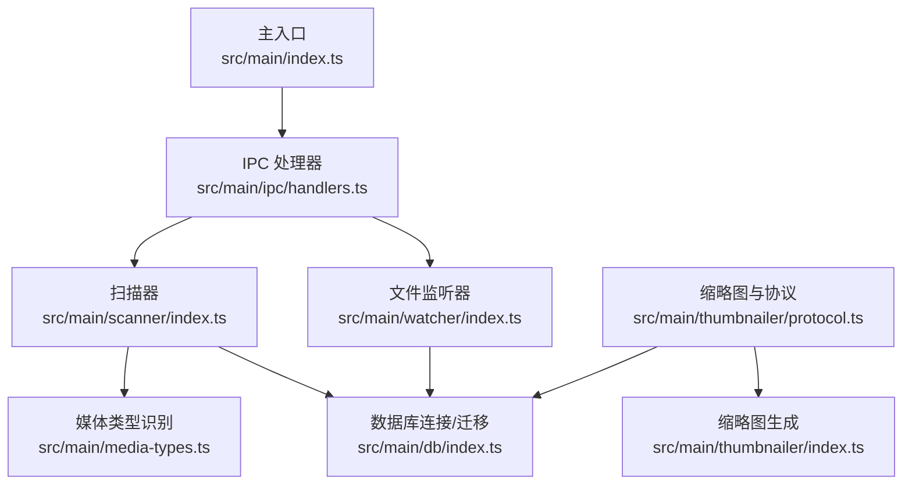
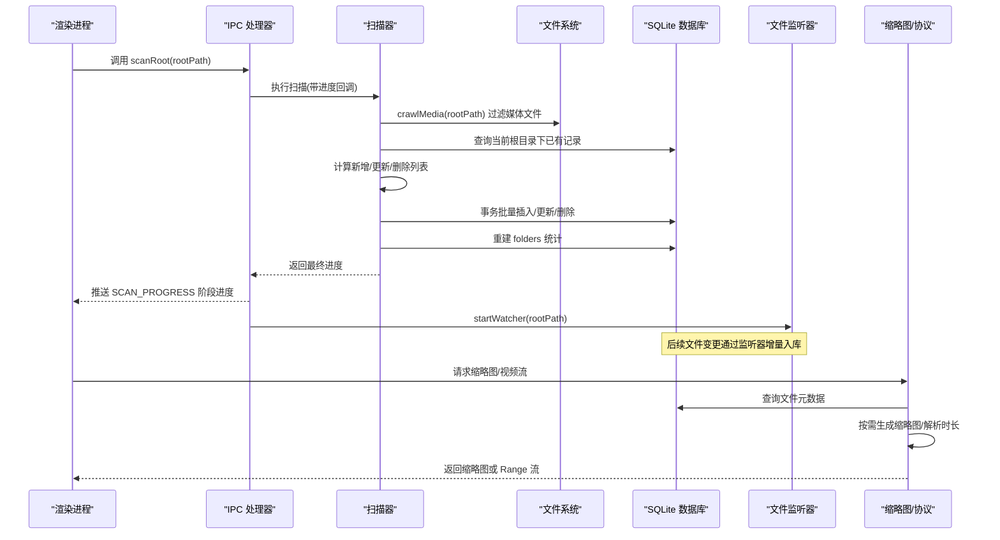
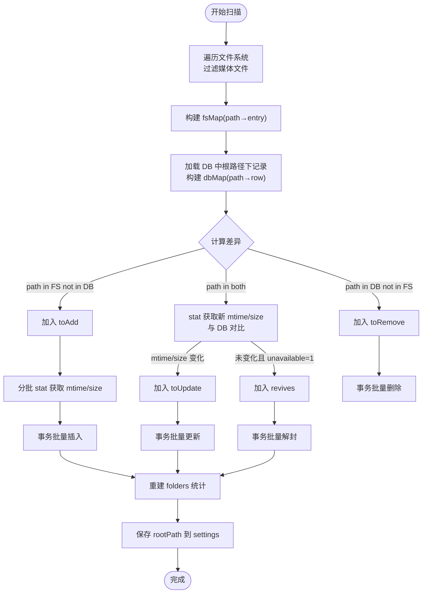
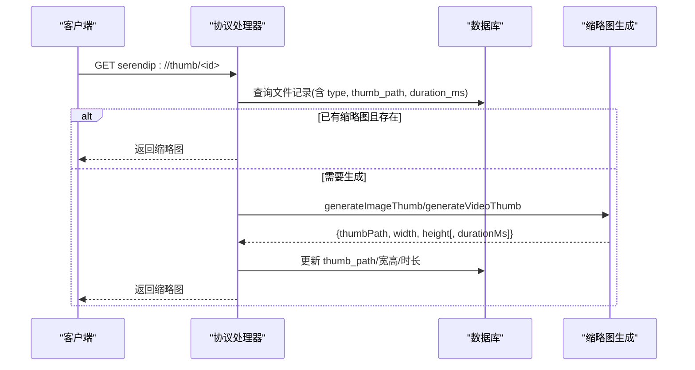
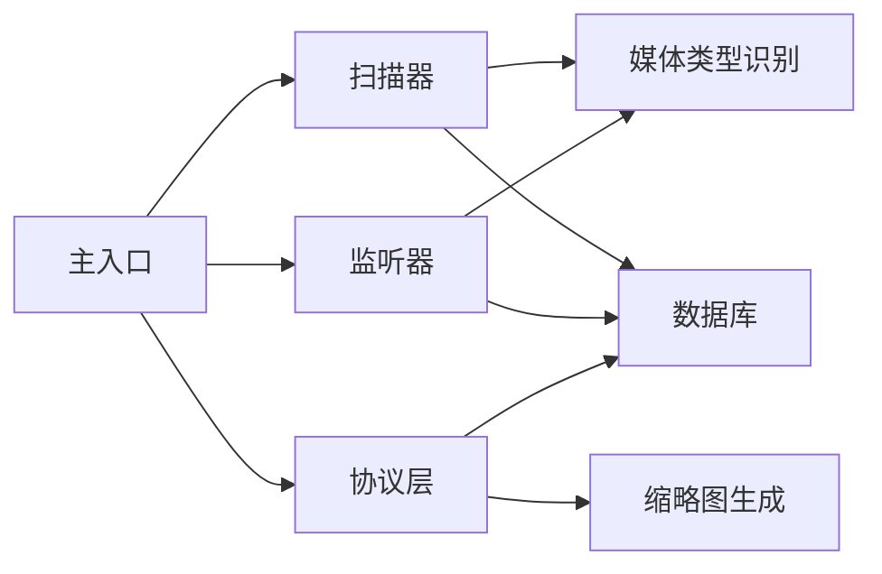

# 文件扫描器

<cite>
**本文引用的文件**   
- [src/main/scanner/index.ts](file://src/main/scanner/index.ts)
- [src/main/media-types.ts](file://src/main/media-types.ts)
- [src/main/db/index.ts](file://src/main/db/index.ts)
- [src/main/watcher/index.ts](file://src/main/watcher/index.ts)
- [src/main/thumbnailer/index.ts](file://src/main/thumbnailer/index.ts)
- [src/main/thumbnailer/protocol.ts](file://src/main/thumbnailer/protocol.ts)
- [src/main/ipc/handlers.ts](file://src/main/ipc/handlers.ts)
- [src/main/ipc/contract.ts](file://src/main/ipc/contract.ts)
- [src/main/index.ts](file://src/main/index.ts)
</cite>

## 目录
1. [简介](#简介)
2. [项目结构](#项目结构)
3. [核心组件](#核心组件)
4. [架构总览](#架构总览)
5. [详细组件分析](#详细组件分析)
6. [依赖关系分析](#依赖关系分析)
7. [性能考量](#性能考量)
8. [故障排查指南](#故障排查指南)
9. [结论](#结论)
10. [附录：API 使用示例与扩展方法](#附录api-使用示例与扩展方法)

## 简介
本文件为 Serendip 应用的“文件扫描器”提供综合文档，重点覆盖以下方面：
- 增量同步算法的实现原理：文件系统遍历策略、变更检测机制、数据库同步逻辑
- 媒体类型识别系统：图片（JPEG、PNG、GIF、WebP、SVG 等）与视频（MP4、MOV、AVI、MKV 等）的自动检测能力与扩展方式
- 元数据提取流程：尺寸信息、时长统计、文件大小计算等
- 性能优化策略：并行处理、内存管理、错误恢复机制
- 扫描配置选项与自定义文件类型的扩展方法
- 面向开发者的定制与调优指导，并提供实际 API 使用示例路径

## 项目结构
扫描器位于主进程模块中，围绕“扫描根目录 → 差异对比 → 批量写入 → 重建文件夹统计 → 持久化设置”的主流程组织。与之协作的关键模块包括：
- 媒体类型识别：集中维护支持的扩展名集合与类型判定函数
- 数据库层：WAL 模式、迁移脚本、索引设计
- 实时监听：基于 chokidar 的文件变化队列与批处理
- 缩略图与协议：按需生成缩略图、视频 Range 流式播放、HEIC/HEIF 转码缓存
- IPC 契约与处理器：对外暴露 API、推送进度、启动监听器

图表来源
- [src/main/index.ts:93-118](file://src/main/index.ts#L93-L118)
- [src/main/ipc/handlers.ts:52-60](file://src/main/ipc/handlers.ts#L52-L60)
- [src/main/scanner/index.ts:36-239](file://src/main/scanner/index.ts#L36-L239)
- [src/main/media-types.ts:1-38](file://src/main/media-types.ts#L1-L38)
- [src/main/db/index.ts:1-190](file://src/main/db/index.ts#L1-L190)
- [src/main/watcher/index.ts:16-117](file://src/main/watcher/index.ts#L16-L117)
- [src/main/thumbnailer/protocol.ts:33-92](file://src/main/thumbnailer/protocol.ts#L33-L92)
- [src/main/thumbnailer/index.ts:27-94](file://src/main/thumbnailer/index.ts#L27-L94)

章节来源
- [src/main/index.ts:93-118](file://src/main/index.ts#L93-L118)
- [src/main/ipc/handlers.ts:52-60](file://src/main/ipc/handlers.ts#L52-L60)
- [src/main/scanner/index.ts:36-239](file://src/main/scanner/index.ts#L36-L239)
- [src/main/media-types.ts:1-38](file://src/main/media-types.ts#L1-L38)
- [src/main/db/index.ts:1-190](file://src/main/db/index.ts#L1-L190)
- [src/main/watcher/index.ts:16-117](file://src/main/watcher/index.ts#L16-L117)
- [src/main/thumbnailer/protocol.ts:33-92](file://src/main/thumbnailer/protocol.ts#L33-L92)
- [src/main/thumbnailer/index.ts:27-94](file://src/main/thumbnailer/index.ts#L27-L94)

## 核心组件
- 扫描器（scanner）
  - 负责增量扫描根目录，输出阶段性进度，执行差异对比与批量写入
  - 关键函数：scanRoot、crawlMedia、rebuildFolderStats
- 媒体类型识别（media-types）
  - 维护图片/视频扩展名集合与 getMediaType 判定函数
- 数据库（db）
  - 初始化 SQLite、启用 WAL、执行迁移、创建索引
- 文件监听器（watcher）
  - 基于 chokidar 监听增删改事件，合并到队列并定时刷新入库
- 缩略图与协议（thumbnailer + protocol）
  - 按需生成缩略图、解析视频元数据、提供 Range 流式响应、HEIC/HEIF 转码缓存
- IPC 处理器（ipc/handlers）
  - 暴露 scanRoot、startWatcher、markUnavailable 等接口，推送进度

章节来源
- [src/main/scanner/index.ts:36-239](file://src/main/scanner/index.ts#L36-L239)
- [src/main/media-types.ts:1-38](file://src/main/media-types.ts#L1-L38)
- [src/main/db/index.ts:1-190](file://src/main/db/index.ts#L1-L190)
- [src/main/watcher/index.ts:16-117](file://src/main/watcher/index.ts#L16-L117)
- [src/main/thumbnailer/index.ts:27-94](file://src/main/thumbnailer/index.ts#L27-L94)
- [src/main/thumbnailer/protocol.ts:33-92](file://src/main/thumbnailer/protocol.ts#L33-L92)
- [src/main/ipc/handlers.ts:52-60](file://src/main/ipc/handlers.ts#L52-L60)

## 架构总览
扫描器采用“全量遍历 + 差异对比 + 事务批量写入”的增量同步模型；配合文件监听器实现热更新；缩略图与协议层在读取时按需生成与缓存，避免扫描期重负载。

图表来源
- [src/main/ipc/handlers.ts:52-60](file://src/main/ipc/handlers.ts#L52-L60)
- [src/main/scanner/index.ts:36-239](file://src/main/scanner/index.ts#L36-L239)
- [src/main/watcher/index.ts:16-117](file://src/main/watcher/index.ts#L16-L117)
- [src/main/thumbnailer/protocol.ts:33-92](file://src/main/thumbnailer/protocol.ts#L33-L92)
- [src/main/thumbnailer/index.ts:27-94](file://src/main/thumbnailer/index.ts#L27-L94)

## 详细组件分析

### 增量同步算法
- 遍历策略
  - 使用高性能目录遍历库，按完整路径收集所有受支持的媒体文件，跳过缓存与隐藏目录、node_modules、回收站等
  - 仅保留扩展名匹配媒体类型的文件
- 变更检测
  - 将文件系统结果构建为 Map，与数据库中该根路径下的记录做差集
  - 新增：路径存在于文件系统但不在数据库
  - 删除：路径存在于数据库但不在文件系统
  - 更新：路径都存在，比较 mtime 与 size，任一变化即标记更新；若未变化但被标记失效则解封
- 数据库同步
  - 先批量删除已不存在项
  - 新增/更新分批 stat 获取 mtime/size，再使用事务批量 INSERT OR REPLACE / UPDATE
  - 完成后重建 folders 表统计，保存 rootPath 到 settings

图表来源
- [src/main/scanner/index.ts:36-239](file://src/main/scanner/index.ts#L36-L239)
- [src/main/scanner/index.ts:245-268](file://src/main/scanner/index.ts#L245-L268)
- [src/main/scanner/index.ts:274-317](file://src/main/scanner/index.ts#L274-L317)

章节来源
- [src/main/scanner/index.ts:36-239](file://src/main/scanner/index.ts#L36-L239)
- [src/main/scanner/index.ts:245-268](file://src/main/scanner/index.ts#L245-L268)
- [src/main/scanner/index.ts:274-317](file://src/main/scanner/index.ts#L274-L317)

### 媒体类型识别系统
- 支持格式
  - 图片：jpg/jpeg、png、gif、webp、bmp、avif、heic/heif
  - 视频：mp4、mov、mkv、webm、m4v
- 识别机制
  - 通过扩展名小写后查 Set 判断类型，统一由 getMediaType 返回 image/video/null
- 扩展方法
  - 在媒体类型文件中新增扩展名集合即可支持新格式
  - 注意：AVI 未在默认集合中，如需支持可在对应集合中添加 .avi

章节来源
- [src/main/media-types.ts:1-38](file://src/main/media-types.ts#L1-L38)

### 文件元数据提取流程
- 图片
  - 使用图像处理库读取原图元数据，得到宽高；同时生成 WebP 缩略图（自动 EXIF 旋转、按比例缩放）
- 视频
  - 使用媒体探测工具一次性获取时长与宽高；抽取中间帧作为缩略图
- 存储
  - 缩略图相对路径、宽高、时长等信息回写到 media_files 表
- 协议层
  - 按需生成缩略图，缺失则触发生成并更新数据库
  - 视频提供 Range 流式响应，提升首屏速度
  - HEIC/HEIF 通过转码为高质量 JPEG 并缓存至 fullres 目录

图表来源
- [src/main/thumbnailer/protocol.ts:238-297](file://src/main/thumbnailer/protocol.ts#L238-L297)
- [src/main/thumbnailer/index.ts:27-94](file://src/main/thumbnailer/index.ts#L27-L94)

章节来源
- [src/main/thumbnailer/index.ts:27-94](file://src/main/thumbnailer/index.ts#L27-L94)
- [src/main/thumbnailer/protocol.ts:238-297](file://src/main/thumbnailer/protocol.ts#L238-L297)

### 实时监听与增量入库
- 监听范围
  - 忽略隐藏目录、缓存目录、node_modules、系统卷与回收站
- 事件聚合
  - add/change/unlink 事件进入队列，去重与合并，500ms 定时器批量刷新
- 入库逻辑
  - 对新增/变更：stat 获取 mtime/size，INSERT OR REPLACE 入库
  - 对删除：DELETE 移除记录
  - 使用事务包裹，减少 IO 开销

章节来源
- [src/main/watcher/index.ts:16-117](file://src/main/watcher/index.ts#L16-L117)

### 数据库设计与索引
- 主要表
  - media_files：文件路径、类型、mtime、size、宽高、时长、缩略图路径、收藏状态、显示计数、失效标记等
  - folders：文件夹层级、父路径、深度、文件数、递归计数、更新时间
  - categories/category_items：收藏分类与关联
  - canvases/canvas_items：画布与项目
  - settings：应用设置（如 rootPath）
- 索引
  - 针对 folder_path、type、liked/disliked、last_shown_at、unavailable 等字段建立索引，加速推荐与筛选
- 并发与一致性
  - 启用 WAL 模式、NORMAL 同步级别、外键约束开启

章节来源
- [src/main/db/index.ts:37-190](file://src/main/db/index.ts#L37-L190)

## 依赖关系分析
- 扫描器依赖
  - 媒体类型识别：用于过滤与类型标注
  - 数据库：查询已有记录、批量写入、重建统计
- 监听器依赖
  - 媒体类型识别：过滤非媒体事件
  - 数据库：增量写入
- 协议层依赖
  - 数据库：查询文件路径与元数据
  - 缩略图生成：按需生成与缓存
- 主入口
  - 启动时自动增量同步并启动监听器

图表来源
- [src/main/scanner/index.ts:36-239](file://src/main/scanner/index.ts#L36-L239)
- [src/main/watcher/index.ts:16-117](file://src/main/watcher/index.ts#L16-L117)
- [src/main/thumbnailer/protocol.ts:33-92](file://src/main/thumbnailer/protocol.ts#L33-L92)
- [src/main/index.ts:93-118](file://src/main/index.ts#L93-L118)

章节来源
- [src/main/scanner/index.ts:36-239](file://src/main/scanner/index.ts#L36-L239)
- [src/main/watcher/index.ts:16-117](file://src/main/watcher/index.ts#L16-L117)
- [src/main/thumbnailer/protocol.ts:33-92](file://src/main/thumbnailer/protocol.ts#L33-L92)
- [src/main/index.ts:93-118](file://src/main/index.ts#L93-L118)

## 性能考量
- 遍历与过滤
  - 使用高性能目录遍历库，直接过滤扩展名，避免无效 I/O
- 差异与批处理
  - 使用 Map 进行 O(1) 查找，批量删除/插入/更新，事务包裹减少磁盘落盘次数
- 并行与分片
  - 新增/更新批次内并行 stat，BATCH_SIZE 控制内存峰值与并发度
- 数据库优化
  - WAL 模式、合理索引、选择性 WHERE 条件，降低锁竞争与扫描成本
- 缩略图与流式播放
  - 按需生成与缓存，避免扫描期 CPU/IO 压力
  - 视频 Range 流式响应，首屏快、带宽可控
- 错误恢复
  - stat 失败跳过、协议层兜底标记失效、监听器忽略消失文件

[本节为通用性能建议，不直接分析具体代码文件]

## 故障排查指南
- 扫描卡住或过慢
  - 检查根目录是否包含大量非媒体文件或隐藏目录未被排除
  - 调整 BATCH_SIZE 以平衡内存与吞吐
- 缩略图无法显示
  - 查看协议层是否成功生成并更新 thumb_path
  - 确认缓存目录权限与空间
- 视频无法播放
  - 检查 Range 响应头是否正确返回
  - 确认媒体类型映射与 MIME 类型正确
- 文件删除未生效
  - 监听器是否被正确启动
  - 检查 unlink 事件是否被过滤规则忽略

章节来源
- [src/main/thumbnailer/protocol.ts:238-297](file://src/main/thumbnailer/protocol.ts#L238-L297)
- [src/main/watcher/index.ts:16-117](file://src/main/watcher/index.ts#L16-L117)
- [src/main/scanner/index.ts:36-239](file://src/main/scanner/index.ts#L36-L239)

## 结论
Serendip 的文件扫描器以“高效遍历 + 精准差异 + 事务批写”为核心，结合实时监听与按需缩略图生成，实现了稳定、可扩展、高性能的媒体库同步方案。通过合理的数据库设计与索引、并行与分片策略，以及完善的错误恢复机制，能够在大规模媒体库场景下保持良好体验。

[本节为总结性内容，不直接分析具体代码文件]

## 附录：API 使用示例与扩展方法

### 使用扫描器 API 进行索引与同步
- 选择根目录
  - 参考路径：[src/main/ipc/handlers.ts:42-49](file://src/main/ipc/handlers.ts#L42-L49)
- 执行扫描（带进度推送）
  - 参考路径：[src/main/ipc/handlers.ts:52-60](file://src/main/ipc/handlers.ts#L52-L60)
  - 进度回调定义：[src/main/scanner/index.ts:8-18](file://src/main/scanner/index.ts#L8-L18)
- 启动文件监听器
  - 参考路径：[src/main/ipc/handlers.ts:58-59](file://src/main/ipc/handlers.ts#L58-L59)
- 启动时自动同步
  - 参考路径：[src/main/index.ts:105-118](file://src/main/index.ts#L105-L118)

章节来源
- [src/main/ipc/handlers.ts:42-60](file://src/main/ipc/handlers.ts#L42-L60)
- [src/main/scanner/index.ts:8-18](file://src/main/scanner/index.ts#L8-L18)
- [src/main/index.ts:105-118](file://src/main/index.ts#L105-L118)

### 自定义文件类型扩展方法
- 在媒体类型文件中添加扩展名
  - 图片扩展集合位置：[src/main/media-types.ts:6-16](file://src/main/media-types.ts#L6-L16)
  - 视频扩展集合位置：[src/main/media-types.ts:19-25](file://src/main/media-types.ts#L19-L25)
- 确保协议层 MIME 映射覆盖新类型（如需浏览器原生播放）
  - 图片 MIME 映射位置：[src/main/thumbnailer/protocol.ts:10-18](file://src/main/thumbnailer/protocol.ts#L10-L18)
  - 视频 MIME 映射位置：[src/main/thumbnailer/protocol.ts:20-26](file://src/main/thumbnailer/protocol.ts#L20-L26)

章节来源
- [src/main/media-types.ts:6-25](file://src/main/media-types.ts#L6-L25)
- [src/main/thumbnailer/protocol.ts:10-26](file://src/main/thumbnailer/protocol.ts#L10-L26)

### 扫描配置与调优建议
- 批次大小
  - 新增/更新批处理大小常量位置：[src/main/scanner/index.ts:135](file://src/main/scanner/index.ts#L135)
- 监听器刷新间隔
  - 队列刷新延迟位置：[src/main/watcher/index.ts:58-64](file://src/main/watcher/index.ts#L58-L64)
- 数据库并发与一致性
  - WAL 与同步级别位置：[src/main/db/index.ts:19-22](file://src/main/db/index.ts#L19-L22)

章节来源
- [src/main/scanner/index.ts:135](file://src/main/scanner/index.ts#L135)
- [src/main/watcher/index.ts:58-64](file://src/main/watcher/index.ts#L58-L64)
- [src/main/db/index.ts:19-22](file://src/main/db/index.ts#L19-L22)