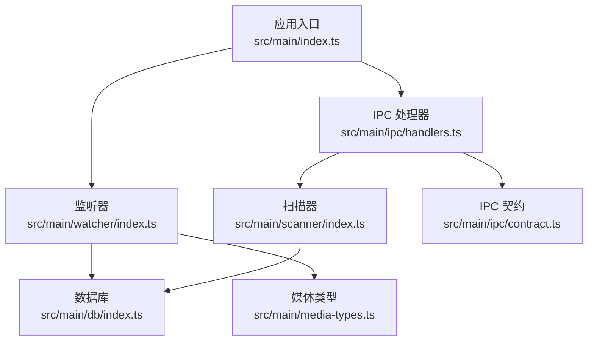
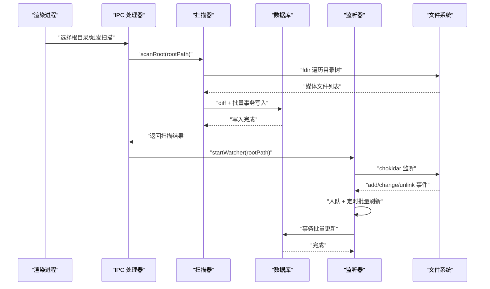
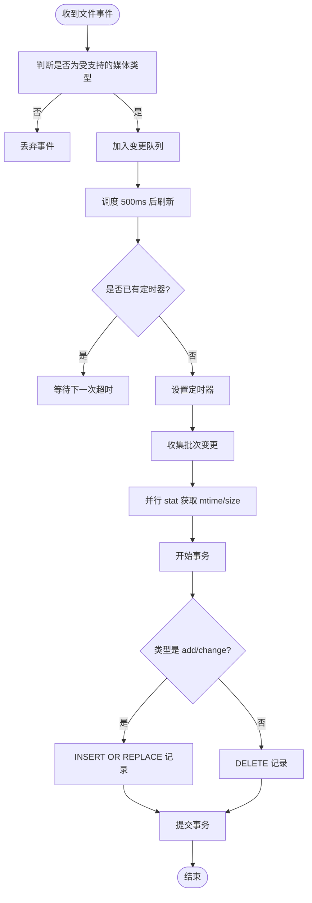
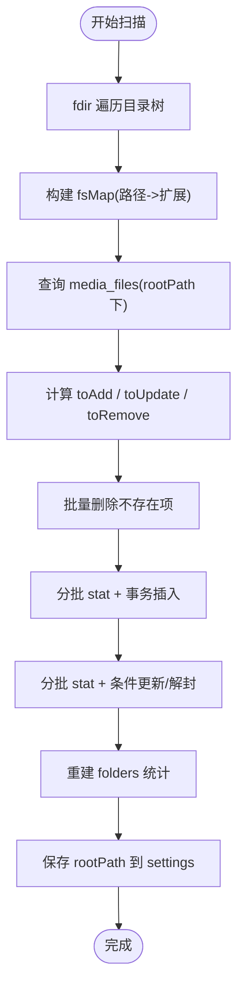
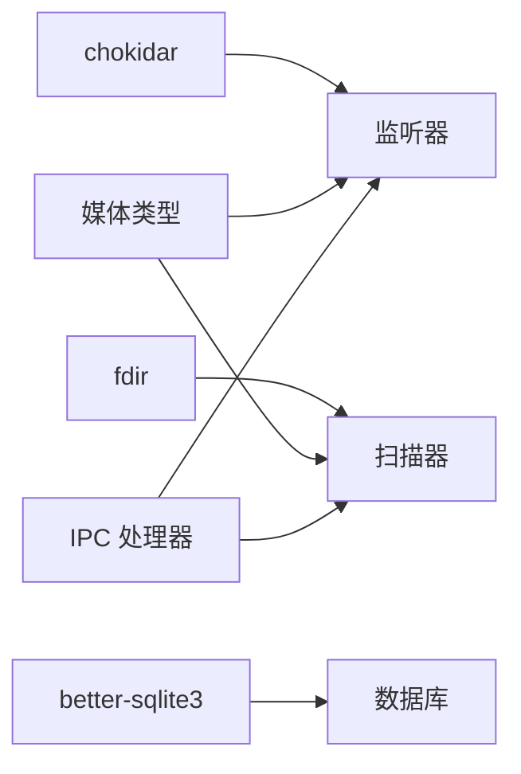

# 文件系统监听器

<cite>
**本文引用的文件**   
- [src/main/watcher/index.ts](file://src/main/watcher/index.ts)
- [src/main/scanner/index.ts](file://src/main/scanner/index.ts)
- [src/main/media-types.ts](file://src/main/media-types.ts)
- [src/main/db/index.ts](file://src/main/db/index.ts)
- [src/main/ipc/handlers.ts](file://src/main/ipc/handlers.ts)
- [src/main/ipc/contract.ts](file://src/main/ipc/contract.ts)
- [src/main/index.ts](file://src/main/index.ts)
- [package.json](file://package.json)
</cite>

## 目录
1. [简介](#简介)
2. [项目结构](#项目结构)
3. [核心组件](#核心组件)
4. [架构总览](#架构总览)
5. [详细组件分析](#详细组件分析)
6. [依赖关系分析](#依赖关系分析)
7. [性能考量](#性能考量)
8. [故障排查指南](#故障排查指南)
9. [结论](#结论)
10. [附录：使用示例与扩展指南](#附录使用示例与扩展指南)

## 简介
本文件为 Serendip 应用的主进程“文件系统监听器”提供系统化文档。该监听器基于 chokidar 实现，负责在媒体根目录下实时检测文件的增、删、改事件，并通过批量去重与事务写入将变更同步到本地 SQLite 数据库（better-sqlite3）。同时，它与扫描器协同工作：首次启动或用户选择根目录时执行增量扫描，随后开启监听器以维持库的实时一致性。

## 项目结构
与监听器相关的代码主要位于主进程模块中，围绕以下职责划分：
- 监听器：封装 chokidar 实例、事件入队、定时批量刷新、数据库事务更新
- 扫描器：一次性遍历目录树并计算差异，完成初始入库与增量更新
- 媒体类型：统一过滤支持的图片/视频扩展名
- 数据库：WAL 模式、迁移与表结构
- IPC 接口：暴露选择根目录、扫描、进度推送等能力
- 应用入口：启动流程中自动扫描并启动监听器

图表来源
- [src/main/index.ts:93-125](file://src/main/index.ts#L93-L125)
- [src/main/ipc/handlers.ts:40-60](file://src/main/ipc/handlers.ts#L40-L60)
- [src/main/watcher/index.ts:16-37](file://src/main/watcher/index.ts#L16-L37)
- [src/main/scanner/index.ts:36-56](file://src/main/scanner/index.ts#L36-L56)
- [src/main/media-types.ts:32-37](file://src/main/media-types.ts#L32-L37)
- [src/main/db/index.ts:1-28](file://src/main/db/index.ts#L1-L28)
- [src/main/ipc/contract.ts:84-130](file://src/main/ipc/contract.ts#L84-L130)

章节来源
- [src/main/index.ts:93-125](file://src/main/index.ts#L93-L125)
- [src/main/ipc/handlers.ts:40-60](file://src/main/ipc/handlers.ts#L40-L60)
- [src/main/watcher/index.ts:16-37](file://src/main/watcher/index.ts#L16-L37)
- [src/main/scanner/index.ts:36-56](file://src/main/scanner/index.ts#L36-L56)
- [src/main/media-types.ts:32-37](file://src/main/media-types.ts#L32-L37)
- [src/main/db/index.ts:1-28](file://src/main/db/index.ts#L1-L28)
- [src/main/ipc/contract.ts:84-130](file://src/main/ipc/contract.ts#L84-L130)

## 核心组件
- 监听器（watcher）
  - 基于 chokidar 创建 FSWatcher，监听 add/change/unlink 三类事件
  - 对事件进行媒体类型预过滤、入队与定时批量刷新
  - 通过 better-sqlite3 的事务批量插入/更新/删除
- 扫描器（scanner）
  - 使用 fdir 高性能遍历目录树，过滤支持扩展名
  - 与数据库现有记录做 diff，批量写入新增/更新/删除
  - 重建文件夹统计并持久化根路径设置
- 媒体类型（media-types）
  - 维护图片/视频扩展集合与类型判定函数
- 数据库（db）
  - 初始化 better-sqlite3，启用 WAL 模式与必要 pragma
  - 执行 schema 迁移，包含 media_files、folders 等表
- IPC 层（ipc）
  - 暴露选择根目录、扫描、获取当前根目录、统计等 API
  - 扫描完成后自动启动监听器
- 应用入口（main/index.ts）
  - 应用就绪后读取已保存根目录，静默扫描并启动监听器
  - 退出时停止监听器并关闭数据库

章节来源
- [src/main/watcher/index.ts:16-37](file://src/main/watcher/index.ts#L16-L37)
- [src/main/watcher/index.ts:66-116](file://src/main/watcher/index.ts#L66-L116)
- [src/main/scanner/index.ts:36-56](file://src/main/scanner/index.ts#L36-L56)
- [src/main/scanner/index.ts:245-268](file://src/main/scanner/index.ts#L245-L268)
- [src/main/media-types.ts:32-37](file://src/main/media-types.ts#L32-L37)
- [src/main/db/index.ts:1-28](file://src/main/db/index.ts#L1-L28)
- [src/main/ipc/handlers.ts:52-60](file://src/main/ipc/handlers.ts#L52-L60)
- [src/main/index.ts:104-118](file://src/main/index.ts#L104-L118)

## 架构总览
下图展示了从用户操作到数据库更新的完整链路，包括首次扫描与后续实时监听两条路径。

图表来源
- [src/main/ipc/handlers.ts:52-60](file://src/main/ipc/handlers.ts#L52-L60)
- [src/main/scanner/index.ts:36-56](file://src/main/scanner/index.ts#L36-L56)
- [src/main/scanner/index.ts:245-268](file://src/main/scanner/index.ts#L245-L268)
- [src/main/watcher/index.ts:16-37](file://src/main/watcher/index.ts#L16-L37)
- [src/main/watcher/index.ts:66-116](file://src/main/watcher/index.ts#L66-L116)
- [src/main/db/index.ts:1-28](file://src/main/db/index.ts#L1-L28)

## 详细组件分析

### 监听器（watcher）
- 生命周期管理
  - startWatcher(rootPath)：停止旧实例，创建 chokidar 实例，绑定 add/change/unlink/error 事件
  - stopWatcher()：清理定时器、关闭 watcher、清空队列
- 事件处理与批处理
  - queueChange(change)：仅保留媒体类型文件；入队并调度 flush
  - scheduleFlush()：防抖 500ms，避免高频事件抖动
  - flushChanges()：批量 stat 获取 mtime/size；按类型分别 INSERT OR REPLACE 或 DELETE；包裹在事务中执行
- 忽略规则与平台适配
  - ignored 配置排除隐藏目录、node_modules、缓存目录、系统卷信息、回收站等
  - awaitWriteFinish 降低写入风暴带来的重复事件
- 错误处理
  - error 事件打印日志
  - stat 失败的文件跳过，避免中断批量流程

图表来源
- [src/main/watcher/index.ts:16-37](file://src/main/watcher/index.ts#L16-L37)
- [src/main/watcher/index.ts:52-64](file://src/main/watcher/index.ts#L52-L64)
- [src/main/watcher/index.ts:66-116](file://src/main/watcher/index.ts#L66-L116)

章节来源
- [src/main/watcher/index.ts:16-37](file://src/main/watcher/index.ts#L16-L37)
- [src/main/watcher/index.ts:52-64](file://src/main/watcher/index.ts#L52-L64)
- [src/main/watcher/index.ts:66-116](file://src/main/watcher/index.ts#L66-L116)

### 扫描器（scanner）
- 扫描策略
  - 使用 fdir 异步遍历，过滤出图片/视频
  - 加载数据库中 rootPath 下的所有记录，构建 Map
  - 计算 toAdd/toUpdate/toRemove 三集合
- 批量写入
  - 删除：IN 占位符批量删除
  - 新增：分批 stat + 事务插入
  - 更新：分批 stat，比较 mtime/size，必要时 UPDATE；若之前标记 unavailable 但 mtime/size 未变则解封
- 辅助逻辑
  - rebuildFolderStats：重建 folders 表的层级与计数
  - escapeLike：转义 LIKE 中的特殊字符，兼容 Windows 路径反斜杠

图表来源
- [src/main/scanner/index.ts:36-56](file://src/main/scanner/index.ts#L36-L56)
- [src/main/scanner/index.ts:245-268](file://src/main/scanner/index.ts#L245-L268)
- [src/main/scanner/index.ts:274-317](file://src/main/scanner/index.ts#L274-L317)

章节来源
- [src/main/scanner/index.ts:36-56](file://src/main/scanner/index.ts#L36-L56)
- [src/main/scanner/index.ts:245-268](file://src/main/scanner/index.ts#L245-L268)
- [src/main/scanner/index.ts:274-317](file://src/main/scanner/index.ts#L274-L317)

### 媒体类型（media-types）
- 维护 IMAGE_EXTENSIONS 与 VIDEO_EXTENSIONS 两个 Set
- getMediaType(ext) 根据扩展名返回 'image' | 'video' | null
- 监听器与扫描器均依赖此函数进行快速过滤

章节来源
- [src/main/media-types.ts:6-16](file://src/main/media-types.ts#L6-L16)
- [src/main/media-types.ts:19-25](file://src/main/media-types.ts#L19-L25)
- [src/main/media-types.ts:32-37](file://src/main/media-types.ts#L32-L37)

### 数据库（db）
- 初始化与优化
  - 使用 app.getPath('userData') 定位数据库文件
  - 启用 WAL 模式、NORMAL 同步、外键约束
- 迁移
  - 包含 media_files、folders、categories、canvas 相关表及索引
  - 支持 unavailable 字段用于标记失效文件

章节来源
- [src/main/db/index.ts:1-28](file://src/main/db/index.ts#L1-L28)
- [src/main/db/index.ts:37-189](file://src/main/db/index.ts#L37-L189)

### IPC 层（ipc）
- 关键接口
  - SELECT_ROOT：打开目录选择对话框
  - SCAN_ROOT：执行扫描并推送进度，完成后启动监听器
  - GET_CURRENT_ROOT：读取 settings.rootPath
  - 其他业务接口（推荐、分类、画布等）
- 与监听器的集成
  - 扫描完成后调用 startWatcher(rootPath)

章节来源
- [src/main/ipc/handlers.ts:40-60](file://src/main/ipc/handlers.ts#L40-L60)
- [src/main/ipc/contract.ts:84-130](file://src/main/ipc/contract.ts#L84-L130)

### 应用入口（main/index.ts）
- 启动流程
  - 注册协议、创建窗口、初始化数据库与缩略图协议、注册 IPC
  - 读取 settings.rootPath，若存在则静默扫描并启动监听器
- 退出流程
  - 停止监听器、关闭数据库

章节来源
- [src/main/index.ts:93-125](file://src/main/index.ts#L93-L125)
- [src/main/index.ts:127-133](file://src/main/index.ts#L127-L133)

## 依赖关系分析
- 外部依赖
  - chokidar：跨平台文件系统事件监听
  - fdir：高性能目录遍历
  - better-sqlite3：嵌入式数据库，WAL 模式提升并发
- 内部依赖
  - 监听器依赖媒体类型与数据库
  - 扫描器依赖 fdir、媒体类型与数据库
  - IPC 处理器协调扫描与监听器

图表来源
- [package.json:23-42](file://package.json#L23-L42)
- [src/main/watcher/index.ts:1-6](file://src/main/watcher/index.ts#L1-L6)
- [src/main/scanner/index.ts:1-6](file://src/main/scanner/index.ts#L1-L6)
- [src/main/db/index.ts:1-4](file://src/main/db/index.ts#L1-L4)

章节来源
- [package.json:23-42](file://package.json#L23-L42)
- [src/main/watcher/index.ts:1-6](file://src/main/watcher/index.ts#L1-L6)
- [src/main/scanner/index.ts:1-6](file://src/main/scanner/index.ts#L1-L6)
- [src/main/db/index.ts:1-4](file://src/main/db/index.ts#L1-L4)

## 性能考量
- 事件去重与防抖
  - 监听器使用 500ms 定时器批量刷新，减少频繁 IO 与 SQL 开销
  - chokidar 的 awaitWriteFinish 合并连续写入事件，降低抖动
- 批量处理
  - 扫描器采用分批 stat + 事务写入，避免单条插入的性能瓶颈
  - 监听器批量 stat 后在单个事务内完成多行写入
- 内存控制
  - 变更队列仅在内存中暂存，flush 后即清空
  - 扫描器使用 Map 存储 fs/db 映射，避免全量对象持有
- 数据库优化
  - WAL 模式提升读写并发
  - 合理索引（folder_path、type、liked/disliked、unavailable 等）加速查询

[本节为通用性能建议，不直接分析具体文件]

## 故障排查指南
- 权限不足
  - 现象：stat 失败或无法写入数据库
  - 处理：确保应用对媒体根目录具有读权限；数据库文件位于 userData 目录，需可写
- 路径失效
  - 现象：文件被移动或删除导致 stat 失败
  - 处理：监听器在 flush 阶段捕获异常并跳过；扫描器在 diff 阶段识别缺失并删除
- 系统限制
  - 现象：大量文件变更导致事件风暴
  - 处理：awaitWriteFinish 与 500ms 批量刷新有效抑制；必要时调整阈值
- 平台差异
  - Windows：路径含反斜杠，LIKE 查询需转义；System Volume Information 与 $RECYCLE.BIN 默认忽略
  - macOS/Linux：遵循 chokidar 原生行为，注意隐藏目录与符号链接
- 日志与调试
  - 监听器 error 事件输出日志；flush 成功会打印处理数量
  - 可通过 IPC 获取扫描进度，观察 walking/diffing/inserting/done 阶段

章节来源
- [src/main/watcher/index.ts:32-37](file://src/main/watcher/index.ts#L32-L37)
- [src/main/watcher/index.ts:66-116](file://src/main/watcher/index.ts#L66-L116)
- [src/main/scanner/index.ts:274-317](file://src/main/scanner/index.ts#L274-L317)
- [src/main/ipc/handlers.ts:52-60](file://src/main/ipc/handlers.ts#L52-L60)

## 结论
Serendip 的文件系统监听器以 chokidar 为核心，结合批量去重、事务写入与 WAL 数据库优化，实现了高效稳定的实时库同步。配合扫描器的增量 diff 机制，系统在首次启动与后续运行中都能保持数据一致性与良好性能。通过合理的忽略规则与错误处理，系统在不同平台上具备较好的鲁棒性。

[本节为总结性内容，不直接分析具体文件]

## 附录：使用示例与扩展指南

### 基本用法：注册监听器与处理事件
- 选择根目录并扫描
  - 通过 IPC 调用 SELECT_ROOT 选择目录
  - 调用 SCAN_ROOT 执行扫描，完成后自动启动监听器
- 监听器内部处理
  - 接收 add/change/unlink 事件
  - 过滤媒体类型，入队并在 500ms 后批量刷新
  - 批量 stat 后在事务中更新数据库

章节来源
- [src/main/ipc/handlers.ts:40-60](file://src/main/ipc/handlers.ts#L40-L60)
- [src/main/watcher/index.ts:16-37](file://src/main/watcher/index.ts#L16-L37)
- [src/main/watcher/index.ts:66-116](file://src/main/watcher/index.ts#L66-L116)

### 监听配置选项
- 监控目录范围
  - rootPath 由用户选择并持久化，监听器仅在该根目录下生效
- 忽略规则
  - 隐藏目录、node_modules、缓存目录、系统卷信息、回收站等
- 事件过滤
  - 仅处理图片/视频扩展名
- 写入稳定性
  - awaitWriteFinish 参数降低写入风暴影响

章节来源
- [src/main/watcher/index.ts:19-30](file://src/main/watcher/index.ts#L19-L30)
- [src/main/media-types.ts:32-37](file://src/main/media-types.ts#L32-L37)

### 错误处理机制
- 权限不足：stat 失败跳过；数据库不可写需检查 userData 权限
- 路径失效：unlink 事件触发删除；stat 失败跳过
- 系统限制：事件风暴通过批量刷新与 awaitWriteFinish 缓解

章节来源
- [src/main/watcher/index.ts:32-37](file://src/main/watcher/index.ts#L32-37)
- [src/main/watcher/index.ts:66-116](file://src/main/watcher/index.ts#L66-116)

### 定制与扩展指导
- 扩展媒体类型
  - 在媒体类型模块中添加新的扩展名集合与判定逻辑
- 自定义忽略规则
  - 在监听器初始化时扩展 ignored 数组，增加目录或正则匹配
- 调整批处理策略
  - 修改 flush 定时器间隔或批量大小，平衡实时性与性能
- 接入外部通知
  - 在 flushChanges 成功后通过 IPC 向渲染层广播变更摘要

章节来源
- [src/main/media-types.ts:6-16](file://src/main/media-types.ts#L6-L16)
- [src/main/media-types.ts:19-25](file://src/main/media-types.ts#L19-L25)
- [src/main/watcher/index.ts:19-30](file://src/main/watcher/index.ts#L19-L30)
- [src/main/watcher/index.ts:66-116](file://src/main/watcher/index.ts#L66-L116)