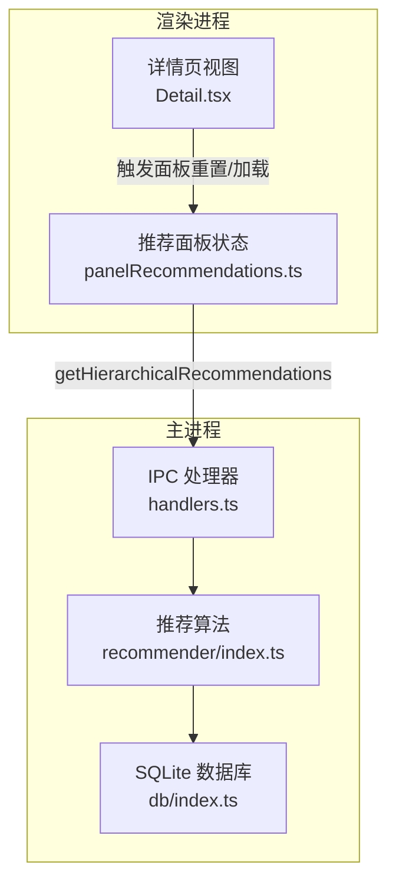
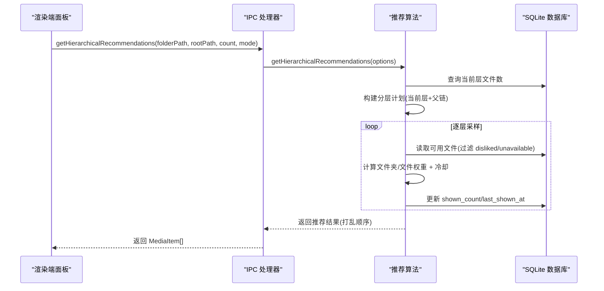
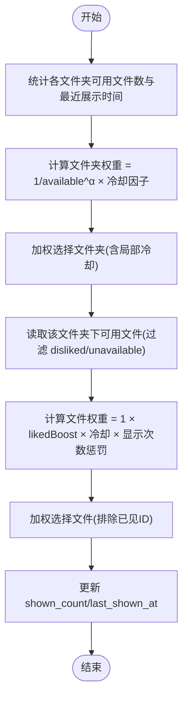
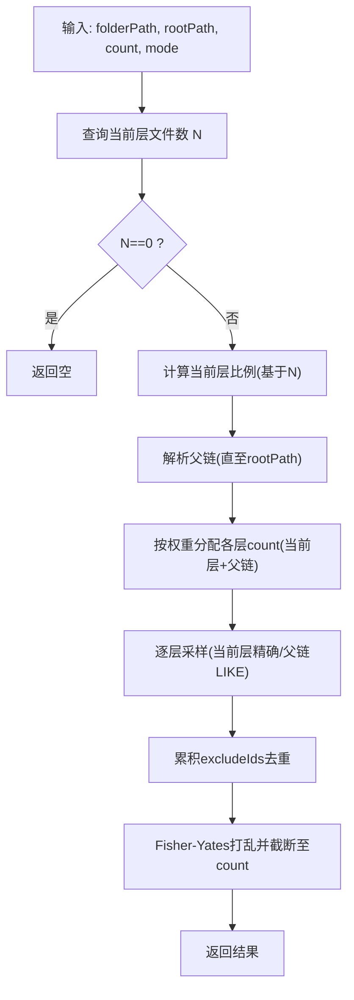
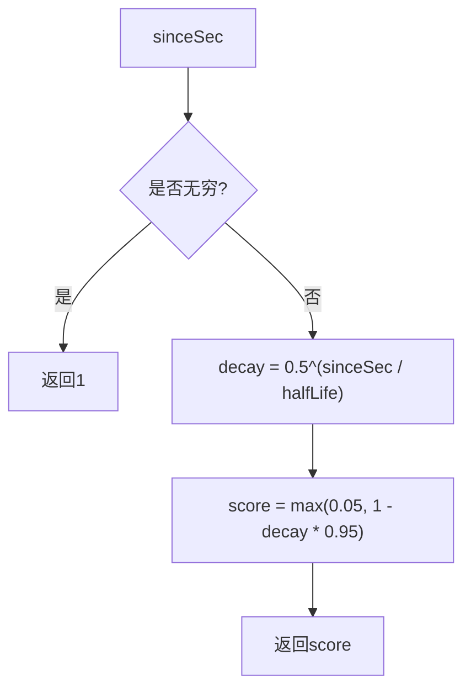
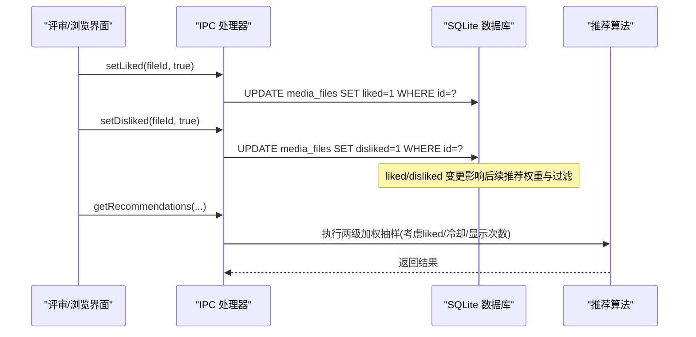

# 智能推荐系统

<cite>
**本文引用的文件**   
- [src/main/recommender/index.ts](file://src/main/recommender/index.ts)
- [src/renderer/src/stores/panelRecommendations.ts](file://src/renderer/src/stores/panelRecommendations.ts)
- [src/main/ipc/handlers.ts](file://src/main/ipc/handlers.ts)
- [src/main/ipc/contract.ts](file://src/main/ipc/contract.ts)
- [src/main/db/index.ts](file://src/main/db/index.ts)
- [src/renderer/src/views/Detail.tsx](file://src/renderer/src/views/Detail.tsx)
</cite>

## 目录
1. [简介](#简介)
2. [项目结构](#项目结构)
3. [核心组件](#核心组件)
4. [架构总览](#架构总览)
5. [详细组件分析](#详细组件分析)
6. [依赖关系分析](#依赖关系分析)
7. [性能与缓存策略](#性能与缓存策略)
8. [参数配置指南](#参数配置指南)
9. [API 接口说明与使用示例](#api-接口说明与使用示例)
10. [故障排查](#故障排查)
11. [结论](#结论)

## 简介
本文件面向开发者，系统化阐述 Serendip 应用的智能推荐系统。重点覆盖：
- 两级加权抽样算法：文件夹级权重计算、文件级权重调整机制
- 权重计算公式：文件夹大小抑制、显示历史冷却、用户偏好学习（点赞）等
- 冷却机制：防止重复推荐已显示内容
- 用户反馈收集与处理：点赞/点踩对权重的影响路径
- 推荐参数配置：权重系数、冷却时间、探索模式
- 结果缓存与性能优化技巧
- API 接口说明与调用示例
- 算法调优与新策略扩展指导

## 项目结构
推荐系统由主进程算法模块、IPC 通道、数据库层以及渲染端面板状态管理共同组成。关键文件职责如下：
- 主进程推荐算法：实现两级加权抽样、分层路径推荐、冷却与模式参数
- IPC 处理器：暴露推荐、点赞/点踩等能力给渲染进程
- 数据库迁移：定义媒体文件表、索引及失效标记字段
- 渲染端面板：维护推荐列表、分页加载、去重与取消请求

图表来源
- [src/renderer/src/stores/panelRecommendations.ts:1-128](file://src/renderer/src/stores/panelRecommendations.ts#L1-L128)
- [src/renderer/src/views/Detail.tsx:212-250](file://src/renderer/src/views/Detail.tsx#L212-L250)
- [src/main/ipc/handlers.ts:83-91](file://src/main/ipc/handlers.ts#L83-L91)
- [src/main/recommender/index.ts:57-149](file://src/main/recommender/index.ts#L57-L149)
- [src/main/db/index.ts:54-77](file://src/main/db/index.ts#L54-L77)

章节来源
- [src/main/recommender/index.ts:1-518](file://src/main/recommender/index.ts#L1-L518)
- [src/renderer/src/stores/panelRecommendations.ts:1-128](file://src/renderer/src/stores/panelRecommendations.ts#L1-L128)
- [src/main/ipc/handlers.ts:83-91](file://src/main/ipc/handlers.ts#L83-L91)
- [src/main/db/index.ts:54-77](file://src/main/db/index.ts#L54-L77)

## 核心组件
- 推荐算法模块
  - 两级加权抽样：先按文件夹权重选文件夹，再在文件夹内按文件权重选文件
  - 分层路径推荐：以当前路径为锚点，逐级向上放宽采样范围
  - 冷却函数：基于半衰期的衰减，避免短时间内重复推荐
  - 模式参数：prefer/balanced/explore 三种探索程度，控制偏好与探索的平衡
- IPC 处理器
  - 提供获取推荐、分层推荐、设置喜欢/不感兴趣等接口
- 数据库层
  - media_files 表包含 liked/disliked/shown_count/last_shown_at/unavailable 等字段，用于权重与冷却计算
- 渲染端面板
  - 维护推荐列表、分页加载、去重、取消请求、防抖初始加载

章节来源
- [src/main/recommender/index.ts:57-149](file://src/main/recommender/index.ts#L57-L149)
- [src/main/recommender/index.ts:155-206](file://src/main/recommender/index.ts#L155-L206)
- [src/main/recommender/index.ts:454-460](file://src/main/recommender/index.ts#L454-L460)
- [src/main/recommender/index.ts:471-504](file://src/main/recommender/index.ts#L471-L504)
- [src/main/ipc/handlers.ts:83-125](file://src/main/ipc/handlers.ts#L83-L125)
- [src/main/db/index.ts:54-77](file://src/main/db/index.ts#L54-L77)
- [src/renderer/src/stores/panelRecommendations.ts:21-128](file://src/renderer/src/stores/panelRecommendations.ts#L21-L128)

## 架构总览
推荐系统采用“渲染端发起 → IPC 转发 → 主进程算法 → 数据库读写”的分层架构。

图表来源
- [src/main/ipc/handlers.ts:83-91](file://src/main/ipc/handlers.ts#L83-L91)
- [src/main/recommender/index.ts:155-206](file://src/main/recommender/index.ts#L155-L206)
- [src/main/recommender/index.ts:211-274](file://src/main/recommender/index.ts#L211-L274)
- [src/main/recommender/index.ts:279-359](file://src/main/recommender/index.ts#L279-L359)
- [src/main/recommender/index.ts:394-448](file://src/main/recommender/index.ts#L394-L448)
- [src/main/recommender/index.ts:136-146](file://src/main/recommender/index.ts#L136-L146)

## 详细组件分析

### 两级加权抽样算法
- 文件夹级权重
  - 基础权重：1 / available_count^α，其中 α 为文件夹抑制系数，用于抑制大文件夹虹吸效应
  - 冷却因子：根据 last_shown_at 计算 sinceSec，使用半衰期衰减 computeCooldown(halfLife)，限制近期被抽过的文件夹
  - 局部冷却：同批次内多次抽取同一文件夹会进一步降权
- 文件级权重
  - 基础权重：1
  - 偏好加成：若 liked=1，乘以 likedBoost
  - 冷却因子：基于 fileCooldownHalfLifeSec 的半衰期衰减
  - 显示次数惩罚：1 / (1 + shown_count)^penalty，鼓励发现新内容
- 抽样流程
  - 循环尝试最多 count*3 次，直到凑齐 count 条或无候选
  - 每批结果更新 shown_count 和 last_shown_at

图表来源
- [src/main/recommender/index.ts:78-113](file://src/main/recommender/index.ts#L78-L113)
- [src/main/recommender/index.ts:364-389](file://src/main/recommender/index.ts#L364-L389)
- [src/main/recommender/index.ts:394-448](file://src/main/recommender/index.ts#L394-L448)
- [src/main/recommender/index.ts:136-146](file://src/main/recommender/index.ts#L136-L146)

章节来源
- [src/main/recommender/index.ts:57-149](file://src/main/recommender/index.ts#L57-L149)
- [src/main/recommender/index.ts:364-389](file://src/main/recommender/index.ts#L364-L389)
- [src/main/recommender/index.ts:394-448](file://src/main/recommender/index.ts#L394-L448)
- [src/main/recommender/index.ts:454-460](file://src/main/recommender/index.ts#L454-L460)

### 分层路径推荐
- 目标：以当前路径为锚点，兼顾当前层与父链层的多样性
- 策略：
  - 当前层比例随文件数 N 变化：N≤2 时 0%，N≤15 时 25%，N≤50 时 35%，N≤200 时 45%，否则 50%
  - 父链分配：前几层按固定权重递减（如 60%/25%/15%），余量归最后一层
  - 当前层精确匹配 folder_path；父链层使用 LIKE 前缀递归采样
  - 最终结果 Fisher-Yates 打乱，避免层级感

图表来源
- [src/main/recommender/index.ts:155-206](file://src/main/recommender/index.ts#L155-L206)
- [src/main/recommender/index.ts:211-274](file://src/main/recommender/index.ts#L211-L274)
- [src/main/recommender/index.ts:279-359](file://src/main/recommender/index.ts#L279-L359)

章节来源
- [src/main/recommender/index.ts:155-206](file://src/main/recommender/index.ts#L155-L206)
- [src/main/recommender/index.ts:211-274](file://src/main/recommender/index.ts#L211-L274)

### 冷却机制
- 半衰期衰减：sinceSec 越小，返回值越接近 0；时间越长越接近 1
- 裁剪范围：[0.05, 1]，确保刚展示过的内容仍有极低概率被再次选中
- 应用位置：
  - 文件夹级：folderCooldownHalfLifeSec
  - 文件级：fileCooldownHalfLifeSec
  - 同批次文件夹局部冷却：localCooldownDecay

图表来源
- [src/main/recommender/index.ts:454-460](file://src/main/recommender/index.ts#L454-L460)

章节来源
- [src/main/recommender/index.ts:454-460](file://src/main/recommender/index.ts#L454-L460)

### 用户反馈收集与处理
- 点赞/点踩行为通过 IPC 写入数据库：
  - setLiked(fileId, true/false)
  - setDisliked(fileId, true/false)
- 对推荐的影响：
  - liked=1 的文件在文件级权重上获得 likedBoost 加成
  - disliked=1 的文件在筛选阶段被排除（disliked=0 条件）
  - shown_count 与 last_shown_at 在每次推荐后递增/更新，参与后续冷却与惩罚计算

图表来源
- [src/main/ipc/handlers.ts:94-125](file://src/main/ipc/handlers.ts#L94-L125)
- [src/main/recommender/index.ts:394-448](file://src/main/recommender/index.ts#L394-L448)

章节来源
- [src/main/ipc/handlers.ts:94-125](file://src/main/ipc/handlers.ts#L94-L125)
- [src/main/recommender/index.ts:394-448](file://src/main/recommender/index.ts#L394-L448)

### 渲染端面板状态管理
- 功能要点：
  - 初始化时防抖 200ms 后加载首批数据
  - 滚动触底加载更多，支持 AbortController 取消旧请求
  - 本地 _seenIds 去重，避免重复追加
  - 从 UI 状态读取 exploreMode 传递给后端

章节来源
- [src/renderer/src/stores/panelRecommendations.ts:21-128](file://src/renderer/src/stores/panelRecommendations.ts#L21-L128)
- [src/renderer/src/views/Detail.tsx:212-250](file://src/renderer/src/views/Detail.tsx#L212-L250)

## 依赖关系分析
- 模块耦合
  - 推荐算法依赖数据库层进行统计与更新
  - IPC 处理器作为桥接层，将渲染端请求映射到算法与数据库操作
  - 渲染端仅持有轻量状态与去重集合，复杂逻辑集中在主进程
- 外部依赖
  - better-sqlite3：高性能 SQLite 驱动
  - Electron IPC：跨进程通信
- 潜在风险
  - 大量文件场景下，单次读取全量候选可能带来内存压力，建议结合分页或流式处理
  - 频繁更新 shown_count/last_shown_at 可能产生写放大，可考虑批量合并或延迟落库

图表来源
- [src/main/ipc/handlers.ts:83-91](file://src/main/ipc/handlers.ts#L83-L91)
- [src/main/recommender/index.ts:57-149](file://src/main/recommender/index.ts#L57-L149)
- [src/main/db/index.ts:1-28](file://src/main/db/index.ts#L1-L28)

章节来源
- [src/main/ipc/handlers.ts:83-91](file://src/main/ipc/handlers.ts#L83-L91)
- [src/main/recommender/index.ts:57-149](file://src/main/recommender/index.ts#L57-L149)
- [src/main/db/index.ts:1-28](file://src/main/db/index.ts#L1-L28)

## 性能与缓存策略
- 数据库层面
  - WAL 模式与 NORMAL 同步策略提升并发性能
  - 针对 folder_path、type、liked、disliked、last_shown_at、unavailable 建立索引，加速过滤与排序
- 算法层面
  - 两级抽样减少全局扫描范围
  - 同批次内 localFolderShown 降低重复文件夹选择概率
  - excludeIds 与 seenInThisBatch 双重去重，避免重复输出
- 渲染端
  - 防抖初始加载与滚动触底增量加载
  - AbortController 取消过期请求，避免竞态
- 建议优化
  - 对超大文件夹采用分块抽样或游标分页
  - 将 shown_count/last_shown_at 的更新合并为批量事务
  - 引入短期内存缓存（TTL）以减少重复 IO

章节来源
- [src/main/db/index.ts:19-27](file://src/main/db/index.ts#L19-L27)
- [src/main/db/index.ts:73-77](file://src/main/db/index.ts#L73-L77)
- [src/main/recommender/index.ts:117-134](file://src/main/recommender/index.ts#L117-L134)
- [src/renderer/src/stores/panelRecommendations.ts:88-126](file://src/renderer/src/stores/panelRecommendations.ts#L88-L126)

## 参数配置指南
- 探索模式参数（默认值）
  - prefer：更偏向已喜欢内容，文件夹平均化弱，冷却较弱
  - balanced：均衡偏好与探索
  - explore：强调探索，文件夹高度均权，冷却强，liked 不加成
- 可调参数
  - folderAlpha：文件夹权重抑制系数，越大越抑制大文件夹
  - folderCooldownHalfLifeSec：文件夹冷却半衰期（秒）
  - fileCooldownHalfLifeSec：文件冷却半衰期（秒）
  - likedBoost：点赞加成倍数
  - shownCountPenalty：显示次数惩罚指数
  - localCooldownDecay：同批次文件夹局部冷却衰减
- 分层计划参数
  - 当前层比例阈值：依据当前层文件数 N 分段设定
  - 父链权重分配：前几层固定权重递减，余量归最后一层
- 调优建议
  - 若出现“大文件夹虹吸”，增大 folderAlpha 或提高 shownCountPenalty
  - 若重复推荐明显，增大 fileCooldownHalfLifeSec 或 localCooldownDecay
  - 若偏好不够突出，适当增大 likedBoost

章节来源
- [src/main/recommender/index.ts:471-504](file://src/main/recommender/index.ts#L471-L504)
- [src/main/recommender/index.ts:211-274](file://src/main/recommender/index.ts#L211-L274)

## API 接口说明与使用示例
- 获取推荐内容
  - 方法：getRecommendations(count, mode, onlyUnrated?, scopePath?)
  - 用途：通用推荐，支持仅未评级与限定路径范围
- 获取分层推荐内容
  - 方法：getHierarchicalRecommendations(folderPath, rootPath, count, mode)
  - 用途：详情页右侧面板，按当前层与父链分层采样
- 设置喜欢/不感兴趣
  - 方法：setLiked(fileId, liked), setDisliked(fileId, disliked)
  - 用途：记录用户偏好，影响后续推荐权重与过滤
- 批量操作
  - 方法：setLikedBatch(fileIds, liked), setDislikedBatch(fileIds, disliked)
  - 用途：多选模式下批量更新偏好
- 其他相关
  - listLiked()：列出所有 liked=1 且未失效的文件
  - markUnavailable(fileId, reason)：标记文件失效（删除/损坏/缩略图失败）

使用示例（概念性步骤）
- 打开详情页时，传入当前文件的 folder_path 与 rootPath，调用分层推荐接口获取面板内容
- 用户滑动点赞/点踩，调用对应接口更新偏好
- 滚动触底时，继续调用分层推荐接口追加更多条目，并在渲染端做去重

章节来源
- [src/main/ipc/contract.ts:20-36](file://src/main/ipc/contract.ts#L20-L36)
- [src/main/ipc/handlers.ts:83-125](file://src/main/ipc/handlers.ts#L83-L125)
- [src/renderer/src/stores/panelRecommendations.ts:96-126](file://src/renderer/src/stores/panelRecommendations.ts#L96-L126)
- [src/renderer/src/views/Detail.tsx:212-250](file://src/renderer/src/views/Detail.tsx#L212-L250)

## 故障排查
- 常见问题
  - 根目录未设置：推荐结果为空，需先选择根目录并扫描入库
  - 文件不可用：disliked=1 或 unavailable=1 会被过滤，检查文件是否存在或标记原因
  - 重复推荐：检查冷却半衰期与局部冷却参数，必要时增大冷却强度
  - 性能瓶颈：大数据集下注意分批与批量更新，避免频繁单条写入
- 定位手段
  - 查看数据库索引是否生效（folder_path、last_shown_at、unavailable 等）
  - 观察 IPC 日志与渲染端请求取消情况，确认无竞态
  - 评估分层计划中当前层比例是否合理，必要时调整阈值

章节来源
- [src/main/db/index.ts:73-77](file://src/main/db/index.ts#L73-L77)
- [src/main/ipc/handlers.ts:148-154](file://src/main/ipc/handlers.ts#L148-L154)
- [src/renderer/src/stores/panelRecommendations.ts:88-126](file://src/renderer/src/stores/panelRecommendations.ts#L88-L126)

## 结论
Serendip 的智能推荐系统通过两级加权抽样与分层路径策略，有效平衡了“偏好”与“探索”。配合冷却机制与用户反馈，系统在避免重复推荐的同时逐步学习用户兴趣。通过合理的参数调优与性能优化，可在大规模媒体库中保持流畅体验。未来可扩展方向包括：
- 引入更细粒度的用户行为信号（停留时长、缩放、收藏分类）
- 基于上下文的路径感知（时间、设备、主题）
- 在线学习与离线训练结合的混合策略