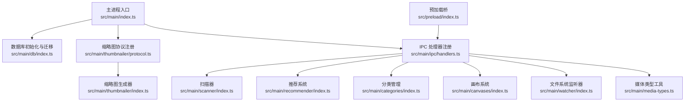
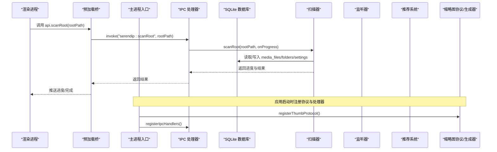
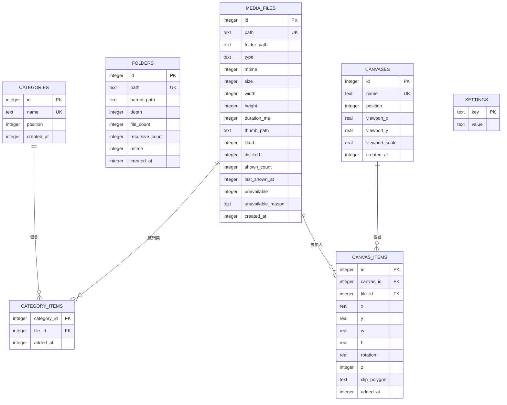
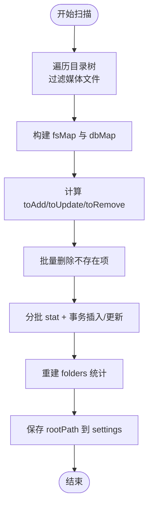
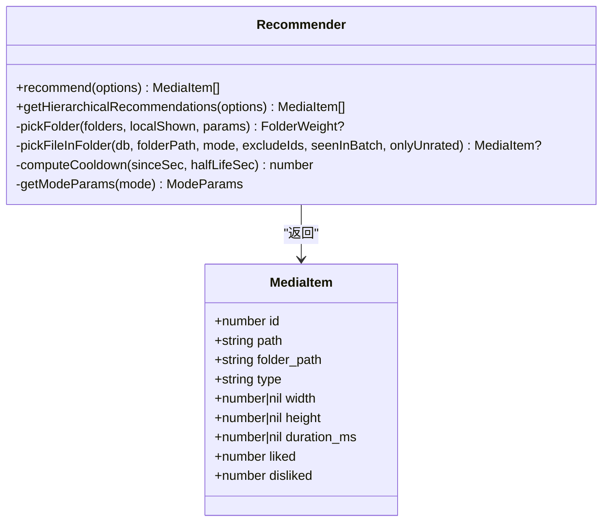
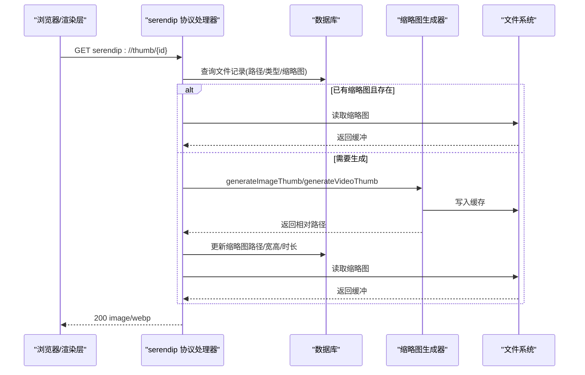
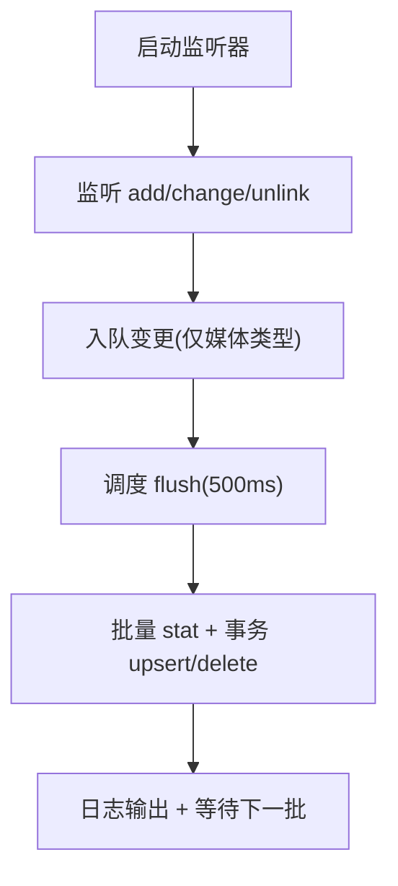
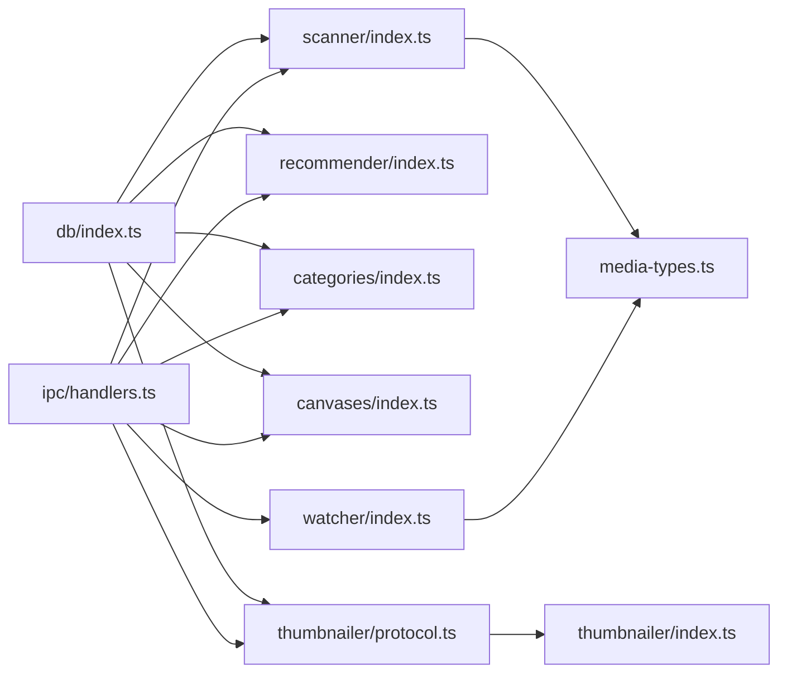

# 核心模块

<cite>
**本文引用的文件**   
- [src/main/index.ts](file://src/main/index.ts)
- [src/main/db/index.ts](file://src/main/db/index.ts)
- [src/main/scanner/index.ts](file://src/main/scanner/index.ts)
- [src/main/recommender/index.ts](file://src/main/recommender/index.ts)
- [src/main/thumbnailer/index.ts](file://src/main/thumbnailer/index.ts)
- [src/main/thumbnailer/protocol.ts](file://src/main/thumbnailer/protocol.ts)
- [src/main/watcher/index.ts](file://src/main/watcher/index.ts)
- [src/main/categories/index.ts](file://src/main/categories/index.ts)
- [src/main/canvases/index.ts](file://src/main/canvases/index.ts)
- [src/main/ipc/handlers.ts](file://src/main/ipc/handlers.ts)
- [src/main/ipc/contract.ts](file://src/main/ipc/contract.ts)
- [src/main/media-types.ts](file://src/main/media-types.ts)
- [src/preload/index.ts](file://src/preload/index.ts)
</cite>

## 目录
1. [简介](#简介)
2. [项目结构](#项目结构)
3. [核心组件](#核心组件)
4. [架构总览](#架构总览)
5. [详细组件分析](#详细组件分析)
6. [依赖关系分析](#依赖关系分析)
7. [性能考量](#性能考量)
8. [故障排查指南](#故障排查指南)
9. [结论](#结论)
10. [附录：API 契约与使用模式](#附录api-契约与使用模式)

## 简介
Serendip 是一款基于 Electron + React 的本地媒体库应用，通过智能随机算法、增量扫描、实时监听、缩略图按需生成与两级加权推荐等能力，提供“无限瀑布流”式的浏览体验。本文聚焦主进程核心模块（数据库层、文件扫描器、智能推荐系统、缩略图生成器、文件系统监听器、分类管理系统、画布系统）的职责边界、接口设计、实现细节与协作模式，并给出面向开发者的最佳实践建议。

## 项目结构
- 主进程入口负责应用生命周期管理、协议注册、IPC 处理器注册、启动时增量同步与监听器启动。
- 数据持久化由 SQLite 承担，包含媒体元数据、文件夹统计、收藏分类、画布及设置表，并提供迁移机制。
- 扫描器采用 fdir 遍历与增量 diff，批量事务写入；监听器基于 chokidar 聚合变更并批量落库。
- 推荐系统实现两级加权抽样与冷却机制，支持偏好/平衡/探索三种模式以及分层路径推荐。
- 缩略图服务通过自定义协议 serendip:// 按需生成图片/视频缩略图，并支持原图与带 Range 的视频流式响应。
- 分类与画布模块提供完整的 CRUD 与排序、关联查询能力，并通过 IPC 暴露给渲染层。

图表来源
- [src/main/index.ts:93-125](file://src/main/index.ts#L93-L125)
- [src/main/db/index.ts:8-28](file://src/main/db/index.ts#L8-L28)
- [src/main/thumbnailer/protocol.ts:33-92](file://src/main/thumbnailer/protocol.ts#L33-L92)
- [src/main/ipc/handlers.ts:40-284](file://src/main/ipc/handlers.ts#L40-L284)
- [src/main/scanner/index.ts:36-239](file://src/main/scanner/index.ts#L36-L239)
- [src/main/recommender/index.ts:57-149](file://src/main/recommender/index.ts#L57-L149)
- [src/main/categories/index.ts:21-166](file://src/main/categories/index.ts#L21-L166)
- [src/main/canvases/index.ts:76-320](file://src/main/canvases/index.ts#L76-L320)
- [src/main/watcher/index.ts:16-117](file://src/main/watcher/index.ts#L16-L117)
- [src/main/thumbnailer/index.ts:27-94](file://src/main/thumbnailer/index.ts#L27-L94)
- [src/main/media-types.ts:32-37](file://src/main/media-types.ts#L32-L37)
- [src/preload/index.ts:9-89](file://src/preload/index.ts#L9-L89)

章节来源
- [src/main/index.ts:93-125](file://src/main/index.ts#L93-L125)
- [README.md:1-66](file://README.md#L1-L66)

## 核心组件
- 数据库层：WAL 模式、外键开启、迁移脚本、索引策略覆盖常用查询路径。
- 文件扫描器：fdir 异步遍历、增量 diff、批量事务写入、文件夹统计重建。
- 智能推荐系统：两级加权抽样、冷却半衰期、探索程度参数、分层路径推荐。
- 缩略图生成器：sharp 图片处理、ffmpeg 视频抽帧、缓存目录与哈希命名。
- 文件系统监听器：chokidar 事件聚合、去重与批量 flush、增量更新。
- 分类管理系统：分类 CRUD、位置排序、多对多关联、级联删除。
- 画布系统：画布与项目 CRUD、视口持久化、尺寸自动推算与保真插入。
- IPC 桥：统一通道名与类型契约，预加载暴露 API 给渲染层。

章节来源
- [src/main/db/index.ts:19-28](file://src/main/db/index.ts#L19-L28)
- [src/main/scanner/index.ts:36-239](file://src/main/scanner/index.ts#L36-L239)
- [src/main/recommender/index.ts:57-149](file://src/main/recommender/index.ts#L57-L149)
- [src/main/thumbnailer/index.ts:27-94](file://src/main/thumbnailer/index.ts#L27-L94)
- [src/main/watcher/index.ts:16-117](file://src/main/watcher/index.ts#L16-L117)
- [src/main/categories/index.ts:21-166](file://src/main/categories/index.ts#L21-L166)
- [src/main/canvases/index.ts:76-320](file://src/main/canvases/index.ts#L76-L320)
- [src/main/ipc/contract.ts:85-130](file://src/main/ipc/contract.ts#L85-L130)
- [src/preload/index.ts:9-89](file://src/preload/index.ts#L9-L89)

## 架构总览
整体采用“主进程业务 + 渲染进程 UI + SQLite 持久化 + 文件系统 IO”的分层架构。主进程通过 IPC 暴露领域能力，渲染进程通过预加载桥调用。缩略图与原图/视频通过自定义协议按需访问，避免在渲染层直接操作磁盘。

图表来源
- [src/main/index.ts:100-118](file://src/main/index.ts#L100-L118)
- [src/main/ipc/handlers.ts:52-60](file://src/main/ipc/handlers.ts#L52-L60)
- [src/main/scanner/index.ts:36-239](file://src/main/scanner/index.ts#L36-L239)
- [src/main/thumbnailer/protocol.ts:33-92](file://src/main/thumbnailer/protocol.ts#L33-L92)

## 详细组件分析

### 数据库层设计与优化
- 存储引擎与配置
  - WAL 模式、NORMAL 同步、外键开启，提升并发读写与一致性。
- 核心表与索引
  - media_files：媒体元数据，含 liked/disliked/shown_count/last_shown_at/unavailable 等字段；索引覆盖 folder_path、type、liked、disliked、last_shown_at、unavailable。
  - folders：文件夹层级与统计，便于按目录维度参与推荐权重计算。
  - categories/category_items：收藏分类及其多对多关联，支持拖拽排序 position。
  - canvases/canvas_items：画布与项目，支持视口持久化与变换属性。
  - settings：根目录等全局设置。
- 迁移机制
  - _migrations 表记录版本，按序执行 up SQL，保证 schema 演进可追踪。

图表来源
- [src/main/db/index.ts:37-176](file://src/main/db/index.ts#L37-L176)

章节来源
- [src/main/db/index.ts:8-28](file://src/main/db/index.ts#L8-L28)
- [src/main/db/index.ts:37-176](file://src/main/db/index.ts#L37-L176)

### 文件扫描器（增量同步与性能优化）
- 流程要点
  - 使用 fdir 递归遍历，过滤隐藏/缓存/系统目录，仅保留支持的媒体扩展。
  - 构建 fsMap 与 dbMap，计算新增/更新/删除集合。
  - 分批 stat 获取 mtime/size，结合事务批量 INSERT OR REPLACE / UPDATE。
  - 对已存在但标记为 unavailable 的记录进行解封（mtime/size 未变也恢复）。
  - 重建 folders 统计，保存 rootPath 到 settings。
- 性能优化
  - 批量写入使用 transaction 包裹，减少磁盘同步开销。
  - 分批处理（BATCH_SIZE=200），降低内存峰值与单次 IO 压力。
  - LIKE 前缀匹配限定根范围，避免全库扫描。

图表来源
- [src/main/scanner/index.ts:36-239](file://src/main/scanner/index.ts#L36-L239)
- [src/main/scanner/index.ts:245-323](file://src/main/scanner/index.ts#L245-L323)

章节来源
- [src/main/scanner/index.ts:36-239](file://src/main/scanner/index.ts#L36-L239)
- [src/main/media-types.ts:32-37](file://src/main/media-types.ts#L32-L37)

### 智能推荐系统（两级加权与冷却机制）
- 两级加权
  - 第一级：按文件夹可用数量取幂抑制大文件夹虹吸效应，叠加最近显示冷却因子。
  - 第二级：在选定文件夹内按 liked 加成、冷却半衰期、显示次数惩罚进行加权抽样。
- 模式参数
  - prefer：偏好放大、冷却弱、文件夹平均化弱。
  - balanced：折中策略。
  - explore：高度均权、强冷却、不加成 liked。
- 分层路径推荐
  - 以当前路径为锚点，向上父链放宽采样，按文件数动态分配各层比例，最后 Fisher-Yates 打乱顺序。

图表来源
- [src/main/recommender/index.ts:57-149](file://src/main/recommender/index.ts#L57-L149)
- [src/main/recommender/index.ts:155-206](file://src/main/recommender/index.ts#L155-L206)
- [src/main/recommender/index.ts:454-460](file://src/main/recommender/index.ts#L454-L460)
- [src/main/recommender/index.ts:471-504](file://src/main/recommender/index.ts#L471-L504)

章节来源
- [src/main/recommender/index.ts:57-149](file://src/main/recommender/index.ts#L57-L149)
- [src/main/recommender/index.ts:155-206](file://src/main/recommender/index.ts#L155-L206)
- [src/main/recommender/index.ts:279-359](file://src/main/recommender/index.ts#L279-L359)
- [src/main/recommender/index.ts:394-448](file://src/main/recommender/index.ts#L394-L448)
- [src/main/recommender/index.ts:454-460](file://src/main/recommender/index.ts#L454-L460)
- [src/main/recommender/index.ts:471-504](file://src/main/recommender/index.ts#L471-L504)

### 缩略图生成器与协议服务
- 生成流程
  - 图片：sharp 读取元数据、EXIF 旋转、resize 至固定宽度、输出 webp；若已存在则跳过。
  - 视频：ffprobe 获取时长/宽高，ffmpeg 抽取中间帧生成缩略图。
  - 缓存目录：根目录下 .serendip-cache/thumbs，文件名基于源路径 SHA256 前缀。
- 协议服务
  - serendip://thumb/<id>：按需生成并返回缩略图。
  - serendip://image/<id>：返回原图（HEIC/HEIF 转 jpeg 并缓存）。
  - serendip://video/<id>：支持 Range 的流式响应，秒开播放。
- 错误兜底
  - 生成失败或文件缺失时标记 unavailable，避免继续推荐。

图表来源
- [src/main/thumbnailer/protocol.ts:33-92](file://src/main/thumbnailer/protocol.ts#L33-L92)
- [src/main/thumbnailer/protocol.ts:238-297](file://src/main/thumbnailer/protocol.ts#L238-L297)
- [src/main/thumbnailer/index.ts:27-94](file://src/main/thumbnailer/index.ts#L27-L94)

章节来源
- [src/main/thumbnailer/index.ts:27-94](file://src/main/thumbnailer/index.ts#L27-L94)
- [src/main/thumbnailer/protocol.ts:33-92](file://src/main/thumbnailer/protocol.ts#L33-L92)
- [src/main/thumbnailer/protocol.ts:99-149](file://src/main/thumbnailer/protocol.ts#L99-L149)
- [src/main/thumbnailer/protocol.ts:177-209](file://src/main/thumbnailer/protocol.ts#L177-L209)
- [src/main/thumbnailer/protocol.ts:238-297](file://src/main/thumbnailer/protocol.ts#L238-L297)

### 文件系统监听器（实时同步机制）
- 事件聚合
  - 使用 chokidar 监听 add/change/unlink，忽略隐藏/缓存/系统目录。
  - awaitWriteFinish 合并短时间内的多次写入，减少抖动。
- 批量刷新
  - 500ms 定时器聚合变更队列，stat 获取最新 mtime/size，事务批量 upsert/delete。
  - 非媒体类型直接丢弃，避免无效 IO。

图表来源
- [src/main/watcher/index.ts:16-117](file://src/main/watcher/index.ts#L16-L117)

章节来源
- [src/main/watcher/index.ts:16-117](file://src/main/watcher/index.ts#L16-L117)

### 分类管理系统
- 功能职责
  - 分类 CRUD、拖拽重排（position）、多对多关联、级联删除。
  - 查询分类下媒体项（排除失效项），返回文件所属分类 ID 列表。
- 关键约束
  - 名称唯一性校验、长度限制、空值校验。
  - 批量操作使用事务，确保一致性。

章节来源
- [src/main/categories/index.ts:21-166](file://src/main/categories/index.ts#L21-L166)

### 画布系统
- 功能职责
  - 画布 CRUD、拖拽重排、视口持久化（pan/zoom）。
  - 画布项目增删改查，支持自动尺寸推算（基于文件宽高比）与保真插入（复制/粘贴场景）。
  - 批量更新与单条 patch 更新，支持 clipPolygon 等高级属性。
- 关键特性
  - 无 UNIQUE 约束允许同一文件多次加入同一画布。
  - 查询时按 z 与 addedAt 排序，符合视觉层级与时间顺序。

章节来源
- [src/main/canvases/index.ts:76-320](file://src/main/canvases/index.ts#L76-L320)

### IPC 与预加载桥
- 契约定义
  - 统一 IPC 通道名与 SerendipAPI 类型，涵盖库管理、推荐、分类、画布、窗口装饰等。
- 预加载桥
  - 将主进程方法映射到 window.api，提供 onScanProgress 订阅回调。
- 处理器实现
  - 封装业务逻辑调用，处理参数校验、事务批写、错误码与返回值。

章节来源
- [src/main/ipc/contract.ts:13-75](file://src/main/ipc/contract.ts#L13-L75)
- [src/main/ipc/contract.ts:85-130](file://src/main/ipc/contract.ts#L85-L130)
- [src/preload/index.ts:9-89](file://src/preload/index.ts#L9-L89)
- [src/main/ipc/handlers.ts:40-284](file://src/main/ipc/handlers.ts#L40-L284)

## 依赖关系分析
- 模块耦合
  - 扫描器与监听器共享媒体类型判断与路径规则，避免重复逻辑。
  - 推荐系统与数据库紧密耦合，依赖 media_files/folders/settings 表结构与索引。
  - 缩略图协议与服务解耦于业务层，仅在协议层兜底标记 unavailable。
- 外部依赖
  - better-sqlite3：高性能同步 SQLite 驱动。
  - sharp/fluent-ffmpeg：图像处理与视频抽帧。
  - chokidar：高效文件监听。
  - fdir：高性能目录遍历。

图表来源
- [src/main/db/index.ts:8-28](file://src/main/db/index.ts#L8-L28)
- [src/main/scanner/index.ts:36-239](file://src/main/scanner/index.ts#L36-L239)
- [src/main/recommender/index.ts:57-149](file://src/main/recommender/index.ts#L57-L149)
- [src/main/categories/index.ts:21-166](file://src/main/categories/index.ts#L21-L166)
- [src/main/canvases/index.ts:76-320](file://src/main/canvases/index.ts#L76-L320)
- [src/main/thumbnailer/protocol.ts:33-92](file://src/main/thumbnailer/protocol.ts#L33-L92)
- [src/main/thumbnailer/index.ts:27-94](file://src/main/thumbnailer/index.ts#L27-L94)
- [src/main/watcher/index.ts:16-117](file://src/main/watcher/index.ts#L16-L117)
- [src/main/media-types.ts:32-37](file://src/main/media-types.ts#L32-L37)
- [src/main/ipc/handlers.ts:40-284](file://src/main/ipc/handlers.ts#L40-L284)

## 性能考量
- 数据库
  - WAL 模式与 NORMAL 同步提升并发性能；针对高频查询建立覆盖索引（folder_path、type、liked、disliked、last_shown_at、unavailable）。
- 扫描与监听
  - 批量事务写入、分批 stat、LIKE 前缀限定范围；监听器聚合 500ms 批次，避免频繁 IO。
- 缩略图
  - 哈希命名避免冲突；已存在即跳过；HEIC/HEIF 转换后缓存；视频 Range 流式传输减少首屏延迟。
- 推荐
  - 两级抽样降低全量排序成本；局部冷却 Map 避免同批次重复；Fisher-Yates 打乱保证视觉随机性。

[本节为通用指导，无需具体文件引用]

## 故障排查指南
- 缩略图生成失败
  - 现象：请求缩略图返回 404，文件被标记 unavailable。
  - 排查：检查源文件是否存在、格式是否受支持、磁盘权限；查看协议层错误日志。
- 视频无法播放
  - 现象：视频请求无 Range 或 206 状态异常。
  - 排查：确认 Range 头解析逻辑、Content-Range 与 Accept-Ranges 响应头是否正确。
- 扫描卡顿或内存高
  - 现象：大量文件扫描时卡顿。
  - 排查：调整 BATCH_SIZE；确认 fdir 过滤规则；观察事务大小与磁盘 IO。
- 监听器丢失变更
  - 现象：文件变更后未入库。
  - 排查：确认 ignored 规则是否误过滤；awaitWriteFinish 阈值是否过大；flush 定时器是否正常触发。

章节来源
- [src/main/thumbnailer/protocol.ts:238-297](file://src/main/thumbnailer/protocol.ts#L238-L297)
- [src/main/thumbnailer/protocol.ts:99-149](file://src/main/thumbnailer/protocol.ts#L99-L149)
- [src/main/scanner/index.ts:36-239](file://src/main/scanner/index.ts#L36-L239)
- [src/main/watcher/index.ts:16-117](file://src/main/watcher/index.ts#L16-L117)

## 结论
Serendip 的核心模块围绕“可靠的数据持久化 + 高效的增量同步 + 智能推荐 + 按需媒体服务”展开。通过合理的索引与事务策略、两级加权与冷却机制、协议层按需生成与流式传输，系统在大数据量与高并发场景下仍保持良好性能与用户体验。后续可在评审模式、动效打磨与压测调优方面持续完善。

[本节为总结性内容，无需具体文件引用]

## 附录：API 契约与使用模式
- 库管理
  - selectRootDirectory：选择媒体根目录，返回路径或 null。
  - scanRoot(rootPath)：执行增量扫描，返回进度对象与最终结果；支持 onScanProgress 订阅。
  - getCurrentRoot：获取当前根目录路径。
  - getStats：返回文件总数、文件夹数、喜欢数。
- 推荐与浏览
  - getRecommendations(count, mode, onlyUnrated?, scopePath?)：返回推荐媒体列表。
  - getHierarchicalRecommendations(folderPath, rootPath, count, mode)：分层路径推荐。
  - setLiked/setDisliked：设置喜欢/不感兴趣，支持批量。
  - listLiked：列出所有喜欢且未失效的文件。
  - markUnavailable(fileId, reason)：标记失效。
  - revealInFolder/openFile/openFolder：打开文件或目录。
- 收藏分类
  - listCategories/createCategory/renameCategory/deleteCategory/reorderCategories
  - getCategoryItems/addItemsToCategory/removeItemFromCategory/removeItemsFromCategory/getFileCategoryIds
- 画布
  - listCanvases/createCanvas/renameCanvas/deleteCanvas/reorderCanvases
  - getCanvasItems/getMediaDimensions/addItemsToCanvas/addItemsToCanvasRaw/removeItemsFromCanvas
  - updateCanvasItem/updateCanvasItems/updateCanvasViewport/getFileCanvasIds
- 窗口装饰
  - setTitleBarOverlay(opts)：设置 Windows Controls Overlay 可见性与配色。

使用模式示例（描述性）
- 首次启动：选择根目录 → 调用 scanRoot → 监听 SCAN_PROGRESS 事件 → 完成后 startWatcher。
- 日常浏览：调用 getRecommendations 获取一批媒体 → 渲染瀑布流 → 用户交互触发 setLiked/setDisliked。
- 详情页右侧面板：调用 getHierarchicalRecommendations 获取相关推荐。
- 缩略图加载：使用 src="serendip://thumb/{id}" 触发协议层按需生成与缓存。
- 视频播放：使用 src="serendip://video/{id}" 触发 Range 流式响应。

章节来源
- [src/main/ipc/contract.ts:13-75](file://src/main/ipc/contract.ts#L13-L75)
- [src/main/ipc/contract.ts:85-130](file://src/main/ipc/contract.ts#L85-L130)
- [src/preload/index.ts:9-89](file://src/preload/index.ts#L9-L89)
- [src/main/ipc/handlers.ts:40-284](file://src/main/ipc/handlers.ts#L40-L284)