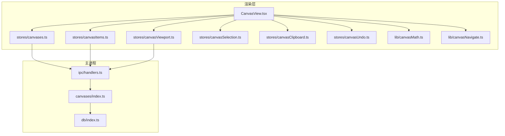
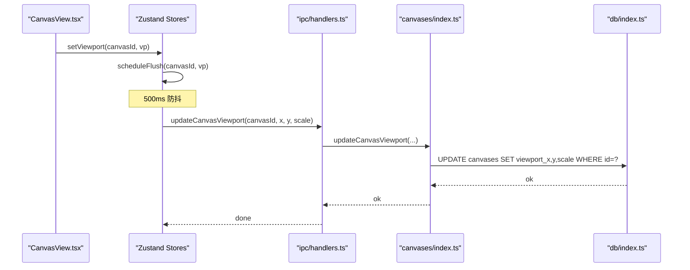
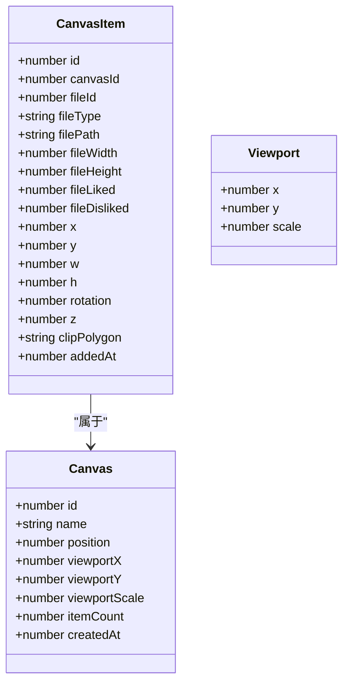
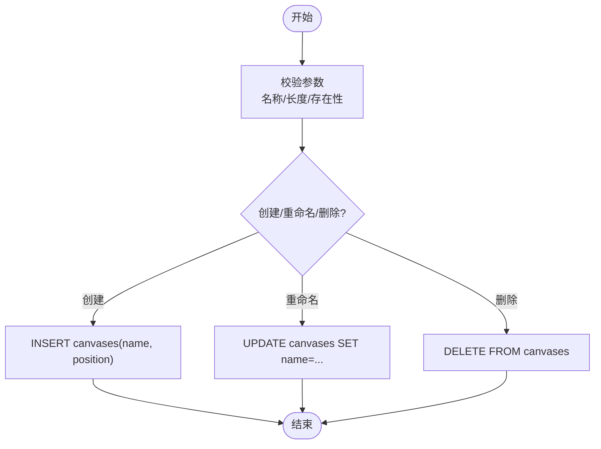
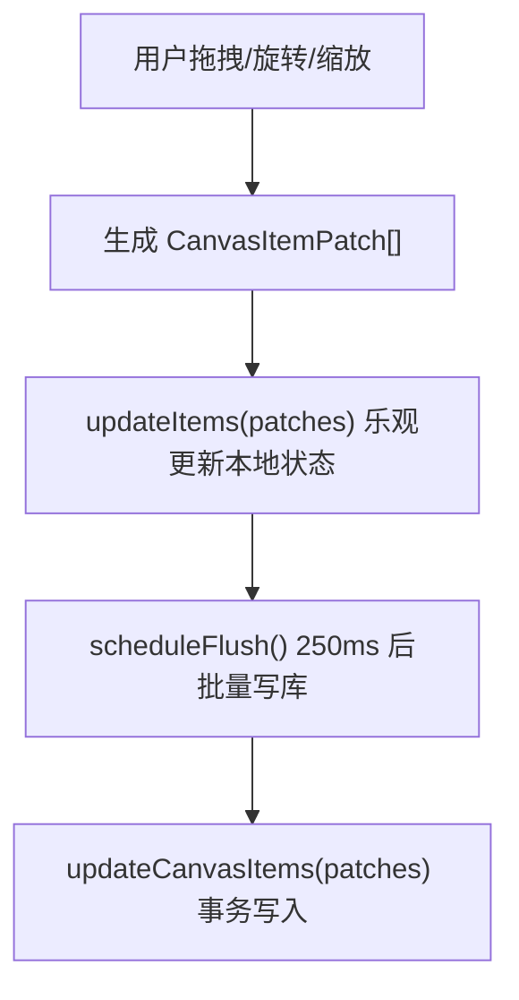
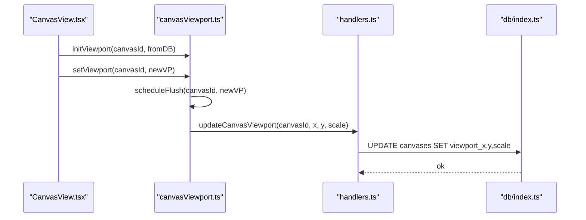
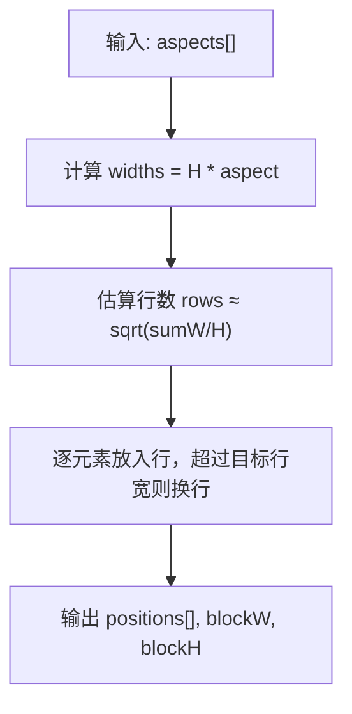
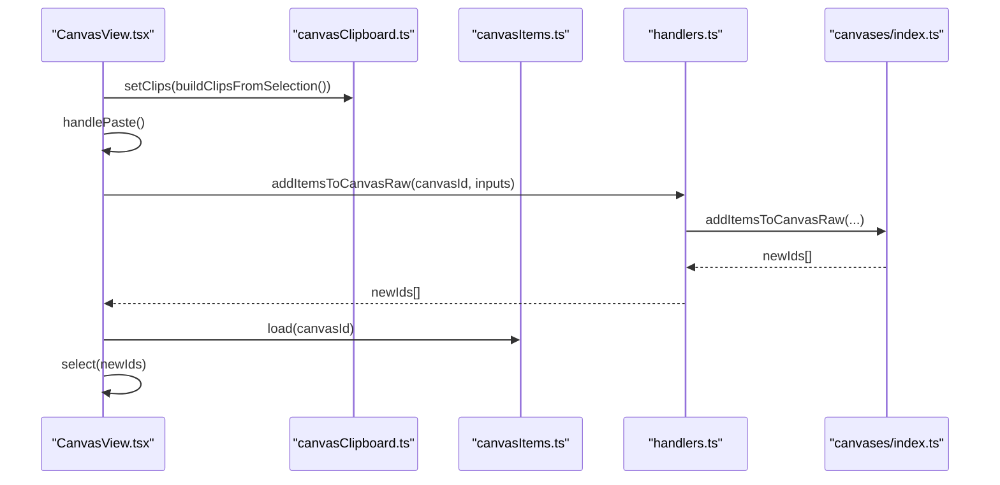
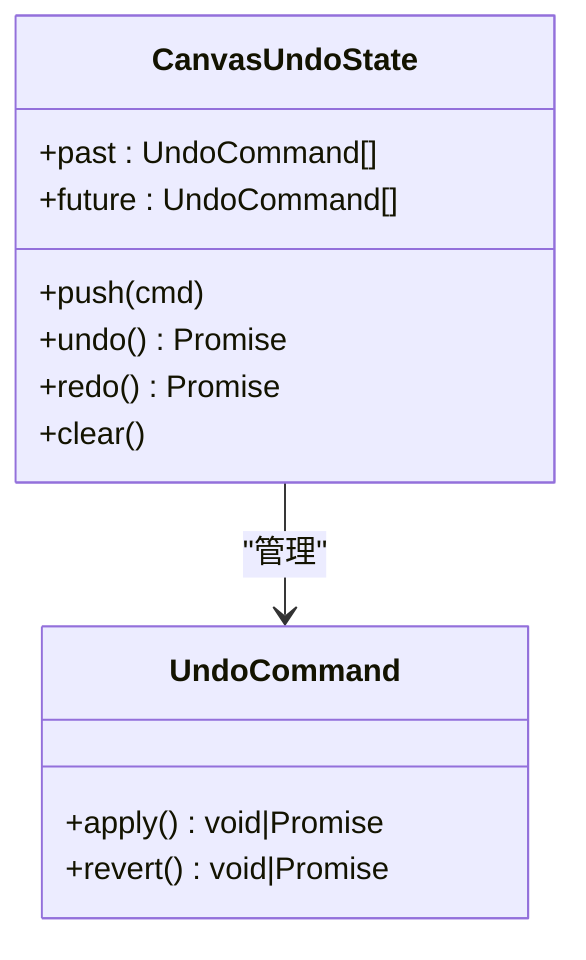

# 画布系统

<cite>
**本文引用的文件列表**
- [src/main/canvases/index.ts](file://src/main/canvases/index.ts)
- [src/renderer/src/stores/canvases.ts](file://src/renderer/src/stores/canvases.ts)
- [src/renderer/src/stores/currentCanvas.ts](file://src/renderer/src/stores/currentCanvas.ts)
- [src/renderer/src/stores/canvasItems.ts](file://src/renderer/src/stores/canvasItems.ts)
- [src/renderer/src/stores/canvasViewport.ts](file://src/renderer/src/stores/canvasViewport.ts)
- [src/renderer/src/lib/canvasMath.ts](file://src/renderer/src/lib/canvasMath.ts)
- [src/renderer/src/views/canvas/CanvasView.tsx](file://src/renderer/src/views/canvas/CanvasView.tsx)
- [src/renderer/src/stores/canvasSelection.ts](file://src/renderer/src/stores/canvasSelection.ts)
- [src/renderer/src/stores/canvasClipboard.ts](file://src/renderer/src/stores/canvasClipboard.ts)
- [src/renderer/src/stores/canvasUndo.ts](file://src/renderer/src/stores/canvasUndo.ts)
- [src/renderer/src/lib/canvasNavigate.ts](file://src/renderer/src/lib/canvasNavigate.ts)
- [src/main/ipc/handlers.ts](file://src/main/ipc/handlers.ts)
- [src/main/ipc/contract.ts](file://src/main/ipc/contract.ts)
- [src/main/db/index.ts](file://src/main/db/index.ts)
</cite>

## 目录
1. [简介](#简介)
2. [项目结构](#项目结构)
3. [核心组件](#核心组件)
4. [架构总览](#架构总览)
5. [详细组件分析](#详细组件分析)
6. [依赖关系分析](#依赖关系分析)
7. [性能考量](#性能考量)
8. [故障排查指南](#故障排查指南)
9. [结论](#结论)
10. [附录：API 参考与使用示例](#附录api-参考与使用示例)

## 简介
本文件为 Serendip 应用的“无限画布”子系统提供系统化文档。内容覆盖数据结构设计、CRUD 管理、坐标系统与变换、状态持久化、操作 API、性能优化策略，以及扩展与自定义交互的指导。目标是帮助开发者快速理解并高效扩展画布能力。

## 项目结构
画布系统由渲染层（React + Zustand）与主进程（Electron + SQLite）协作完成：
- 渲染层负责交互、视口控制、元素选择、撤销重做、剪贴板等；
- 主进程负责数据访问、事务写入、IPC 暴露；
- 数学库提供坐标转换、布局算法、导航辅助。

图表来源
- [src/renderer/src/views/canvas/CanvasView.tsx](file://src/renderer/src/views/canvas/CanvasView.tsx)
- [src/renderer/src/stores/canvases.ts](file://src/renderer/src/stores/canvases.ts)
- [src/renderer/src/stores/canvasItems.ts](file://src/renderer/src/stores/canvasItems.ts)
- [src/renderer/src/stores/canvasViewport.ts](file://src/renderer/src/stores/canvasViewport.ts)
- [src/renderer/src/stores/canvasSelection.ts](file://src/renderer/src/stores/canvasSelection.ts)
- [src/renderer/src/stores/canvasClipboard.ts](file://src/renderer/src/stores/canvasClipboard.ts)
- [src/renderer/src/stores/canvasUndo.ts](file://src/renderer/src/stores/canvasUndo.ts)
- [src/renderer/src/lib/canvasMath.ts](file://src/renderer/src/lib/canvasMath.ts)
- [src/renderer/src/lib/canvasNavigate.ts](file://src/renderer/src/lib/canvasNavigate.ts)
- [src/main/ipc/handlers.ts](file://src/main/ipc/handlers.ts)
- [src/main/canvases/index.ts](file://src/main/canvases/index.ts)
- [src/main/db/index.ts](file://src/main/db/index.ts)

章节来源
- [src/main/canvases/index.ts:1-320](file://src/main/canvases/index.ts#L1-L320)
- [src/renderer/src/stores/canvases.ts:1-115](file://src/renderer/src/stores/canvases.ts#L1-L115)
- [src/renderer/src/stores/canvasItems.ts:1-94](file://src/renderer/src/stores/canvasItems.ts#L1-L94)
- [src/renderer/src/stores/canvasViewport.ts:1-53](file://src/renderer/src/stores/canvasViewport.ts#L1-L53)
- [src/renderer/src/lib/canvasMath.ts:1-226](file://src/renderer/src/lib/canvasMath.ts#L1-L226)
- [src/renderer/src/views/canvas/CanvasView.tsx:1-800](file://src/renderer/src/views/canvas/CanvasView.tsx#L1-L800)
- [src/main/ipc/handlers.ts:1-292](file://src/main/ipc/handlers.ts#L1-L292)
- [src/main/db/index.ts:1-190](file://src/main/db/index.ts#L1-L190)

## 核心组件
- 画布实体与项目实体
  - 画布：标识、名称、排序位置、视口缓存（x/y/scale）、创建时间、项目计数。
  - 画布项目：关联媒体文件、二维中心点坐标、宽高、旋转角度、层级 z、裁剪多边形、加入时间。
- 视口状态：按画布独立缓存的 x/y/scale，支持防抖持久化与卸载时立即落盘。
- 选择与剪贴板：维护选中集合、跨画布复制粘贴的完整变换快照。
- 撤销/重做：命令式栈，限制最大深度，apply/revert 双函数封装。
- 数学工具：屏幕/世界坐标互转、旋转包围盒、自动适配视口、等高行网格布局、黄金角螺旋放置。

章节来源
- [src/main/canvases/index.ts:11-73](file://src/main/canvases/index.ts#L11-L73)
- [src/renderer/src/stores/canvasViewport.ts:1-53](file://src/renderer/src/stores/canvasViewport.ts#L1-L53)
- [src/renderer/src/stores/canvasSelection.ts:1-62](file://src/renderer/src/stores/canvasSelection.ts#L1-L62)
- [src/renderer/src/stores/canvasClipboard.ts:1-29](file://src/renderer/src/stores/canvasClipboard.ts#L1-L29)
- [src/renderer/src/stores/canvasUndo.ts:1-49](file://src/renderer/src/stores/canvasUndo.ts#L1-L49)
- [src/renderer/src/lib/canvasMath.ts:1-226](file://src/renderer/src/lib/canvasMath.ts#L1-L226)

## 架构总览
画布系统采用“渲染态 + 持久态”分离：
- 渲染态：Zustand store 维护当前画布的 items、viewport、selection、undo 历史等；
- 持久态：SQLite 存储 canvases、canvas_items、media_files 等表；
- IPC 契约：SerendipAPI 定义主进程暴露给渲染层的接口；
- 数学库：纯函数实现坐标变换与布局算法，无副作用。

图表来源
- [src/renderer/src/stores/canvasViewport.ts:16-34](file://src/renderer/src/stores/canvasViewport.ts#L16-L34)
- [src/main/ipc/handlers.ts:245-247](file://src/main/ipc/handlers.ts#L245-L247)
- [src/main/canvases/index.ts:290-296](file://src/main/canvases/index.ts#L290-L296)
- [src/main/db/index.ts:139-176](file://src/main/db/index.ts#L139-L176)

## 详细组件分析

### 数据结构与坐标系
- 画布实体 Canvas
  - 字段：id、name、position、viewportX/Y/Scale、itemCount、createdAt
  - 用途：画布元数据与视图缓存
- 画布项目 CanvasItem
  - 字段：id、canvasId、fileId、fileType/path/width/height/liked/disliked、x/y/w/h、rotation、z、clipPolygon、addedAt
  - 用途：在画布上的媒体项及其变换
- 输入与补丁类型
  - CanvasItemInput：基础插入（w/h 可由后端根据媒体尺寸推算）
  - CanvasItemFullInput：完整变换原样写入（用于复制/粘贴/再制保真）
  - CanvasItemPatch：增量更新（x/y/w/h/rotation/z/clipPolygon）
- 视口 Viewport
  - 字段：x、y、scale
  - 默认值：{x:0, y:0, scale:1}
- 坐标系统
  - 世界坐标：以画布原点为中心，单位与世界像素一致
  - 屏幕坐标：容器内像素坐标
  - 转换：screenToWorld / worldToScreen
  - 旋转：以中心点 (x,y) 为枢轴，rotation 为弧度
  - 层级：z 越大越靠前，查询按 z ASC, added_at ASC 排序

图表来源
- [src/main/canvases/index.ts:11-73](file://src/main/canvases/index.ts#L11-L73)
- [src/renderer/src/lib/canvasMath.ts:3-9](file://src/renderer/src/lib/canvasMath.ts#L3-L9)

章节来源
- [src/main/canvases/index.ts:11-73](file://src/main/canvases/index.ts#L11-L73)
- [src/renderer/src/lib/canvasMath.ts:1-29](file://src/renderer/src/lib/canvasMath.ts#L1-L29)

### 画布 CRUD 与管理逻辑
- 创建画布
  - 校验名称非空且长度限制，分配递增 position，返回新 id
- 重命名/删除
  - 唯一名约束检查；删除级联清理关联项
- 重排画布
  - 事务批量更新 position
- 添加项目
  - addItemsToCanvas：按媒体真实宽高比计算目标宽/高
  - addItemsToCanvasRaw：原样写入 w/h/rotation/clipPolygon，用于复制/粘贴/再制保真
- 移除项目
  - 批量删除，事务保证一致性
- 更新项目
  - 单条或批量更新，动态拼接 SQL 字段
- 获取维度
  - getMediaDimensions：批量取媒体宽高，供前端等高行布局使用

图表来源
- [src/main/canvases/index.ts:92-149](file://src/main/canvases/index.ts#L92-L149)

章节来源
- [src/main/canvases/index.ts:75-149](file://src/main/canvases/index.ts#L75-L149)

### 画布项目的坐标系统与变换
- 二维定位：(x, y) 为中心点
- 旋转角度：rotation 弧度，围绕中心点旋转
- 缩放比例：通过视口 scale 控制整体缩放
- 层级管理：z 整数，查询排序决定绘制顺序
- 裁剪多边形：clipPolygon 字符串描述，支持局部裁剪与内容同步缩放

图表来源
- [src/renderer/src/stores/canvasItems.ts:18-32](file://src/renderer/src/stores/canvasItems.ts#L18-L32)
- [src/main/canvases/index.ts:277-288](file://src/main/canvases/index.ts#L277-L288)

章节来源
- [src/renderer/src/stores/canvasItems.ts:34-94](file://src/renderer/src/stores/canvasItems.ts#L34-L94)
- [src/main/canvases/index.ts:258-288](file://src/main/canvases/index.ts#L258-L288)

### 视口状态持久化
- 初始化：首次加载从数据库读取 viewportX/Y/Scale 注入 byId 缓存
- 更新：setViewport 立即更新内存，并启动 500ms 防抖定时器
- 卸载：flushViewportNow 强制落盘，避免最后一次平移丢失
- 自动适配：首次有元素且视口为默认值时，fitViewport 计算最佳缩放与居中

图表来源
- [src/renderer/src/stores/canvasViewport.ts:36-53](file://src/renderer/src/stores/canvasViewport.ts#L36-L53)
- [src/main/ipc/handlers.ts:245-247](file://src/main/ipc/handlers.ts#L245-L247)
- [src/main/canvases/index.ts:290-296](file://src/main/canvases/index.ts#L290-L296)

章节来源
- [src/renderer/src/stores/canvasViewport.ts:1-53](file://src/renderer/src/stores/canvasViewport.ts#L1-L53)
- [src/renderer/src/views/canvas/CanvasView.tsx:288-327](file://src/renderer/src/views/canvas/CanvasView.tsx#L288-L327)

### 自动布局与放置算法
- 等高行网格 layoutJustifiedRows
  - 统一行高，按各自宽高比计算宽度，贪心换行使整块趋近正方形
  - 返回每个元素的相对块中心坐标及整块宽高
- 空白落点 findBlockPlacement
  - 基于现有内容 AABB 中心，黄金角螺旋向外探测，首个不与任何元素碰撞的位置即返回
- 自动适配 fitViewport
  - 计算所有元素旋转后的 AABB，按视口尺寸与 padding 计算最佳 scale 与中心

图表来源
- [src/renderer/src/lib/canvasMath.ts:133-177](file://src/renderer/src/lib/canvasMath.ts#L133-L177)

章节来源
- [src/renderer/src/lib/canvasMath.ts:106-226](file://src/renderer/src/lib/canvasMath.ts#L106-L226)

### 选择、复制粘贴与再制
- 选择：toggle/select/selectRange/selectAll/clear，支持 Shift 范围选择
- 剪贴板：保存选区完整变换快照（含 clipPolygon），跨画布有效
- 复制 Ctrl+C：构建 clips
- 粘贴 Ctrl+V：以光标或视口中心为目标，偏移组包围盒中心，设置 z 并新增元素
- 再制 Ctrl+D：原地偏移固定距离复制一组元素

图表来源
- [src/renderer/src/stores/canvasClipboard.ts:1-29](file://src/renderer/src/stores/canvasClipboard.ts#L1-L29)
- [src/renderer/src/views/canvas/CanvasView.tsx:681-788](file://src/renderer/src/views/canvas/CanvasView.tsx#L681-L788)
- [src/main/ipc/handlers.ts:232-235](file://src/main/ipc/handlers.ts#L232-L235)
- [src/main/canvases/index.ts:216-245](file://src/main/canvases/index.ts#L216-L245)

章节来源
- [src/renderer/src/stores/canvasSelection.ts:1-62](file://src/renderer/src/stores/canvasSelection.ts#L1-L62)
- [src/renderer/src/stores/canvasClipboard.ts:1-29](file://src/renderer/src/stores/canvasClipboard.ts#L1-L29)
- [src/renderer/src/views/canvas/CanvasView.tsx:681-800](file://src/renderer/src/views/canvas/CanvasView.tsx#L681-L800)

### 撤销/重做机制
- 命令对象：apply/revert 函数对，可异步
- 栈管理：past/future 双向栈，push 时清空 future，限制最大长度
- 典型用法：批量变换前记录 before，变换后 push({ apply, revert })

图表来源
- [src/renderer/src/stores/canvasUndo.ts:1-49](file://src/renderer/src/stores/canvasUndo.ts#L1-L49)

章节来源
- [src/renderer/src/stores/canvasUndo.ts:1-49](file://src/renderer/src/stores/canvasUndo.ts#L1-L49)

### 键盘导航与聚焦
- 方向键导航 navigateDirection：在无选中时选择视口中心最近元素；有选中时沿方向锥搜索最近未选中元素
- 自动平移 panToItem：若选中元素不在视口内，返回新的视口使其居中显示

章节来源
- [src/renderer/src/lib/canvasNavigate.ts:1-88](file://src/renderer/src/lib/canvasNavigate.ts#L1-L88)

## 依赖关系分析
- 渲染层依赖
  - CanvasView 依赖多个 stores 与数学/导航库
  - stores 之间松耦合，通过 window.api 调用 IPC
- 主进程依赖
  - handlers 将 IPC 映射到业务逻辑 canavses/index.ts
  - 业务逻辑通过 db/index.ts 访问 SQLite
- 外部依赖
  - better-sqlite3：高性能本地数据库
  - Electron IPC：跨进程通信

图表来源
- [src/renderer/src/views/canvas/CanvasView.tsx:1-800](file://src/renderer/src/views/canvas/CanvasView.tsx#L1-L800)
- [src/main/ipc/handlers.ts:1-292](file://src/main/ipc/handlers.ts#L1-L292)
- [src/main/canvases/index.ts:1-320](file://src/main/canvases/index.ts#L1-L320)
- [src/main/db/index.ts:1-190](file://src/main/db/index.ts#L1-L190)

章节来源
- [src/main/ipc/contract.ts:1-130](file://src/main/ipc/contract.ts#L1-L130)

## 性能考量
- 大画布渲染
  - 视口裁剪：仅渲染可见区域（结合视口与 AABB 判断）
  - 懒加载缩略图：按需请求与缓存
  - 减少重排：批量更新使用事务与 debounce flush
- 内存管理
  - 卸载画布时 unload 清空 items 与 selection，释放 DOM 引用
  - 限制 undo 历史长度，避免无限增长
- 操作历史记录
  - 250ms 合并多次 patch，降低 I/O 压力
  - 视口 500ms 防抖，避免频繁写库
- 布局算法复杂度
  - layoutJustifiedRows O(n)，findBlockPlacement O(n*k)（k 为候选数，上限 4000）

[本节为通用指导，不直接分析具体文件]

## 故障排查指南
- 画布无法创建/重命名
  - 检查名称是否为空或过长，是否重复
- 项目未保存
  - 确认 updateItems 已触发 scheduleFlush，查看 IPC 通道是否成功
- 视口丢失
  - 检查 unmount 时是否调用 flushViewportNow
- 布局异常
  - 检查媒体宽高是否正确，aspect 回退逻辑是否生效

章节来源
- [src/main/canvases/index.ts:92-131](file://src/main/canvases/index.ts#L92-L131)
- [src/renderer/src/stores/canvasItems.ts:18-32](file://src/renderer/src/stores/canvasItems.ts#L18-L32)
- [src/renderer/src/stores/canvasViewport.ts:26-34](file://src/renderer/src/stores/canvasViewport.ts#L26-L34)

## 结论
画布系统通过清晰的职责分层与稳健的数据流设计，实现了高性能的无限画布体验。渲染层专注交互与状态，主进程保障数据一致性与持久化，数学库提供可靠的几何与布局能力。借助防抖、事务与撤销机制，系统在易用性与性能之间取得良好平衡。

[本节为总结，不直接分析具体文件]

## 附录：API 参考与使用示例

### IPC 接口清单（画布相关）
- listCanvases(): Promise<Canvas[]>
- createCanvas(name: string): Promise<number>
- renameCanvas(id: number, newName: string): Promise<void>
- deleteCanvas(id: number): Promise<void>
- reorderCanvases(orderedIds: number[]): Promise<void>
- getCanvasItems(canvasId: number): Promise<CanvasItem[]>
- getMediaDimensions(fileIds: number[]): Promise<Array<{ id: number; width: number | null; height: number | null }>>
- addItemsToCanvas(canvasId: number, items: CanvasItemInput[]): Promise<number[]>
- addItemsToCanvasRaw(canvasId: number, items: CanvasItemFullInput[]): Promise<number[]>
- removeItemsFromCanvas(canvasId: number, itemIds: number[]): Promise<void>
- updateCanvasItem(itemId: number, patch: Omit<CanvasItemPatch, 'id'>): Promise<void>
- updateCanvasItems(patches: CanvasItemPatch[]): Promise<void>
- updateCanvasViewport(canvasId: number, x: number, y: number, scale: number): Promise<void>
- getFileCanvasIds(fileId: number): Promise<number[]>

章节来源
- [src/main/ipc/contract.ts:52-67](file://src/main/ipc/contract.ts#L52-L67)
- [src/main/ipc/handlers.ts:213-250](file://src/main/ipc/handlers.ts#L213-L250)

### 使用示例（步骤说明）
- 创建画布并切换
  - 调用 createCanvas(name) 获取 id
  - setCurrent(id) 切换到该画布
  - 首次进入时 initViewport 从 DB 恢复视口
- 向画布添加元素
  - 使用 addItemsToCanvasRaw 传入完整变换，或 addItemsToCanvas 让后端按媒体宽高计算
  - 成功后 load(canvasId) 刷新本地 items，select(newIds) 选中新元素
- 移动/旋转/缩放元素
  - 生成 CanvasItemPatch[] 调用 updateItems(patches)
  - 250ms 后自动 flush 到数据库
- 调整视口
  - setViewport(canvasId, vp) 即时更新，500ms 后持久化
  - 卸载时 flushViewportNow 确保最后状态落盘
- 撤销/重做
  - push({ apply, revert }) 记录命令
  - undo()/redo() 执行对应动作

章节来源
- [src/renderer/src/stores/currentCanvas.ts:1-18](file://src/renderer/src/stores/currentCanvas.ts#L1-L18)
- [src/renderer/src/stores/canvases.ts:24-56](file://src/renderer/src/stores/canvases.ts#L24-L56)
- [src/renderer/src/stores/canvasItems.ts:34-94](file://src/renderer/src/stores/canvasItems.ts#L34-L94)
- [src/renderer/src/stores/canvasViewport.ts:36-53](file://src/renderer/src/stores/canvasViewport.ts#L36-L53)
- [src/renderer/src/stores/canvasUndo.ts:19-48](file://src/renderer/src/stores/canvasUndo.ts#L19-L48)

### 扩展与自定义交互建议
- 新增手势
  - 在 CanvasView 中监听 pointer/mouse 事件，生成 patches 并通过 updateItems 提交
  - 如需撤销，构造 apply/revert 命令压入 undo 栈
- 自定义布局
  - 复用 layoutJustifiedRows/findBlockPlacement 或自行实现布局算法，返回 positions 后批量更新
- 自定义裁剪
  - 基于 cropItem 与 clipPolygon 序列化/反序列化，保持内容层与 mask 同步缩放
- 性能优化
  - 对大量元素进行分片渲染与虚拟滚动
  - 使用 requestAnimationFrame 批处理 UI 更新，减少抖动

章节来源
- [src/renderer/src/views/canvas/CanvasView.tsx:1-800](file://src/renderer/src/views/canvas/CanvasView.tsx#L1-L800)
- [src/renderer/src/lib/canvasMath.ts:133-226](file://src/renderer/src/lib/canvasMath.ts#L133-L226)