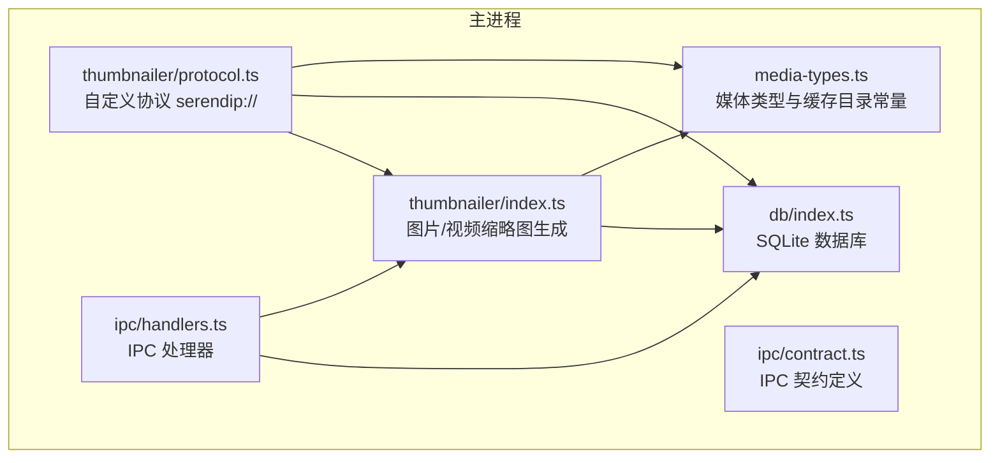
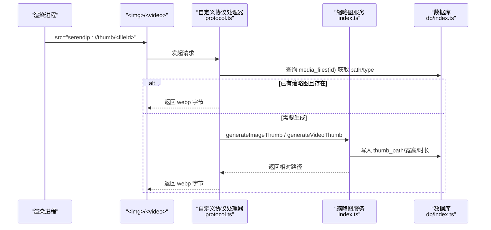
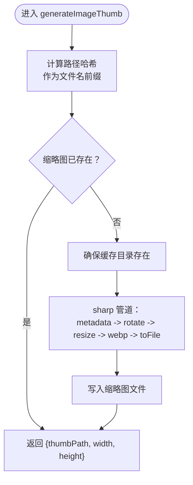
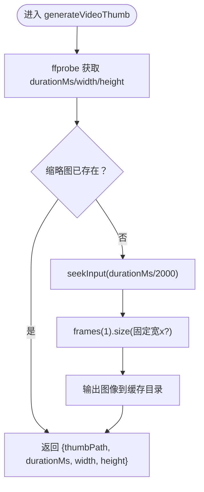
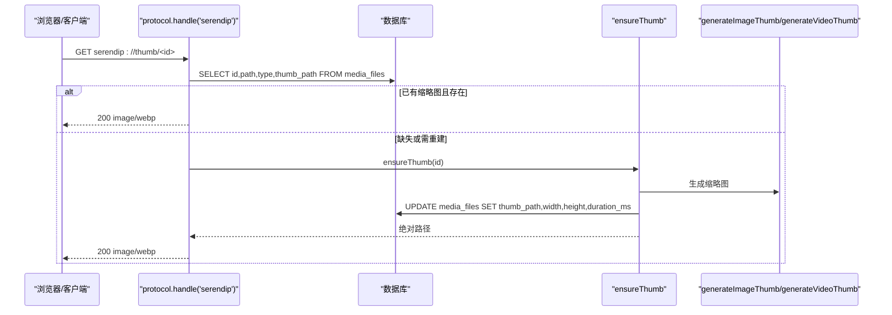
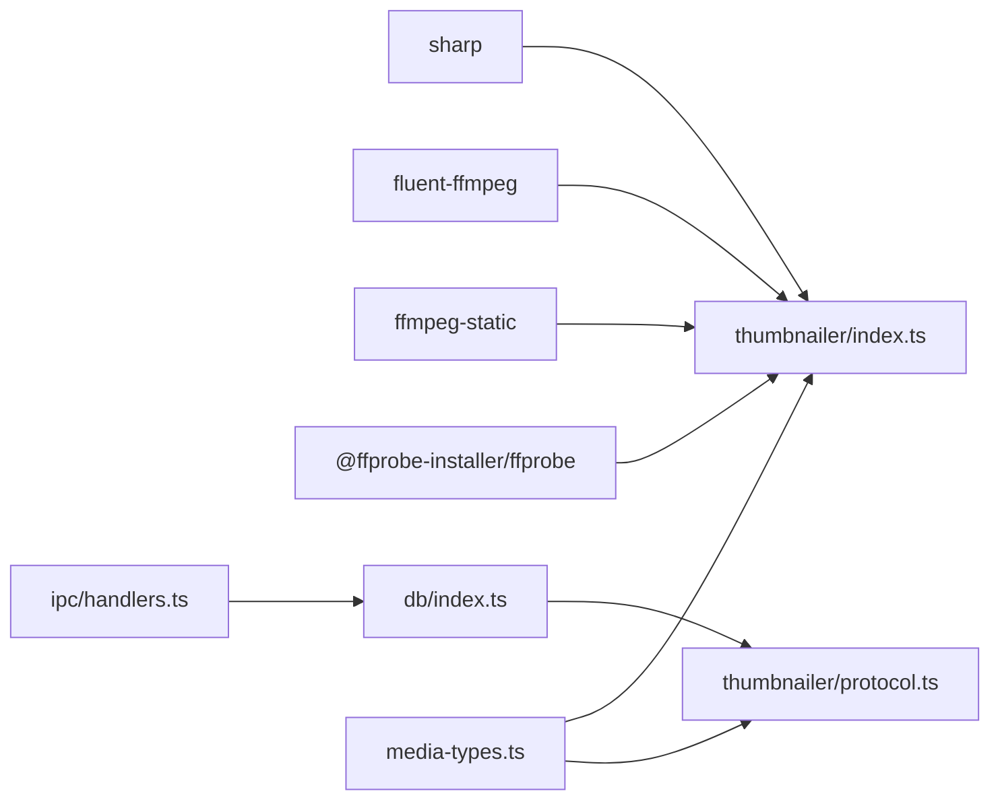

# 缩略图服务

<cite>
**本文引用的文件列表**
- [src/main/thumbnailer/index.ts](file://src/main/thumbnailer/index.ts)
- [src/main/thumbnailer/protocol.ts](file://src/main/thumbnailer/protocol.ts)
- [src/main/media-types.ts](file://src/main/media-types.ts)
- [src/main/db/index.ts](file://src/main/db/index.ts)
- [src/main/ipc/handlers.ts](file://src/main/ipc/handlers.ts)
- [src/main/ipc/contract.ts](file://src/main/ipc/contract.ts)
</cite>

## 目录
1. [简介](#简介)
2. [项目结构](#项目结构)
3. [核心组件](#核心组件)
4. [架构总览](#架构总览)
5. [详细组件分析](#详细组件分析)
6. [依赖关系分析](#依赖关系分析)
7. [性能考量](#性能考量)
8. [故障排查指南](#故障排查指南)
9. [结论](#结论)
10. [附录：API 使用与集成示例](#附录api-使用与集成示例)

## 简介
本文件为 Serendip 应用的“缩略图服务”提供综合文档。内容覆盖基于 sharp 的图片处理流程（缩放、格式转换、质量优化）、基于 ffmpeg-static 的视频关键帧提取、缓存策略（路径映射、目录结构、过期清理）、协议实现（自定义协议、异步任务、进度回调）、配置项（尺寸、质量、格式）、错误处理策略，以及面向开发者的扩展与性能优化最佳实践。

## 项目结构
缩略图服务位于主进程侧，主要涉及以下模块：
- 图像处理与视频抽帧：thumbnailer/index.ts
- 自定义协议与按需生成：thumbnailer/protocol.ts
- 媒体类型与缓存目录常量：media-types.ts
- 数据库与元数据持久化：db/index.ts
- IPC 接口与处理器：ipc/handlers.ts、ipc/contract.ts

图表来源
- [src/main/thumbnailer/index.ts:1-138](file://src/main/thumbnailer/index.ts#L1-L138)
- [src/main/thumbnailer/protocol.ts:1-298](file://src/main/thumbnailer/protocol.ts#L1-L298)
- [src/main/media-types.ts:1-38](file://src/main/media-types.ts#L1-L38)
- [src/main/db/index.ts:1-190](file://src/main/db/index.ts#L1-L190)
- [src/main/ipc/handlers.ts:1-292](file://src/main/ipc/handlers.ts#L1-L292)
- [src/main/ipc/contract.ts:1-130](file://src/main/ipc/contract.ts#L1-L130)

章节来源
- [src/main/thumbnailer/index.ts:1-138](file://src/main/thumbnailer/index.ts#L1-L138)
- [src/main/thumbnailer/protocol.ts:1-298](file://src/main/thumbnailer/protocol.ts#L1-L298)
- [src/main/media-types.ts:1-38](file://src/main/media-types.ts#L1-L38)
- [src/main/db/index.ts:1-190](file://src/main/db/index.ts#L1-L190)
- [src/main/ipc/handlers.ts:1-292](file://src/main/ipc/handlers.ts#L1-L292)
- [src/main/ipc/contract.ts:1-130](file://src/main/ipc/contract.ts#L1-L130)

## 核心组件
- 图片缩略图生成：基于 sharp，自动 EXIF 旋转、等比缩放至固定宽度、输出 WebP，并缓存到根目录下的 .serendip-cache/thumbs。
- 视频缩略图生成：基于 fluent-ffmpeg + ffmpeg-static + @ffprobe-installer/ffprobe，先 ffprobe 获取时长与宽高，再抽取中间帧生成 WebP 缩略图。
- 自定义协议：注册 serendip://thumb/<id> 按需返回缩略图；同时支持 serendip://image/<id> 原图直出（含 HEIC/HEIF 转码）与 serendip://video/<id> 带 Range 的流式播放。
- 缓存策略：以源文件路径哈希命名缩略图，避免重复生成；fullres 子目录用于 HEIC/HEIF 转码后的全分辨率缓存。
- 失效标记：当缩略图生成失败或文件不可用时，更新数据库 unavailable 字段，避免再次推荐。

章节来源
- [src/main/thumbnailer/index.ts:17-52](file://src/main/thumbnailer/index.ts#L17-L52)
- [src/main/thumbnailer/index.ts:59-94](file://src/main/thumbnailer/index.ts#L59-L94)
- [src/main/thumbnailer/index.ts:99-119](file://src/main/thumbnailer/index.ts#L99-L119)
- [src/main/thumbnailer/index.ts:124-137](file://src/main/thumbnailer/index.ts#L124-L137)
- [src/main/thumbnailer/protocol.ts:33-92](file://src/main/thumbnailer/protocol.ts#L33-L92)
- [src/main/thumbnailer/protocol.ts:177-209](file://src/main/thumbnailer/protocol.ts#L177-L209)
- [src/main/thumbnailer/protocol.ts:238-297](file://src/main/thumbnailer/protocol.ts#L238-L297)
- [src/main/media-types.ts:27-28](file://src/main/media-types.ts#L27-L28)

## 架构总览
下图展示了从渲染层发起请求到主进程处理、按需生成缩略图并返回的完整链路。

图表来源
- [src/main/thumbnailer/protocol.ts:33-92](file://src/main/thumbnailer/protocol.ts#L33-L92)
- [src/main/thumbnailer/protocol.ts:238-297](file://src/main/thumbnailer/protocol.ts#L238-L297)
- [src/main/thumbnailer/index.ts:27-52](file://src/main/thumbnailer/index.ts#L27-L52)
- [src/main/thumbnailer/index.ts:59-94](file://src/main/thumbnailer/index.ts#L59-L94)
- [src/main/db/index.ts:55-71](file://src/main/db/index.ts#L55-L71)

## 详细组件分析

### 图片缩略图生成（sharp）
- 输入：源图片路径、缓存目录
- 处理：读取元数据（宽高），若缩略图不存在则创建目录，按 EXIF 自动旋转，等比缩放至固定宽度且不放大，输出 WebP 指定质量
- 输出：缩略图相对路径、原始宽高

图表来源
- [src/main/thumbnailer/index.ts:27-52](file://src/main/thumbnailer/index.ts#L27-L52)

章节来源
- [src/main/thumbnailer/index.ts:17-52](file://src/main/thumbnailer/index.ts#L17-L52)

### 视频缩略图生成（ffmpeg-static）
- 输入：源视频路径、缓存目录
- 处理：通过 ffprobe 一次获取时长与宽高；若缩略图不存在，seek 到中间时间点抽取一帧，按固定宽度缩放，输出图像
- 输出：缩略图相对路径、时长（毫秒）、宽高

图表来源
- [src/main/thumbnailer/index.ts:59-94](file://src/main/thumbnailer/index.ts#L59-L94)
- [src/main/thumbnailer/index.ts:99-119](file://src/main/thumbnailer/index.ts#L99-L119)

章节来源
- [src/main/thumbnailer/index.ts:59-94](file://src/main/thumbnailer/index.ts#L59-L94)
- [src/main/thumbnailer/index.ts:99-119](file://src/main/thumbnailer/index.ts#L99-L119)

### 自定义协议与按需生成
- 注册协议：serendip://thumb/<id> 返回缩略图；serendip://image/<id> 返回原图（HEIC/HEIF 转码）；serendip://video/<id> 返回带 Range 的原视频流
- 按需生成：ensureThumb 根据数据库记录判断是否需要生成，调用对应生成函数并回写元数据

图表来源
- [src/main/thumbnailer/protocol.ts:33-92](file://src/main/thumbnailer/protocol.ts#L33-L92)
- [src/main/thumbnailer/protocol.ts:238-297](file://src/main/thumbnailer/protocol.ts#L238-L297)

章节来源
- [src/main/thumbnailer/protocol.ts:33-92](file://src/main/thumbnailer/protocol.ts#L33-L92)
- [src/main/thumbnailer/protocol.ts:238-297](file://src/main/thumbnailer/protocol.ts#L238-L297)

### 原图直出与 HEIC/HEIF 转码
- 非 HEIC/HEIF：直接读取原文件字节并按扩展名设置正确的 MIME
- HEIC/HEIF：Chromium 无法渲染，使用 sharp 转为高质量 JPEG，结果缓存到 fullres 子目录，后续命中缓存

章节来源
- [src/main/thumbnailer/protocol.ts:177-209](file://src/main/thumbnailer/protocol.ts#L177-L209)

### 视频 Range 流式响应
- 解析 Range 头，返回 206 Partial Content，包含 Content-Range/Accept-Ranges
- 无 Range 时返回 200 完整流
- Node ReadableStream 转换为 Web ReadableStream，并在取消时销毁底层流，避免 fd 泄漏

章节来源
- [src/main/thumbnailer/protocol.ts:99-149](file://src/main/thumbnailer/protocol.ts#L99-L149)
- [src/main/thumbnailer/protocol.ts:152-169](file://src/main/thumbnailer/protocol.ts#L152-L169)

### 缓存策略设计
- 路径映射：缩略图文件名由源文件路径的 SHA256 前 16 位构成，保证唯一性与可重现性
- 目录结构：
  - <rootPath>/.serendip-cache/thumbs：缩略图
  - <rootPath>/.serendip-cache/fullres：HEIC/HEIF 转码后的全分辨率缓存
- 过期清理：当前未实现定时清理；可通过外部脚本定期扫描 thumbs/fullres 目录删除长时间未访问的文件，或在应用内新增清理任务

章节来源
- [src/main/thumbnailer/index.ts:124-137](file://src/main/thumbnailer/index.ts#L124-L137)
- [src/main/thumbnailer/protocol.ts:186-203](file://src/main/thumbnailer/protocol.ts#L186-L203)
- [src/main/media-types.ts:27-28](file://src/main/media-types.ts#L27-L28)

### 协议与 IPC 通信
- 自定义协议：在 protocol.handle('serendip') 中统一路由 thumb/image/video
- IPC 通道：handlers.ts 暴露大量 API（如扫描、分类、画布、窗口装饰等），其中与缩略图相关的失效标记通过 IPC 由 UI 主动调用
- 进度回调：扫描过程通过 IPC.SCAN_PROGRESS 推送进度，供 UI 展示

章节来源
- [src/main/thumbnailer/protocol.ts:33-92](file://src/main/thumbnailer/protocol.ts#L33-L92)
- [src/main/ipc/handlers.ts:148-154](file://src/main/ipc/handlers.ts#L148-L154)
- [src/main/ipc/handlers.ts:286-292](file://src/main/ipc/handlers.ts#L286-L292)
- [src/main/ipc/contract.ts:84-130](file://src/main/ipc/contract.ts#L84-L130)

### 数据库与元数据
- media_files 表包含 path、type、width、height、duration_ms、thumb_path、unavailable、unavailable_reason 等字段
- 缩略图生成成功后回写 thumb_path、宽高、时长；失败时通过 markUnavailable 标记不可用

章节来源
- [src/main/db/index.ts:55-71](file://src/main/db/index.ts#L55-L71)
- [src/main/db/index.ts:120-128](file://src/main/db/index.ts#L120-L128)
- [src/main/thumbnailer/protocol.ts:223-232](file://src/main/thumbnailer/protocol.ts#L223-L232)

## 依赖关系分析
- 外部库
  - sharp：高性能图片处理（EXIF 旋转、缩放、WebP 编码）
  - fluent-ffmpeg：封装 ffmpeg 命令
  - ffmpeg-static：打包平台特定的 ffmpeg 二进制
  - @ffprobe-installer/ffprobe：平台特定的 ffprobe 二进制
- 内部依赖
  - db/index.ts：better-sqlite3 数据库访问
  - media-types.ts：媒体扩展名集合与缓存目录常量
  - ipc/handlers.ts：IPC 处理器（失效标记、进度广播等）

图表来源
- [src/main/thumbnailer/index.ts:1-16](file://src/main/thumbnailer/index.ts#L1-L16)
- [src/main/thumbnailer/protocol.ts:1-8](file://src/main/thumbnailer/protocol.ts#L1-L8)
- [src/main/media-types.ts:1-38](file://src/main/media-types.ts#L1-L38)
- [src/main/db/index.ts:1-28](file://src/main/db/index.ts#L1-L28)
- [src/main/ipc/handlers.ts:1-10](file://src/main/ipc/handlers.ts#L1-L10)

章节来源
- [src/main/thumbnailer/index.ts:1-16](file://src/main/thumbnailer/index.ts#L1-L16)
- [src/main/thumbnailer/protocol.ts:1-8](file://src/main/thumbnailer/protocol.ts#L1-L8)
- [src/main/media-types.ts:1-38](file://src/main/media-types.ts#L1-L38)
- [src/main/db/index.ts:1-28](file://src/main/db/index.ts#L1-L28)
- [src/main/ipc/handlers.ts:1-10](file://src/main/ipc/handlers.ts#L1-L10)

## 性能考量
- 懒加载：缩略图仅在首次访问时生成，避免扫描阶段阻塞
- 缓存命中：基于路径哈希的文件名，避免重复生成；fullres 子目录缓存 HEIC/HEIF 转码结果
- 流式传输：视频播放采用 Range 分块，减少首屏延迟与内存占用
- 并发与事务：数据库使用 WAL 模式与批量事务提升写入性能
- I/O 优化：Node ReadableStream 转换为 Web ReadableStream，并在取消时销毁底层流，避免句柄泄漏

[本节为通用性能建议，不直接分析具体文件]

## 故障排查指南
- 无效文件或损坏：
  - 现象：缩略图生成失败，返回 404
  - 处理：protocol 层捕获异常后调用 markUnavailable 标记不可用，UI 可通过 IPC 查看原因
- 格式不支持：
  - 现象：扩展名不在 IMAGE_EXTENSIONS/VIDEO_EXTENSIONS 集合中
  - 处理：扫描器会跳过非受支持类型；如需扩展，更新 media-types.ts 中的集合
- 磁盘空间不足：
  - 现象：写入缩略图失败
  - 处理：确保磁盘有足够空间；可在应用内增加清理任务或删除旧缓存
- 视频解码失败：
  - 现象：ffprobe 或 ffmpeg 报错
  - 处理：检查 ffmpeg-static 是否正确安装；必要时重试或标记不可用

章节来源
- [src/main/thumbnailer/protocol.ts:48-53](file://src/main/thumbnailer/protocol.ts#L48-L53)
- [src/main/thumbnailer/protocol.ts:223-232](file://src/main/thumbnailer/protocol.ts#L223-L232)
- [src/main/media-types.ts:6-25](file://src/main/media-types.ts#L6-L25)
- [src/main/thumbnailer/index.ts:89-91](file://src/main/thumbnailer/index.ts#L89-L91)
- [src/main/thumbnailer/index.ts:104-106](file://src/main/thumbnailer/index.ts#L104-L106)

## 结论
缩略图服务通过 sharp 与 ffmpeg-static 的组合，实现了高效、可靠的图片与视频缩略图生成。结合自定义协议与按需生成机制，显著降低了启动与扫描开销。完善的缓存策略与数据库元数据管理确保了良好的用户体验与可扩展性。未来可考虑引入缓存过期清理与更细粒度的质量/尺寸配置，以满足更多场景需求。

[本节为总结性内容，不直接分析具体文件]

## 附录：API 使用与集成示例

### 缩略图 URL 使用
- 图片缩略图：在  标签中使用 src="serendip://thumb/<fileId>"
- 原图直出：在  标签中使用 src="serendip://image/<fileId>"（HEIC/HEIF 会自动转码）
- 视频播放：在 <video> 标签中使用 src="serendip://video/<fileId>"（支持 Range 流式播放）

章节来源
- [src/main/thumbnailer/protocol.ts:33-92](file://src/main/thumbnailer/protocol.ts#L33-L92)

### 失效标记（IPC）
- 调用方式：通过 IPC 通道标记文件不可用，避免再次推荐
- 适用场景：缩略图生成失败、文件丢失、解码错误等

章节来源
- [src/main/ipc/handlers.ts:148-154](file://src/main/ipc/handlers.ts#L148-L154)
- [src/main/ipc/contract.ts:98-98](file://src/main/ipc/contract.ts#L98-98)

### 进度回调（IPC）
- 扫描进度：通过 IPC.SCAN_PROGRESS 向所有窗口广播进度，便于 UI 显示扫描状态

章节来源
- [src/main/ipc/handlers.ts:286-292](file://src/main/ipc/handlers.ts#L286-L292)
- [src/main/ipc/contract.ts:90-90](file://src/main/ipc/contract.ts#L90-90)

### 配置选项
- 缩略图宽度：固定值（例如 320px）
- 缩略图质量：WebP 质量参数（例如 80）
- 输出格式：WebP
- 全分辨率缓存：HEIC/HEIF 转码为 JPEG，质量 90，缓存于 fullres 子目录

章节来源
- [src/main/thumbnailer/index.ts:17-18](file://src/main/thumbnailer/index.ts#L17-L18)
- [src/main/thumbnailer/index.ts:45-48](file://src/main/thumbnailer/index.ts#L45-L48)
- [src/main/thumbnailer/protocol.ts:195-203](file://src/main/thumbnailer/protocol.ts#L195-L203)