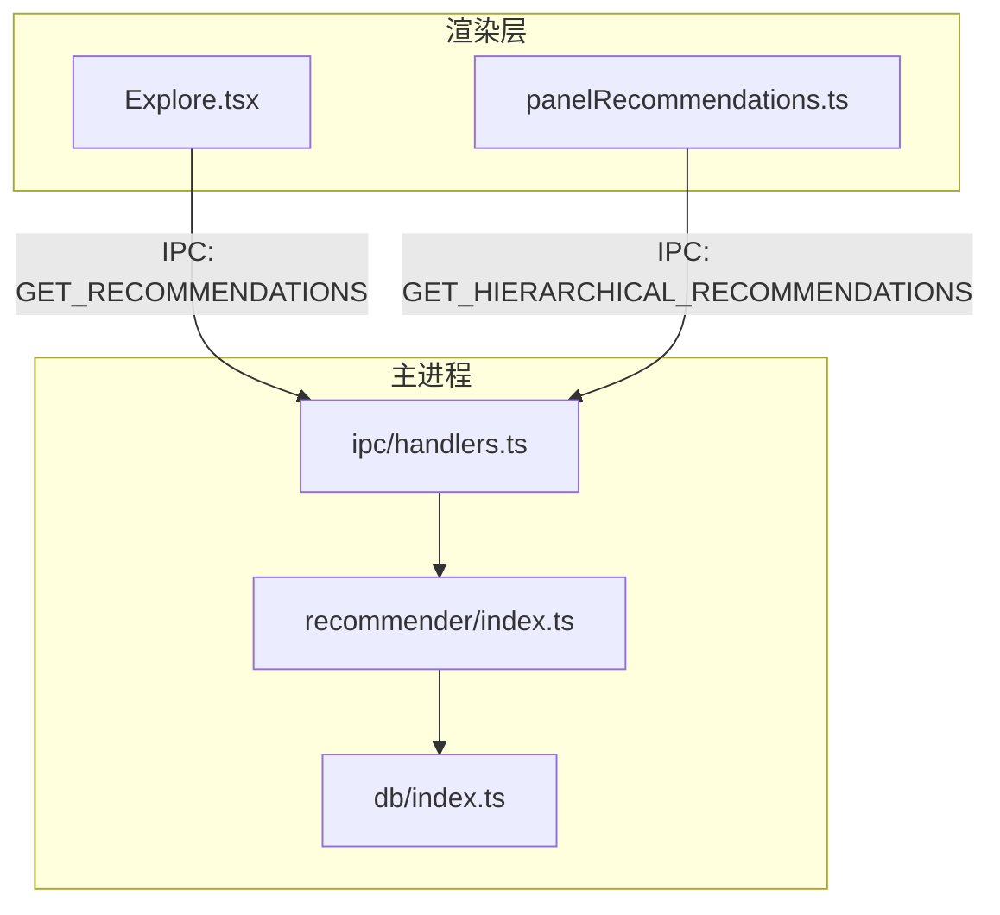
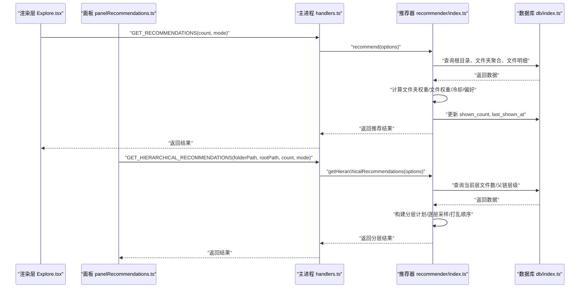
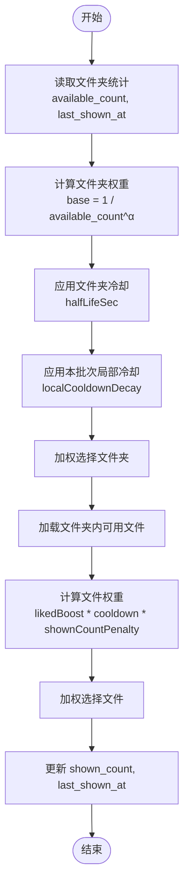
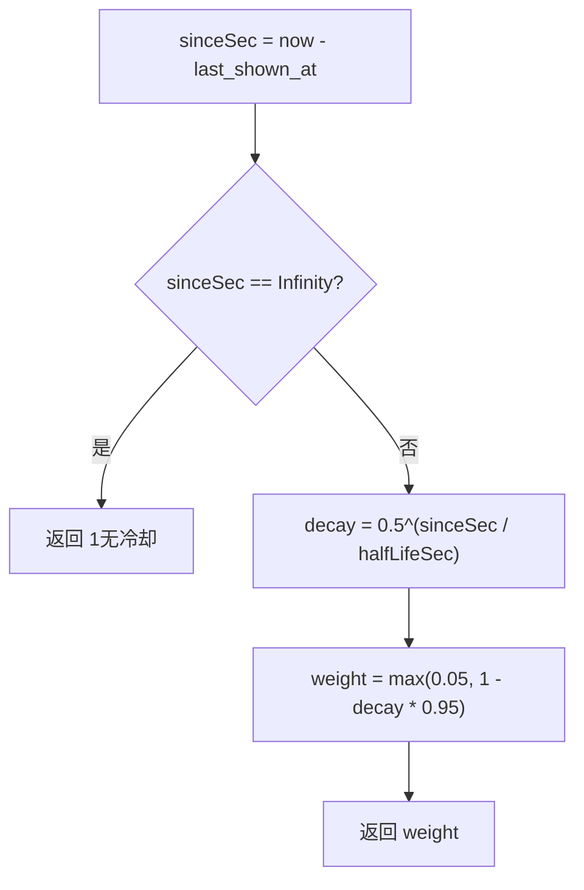
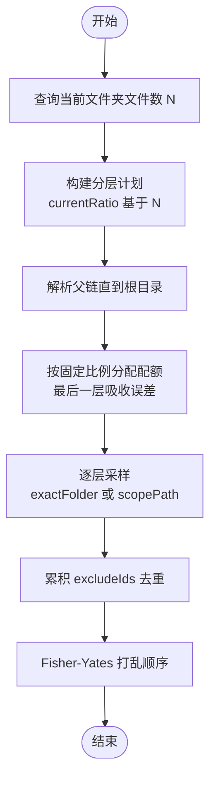
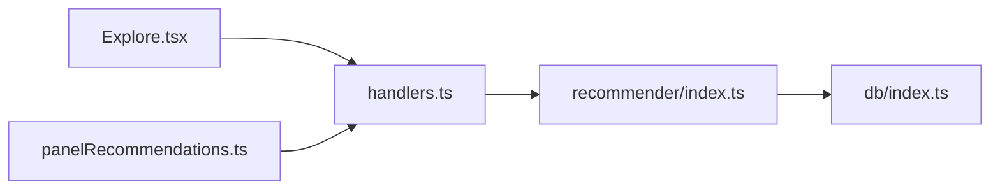

# 智能推荐算法

<cite>
**本文引用的文件列表**
- [src/main/recommender/index.ts](file://src/main/recommender/index.ts)
- [src/renderer/src/stores/panelRecommendations.ts](file://src/renderer/src/stores/panelRecommendations.ts)
- [src/renderer/src/views/Explore.tsx](file://src/renderer/src/views/Explore.tsx)
- [src/main/db/index.ts](file://src/main/db/index.ts)
- [src/main/ipc/handlers.ts](file://src/main/ipc/handlers.ts)
</cite>

## 目录
1. [简介](#简介)
2. [项目结构](#项目结构)
3. [核心组件](#核心组件)
4. [架构总览](#架构总览)
5. [详细组件分析](#详细组件分析)
6. [依赖关系分析](#依赖关系分析)
7. [性能与复杂度](#性能与复杂度)
8. [故障排查指南](#故障排查指南)
9. [结论](#结论)
10. [附录：数学公式、伪代码与参数调优](#附录数学公式伪代码与参数调优)

## 简介
本技术文档聚焦 Serendip 应用的“智能随机”推荐系统，系统性阐述两级加权抽样算法、三种探索模式（prefer/balanced/explore）、冷却机制（文件夹冷却、文件冷却、本批次局部冷却）、用户偏好学习（liked/disliked 权重动态调整）以及分层路径推荐的实现细节。文档同时提供时间复杂度评估、内存优化建议、测试验证方法与参数调优指南，帮助算法工程师和高级开发者深入理解并扩展该推荐系统。

## 项目结构
推荐系统主要位于主进程模块中，渲染层通过 IPC 调用主进程能力，并在 UI 状态管理中维护加载、去重与批量操作逻辑。数据库使用 SQLite，包含媒体文件表、文件夹表、分类与画布等表结构，索引覆盖常用查询路径。



图表来源
- [src/renderer/src/views/Explore.tsx:65-91](file://src/renderer/src/views/Explore.tsx#L65-L91)
- [src/renderer/src/stores/panelRecommendations.ts:88-126](file://src/renderer/src/stores/panelRecommendations.ts#L88-L126)
- [src/main/ipc/handlers.ts:83-91](file://src/main/ipc/handlers.ts#L83-L91)
- [src/main/recommender/index.ts:57-149](file://src/main/recommender/index.ts#L57-L149)
- [src/main/db/index.ts:1-28](file://src/main/db/index.ts#L1-L28)

章节来源
- [src/main/recommender/index.ts:1-518](file://src/main/recommender/index.ts#L1-L518)
- [src/renderer/src/stores/panelRecommendations.ts:1-128](file://src/renderer/src/stores/panelRecommendations.ts#L1-L128)
- [src/renderer/src/views/Explore.tsx:1-430](file://src/renderer/src/views/Explore.tsx#L1-L430)
- [src/main/db/index.ts:1-190](file://src/main/db/index.ts#L1-L190)
- [src/main/ipc/handlers.ts:1-292](file://src/main/ipc/handlers.ts#L1-L292)

## 核心组件
- 两级加权抽样：先按文件夹权重选择目标文件夹，再在文件夹内按文件权重选择具体文件。
- 三种探索模式：prefer（偏好放大）、balanced（平衡）、explore（探索优先），通过一组参数控制权重抑制、冷却半衰期、喜欢加成、显示次数惩罚和本批次局部冷却衰减。
- 冷却机制：
  - 文件夹冷却：基于 last_shown_at 的半衰期衰减，降低近期被抽过的文件夹权重。
  - 文件冷却：同文件夹内文件基于 last_shown_at 的半衰期衰减。
  - 本批次局部冷却：同一批请求内对已选文件夹进行指数衰减，避免重复抽取。
- 用户偏好学习：liked 提升权重；disliked 直接过滤不参与抽样；shown_count 作为“曝光惩罚”鼓励发现新内容。
- 分层路径推荐：以当前路径为锚点，向上构建父链层级，按策略分配各层采样数量，精确匹配当前层，父链层用 LIKE 前缀递归采样。

章节来源
- [src/main/recommender/index.ts:57-149](file://src/main/recommender/index.ts#L57-L149)
- [src/main/recommender/index.ts:155-206](file://src/main/recommender/index.ts#L155-L206)
- [src/main/recommender/index.ts:211-274](file://src/main/recommender/index.ts#L211-L274)
- [src/main/recommender/index.ts:279-359](file://src/main/recommender/index.ts#L279-L359)
- [src/main/recommender/index.ts:364-389](file://src/main/recommender/index.ts#L364-L389)
- [src/main/recommender/index.ts:394-448](file://src/main/recommender/index.ts#L394-L448)
- [src/main/recommender/index.ts:454-460](file://src/main/recommender/index.ts#L454-L460)
- [src/main/recommender/index.ts:471-504](file://src/main/recommender/index.ts#L471-L504)

## 架构总览
从渲染层发起推荐请求，主进程处理 IPC 并调用推荐器，推荐器读取数据库统计信息并执行两级加权抽样，更新 shown_count 与 last_shown_at，返回结果给渲染层进行展示与交互。



图表来源
- [src/renderer/src/views/Explore.tsx:65-91](file://src/renderer/src/views/Explore.tsx#L65-L91)
- [src/renderer/src/stores/panelRecommendations.ts:88-126](file://src/renderer/src/stores/panelRecommendations.ts#L88-L126)
- [src/main/ipc/handlers.ts:83-91](file://src/main/ipc/handlers.ts#L83-L91)
- [src/main/recommender/index.ts:57-149](file://src/main/recommender/index.ts#L57-L149)
- [src/main/recommender/index.ts:155-206](file://src/main/recommender/index.ts#L155-L206)
- [src/main/db/index.ts:1-28](file://src/main/db/index.ts#L1-L28)

## 详细组件分析

### 两级加权抽样算法
- 文件夹级权重：基础权重为 1 / available_count^α，其中 α 由模式决定，用于抑制大文件夹虹吸效应。
- 文件级权重：在选定文件夹内，文件权重受 liked 加成、冷却因子、显示次数惩罚影响。
- 抽样流程：
  - 读取所有可用文件夹及其统计信息（available_count、last_shown_at）。
  - 计算每个文件夹的基础权重与冷却因子，得到调整后权重。
  - 在本批次内对文件夹进行局部冷却，防止重复抽取。
  - 在选中文件夹内按文件权重抽样，更新 seenInThisBatch 避免重复。
  - 批量更新 shown_count 与 last_shown_at。



图表来源
- [src/main/recommender/index.ts:78-149](file://src/main/recommender/index.ts#L78-L149)
- [src/main/recommender/index.ts:364-389](file://src/main/recommender/index.ts#L364-L389)
- [src/main/recommender/index.ts:394-448](file://src/main/recommender/index.ts#L394-L448)
- [src/main/recommender/index.ts:454-460](file://src/main/recommender/index.ts#L454-L460)

章节来源
- [src/main/recommender/index.ts:57-149](file://src/main/recommender/index.ts#L57-L149)
- [src/main/recommender/index.ts:364-389](file://src/main/recommender/index.ts#L364-L389)
- [src/main/recommender/index.ts:394-448](file://src/main/recommender/index.ts#L394-L448)
- [src/main/recommender/index.ts:454-460](file://src/main/recommender/index.ts#L454-L460)

### 三种探索模式的参数配置与行为差异
- prefer：偏好放大，folderAlpha 较小（抑制弱），likedBoost 较大，文件冷却半衰期较短，shownCountPenalty 较低，本地冷却衰减中等。
- balanced：折中策略，folderAlpha 中等，likedBoost 中等，文件冷却半衰期较长，shownCountPenalty 中等，本地冷却衰减中等。
- explore：探索优先，folderAlpha 较大（抑制强，接近均权），likedBoost=1（不加成），文件冷却半衰期很长，shownCountPenalty 较高，本地冷却衰减低（更倾向分散到不同文件夹）。

章节来源
- [src/main/recommender/index.ts:471-504](file://src/main/recommender/index.ts#L471-L504)

### 冷却机制实现
- 文件夹冷却：基于 last_shown_at 与 folderCooldownHalfLifeSec 的半衰期函数 computeCooldown，最近被抽过的文件夹权重降低。
- 文件冷却：同文件夹内文件基于 last_shown_at 与 fileCooldownHalfLifeSec 的半衰期函数 computeCooldown。
- 本批次局部冷却：pickFolder 中使用 localShown Map 记录每文件夹在本批次中被抽到的次数，按 localCooldownDecay 指数衰减其权重。



图表来源
- [src/main/recommender/index.ts:454-460](file://src/main/recommender/index.ts#L454-L460)
- [src/main/recommender/index.ts:364-389](file://src/main/recommender/index.ts#L364-L389)

章节来源
- [src/main/recommender/index.ts:454-460](file://src/main/recommender/index.ts#L454-L460)
- [src/main/recommender/index.ts:364-389](file://src/main/recommender/index.ts#L364-L389)

### 用户偏好学习算法
- liked 权重：文件若被标记为喜欢，则乘以 likedBoost 提升权重。
- disliked 权重：被标记为不感兴趣的文件直接过滤，不参与抽样。
- 曝光惩罚：shown_count 越大，权重越低，鼓励发现新内容。
- 动态调整：用户在界面点击喜欢/不感兴趣后，后端立即更新数据库字段，后续推荐会反映这些变化。

章节来源
- [src/main/recommender/index.ts:394-448](file://src/main/recommender/index.ts#L394-L448)
- [src/main/ipc/handlers.ts:93-125](file://src/main/ipc/handlers.ts#L93-L125)
- [src/renderer/src/views/Explore.tsx:118-143](file://src/renderer/src/views/Explore.tsx#L118-L143)

### 分层路径推荐实现细节
- 当前层权重策略：根据当前文件夹文件数 N 决定当前层占比，N 越小当前层占比越低，最多不超过 50%。
- 父链权重分配：向上解析父链直到根目录，按固定比例（如 60%/25%/15%）分配剩余配额，最后一层吸收舍入误差。
- 精确匹配与 LIKE 前缀：当前层使用 exactFolder=true 精确匹配 folder_path；父链层使用 recommend(scopePath=父路径) 进行 LIKE 前缀匹配。
- 去重与打乱：累积 excludeIds 保证跨层不重复，最终 Fisher-Yates 打乱顺序。



图表来源
- [src/main/recommender/index.ts:155-206](file://src/main/recommender/index.ts#L155-L206)
- [src/main/recommender/index.ts:211-274](file://src/main/recommender/index.ts#L211-L274)
- [src/main/recommender/index.ts:279-359](file://src/main/recommender/index.ts#L279-L359)

章节来源
- [src/main/recommender/index.ts:155-206](file://src/main/recommender/index.ts#L155-L206)
- [src/main/recommender/index.ts:211-274](file://src/main/recommender/index.ts#L211-L274)
- [src/main/recommender/index.ts:279-359](file://src/main/recommender/index.ts#L279-L359)

## 依赖关系分析
- 渲染层 Explore.tsx 通过 window.api.getRecommendations 获取推荐结果，panelRecommendations.ts 通过 window.api.getHierarchicalRecommendations 获取分层推荐结果。
- 主进程 handlers.ts 将 IPC 请求转发至 recommender/index.ts。
- recommender/index.ts 依赖 db/index.ts 提供的 getDatabase 访问 SQLite，并使用 prepared statements 进行高效查询与更新。
- 数据库 schema 包含 media_files、folders、categories、canvas_items 等表，索引覆盖 folder_path、type、liked、disliked、last_shown_at 等关键列。



图表来源
- [src/renderer/src/views/Explore.tsx:65-91](file://src/renderer/src/views/Explore.tsx#L65-L91)
- [src/renderer/src/stores/panelRecommendations.ts:88-126](file://src/renderer/src/stores/panelRecommendations.ts#L88-L126)
- [src/main/ipc/handlers.ts:83-91](file://src/main/ipc/handlers.ts#L83-L91)
- [src/main/recommender/index.ts:57-149](file://src/main/recommender/index.ts#L57-L149)
- [src/main/db/index.ts:1-28](file://src/main/db/index.ts#L1-L28)

章节来源
- [src/main/recommender/index.ts:1-518](file://src/main/recommender/index.ts#L1-L518)
- [src/main/db/index.ts:1-190](file://src/main/db/index.ts#L1-L190)
- [src/main/ipc/handlers.ts:1-292](file://src/main/ipc/handlers.ts#L1-L292)
- [src/renderer/src/views/Explore.tsx:1-430](file://src/renderer/src/views/Explore.tsx#L1-L430)
- [src/renderer/src/stores/panelRecommendations.ts:1-128](file://src/renderer/src/stores/panelRecommendations.ts#L1-L128)

## 性能与复杂度
- 时间复杂度：
  - 文件夹权重计算：O(F)，F 为可用文件夹数。
  - 文件夹抽样循环：最多 K 次尝试（K=count*3），每次 pickFolder O(F)。
  - 文件抽样：每次 pickFileInFolder O(M)，M 为文件夹内可用文件数。
  - 总体近似 O(K*(F+M))，实际因 seenInThisBatch 与 excludeIds 剪枝而更快。
- 空间复杂度：
  - 存储文件夹权重数组 O(F)。
  - 本批次 seenInThisBatch 与 localFolderShown 占用 O(C+F)，C 为已抽样文件数。
- 数据库查询：
  - 使用 prepared statements 与索引（folder_path、last_shown_at、liked、disliked）减少扫描成本。
  - 批量更新 shown_count 与 last_shown_at 使用 IN 占位符减少往返。
- 内存优化建议：
  - 对超大文件夹可考虑分页或限制最大 M 值，避免一次性加载过多文件。
  - 使用 Set 去重时注意内存增长，必要时定期清理或限制大小。
  - 分层推荐中 excludeIds 可能随层数增长，建议在每层结束后合并并压缩集合。

[本节为通用性能讨论，无需特定文件引用]

## 故障排查指南
- 根目录未设置：当 settings.rootPath 不存在时，推荐返回空数组。检查根目录设置是否正确。
- 文件失效：unavailable=1 的文件会被过滤，确保缩略图生成失败或缺失文件被正确标记。
- 权限与路径转义：LIKE 查询需转义反斜杠、百分号、下划线，避免路径匹配异常。
- 批量操作事务：setLikedBatch/setDislikedBatch 使用事务批写，确保一致性；若失败回滚。
- 异步取消：panelRecommendations.ts 使用 AbortController 取消未完成请求，避免竞态条件。

章节来源
- [src/main/recommender/index.ts:64-76](file://src/main/recommender/index.ts#L64-L76)
- [src/main/ipc/handlers.ts:105-125](file://src/main/ipc/handlers.ts#L105-L125)
- [src/renderer/src/stores/panelRecommendations.ts:88-126](file://src/renderer/src/stores/panelRecommendations.ts#L88-L126)

## 结论
Serendip 的智能推荐系统通过两级加权抽样、多模式参数化、冷却机制与用户偏好学习，实现了兼顾“偏好”与“探索”的动态推荐体验。分层路径推荐进一步增强了上下文相关的发现能力。整体架构清晰、可扩展性强，适合在大数据量场景下进行持续优化与功能扩展。

[本节为总结性内容，无需特定文件引用]

## 附录：数学公式、伪代码与参数调优

### 数学公式
- 文件夹基础权重：W_folder = 1 / (available_count^α)
- 冷却因子：C(sinceSec, halfLife) = max(0.05, 1 - 0.5^(sinceSec/halfLife) * 0.95)
- 文件权重：W_file = base * likedBoost * C_file * (1/(1+shown_count)^β)
- 本批次局部冷却：W_local = W_base * (localCooldownDecay^localCount)

### 伪代码
```
function recommend(count, mode):
    params = getModeParams(mode)
    folders = queryFolders(rootPrefix)
    for each folder in folders:
        base = 1 / pow(folder.available_count, params.folderAlpha)
        cooldown = computeCooldown(folder.last_shown_at, params.folderCooldownHalfLifeSec)
        folder.weight = base * cooldown

    results = []
    seenInBatch = {}
    localFolderShown = {}
    for i in range(count * 3):
        if len(results) >= count: break
        folder = pickFolder(folders, localFolderShown, params)
        if not folder: break
        file = pickFileInFolder(db, folder.path, mode, seenInBatch)
        if file:
            results.append(file)
            seenInBatch[file.id] = true
            localFolderShown[folder.path] += 1
    updateShownStats(results)
    return results
```

### 参数调优指南
- folderAlpha：增大 → 更平均地分布到小文件夹；减小 → 偏向大文件夹。
- likedBoost：增大 → 更喜欢的内容更容易出现；减小 → 更中性。
- fileCooldownHalfLifeSec：增大 → 文件冷却更强，减少重复；减小 → 允许较快重复。
- shownCountPenalty：增大 → 对高频曝光文件的惩罚更强，鼓励发现新内容。
- localCooldownDecay：增大 → 本批次内对重复文件夹的惩罚更强，促进多样性。

[本节为概念性指导，无需特定文件引用]