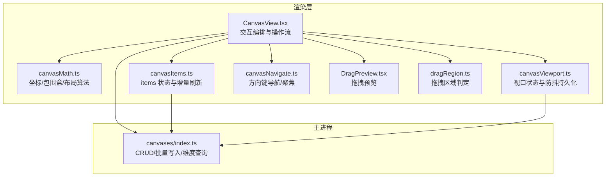
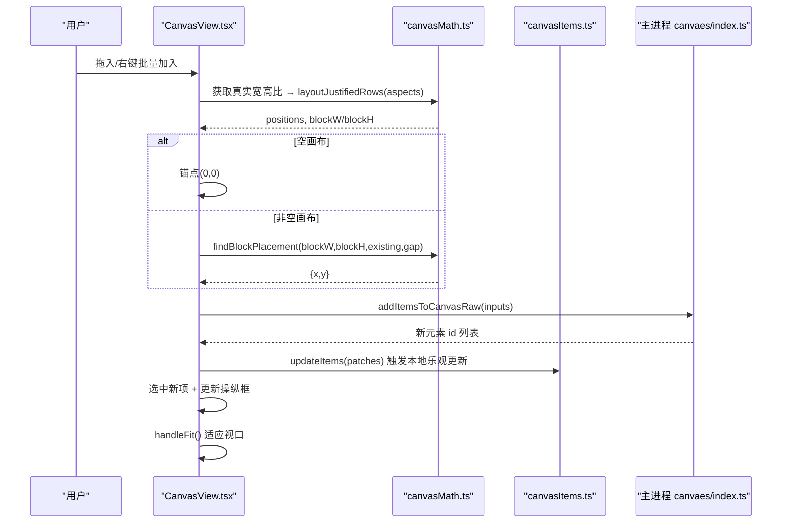
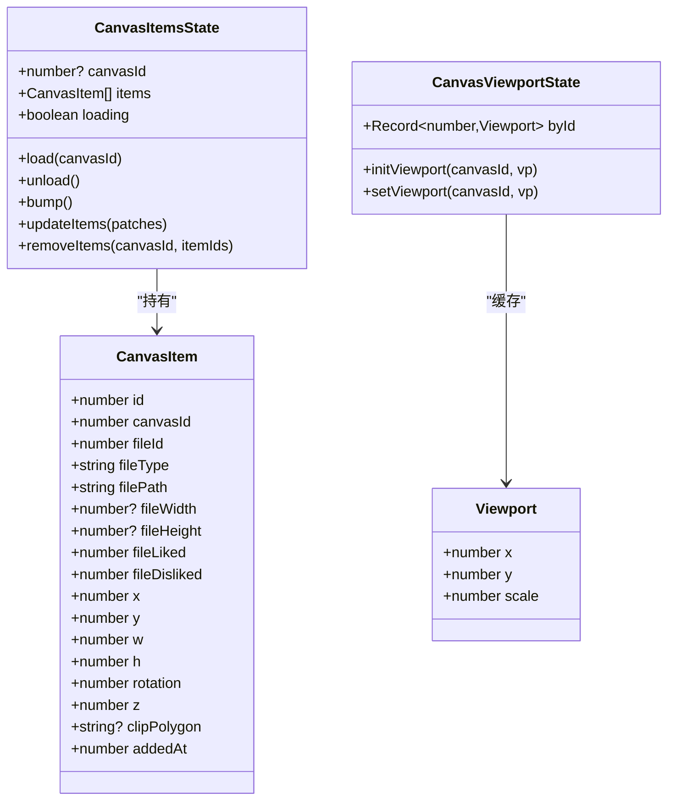
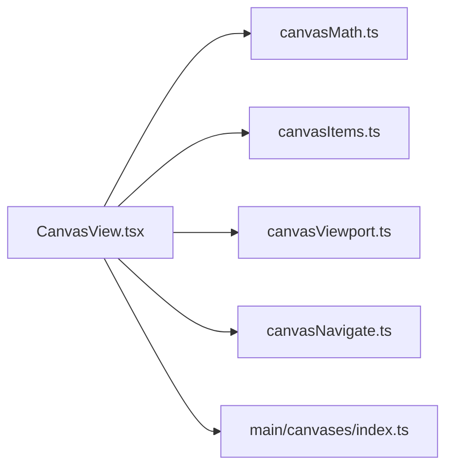

# 画布放置算法

<cite>
**本文引用的文件**   
- [canvasMath.ts](file://src/renderer/src/lib/canvasMath.ts)
- [CanvasView.tsx](file://src/renderer/src/views/canvas/CanvasView.tsx)
- [index.ts（主进程画布）](file://src/main/canvases/index.ts)
- [canvasItems.ts（前端状态）](file://src/renderer/src/stores/canvasItems.ts)
- [canvasViewport.ts（前端视口状态）](file://src/renderer/src/stores/canvasViewport.ts)
- [canvasNavigate.ts](file://src/renderer/src/lib/canvasNavigate.ts)
- [DragPreview.tsx](file://src/renderer/src/components/DragPreview.tsx)
- [dragRegion.ts](file://src/renderer/src/lib/dragRegion.ts)
- [canvas-placement-algorithm.md](file://docs/canvas-placement-algorithm.md)
</cite>

## 目录
1. [简介](#简介)
2. [项目结构](#项目结构)
3. [核心组件](#核心组件)
4. [架构总览](#架构总览)
5. [详细组件分析](#详细组件分析)
6. [依赖关系分析](#依赖关系分析)
7. [性能考量](#性能考量)
8. [故障排查指南](#故障排查指南)
9. [结论](#结论)
10. [附录](#附录)

## 简介
本文件系统化梳理 Serendip 应用的“画布放置系统”的算法与实现，覆盖自动排列策略、碰撞检测、空间优化、坐标系统与变换、拖拽交互、缩放平移、以及性能优化与扩展性设计。目标是帮助前端与 UI 工程师快速理解并正确扩展画布布局与交互逻辑。

## 项目结构
画布放置相关代码主要分布在渲染层数学库、视图交互、状态管理、以及主进程数据持久化模块：
- 渲染层数学库：提供坐标变换、包围盒计算、等高行布局、黄金角螺旋空位查找等核心算法
- 视图交互：组合上述算法完成批量加入、一键重排、复制粘贴、裁剪、旋转等操作
- 状态管理：维护 items、选择集、视口、撤销栈等
- 主进程：负责持久化插入/更新/删除，并提供媒体尺寸查询

图表来源
- [canvasMath.ts:1-226](file://src/renderer/src/lib/canvasMath.ts#L1-L226)
- [CanvasView.tsx:1-800](file://src/renderer/src/views/canvas/CanvasView.tsx#L1-L800)
- [canvasItems.ts:1-94](file://src/renderer/src/stores/canvasItems.ts#L1-L94)
- [canvasViewport.ts:1-53](file://src/renderer/src/stores/canvasViewport.ts#L1-L53)
- [canvasNavigate.ts:1-88](file://src/renderer/src/lib/canvasNavigate.ts#L1-L88)
- [DragPreview.tsx:1-68](file://src/renderer/src/components/DragPreview.tsx#L1-L68)
- [dragRegion.ts:1-17](file://src/renderer/src/lib/dragRegion.ts#L1-L17)
- [index.ts（主进程画布）:1-320](file://src/main/canvases/index.ts#L1-L320)

章节来源
- [canvasMath.ts:1-226](file://src/renderer/src/lib/canvasMath.ts#L1-L226)
- [CanvasView.tsx:1-800](file://src/renderer/src/views/canvas/CanvasView.tsx#L1-L800)
- [index.ts（主进程画布）:1-320](file://src/main/canvases/index.ts#L1-L320)

## 核心组件
- 坐标与视口
  - 屏幕↔世界坐标转换、离散档位缩放、视口适配（fitViewport）、旋转矩形 AABB 计算
- 自动布局
  - 等高行网格 layoutJustifiedRows：统一行高、贪心换行、整块近似正方形
  - 整块空位 findBlockPlacement：黄金角螺旋候选 + AABB 碰撞测试
- 交互与操作
  - 批量加入、一键重排、复制/粘贴/再制、裁剪、旋转、框选、方向键导航
- 状态与持久化
  - items 增量合并与防抖落盘、视口按画布独立防抖持久化、撤销/重做

章节来源
- [canvasMath.ts:1-226](file://src/renderer/src/lib/canvasMath.ts#L1-L226)
- [CanvasView.tsx:1-800](file://src/renderer/src/views/canvas/CanvasView.tsx#L1-L800)
- [canvasItems.ts:1-94](file://src/renderer/src/stores/canvasItems.ts#L1-L94)
- [canvasViewport.ts:1-53](file://src/renderer/src/stores/canvasViewport.ts#L1-L53)

## 架构总览
下图展示从用户操作到数据落盘的端到端流程，突出布局算法与碰撞检测在其中的作用点。

图表来源
- [CanvasView.tsx:346-397](file://src/renderer/src/views/canvas/CanvasView.tsx#L346-L397)
- [canvasMath.ts:133-226](file://src/renderer/src/lib/canvasMath.ts#L133-L226)
- [index.ts（主进程画布）:216-245](file://src/main/canvases/index.ts#L216-L245)
- [canvasItems.ts:66-85](file://src/renderer/src/stores/canvasItems.ts#L66-L85)

## 详细组件分析

### 坐标系统与变换
- 屏幕↔世界坐标
  - screenToWorld/worldToScreen 基于当前视口 scale/x/y 进行线性映射
- 离散缩放
  - 以固定步长 ZOOM_STEP 对数级切换，clampScale 限制范围
- 视口适配 fitViewport
  - 遍历所有元素求旋转后 AABB，计算整体中心与宽高，按 padding 比例反推 scale 与 x/y
- 旋转矩形 AABB
  - aabbOfRotatedRect 通过四个顶点投影取极值，用于碰撞与适配

复杂度
- fitViewport: O(n)，n 为元素数量
- aabbOfRotatedRect: O(1)

章节来源
- [canvasMath.ts:20-104](file://src/renderer/src/lib/canvasMath.ts#L20-L104)

### 自动排列：等高行网格
- 输入：各元素的宽高比数组 aspects
- 步骤
  - 将每项缩放到统一行高 H，宽 = H × aspect（非法回退 4:3）
  - 目标行数 R ≈ round(√(ΣW / H))，使整块接近正方形；目标行宽 targetRowW = ΣW / R
  - 贪心填充：逐项加入当前行，超过 targetRowW 则换行；记录行内 gap
  - 输出每个元素相对「块左上角原点」的中心坐标及整块宽高
- 使用场景
  - 空画布批量加入时直接以 (0,0) 作为块锚点
  - 已有内容时，先算出块尺寸，再用 findBlockPlacement 定位

时间复杂度
- O(n)

章节来源
- [canvasMath.ts:133-177](file://src/renderer/src/lib/canvasMath.ts#L133-L177)
- [canvas-placement-algorithm.md:22-30](file://docs/canvas-placement-algorithm.md#L22-L30)

### 空位放置：黄金角螺旋 + AABB 碰撞
- 输入：待放置块的宽高、现有元素集合、gap
- 步骤
  - 若为空画布，返回 (0,0)
  - 计算现有内容整体 AABB 中心
  - 生成候选点：r = baseStep·√i，θ = i·GOLDEN_ANGLE（≈137.5°），baseStep 与块大小和 gap 相关
  - 对每个候选点，构造 testW/testH = blockW+2*gap, blockH+2*gap 的 AABB，与所有现有元素 AABB 相交检测
  - 首个不相交即命中；兜底返回现有内容正下方
- 碰撞检测
  - rectsOverlap 采用轴对齐矩形中心距判据

时间复杂度
- 每候选 O(n)，通常几次迭代命中；最坏 O(k·n)，k 为候选上限（默认 4000）

章节来源
- [canvasMath.ts:184-226](file://src/renderer/src/lib/canvasMath.ts#L184-L226)
- [canvas-placement-algorithm.md:31-43](file://docs/canvas-placement-algorithm.md#L31-L43)

### 批量加入与一键重排
- 批量加入
  - 取新项真实宽高比 → layoutJustifiedRows 得到 positions 与块尺寸
  - 空画布锚点 (0,0)；非空画布用 findBlockPlacement 定位
  - 调用 addItemsToCanvasRaw 原样写入精确 x/y/w/h/z（避免主进程按固定宽重算）
  - 新元素 z 高于现有，随后选中并更新操纵框，最后 fitViewport
- 一键重排全部
  - 读取当前 items 的 w/h 计算 aspects，再次 layoutJustifiedRows
  - 居中于现有内容质心，rotation 归零，updateItems 批量改 x/y/w/h/rotation
  - 压入可撤销栈，完成后 fitViewport

章节来源
- [CanvasView.tsx:346-397](file://src/renderer/src/views/canvas/CanvasView.tsx#L346-L397)
- [index.ts（主进程画布）:216-245](file://src/main/canvases/index.ts#L216-L245)

### 复制/粘贴/再制与吸附对齐
- 复制/粘贴
  - 构建选区完整变换快照（含 clipPolygon）
  - 计算组 AABB 中心，根据光标位置或视口中心确定目标世界坐标
  - 按 maxZ + 序号分配 z，addItemsWithUndo 插入并选中
- 再制
  - 在原位偏移固定世界距离（OFFSET）后插入
- 吸附对齐（概念）
  - 可在拖拽过程中对候选位置进行最近对齐（如网格/边/中心），此处未在当前文件中实现，可作为扩展点

章节来源
- [CanvasView.tsx:681-800](file://src/renderer/src/views/canvas/CanvasView.tsx#L681-L800)

### 裁剪与旋转
- 裁剪（C 键 + 拖拽）
  - 屏幕矩形转世界矩形，对每个选中项执行 cropItem，生成新的 x/y/w/h/rotation/clipPolygon
  - flushSync 立即更新，moveableRef.updateRect 同步操纵框，压入撤销栈
- 四角旋转提交
  - 单选：累加 rotation
  - 多选：围绕组中心旋转，同时更新 x/y 与 rotation
  - 同样支持撤销/重做

章节来源
- [CanvasView.tsx:551-679](file://src/renderer/src/views/canvas/CanvasView.tsx#L551-L679)
- [CanvasView.tsx:399-453](file://src/renderer/src/views/canvas/CanvasView.tsx#L399-L453)

### 缩放与平移
- 滚轮缩放
  - 以光标为锚点进行离散档位缩放，保持光标处世界坐标不变
- 平移
  - 中键或 Space+左键拖拽，按 delta/scale 更新视口 x/y
- 视口持久化
  - setViewport 触发按画布独立的防抖落盘，unmount 时强制 flush

章节来源
- [CanvasView.tsx:455-549](file://src/renderer/src/views/canvas/CanvasView.tsx#L455-L549)
- [canvasViewport.ts:16-34](file://src/renderer/src/stores/canvasViewport.ts#L16-L34)

### 方向键导航与聚焦
- navigateDirection
  - 无选中：选视口中心最近元素
  - 有选中：以选区中心为起点，沿方向锥（cosθ > 0.5）找最近元素
- panToItem
  - 若元素不在视口安全区内，返回使其居中的新视口

章节来源
- [canvasNavigate.ts:18-88](file://src/renderer/src/lib/canvasNavigate.ts#L18-L88)

### 拖拽预览与拖拽区域
- DragPreview
  - 跟随光标的预览卡片，显示缩略图与类型标识，支持多选堆叠阴影与数量角标
- dragRegion
  - 判断事件是否落在标题栏拖拽区域，遇到 no-drag 子元素立即短路

章节来源
- [DragPreview.tsx:1-68](file://src/renderer/src/components/DragPreview.tsx#L1-L68)
- [dragRegion.ts:1-17](file://src/renderer/src/lib/dragRegion.ts#L1-L17)

### 数据模型与类关系

图表来源
- [index.ts（主进程画布）:22-73](file://src/main/canvases/index.ts#L22-L73)
- [canvasItems.ts:1-94](file://src/renderer/src/stores/canvasItems.ts#L1-L94)
- [canvasViewport.ts:1-53](file://src/renderer/src/stores/canvasViewport.ts#L1-L53)
- [canvasMath.ts:3-9](file://src/renderer/src/lib/canvasMath.ts#L3-L9)

## 依赖关系分析
- 低耦合
  - 布局算法集中在 canvasMath.ts，被 CanvasView.tsx 按需调用
  - 状态与视图解耦，通过 Zustand store 传递
- 关键依赖链
  - CanvasView.tsx → canvasMath.ts（布局/变换）
  - CanvasView.tsx → canvasItems.ts（增量更新）
  - CanvasView.tsx → canvasViewport.ts（视口持久化）
  - CanvasView.tsx → main/canvases/index.ts（批量写入/维度查询）
  - CanvasView.tsx → canvasNavigate.ts（导航/聚焦）

图表来源
- [CanvasView.tsx:1-800](file://src/renderer/src/views/canvas/CanvasView.tsx#L1-L800)
- [canvasMath.ts:1-226](file://src/renderer/src/lib/canvasMath.ts#L1-L226)
- [canvasItems.ts:1-94](file://src/renderer/src/stores/canvasItems.ts#L1-L94)
- [canvasViewport.ts:1-53](file://src/renderer/src/stores/canvasViewport.ts#L1-L53)
- [canvasNavigate.ts:1-88](file://src/renderer/src/lib/canvasNavigate.ts#L1-L88)
- [index.ts（主进程画布）:1-320](file://src/main/canvases/index.ts#L1-L320)

## 性能考量
- 时间复杂度
  - layoutJustifiedRows: O(n)
  - findBlockPlacement: 平均 O(k·n)，k 较小（通常几次命中），上限 4000
  - fitViewport: O(n)
  - 批量更新：主进程事务写入，前端增量合并 + 防抖落盘
- 内存与渲染
  - 使用增量 patches 合并，避免全量重建
  - 图片延迟加载与缩略图占位，减少首屏压力
  - 视口变化按画布独立防抖，降低频繁 I/O
- 可扩展优化
  - 虚拟渲染：对超大画布可按视口裁剪可见区间渲染
  - 空间索引：当 n 较大时可用四叉树/网格加速碰撞检测
  - 增量布局：仅对新增/移动项局部重排

章节来源
- [canvasItems.ts:18-32](file://src/renderer/src/stores/canvasItems.ts#L18-L32)
- [canvasViewport.ts:14-24](file://src/renderer/src/stores/canvasViewport.ts#L14-L24)
- [canvasMath.ts:133-226](file://src/renderer/src/lib/canvasMath.ts#L133-L226)

## 故障排查指南
- 批量加入后位置异常
  - 检查传入的宽高比是否为有效正数，layoutJustifiedRows 会回退 4:3
  - 确认 findBlockPlacement 的 gap 参数与期望一致
- 重排后视图跳动
  - 确保重排前计算了现有内容 AABB 质心，并以块中心对齐
- 视口丢失
  - 组件卸载时是否调用了 flushViewportNow
- 拖拽冲突
  - 检查 isOnDragRegion 是否正确识别 no-drag 子元素
- 方向键导航不生效
  - 确认 navigateDirection 的容器宽高与 viewport.scale 一致

章节来源
- [canvasMath.ts:133-226](file://src/renderer/src/lib/canvasMath.ts#L133-L226)
- [canvasViewport.ts:26-34](file://src/renderer/src/stores/canvasViewport.ts#L26-L34)
- [dragRegion.ts:1-17](file://src/renderer/src/lib/dragRegion.ts#L1-L17)
- [canvasNavigate.ts:18-88](file://src/renderer/src/lib/canvasNavigate.ts#L18-L88)

## 结论
Serendip 的画布放置系统以“等高行网格 + 黄金角螺旋空位探测”为核心，结合稳健的坐标变换与 AABB 碰撞检测，实现了紧凑、直观且可扩展的布局体验。通过增量更新、防抖持久化与延迟加载，系统在交互流畅性与资源占用之间取得良好平衡。未来可在大规模场景下引入空间索引与虚拟渲染进一步提升性能。

## 附录
- 关键 API 路径参考
  - 布局算法：[layoutJustifiedRows:133-177](file://src/renderer/src/lib/canvasMath.ts#L133-L177)、[findBlockPlacement:184-226](file://src/renderer/src/lib/canvasMath.ts#L184-L226)
  - 坐标与视口：[screenToWorld/worldToScreen:20-28](file://src/renderer/src/lib/canvasMath.ts#L20-L28)、[fitViewport:63-104](file://src/renderer/src/lib/canvasMath.ts#L63-L104)
  - 批量写入：[addItemsToCanvasRaw:216-245](file://src/main/canvases/index.ts#L216-L245)
  - 视口持久化：[setViewport/flushViewportNow:26-34](file://src/renderer/src/stores/canvasViewport.ts#L26-L34)
  - 导航与聚焦：[navigateDirection/panToItem:18-88](file://src/renderer/src/lib/canvasNavigate.ts#L18-L88)
  - 拖拽预览与区域：[DragPreview.tsx:1-68](file://src/renderer/src/components/DragPreview.tsx#L1-L68)、[isOnDragRegion:1-17](file://src/renderer/src/lib/dragRegion.ts#L1-L17)