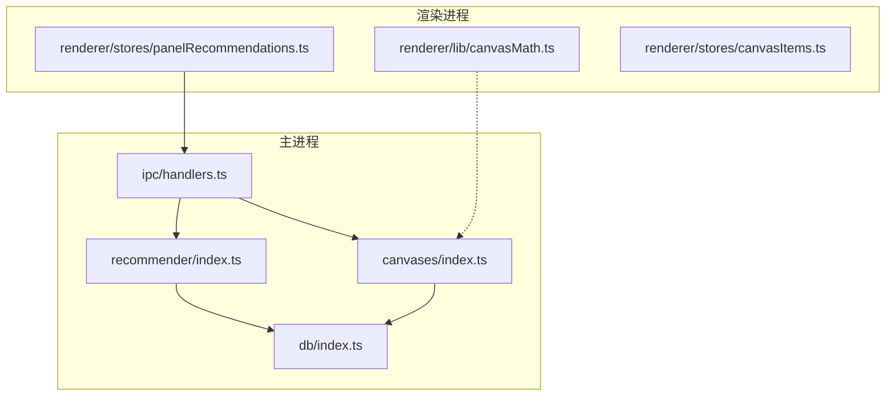
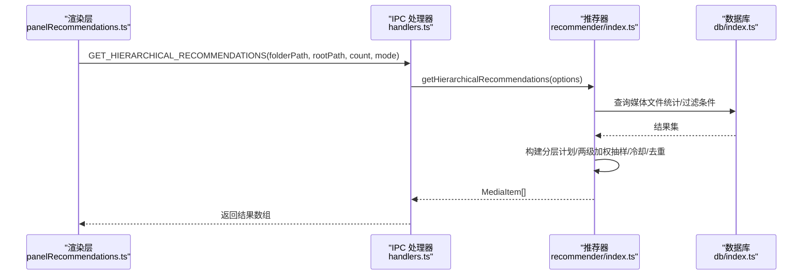
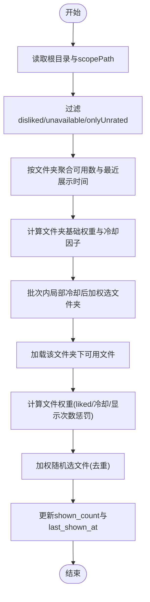
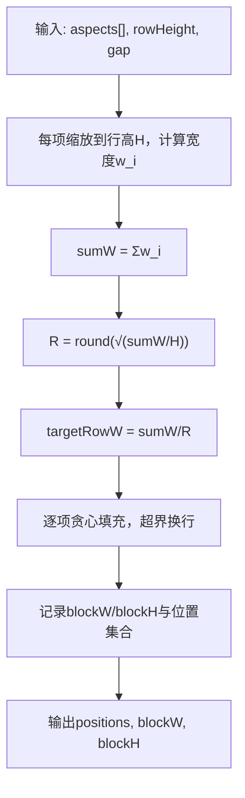
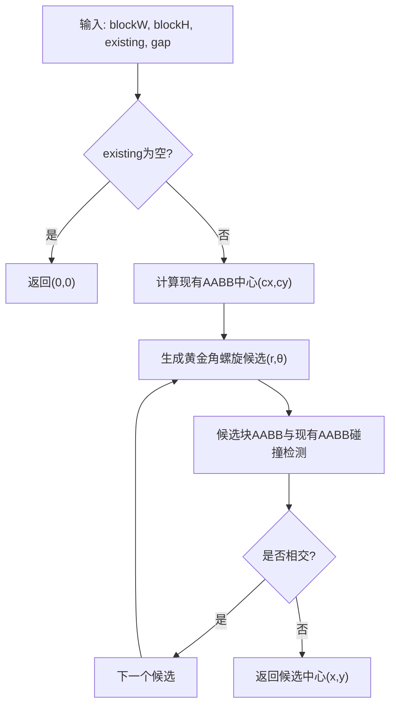
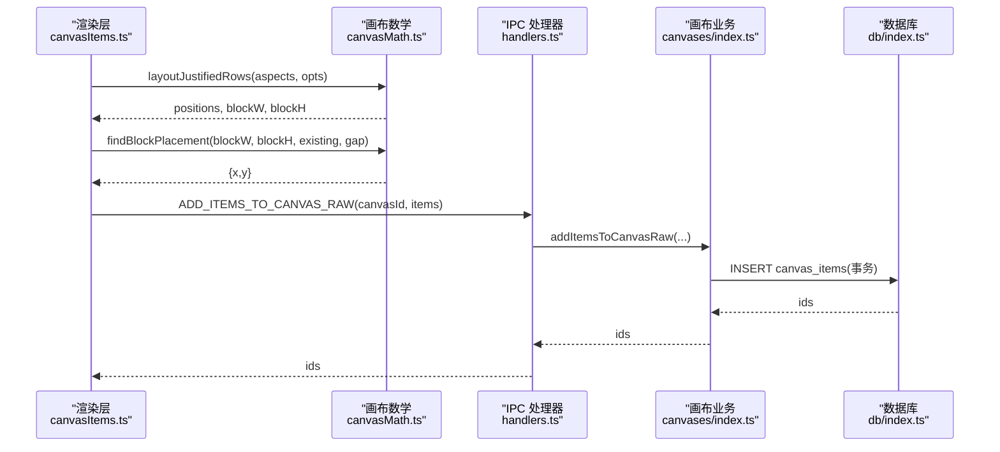
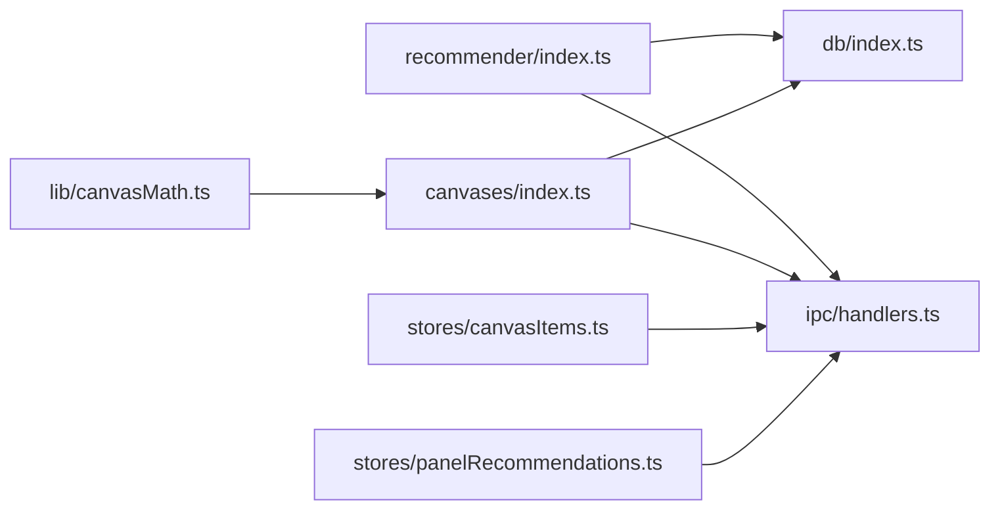

# 算法实现

<cite>
**本文引用的文件列表**
- [src/main/recommender/index.ts](file://src/main/recommender/index.ts)
- [src/renderer/src/lib/canvasMath.ts](file://src/renderer/src/lib/canvasMath.ts)
- [docs/canvas-placement-algorithm.md](file://docs/canvas-placement-algorithm.md)
- [src/main/ipc/handlers.ts](file://src/main/ipc/handlers.ts)
- [src/renderer/src/stores/panelRecommendations.ts](file://src/renderer/src/stores/panelRecommendations.ts)
- [src/main/canvases/index.ts](file://src/main/canvases/index.ts)
- [src/renderer/src/stores/canvasItems.ts](file://src/renderer/src/stores/canvasItems.ts)
- [src/main/db/index.ts](file://src/main/db/index.ts)
</cite>

## 目录
1. [引言](#引言)
2. [项目结构](#项目结构)
3. [核心组件](#核心组件)
4. [架构总览](#架构总览)
5. [详细组件分析](#详细组件分析)
6. [依赖关系分析](#依赖关系分析)
7. [性能考量](#性能考量)
8. [故障排查指南](#故障排查指南)
9. [结论](#结论)
10. [附录](#附录)

## 引言
本技术文档聚焦 Serendip 应用的核心算法，覆盖两大模块：
- 智能推荐系统：两级加权抽样（文件夹级权重 + 文件级权重调整）、冷却机制、用户偏好学习（基于 liked/disliked/shown_count/last_shown_at）与分层路径推荐。
- 画布放置算法：等高行布局（justified rows）、整块空位落点（黄金角螺旋候选 + AABB 碰撞检测）、视口适配与批量更新策略。

文档提供数学公式、伪代码、参数调优建议、复杂度分析与可扩展性说明，并给出测试与验证方法，面向算法工程师与高级开发者。

## 项目结构
与算法直接相关的代码分布在主进程与渲染进程两侧：
- 主进程：推荐器、IPC 处理器、画布业务逻辑、数据库迁移与索引。
- 渲染进程：画布数学工具库、推荐面板状态管理、画布项存储与去抖写入。

图表来源
- [src/main/recommender/index.ts:1-120](file://src/main/recommender/index.ts#L1-L120)
- [src/main/ipc/handlers.ts:84-91](file://src/main/ipc/handlers.ts#L84-L91)
- [src/main/canvases/index.ts:172-245](file://src/main/canvases/index.ts#L172-L245)
- [src/renderer/src/lib/canvasMath.ts:106-226](file://src/renderer/src/lib/canvasMath.ts#L106-L226)
- [src/renderer/src/stores/panelRecommendations.ts:88-127](file://src/renderer/src/stores/panelRecommendations.ts#L88-L127)
- [src/main/db/index.ts:1-35](file://src/main/db/index.ts#L1-L35)

章节来源
- [src/main/recommender/index.ts:1-120](file://src/main/recommender/index.ts#L1-L120)
- [src/renderer/src/lib/canvasMath.ts:106-226](file://src/renderer/src/lib/canvasMath.ts#L106-L226)
- [docs/canvas-placement-algorithm.md:1-65](file://docs/canvas-placement-algorithm.md#L1-L65)
- [src/main/ipc/handlers.ts:84-91](file://src/main/ipc/handlers.ts#L84-L91)
- [src/renderer/src/stores/panelRecommendations.ts:88-127](file://src/renderer/src/stores/panelRecommendations.ts#L88-L127)
- [src/main/canvases/index.ts:172-245](file://src/main/canvases/index.ts#L172-L245)
- [src/main/db/index.ts:1-35](file://src/main/db/index.ts#L1-L35)

## 核心组件
- 推荐器（两级加权抽样）
  - 文件夹级权重：按可用文件数进行幂次抑制，结合最近展示时间做半衰期冷却。
  - 文件级权重：liked 加成、冷却、显示次数惩罚；支持“仅未评级”模式。
  - 探索模式：prefer/balanced/explore 三套参数控制偏好与探索强度。
  - 分层路径推荐：以当前文件夹为锚点，向上父链逐级放宽采样，避免局部饱和。
- 画布放置算法
  - 等高行布局：统一行高，贪心换行，使整体接近正方形。
  - 整块空位放置：黄金角螺旋候选 + AABB 碰撞检测，快速定位空白区域。
  - 视口适配：计算所有元素旋转后的 AABB，自动缩放和平移至可视范围。

章节来源
- [src/main/recommender/index.ts:57-149](file://src/main/recommender/index.ts#L57-L149)
- [src/main/recommender/index.ts:155-206](file://src/main/recommender/index.ts#L155-L206)
- [src/main/recommender/index.ts:454-460](file://src/main/recommender/index.ts#L454-L460)
- [src/main/recommender/index.ts:471-504](file://src/main/recommender/index.ts#L471-L504)
- [src/renderer/src/lib/canvasMath.ts:133-177](file://src/renderer/src/lib/canvasMath.ts#L133-L177)
- [src/renderer/src/lib/canvasMath.ts:184-225](file://src/renderer/src/lib/canvasMath.ts#L184-L225)
- [src/renderer/src/lib/canvasMath.ts:63-104](file://src/renderer/src/lib/canvasMath.ts#L63-L104)

## 架构总览
推荐与画布两条主线通过 IPC 连接渲染层与主进程，数据持久化由 SQLite 承担。

图表来源
- [src/renderer/src/stores/panelRecommendations.ts:99-104](file://src/renderer/src/stores/panelRecommendations.ts#L99-L104)
- [src/main/ipc/handlers.ts:89-91](file://src/main/ipc/handlers.ts#L89-L91)
- [src/main/recommender/index.ts:155-206](file://src/main/recommender/index.ts#L155-L206)
- [src/main/db/index.ts:1-35](file://src/main/db/index.ts#L1-L35)

## 详细组件分析

### 智能推荐系统：两级加权抽样与冷却机制
- 目标
  - 在根目录下，优先曝光“小而精”的文件夹，同时兼顾用户偏好与近期展示历史，避免重复与虹吸效应。
- 关键流程
  - 读取根目录与可选 scopePath，过滤 disliked/unavailable/onlyUnrated。
  - 按文件夹聚合可用文件数与最近展示时间，计算基础权重与冷却因子。
  - 批次内对文件夹做局部冷却，再在选定文件夹内按文件权重抽样。
  - 更新 shown_count 与 last_shown_at。
- 数学模型
  - 文件夹基础权重：W_f = (N_f)^(-α)，其中 N_f 为可用文件数，α ∈ [0.4, 0.85] 随模式变化。
  - 文件夹冷却因子：C_f(t) = max(0.05, 1 - 0.95 × 0.5^(t / T_f))，T_f 为半衰期秒数。
  - 文件权重：W_i = B_i × C_i(t) × (1 + S_i)^(-β)，其中 B_i 含 liked 加成，S_i 为显示次数，β ∈ [0.1, 0.5]。
  - 批次内文件夹局部冷却：每被抽中一次，权重乘以 γ^k（γ ∈ [0.2, 0.6]）。
- 伪代码
  - 文件夹选择
    - 输入：folders[{path, weight, fileCount}]，localShown{path→count}，params
    - 计算 adjustedWeight[f] = weight[f] × γ^(localShown[f])
    - 归一化后随机选一个文件夹
  - 文件选择
    - 输入：files[{id, liked, last_shown_at, shown_count}]，excludeIds，seenInBatch，params
    - 计算 w[i] = (liked ? boost : 1) × C_i(t) × (1 + shown_count)^(-β)
    - 累积权重随机选中，跳过 excludeIds 与 seenInBatch
- 参数表（按模式）
  - prefer：folderAlpha=0.4，folderCooldownHalfLifeSec=60，fileCooldownHalfLifeSec=300，likedBoost=4.0，shownCountPenalty=0.1，localCooldownDecay=0.6
  - balanced：folderAlpha=0.6，folderCooldownHalfLifeSec=180，fileCooldownHalfLifeSec=1200，likedBoost=2.0，shownCountPenalty=0.3，localCooldownDecay=0.4
  - explore：folderAlpha=0.85，folderCooldownHalfLifeSec=600，fileCooldownHalfLifeSec=3600，likedBoost=1.0，shownCountPenalty=0.5，localCooldownDecay=0.2
- 分层路径推荐
  - 根据当前文件夹文件数 N 决定当前层占比（≤2 → 0%，≤15 → 25%，≤50 → 35%，≤200 → 45%，>200 → 50%），父链按 60%/25%/15% 递减分配，最后一层吸收舍入误差。
  - 当前层精确匹配 folder_path，父链层用 LIKE 前缀递归调用 recommend。
  - 最终打乱顺序，截断到 count。

图表来源
- [src/main/recommender/index.ts:57-149](file://src/main/recommender/index.ts#L57-L149)
- [src/main/recommender/index.ts:394-448](file://src/main/recommender/index.ts#L394-L448)
- [src/main/recommender/index.ts:454-460](file://src/main/recommender/index.ts#L454-L460)
- [src/main/recommender/index.ts:471-504](file://src/main/recommender/index.ts#L471-L504)

章节来源
- [src/main/recommender/index.ts:57-149](file://src/main/recommender/index.ts#L57-L149)
- [src/main/recommender/index.ts:155-206](file://src/main/recommender/index.ts#L155-L206)
- [src/main/recommender/index.ts:279-359](file://src/main/recommender/index.ts#L279-L359)
- [src/main/recommender/index.ts:394-448](file://src/main/recommender/index.ts#L394-L448)
- [src/main/recommender/index.ts:454-460](file://src/main/recommender/index.ts#L454-L460)
- [src/main/recommender/index.ts:471-504](file://src/main/recommender/index.ts#L471-L504)

#### 用户偏好学习与可配置项
- 偏好信号
  - liked：提升文件权重（boost 系数）。
  - disliked：参与过滤（不参与抽样）。
  - shown_count：惩罚高频曝光，鼓励发现新内容。
  - last_shown_at：冷却函数降低近期曝光过的文件/文件夹权重。
- 可配置项
  - 探索模式：prefer/balanced/explore 切换不同参数组合。
  - onlyUnrated：评审模式下仅返回未评级文件。
  - scopePath：限定抽样路径范围（必须在 rootPath 之下）。
- 扩展建议
  - 引入更多信号：浏览时长、交互反馈（收藏/分享）、缩略图质量等。
  - 动态参数：根据用户活跃度或库规模自适应调节 α、β、半衰期。

章节来源
- [src/main/recommender/index.ts:471-504](file://src/main/recommender/index.ts#L471-L504)
- [src/main/recommender/index.ts:31-46](file://src/main/recommender/index.ts#L31-L46)

### 画布放置算法：等高行布局与空位落点
- 等高行布局（justified rows）
  - 将每个元素缩放到统一行高 H，宽度按宽高比计算；非法比例回退 4:3。
  - 目标行数 R ≈ round(√(ΣW / H))，目标行宽 targetRowW = ΣW / R。
  - 贪心填充：若加入下一项超过 targetRowW 则换行，记录块尺寸 blockW/blockH。
- 整块空位放置（findBlockPlacement）
  - 计算现有内容的 AABB 中心作为视觉中心。
  - 生成黄金角螺旋候选点 r = baseStep·√i，θ = i·137.5°，baseStep = (max(blockW,blockH)+gap)·0.5。
  - 对每个候选点，检查「块 AABB（含 gap）」是否与任意现有元素 AABB 相交，首个不相交即命中。
  - 空画布直接返回 (0,0)。
- 视口适配（fitViewport）
  - 遍历所有元素，考虑 rotation 的 AABB，计算整体包围盒。
  - 根据视口宽高与 padding 计算 scale，居中平移。

图表来源
- [src/renderer/src/lib/canvasMath.ts:133-177](file://src/renderer/src/lib/canvasMath.ts#L133-L177)

图表来源
- [src/renderer/src/lib/canvasMath.ts:184-225](file://src/renderer/src/lib/canvasMath.ts#L184-L225)

章节来源
- [src/renderer/src/lib/canvasMath.ts:133-177](file://src/renderer/src/lib/canvasMath.ts#L133-L177)
- [src/renderer/src/lib/canvasMath.ts:184-225](file://src/renderer/src/lib/canvasMath.ts#L184-L225)
- [src/renderer/src/lib/canvasMath.ts:63-104](file://src/renderer/src/lib/canvasMath.ts#L63-L104)
- [docs/canvas-placement-algorithm.md:24-47](file://docs/canvas-placement-algorithm.md#L24-L47)

### 画布添加与批量更新流程
- 添加流程
  - 渲染层获取真实宽高（getMediaDimensions），使用 layoutJustifiedRows 排布，空画布居中原点，非空画布 findBlockPlacement 定位。
  - 使用 addItemsToCanvasRaw 原样写入 x/y/w/h/z/rotation/clipPolygon，避免主进程按固定宽重算。
- 批量更新
  - 渲染层 useCanvasItemsStore 维护 pendingPatches，250ms debounce 合并 flush 到主进程 updateCanvasItems，减少 IO 压力。

图表来源
- [src/renderer/src/lib/canvasMath.ts:133-177](file://src/renderer/src/lib/canvasMath.ts#L133-L177)
- [src/renderer/src/lib/canvasMath.ts:184-225](file://src/renderer/src/lib/canvasMath.ts#L184-L225)
- [src/main/ipc/handlers.ts:232-235](file://src/main/ipc/handlers.ts#L232-L235)
- [src/main/canvases/index.ts:216-245](file://src/main/canvases/index.ts#L216-L245)
- [src/main/db/index.ts:1-35](file://src/main/db/index.ts#L1-L35)

章节来源
- [src/main/canvases/index.ts:216-245](file://src/main/canvases/index.ts#L216-L245)
- [src/renderer/src/stores/canvasItems.ts:66-85](file://src/renderer/src/stores/canvasItems.ts#L66-L85)
- [src/main/ipc/handlers.ts:232-235](file://src/main/ipc/handlers.ts#L232-L235)

## 依赖关系分析
- 推荐器依赖
  - 数据库：media_files/folders/settings 表，利用索引加速过滤与聚合。
  - IPC：暴露 recommend 与 getHierarchicalRecommendations。
- 画布算法依赖
  - 渲染层 math 工具：aabbOfRotatedRect、layoutJustifiedRows、findBlockPlacement、fitViewport。
  - 主进程 canavs 模块：addItemsToCanvasRaw、updateCanvasItems、getMediaDimensions。
  - IPC：渲染层通过 window.api 调用主进程能力。
- 外部依赖
  - better-sqlite3：WAL 模式、事务、外键约束。
  - Electron：IPC、文件系统访问、窗口控制。

图表来源
- [src/main/recommender/index.ts:1-20](file://src/main/recommender/index.ts#L1-L20)
- [src/main/ipc/handlers.ts:1-38](file://src/main/ipc/handlers.ts#L1-L38)
- [src/main/canvases/index.ts:1-10](file://src/main/canvases/index.ts#L1-L10)
- [src/renderer/src/lib/canvasMath.ts:1-10](file://src/renderer/src/lib/canvasMath.ts#L1-L10)
- [src/renderer/src/stores/canvasItems.ts:1-10](file://src/renderer/src/stores/canvasItems.ts#L1-L10)
- [src/renderer/src/stores/panelRecommendations.ts:1-10](file://src/renderer/src/stores/panelRecommendations.ts#L1-L10)

章节来源
- [src/main/recommender/index.ts:1-20](file://src/main/recommender/index.ts#L1-L20)
- [src/main/ipc/handlers.ts:1-38](file://src/main/ipc/handlers.ts#L1-L38)
- [src/main/canvases/index.ts:1-10](file://src/main/canvases/index.ts#L1-L10)
- [src/renderer/src/lib/canvasMath.ts:1-10](file://src/renderer/src/lib/canvasMath.ts#L1-L10)
- [src/renderer/src/stores/canvasItems.ts:1-10](file://src/renderer/src/stores/canvasItems.ts#L1-L10)
- [src/renderer/src/stores/panelRecommendations.ts:1-10](file://src/renderer/src/stores/panelRecommendations.ts#L1-L10)

## 性能考量
- 推荐器
  - 时间复杂度：O(F + Σn_f)，F 为文件夹数，n_f 为各文件夹可用文件数。主要开销在 SQL 聚合与文件权重计算。
  - 空间复杂度：O(F + n_max)，n_max 为最大文件夹的文件数。
  - 优化建议：
    - 合理设置只读缓存（如最近一批结果的小窗口缓存）以减少重复计算。
    - 对 large folders 采用分片抽样或延迟加载。
    - 调整 α、β、半衰期以平衡探索与偏好。
- 画布布局
  - 等高行布局 O(n)，整块空位放置平均 O(k·m)，k 为候选数（通常很小），m 为现有元素数。
  - 视口适配 O(m)。
  - 优化建议：
    - 对大量元素场景，使用空间索引（如四叉树）加速碰撞检测。
    - 批量更新使用事务与 debounce 合并，减少 IO。
- 数据库
  - WAL 模式提升并发读写性能。
  - 索引：folder_path、type、liked、disliked、last_shown_at、unavailable 等用于高效过滤与排序。

[本节为通用性能讨论，不直接分析具体文件]

## 故障排查指南
- 推荐结果为空
  - 检查根目录是否存在、scopePath 是否在 rootPath 之下。
  - 确认 media_files 中 disliked/unavailable 标记是否正确。
  - 查看 onlyUnrated 模式是否导致无可用项。
- 推荐重复或分布不均
  - 调整 folderAlpha、fileCooldownHalfLifeSec、shownCountPenalty。
  - 检查 localCooldownDecay 是否过强导致同批次内文件夹冷度过高。
- 画布重叠或布局异常
  - 检查宽高比是否为正且有限，否则回退 4:3。
  - 增大 gap 或调整 rowHeight 以改善紧凑度。
  - 对于大量元素，考虑增加 findBlockPlacement 的最大迭代上限或引入空间索引。
- 批量更新卡顿
  - 确认 debounce 间隔与批大小，避免单次过大。
  - 确保主进程使用事务批量写入。

章节来源
- [src/main/recommender/index.ts:57-149](file://src/main/recommender/index.ts#L57-L149)
- [src/renderer/src/lib/canvasMath.ts:133-177](file://src/renderer/src/lib/canvasMath.ts#L133-L177)
- [src/renderer/src/lib/canvasMath.ts:184-225](file://src/renderer/src/lib/canvasMath.ts#L184-L225)
- [src/renderer/src/stores/canvasItems.ts:66-85](file://src/renderer/src/stores/canvasItems.ts#L66-L85)

## 结论
Serendip 的推荐系统与画布放置算法在工程上实现了良好的平衡：
- 推荐系统通过两级加权抽样与冷却机制，有效缓解大文件夹虹吸与重复曝光问题，并通过分层路径推荐增强上下文相关性。
- 画布放置算法以等高行布局与黄金角螺旋空位搜索为核心，兼顾紧凑性与视觉连续性，配合批量更新与视口适配，满足大规模元素的交互需求。
- 通过参数化与可扩展设计，算法可在不同使用场景下进行灵活调优与扩展。

[本节为总结性内容，不直接分析具体文件]

## 附录

### 数学公式汇总
- 文件夹基础权重：W_f = (N_f)^(-α)
- 文件夹冷却因子：C_f(t) = max(0.05, 1 - 0.95 × 0.5^(t / T_f))
- 文件权重：W_i = B_i × C_i(t) × (1 + S_i)^(-β)
- 批次内文件夹局部冷却：adjustedWeight[f] = weight[f] × γ^(localShown[f])
- 等高行布局：R = round(√(ΣW / H))，targetRowW = ΣW / R
- 黄金角螺旋：r = baseStep·√i，θ = i·137.5°

[本节为概念性汇总，不直接分析具体文件]

### 参数调优指南
- prefer 模式：提高 likedBoost、降低 shownCountPenalty、缩短 fileCooldownHalfLifeSec，强化偏好。
- explore 模式：增大 folderAlpha、提高 shownCountPenalty、延长 fileCooldownHalfLifeSec，鼓励探索。
- balanced 模式：折中参数，适合一般浏览。
- 分层路径推荐：根据当前文件夹文件数调整 currentRatio，避免小文件夹过度饱和。

章节来源
- [src/main/recommender/index.ts:471-504](file://src/main/recommender/index.ts#L471-L504)
- [src/main/recommender/index.ts:211-274](file://src/main/recommender/index.ts#L211-L274)

### 测试用例与验证方法
- 推荐器单元测试
  - 输入：不同模式的参数组合、不同文件夹大小分布、不同 liked/disliked 比例。
  - 期望：覆盖率、重复率、曝光均匀性、冷却效果符合预期。
  - 指标：Jensen-Shannon 距离衡量分布差异；重复率 ≤ 阈值；平均等待时间（冷却恢复）符合半衰期设定。
- 画布布局单元测试
  - 输入：不同宽高比集合、不同 gap/rowHeight。
  - 期望：positions 不重叠、blockW/blockH 正确、空画布返回原点。
  - 指标：碰撞检测通过率 100%；布局面积利用率 ≥ 阈值。
- 集成测试
  - 端到端：渲染层调用 IPC → 主进程执行算法 → 数据库写入 → 渲染层刷新。
  - 压测：大批量元素（数千）下的布局与碰撞检测耗时。

[本节为方法论说明，不直接分析具体文件]