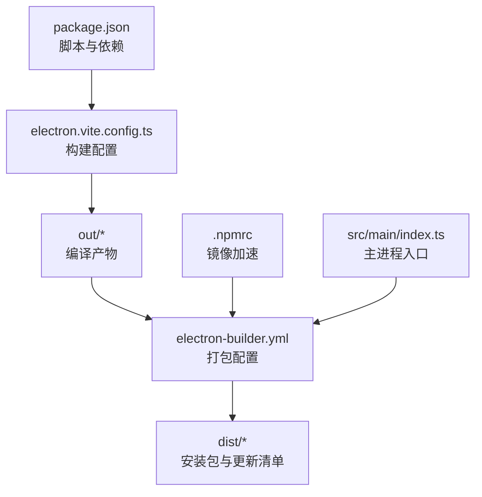
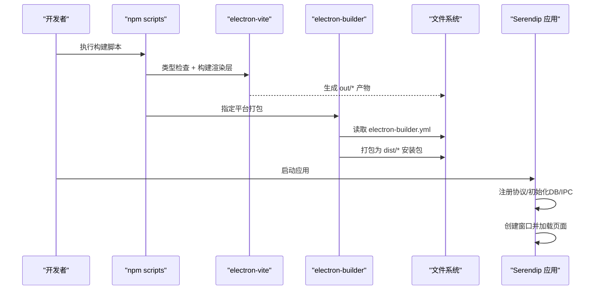
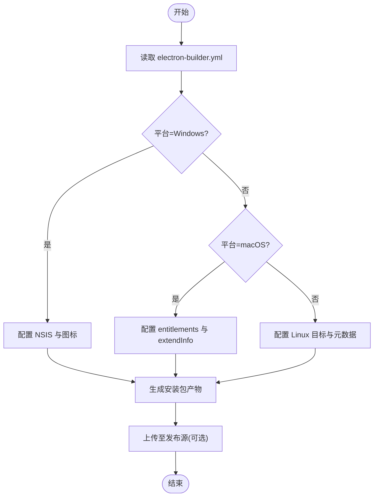
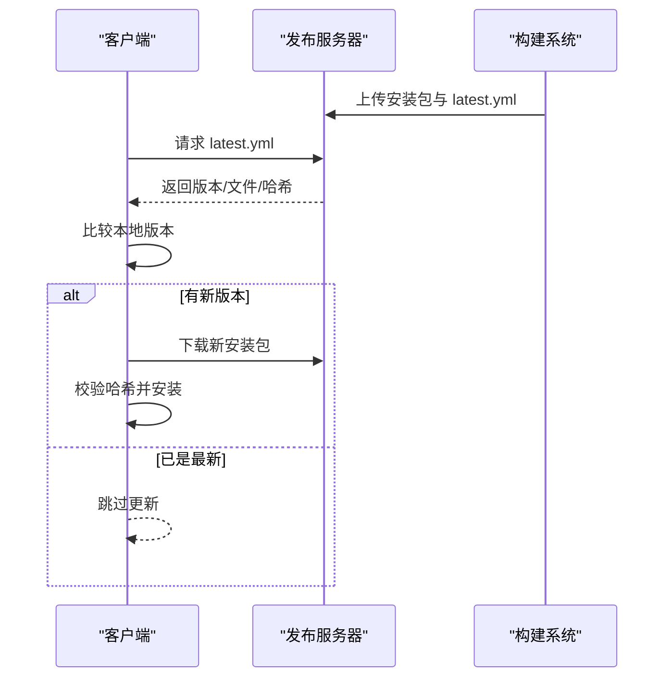
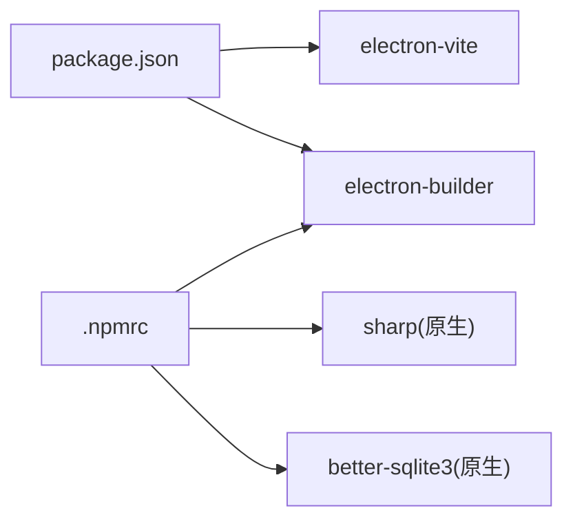

# 部署与发布

<cite>
**本文引用的文件**   
- [package.json](file://package.json)
- [electron-builder.yml](file://electron-builder.yml)
- [electron.vite.config.ts](file://electron.vite.config.ts)
- [README.md](file://README.md)
- [.npmrc](file://.npmrc)
- [src/main/index.ts](file://src/main/index.ts)
- [dist/latest.yml](file://dist/latest.yml)
</cite>

## 目录
1. [简介](#简介)
2. [项目结构](#项目结构)
3. [核心组件](#核心组件)
4. [架构总览](#架构总览)
5. [详细组件分析](#详细组件分析)
6. [依赖分析](#依赖分析)
7. [性能考虑](#性能考虑)
8. [故障排查指南](#故障排查指南)
9. [结论](#结论)
10. [附录](#附录)

## 简介
本指南面向运维与发布工程师，提供 Serendip（基于 Electron + electron-vite）在 Windows、macOS、Linux 的跨平台打包与发布方案。内容涵盖：
- electron-builder 配置项解读与自定义打包流程
- 自动化构建脚本与 CI/CD 流水线示例
- 应用签名、代码公证与安全证书管理
- 版本管理与自动更新机制
- 生产环境部署最佳实践与性能优化建议
- 安装包定制、图标资源配置与应用元数据设置
- 发布渠道管理与自动更新配置

## 项目结构
本项目采用标准 Electron 工程组织方式，结合 electron-vite 进行前端构建，使用 electron-builder 完成多平台打包与发布。关键配置文件如下：
- package.json：定义脚本命令、入口与依赖
- electron-builder.yml：打包目标、产物命名、平台特性、发布源等
- electron.vite.config.ts：Vite 构建与别名配置
- .npmrc：镜像加速与原生模块二进制下载源
- src/main/index.ts：主进程初始化、窗口创建、协议注册等



图表来源
- [package.json:1-70](file://package.json#L1-L70)
- [electron.vite.config.ts:1-17](file://electron.vite.config.ts#L1-L17)
- [electron-builder.yml:1-45](file://electron-builder.yml#L1-L45)
- [.npmrc:1-17](file://.npmrc#L1-L17)
- [src/main/index.ts:1-134](file://src/main/index.ts#L1-L134)

章节来源
- [package.json:1-70](file://package.json#L1-L70)
- [electron.vite.config.ts:1-17](file://electron.vite.config.ts#L1-L17)
- [README.md:1-66](file://README.md#L1-L66)

## 核心组件
- 构建与打包
  - 通过 npm scripts 统一触发类型检查、Vite 构建与 electron-builder 打包。
  - 支持开发预览、本地调试、单平台构建与目录输出。
- 打包配置
  - 应用标识、产品名称、资源目录、asar 解包策略、各平台专属选项、NSIS/Dmg/AppImage 产物命名、发布源等。
- 运行期能力
  - 主进程注册自定义协议、窗口标题栏覆盖、全屏事件广播、数据库与缩略图协议初始化等。

章节来源
- [package.json:9-22](file://package.json#L9-L22)
- [electron-builder.yml:1-45](file://electron-builder.yml#L1-L45)
- [src/main/index.ts:25-91](file://src/main/index.ts#L25-L91)

## 架构总览
下图展示从源码到安装包的端到端构建与发布流程，以及运行时主进程的关键初始化步骤。



图表来源
- [package.json:9-22](file://package.json#L9-L22)
- [electron.vite.config.ts:1-17](file://electron.vite.config.ts#L1-L17)
- [electron-builder.yml:1-45](file://electron-builder.yml#L1-L45)
- [src/main/index.ts:93-125](file://src/main/index.ts#L93-L125)

## 详细组件分析

### 跨平台打包配置（Windows / macOS / Linux）
- 通用配置
  - 应用 ID、产品名、构建资源目录、打包文件过滤规则、asar 解包策略。
- Windows
  - 可执行文件名、图标、NSIS 安装包产物命名、快捷方式策略。
- macOS
  - 继承权限描述文件、扩展 Info 字段（相机/麦克风/文档/下载访问说明）、是否开启公证开关。
- Linux
  - 目标格式（AppImage/snap/deb）、维护者信息、分类。
- 其他
  - 禁用 npm rebuild 以加速构建；publish 指向通用静态服务器用于自动更新。



图表来源
- [electron-builder.yml:1-45](file://electron-builder.yml#L1-L45)

章节来源
- [electron-builder.yml:1-45](file://electron-builder.yml#L1-L45)

### 自动化构建脚本
- 常用命令
  - 开发预览、本地调试、类型检查、构建、仅目录输出、按平台构建。
- 推荐工作流
  - 本地先执行类型检查与构建，再按需选择平台打包；CI 中并行构建多平台。

章节来源
- [package.json:9-22](file://package.json#L9-L22)
- [README.md:17-34](file://README.md#L17-L34)

### CI/CD 流水线示例（GitHub Actions）
以下示例演示如何在 GitHub Actions 中并行构建三平台安装包，并将产物上传到仓库 Release。请根据实际仓库与密钥进行适配。

```yaml
name: Build & Release
on:
  push:
    tags:
      - 'v*'
jobs:
  build:
    strategy:
      matrix:
        os: [windows-latest, macos-latest, ubuntu-latest]
    runs-on: ${{ matrix.os }}
    steps:
      - uses: actions/checkout@v4
      - name: Setup Node.js
        uses: actions/setup-node@v4
        with:
          node-version: 20
          cache: 'npm'
      - name: Install dependencies
        run: npm ci
      - name: Build app
        run: npm run build
      - name: Package (Windows)
        if: matrix.os == 'windows-latest'
        run: npm run build:win
      - name: Package (macOS)
        if: matrix.os == 'macos-latest'
        run: npm run build:mac
      - name: Package (Linux)
        if: matrix.os == 'ubuntu-latest'
        run: npm run build:linux
      - name: Upload artifacts
        uses: actions/upload-artifact@v4
        with:
          name: dist-${{ matrix.os }}
          path: dist/
```

说明
- 使用矩阵并行构建三平台。
- 若需自动发布到 GitHub Releases，可在后续步骤调用 gh CLI 或专用 action。
- 如需启用自动更新，请将 publish.url 指向可被客户端访问的静态地址，并在服务器上放置 latest.yml 与对应安装包。

[本节为概念性示例，不直接分析具体文件，故无“章节来源”]

### 应用签名、代码公证与安全证书管理
- Windows
  - 使用 Authenticode 对 exe/dll 签名，提升可信度与防篡改。
  - 建议在 CI 中通过环境变量注入证书路径与密码，避免硬编码。
- macOS
  - 使用 Developer ID 对应用与 dmg 签名，并通过 Apple Notary Service 公证。
  - 配置 entitlements 与 extendInfo 声明系统权限，确保沙箱与隐私合规。
- Linux
  - 一般无需签名，但可通过 gpg 对 deb 包签名以提升信任度。

注意
- 当前 electron-builder.yml 中 macOS 的公证开关已关闭，可按需开启并配置相关凭据。

章节来源
- [electron-builder.yml:22-31](file://electron-builder.yml#L22-L31)

### 版本管理与自动更新机制
- 版本来源
  - 版本号来自 package.json 的 version 字段，electron-builder 会将其写入产物与更新清单。
- 更新清单
  - 构建后会在 dist 目录生成 latest.yml，包含版本、文件列表、哈希与发布日期。
- 发布源
  - electron-builder.yml 的 publish 指向通用静态服务器，客户端据此拉取更新清单与增量包。
- 客户端集成
  - 在主进程中集成自动更新逻辑，定期或手动检查更新，校验哈希后下载安装。



图表来源
- [package.json:1-10](file://package.json#L1-L10)
- [electron-builder.yml:42-45](file://electron-builder.yml#L42-L45)
- [dist/latest.yml:1-9](file://dist/latest.yml#L1-L9)

章节来源
- [package.json:1-10](file://package.json#L1-L10)
- [electron-builder.yml:42-45](file://electron-builder.yml#L42-L45)
- [dist/latest.yml:1-9](file://dist/latest.yml#L1-L9)

### 安装包定制、图标资源配置与应用元数据
- 图标与资源
  - Windows 图标路径、构建资源目录、asar 解包策略（如 resources/**）。
- 元数据
  - 应用 ID、产品名、维护者、分类等。
- NSIS 与 Dmg
  - 安装包名称模板、快捷方式策略、DMG 产物命名等。

章节来源
- [electron-builder.yml:1-41](file://electron-builder.yml#L1-L41)

### 发布渠道管理与自动更新配置
- 渠道策略
  - 可使用不同 URL 前缀区分稳定版与测试版，例如 stable 与 beta。
- 客户端行为
  - 根据渠道选择对应的更新源，实现灰度发布与回滚。
- 服务器要求
  - 提供稳定的 HTTP(S) 服务，确保 latest.yml 与安装包可被客户端访问与校验。

[本节为概念性说明，不直接分析具体文件，故无“章节来源”]

### 主进程初始化与运行时要点
- 自定义协议注册
  - 在应用准备阶段注册私有协议，赋予安全与网络能力。
- 窗口与主题
  - 根据平台设置标题栏覆盖与颜色，处理全屏与移动事件。
- 启动同步
  - 启动时读取根目录设置，执行静默扫描并启动文件监听器。

章节来源
- [src/main/index.ts:25-91](file://src/main/index.ts#L25-L91)
- [src/main/index.ts:93-125](file://src/main/index.ts#L93-L125)

## 依赖分析
- 构建与打包
  - electron-vite：负责主进程与渲染层构建
  - electron-builder：负责多平台打包与发布
- 原生模块与镜像
  - sharp、better-sqlite3 等原生模块通过 .npmrc 配置的镜像加速下载，减少构建失败概率。



图表来源
- [package.json:43-68](file://package.json#L43-L68)
- [.npmrc:1-17](file://.npmrc#L1-L17)

章节来源
- [package.json:43-68](file://package.json#L43-L68)
- [.npmrc:1-17](file://.npmrc#L1-L17)

## 性能考虑
- 构建优化
  - 使用 npm ci 与缓存依赖，减少重复安装时间。
  - 禁用 npmRebuild 以避免不必要的原生模块重建。
- 产物体积
  - 合理配置 files 白/黑名单，排除开发文件与无关资源。
  - 谨慎使用 asarUnpack，仅对必须解包的资源进行解包。
- 运行时体验
  - 利用虚拟化与懒加载降低首屏压力。
  - 合理使用 IPC 与事件广播，避免频繁通信。

[本节为通用建议，不直接分析具体文件，故无“章节来源”]

## 故障排查指南
- 构建失败（原生模块）
  - 检查 .npmrc 镜像是否可达，确认 Node 版本满足依赖要求。
  - 清理缓存后重试安装与构建。
- 自动更新失败
  - 确认 publish.url 可访问且 latest.yml 与安装包一致。
  - 核对哈希值与文件大小，确保服务端未截断或损坏。
- macOS 权限问题
  - 检查 entitlements 与 extendInfo 是否正确声明所需权限。
  - 如需公证，请在 CI 中正确配置凭据并开启 notarize。

章节来源
- [.npmrc:1-17](file://.npmrc#L1-L17)
- [electron-builder.yml:22-31](file://electron-builder.yml#L22-L31)
- [electron-builder.yml:42-45](file://electron-builder.yml#L42-L45)

## 结论
通过统一的脚本与清晰的 electron-builder 配置，Serendip 实现了跨平台的一键打包与发布。配合 CI/CD 与自动更新机制，可高效交付稳定版本。在生产环境中，应重视签名与公证、镜像加速与产物瘦身，以获得更好的用户体验与安全性。

[本节为总结性内容，不直接分析具体文件，故无“章节来源”]

## 附录
- 快速上手
  - 安装依赖、开发预览、类型检查、构建与打包命令参考 README 与 package.json。
- 参考链接
  - electron-builder 官方文档
  - GitHub Actions 文档
  - Apple Developer ID 与 Notary Service 文档

[本节为补充信息，不直接分析具体文件，故无“章节来源”]