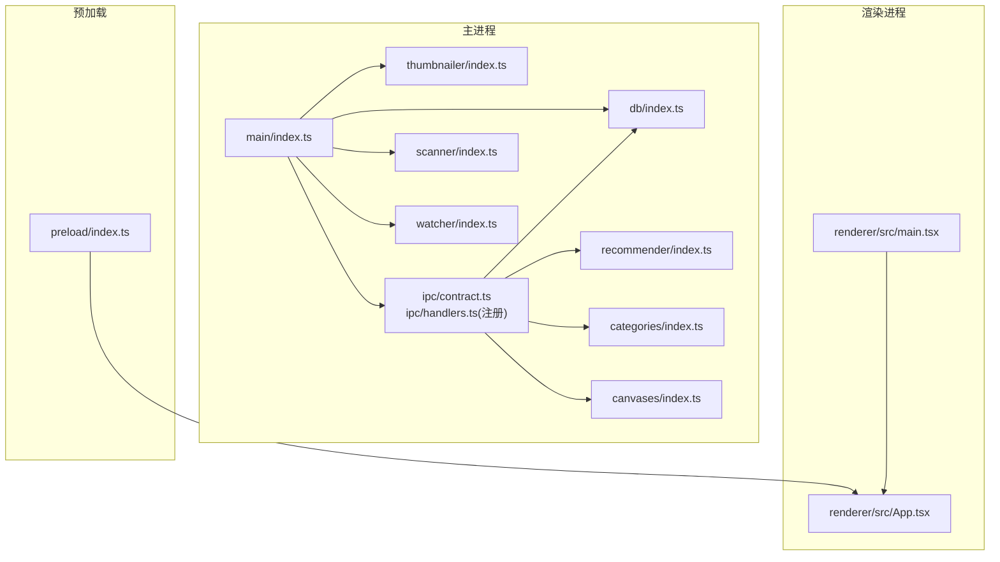
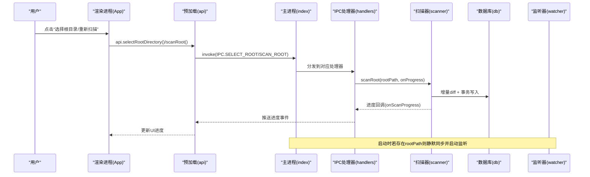
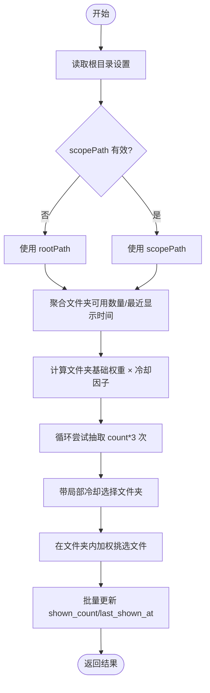
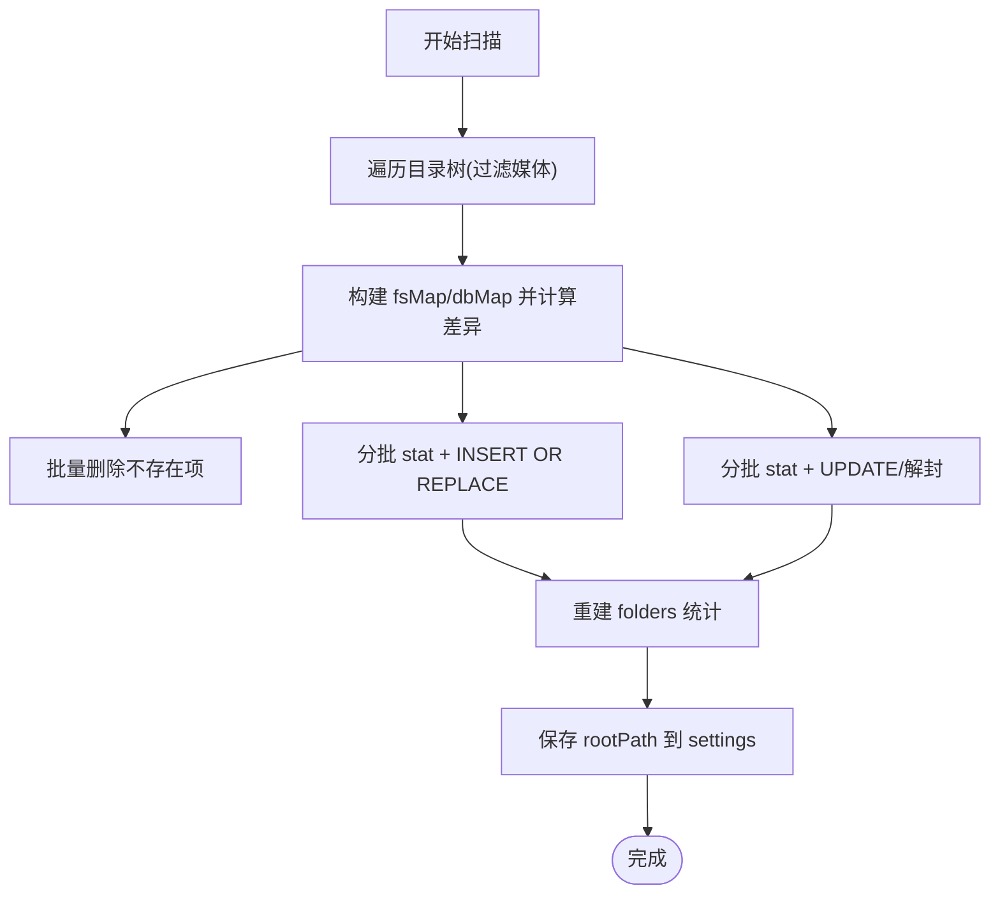
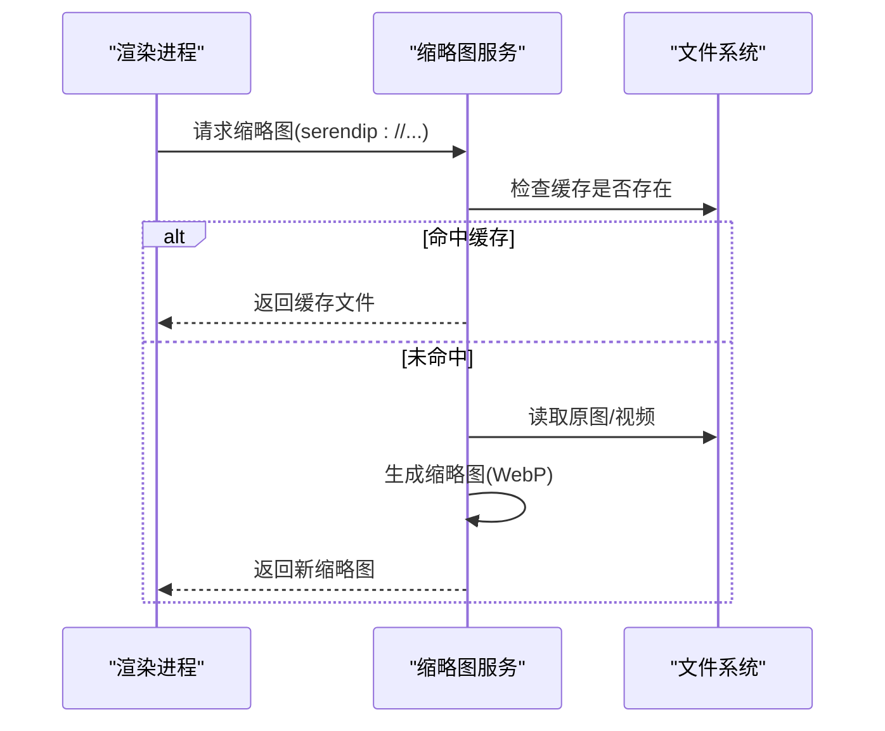
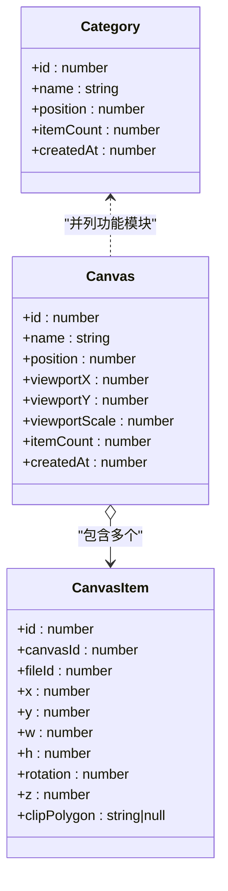
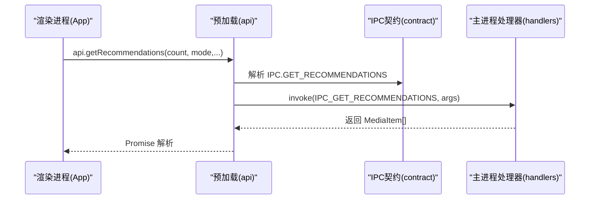
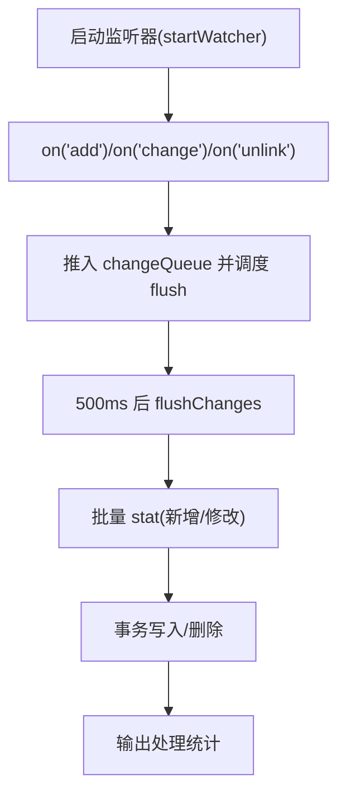
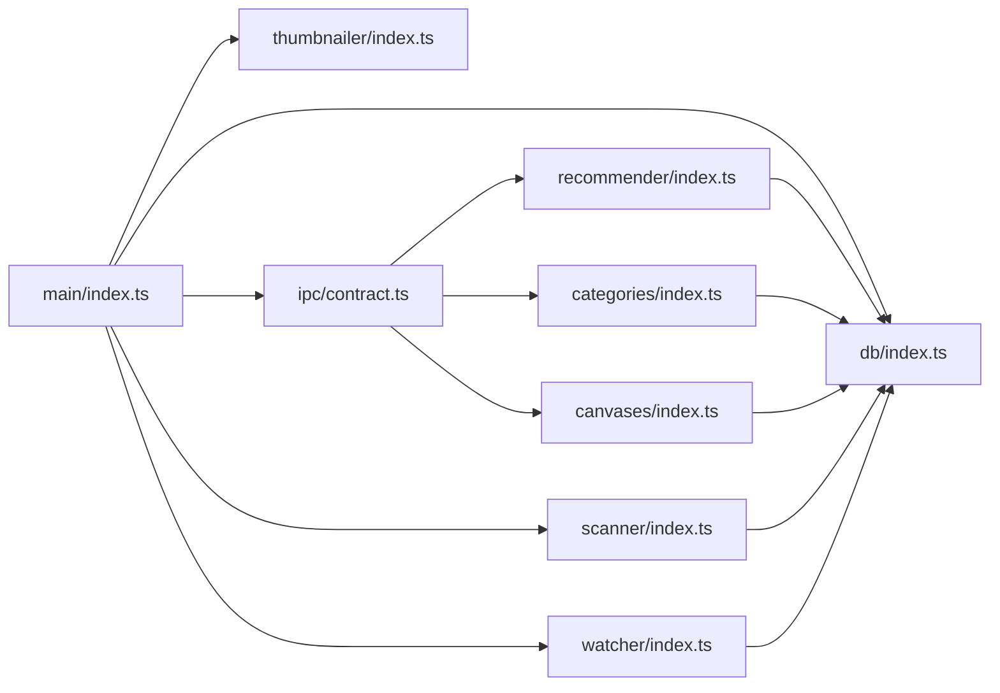

# 项目概述

<cite>
**本文引用的文件**   
- [README.md](file://README.md)
- [package.json](file://package.json)
- [src/main/index.ts](file://src/main/index.ts)
- [src/preload/index.ts](file://src/preload/index.ts)
- [src/renderer/src/main.tsx](file://src/renderer/src/main.tsx)
- [src/renderer/src/App.tsx](file://src/renderer/src/App.tsx)
- [src/main/ipc/contract.ts](file://src/main/ipc/contract.ts)
- [src/main/db/index.ts](file://src/main/db/index.ts)
- [src/main/scanner/index.ts](file://src/main/scanner/index.ts)
- [src/main/recommender/index.ts](file://src/main/recommender/index.ts)
- [src/main/categories/index.ts](file://src/main/categories/index.ts)
- [src/main/canvases/index.ts](file://src/main/canvases/index.ts)
- [src/main/thumbnailer/index.ts](file://src/main/thumbnailer/index.ts)
- [src/main/watcher/index.ts](file://src/main/watcher/index.ts)
- [docs/canvas-dev-plan.md](file://docs/canvas-dev-plan.md)
</cite>

## 目录
1. [简介](#简介)
2. [项目结构](#项目结构)
3. [核心组件](#核心组件)
4. [架构总览](#架构总览)
5. [详细组件分析](#详细组件分析)
6. [依赖分析](#依赖分析)
7. [性能考量](#性能考量)
8. [故障排查指南](#故障排查指南)
9. [结论](#结论)
10. [附录](#附录)

## 简介
Serendip 是一款基于 Electron 的桌面应用，专注于通过智能算法重新发现用户的本地照片与视频库。它以“智能随机”为核心体验：在用户偏好与探索广度之间取得平衡，结合无限瀑布流、缩略图服务、分类管理与画布模式，帮助用户高效浏览、组织与创作。

核心价值主张
- 智能推荐：两级加权抽样（文件夹级 + 文件级），支持“偏好/均衡/探索”三种模式，避免大文件夹虹吸效应，兼顾新鲜度与可重复性控制。
- 本地优先：所有数据与缓存落盘于本机，扫描与增量同步由主进程完成，渲染层专注交互与展示。
- 丰富工作流：探索瀑布流、评审滑卡、喜欢列表、收藏分类、画布排版与拖拽协作，覆盖从浏览到整理的完整链路。
- 高性能体验：WAL 模式的 SQLite、虚拟瀑布流、按需缩略图生成与自定义协议直读缓存，保障大数据量下的流畅体验。

技术栈概览
- 应用框架：Electron + electron-vite
- UI：React + TypeScript + Tailwind CSS
- 状态管理：Zustand（持久化）
- 瀑布流虚拟化：masonic
- 拖拽：@dnd-kit
- 数据库：better-sqlite3（WAL 模式）
- 缩略图：sharp（图片）+ fluent-ffmpeg（视频帧抽取）
- 文件监听：chokidar（增量同步）

典型用户工作流示例
- 首次使用：选择根目录 → 自动扫描并入库 → 进入“探索”瀑布流浏览 → 对喜欢的内容点赞或加入分类 → 切换到“画布”进行拼图式排版。
- 日常维护：启动时静默增量同步 → 实时监听新增/删除 → 定期重扫修复失效项 → 在“评审”视图批量处理未评级内容。

章节来源
- [README.md:1-66](file://README.md#L1-L66)
- [package.json:1-70](file://package.json#L1-L70)

## 项目结构
仓库采用主进程/预加载/渲染进程三层分离，业务按模块划分：
- src/main：主进程逻辑（IPC 契约与处理器、数据库迁移、扫描器、推荐算法、分类与画布、缩略图服务、文件监听）
- src/preload：安全桥接，暴露 window.api 给渲染层
- src/renderer：React 应用（路由视图、Zustand 状态、UI 组件、工具库）
- docs：开发计划与设计文档（含画布阶段规划）

图表来源
- [src/main/index.ts:1-134](file://src/main/index.ts#L1-L134)
- [src/main/ipc/contract.ts:1-130](file://src/main/ipc/contract.ts#L1-L130)
- [src/main/db/index.ts:1-190](file://src/main/db/index.ts#L1-L190)
- [src/main/scanner/index.ts:1-323](file://src/main/scanner/index.ts#L1-L323)
- [src/main/recommender/index.ts:1-518](file://src/main/recommender/index.ts#L1-L518)
- [src/main/categories/index.ts:1-166](file://src/main/categories/index.ts#L1-L166)
- [src/main/canvases/index.ts:1-320](file://src/main/canvases/index.ts#L1-L320)
- [src/main/thumbnailer/index.ts:1-138](file://src/main/thumbnailer/index.ts#L1-L138)
- [src/main/watcher/index.ts:1-117](file://src/main/watcher/index.ts#L1-L117)
- [src/preload/index.ts:1-104](file://src/preload/index.ts#L1-L104)
- [src/renderer/src/main.tsx:1-12](file://src/renderer/src/main.tsx#L1-L12)
- [src/renderer/src/App.tsx:1-800](file://src/renderer/src/App.tsx#L1-L800)

章节来源
- [README.md:36-52](file://README.md#L36-L52)

## 核心组件
- 数据库与迁移：WAL 模式提升并发；多版本迁移脚本管理 schema 演进；索引优化查询与过滤。
- 扫描器：fdir 遍历 + 增量 diff（新增/更新/删除）+ 事务批量写入；重建 folders 统计用于算法权重。
- 推荐引擎：两级加权抽样（文件夹权重抑制 + 文件冷却/显示次数惩罚），支持分层路径推荐与仅未评级模式。
- 缩略图服务：sharp 生成图片缩略图（EXIF 旋转、WebP 压缩）；fluent-ffmpeg 抽取视频中间帧；自定义协议 serendip:// 直接读取缓存。
- 文件监听：chokidar 监听增删改，聚合后批量 flush 入库，保持与初始扫描一致的语义。
- 分类与画布：CRUD、排序、关联表多对一/一对多；画布支持位置/尺寸/旋转/层级/裁剪多边形等变换持久化。
- IPC 契约：集中定义 SerendipAPI 接口与通道名，预加载桥接暴露给渲染层。

章节来源
- [src/main/db/index.ts:1-190](file://src/main/db/index.ts#L1-L190)
- [src/main/scanner/index.ts:1-323](file://src/main/scanner/index.ts#L1-L323)
- [src/main/recommender/index.ts:1-518](file://src/main/recommender/index.ts#L1-L518)
- [src/main/thumbnailer/index.ts:1-138](file://src/main/thumbnailer/index.ts#L1-L138)
- [src/main/watcher/index.ts:1-117](file://src/main/watcher/index.ts#L1-L117)
- [src/main/categories/index.ts:1-166](file://src/main/categories/index.ts#L1-L166)
- [src/main/canvases/index.ts:1-320](file://src/main/canvases/index.ts#L1-L320)
- [src/main/ipc/contract.ts:1-130](file://src/main/ipc/contract.ts#L1-L130)

## 架构总览
主进程负责系统能力（文件系统、数据库、媒体处理、协议注册），渲染进程专注 UI 与交互。两者通过预加载桥接的 IPC 通信，严格遵循最小权限原则。

图表来源
- [src/main/index.ts:93-125](file://src/main/index.ts#L93-L125)
- [src/main/scanner/index.ts:36-239](file://src/main/scanner/index.ts#L36-L239)
- [src/main/watcher/index.ts:16-50](file://src/main/watcher/index.ts#L16-L50)
- [src/preload/index.ts:78-86](file://src/preload/index.ts#L78-L86)
- [src/main/ipc/contract.ts:84-130](file://src/main/ipc/contract.ts#L84-L130)

## 详细组件分析

### 智能推荐模块
- 设计要点
  - 两级加权：先选文件夹（按可用文件数幂次抑制），再在文件夹内加权抽文件（考虑 liked、冷却、显示次数）。
  - 模式参数：prefer/balanced/explore 分别调节 folderAlpha、冷却半衰期、likedBoost、shownCountPenalty 等。
  - 分层推荐：以当前路径为锚点，向上父链放宽采样，保证“就近相关”与“广域探索”的平衡。
- 复杂度与性能
  - 单次推荐主要开销在 SQL 聚合与内存加权计算；通过索引与只读字段减少 IO。
  - 本批次内局部冷却 Map 防止同批重复抽取同一文件夹。
- 错误与边界
  - 无可用文件或 scopePath 越界时回退策略；LIKE 转义防注入。

图表来源
- [src/main/recommender/index.ts:57-149](file://src/main/recommender/index.ts#L57-L149)
- [src/main/recommender/index.ts:155-206](file://src/main/recommender/index.ts#L155-L206)
- [src/main/recommender/index.ts:471-504](file://src/main/recommender/index.ts#L471-L504)

章节来源
- [src/main/recommender/index.ts:1-518](file://src/main/recommender/index.ts#L1-L518)

### 扫描与增量同步
- 流程
  - fdir 遍历过滤媒体类型 → 与数据库记录 diff → 批量删除/插入/更新 → 重建 folders 统计 → 保存 rootPath。
  - 扫描期间分块 stat + 事务写入，持续推送进度。
- 可靠性
  - 对已标记 unavailable 的文件，若 mtime/size 未变也解封，避免误判。
  - LIKE 转义与忽略隐藏/系统目录，提高健壮性。

图表来源
- [src/main/scanner/index.ts:36-239](file://src/main/scanner/index.ts#L36-L239)
- [src/main/scanner/index.ts:274-317](file://src/main/scanner/index.ts#L274-L317)

章节来源
- [src/main/scanner/index.ts:1-323](file://src/main/scanner/index.ts#L1-L323)

### 缩略图服务与自定义协议
- 图片：sharp 元数据 + EXIF 旋转 + WebP 压缩，命中缓存则跳过。
- 视频：ffprobe 一次获取时长/宽高，ffmpeg 抽取中间帧作为封面。
- 协议：注册 serendip:// 特权协议，渲染层可直接请求缩略图资源，无需额外代理。

图表来源
- [src/main/thumbnailer/index.ts:27-94](file://src/main/thumbnailer/index.ts#L27-L94)
- [src/main/index.ts:26-36](file://src/main/index.ts#L26-L36)

章节来源
- [src/main/thumbnailer/index.ts:1-138](file://src/main/thumbnailer/index.ts#L1-L138)
- [src/main/index.ts:26-36](file://src/main/index.ts#L26-L36)

### 分类与画布模块
- 分类
  - 唯一名称、position 排序；category_items 多对多关联；删除分类级联清理。
  - 提供添加/移除/批量操作与文件所属分类查询。
- 画布
  - canvases 存储视口与顺序；canvas_items 记录媒体项坐标、尺寸、旋转、层级与裁剪多边形。
  - 支持批量添加（按原始宽高比推算）、原始变换保真插入、批量更新与视口持久化。

图表来源
- [src/main/categories/index.ts:12-32](file://src/main/categories/index.ts#L12-L32)
- [src/main/canvases/index.ts:11-73](file://src/main/canvases/index.ts#L11-L73)
- [src/main/canvases/index.ts:152-170](file://src/main/canvases/index.ts#L152-L170)

章节来源
- [src/main/categories/index.ts:1-166](file://src/main/categories/index.ts#L1-L166)
- [src/main/canvases/index.ts:1-320](file://src/main/canvases/index.ts#L1-L320)

### IPC 契约与预加载桥接
- 契约：集中定义 SerendipAPI 方法与 IPC 通道常量，确保主/渲染端一致。
- 预加载：contextBridge 暴露 window.api，封装 ipcRenderer.invoke/on，统一错误与类型。

图表来源
- [src/main/ipc/contract.ts:13-75](file://src/main/ipc/contract.ts#L13-L75)
- [src/main/ipc/contract.ts:84-130](file://src/main/ipc/contract.ts#L84-L130)
- [src/preload/index.ts:9-89](file://src/preload/index.ts#L9-L89)

章节来源
- [src/main/ipc/contract.ts:1-130](file://src/main/ipc/contract.ts#L1-L130)
- [src/preload/index.ts:1-104](file://src/preload/index.ts#L1-L104)

### 实时监听与增量同步
- chokidar 监听 add/change/unlink，过滤非媒体类型与敏感目录。
- 500ms 节流合并变更，批量 stat 后事务写入，保持与扫描一致的语义。

图表来源
- [src/main/watcher/index.ts:16-50](file://src/main/watcher/index.ts#L16-L50)
- [src/main/watcher/index.ts:52-116](file://src/main/watcher/index.ts#L52-L116)

章节来源
- [src/main/watcher/index.ts:1-117](file://src/main/watcher/index.ts#L1-L117)

## 依赖分析
- 外部依赖
  - better-sqlite3：本地数据库，启用 WAL 与外键约束。
  - sharp/fluent-ffmpeg：缩略图与视频元数据/帧抽取。
  - chokidar：文件系统监听。
  - @dnd-kit/masonic/zustand/tailwind：前端交互与样式。
- 内部耦合
  - main/index.ts 作为入口，初始化 DB、协议、IPC、扫描与监听。
  - recommender 强依赖 db 与 scanner 产出的 folders/media_files 数据。
  - thumbnailer 独立于业务模块，通过协议被渲染层消费。
  - categories/canvases 共享 db 抽象，互不依赖。

图表来源
- [src/main/index.ts:1-134](file://src/main/index.ts#L1-L134)
- [src/main/ipc/contract.ts:1-130](file://src/main/ipc/contract.ts#L1-L130)
- [src/main/db/index.ts:1-190](file://src/main/db/index.ts#L1-L190)
- [src/main/scanner/index.ts:1-323](file://src/main/scanner/index.ts#L1-L323)
- [src/main/recommender/index.ts:1-518](file://src/main/recommender/index.ts#L1-L518)
- [src/main/categories/index.ts:1-166](file://src/main/categories/index.ts#L1-L166)
- [src/main/canvases/index.ts:1-320](file://src/main/canvases/index.ts#L1-L320)
- [src/main/thumbnailer/index.ts:1-138](file://src/main/thumbnailer/index.ts#L1-L138)
- [src/main/watcher/index.ts:1-117](file://src/main/watcher/index.ts#L1-L117)

章节来源
- [package.json:23-42](file://package.json#L23-L42)

## 性能考量
- 数据库
  - WAL 模式与 NORMAL 同步级别提升并发与吞吐；关键列建立索引（folder_path、type、liked/disliked、last_shown_at、unavailable、position 等）。
- 扫描与监听
  - 分块 stat + 事务批量写入；监听侧 500ms 合并，降低频繁 I/O。
- 缩略图
  - 命中缓存即走磁盘直读；WebP 压缩与固定宽度缩放降低带宽与内存占用。
- 渲染
  - 瀑布流虚拟化（masonic）与独立滚动容器，避免长列表重排；主题切换与全屏事件通过 IPC 轻量通知。

[本节为通用指导，不直接分析具体文件]

## 故障排查指南
- 视频播放导致全屏闪烁（Windows）
  - 现象：DirectComposition 叠加平面切换引起整屏色彩/HDR 抖动。
  - 解决：主进程启动时禁用 DirectCompositionVideoOverlays 与 UseMultiPlaneOverlayForVideo；必要时降级关闭 DirectComposition（可能影响合成性能）。
- 缩略图生成失败
  - 现象：视频无法抽取帧或图片损坏。
  - 处理：扫描器将文件标记 unavailable 并记录原因；后续扫描若 mtime/size 未变也会解封；可在详情页打开系统默认应用验证源文件。
- 分类/画布重命名冲突
  - 现象：唯一约束导致重复名称报错。
  - 处理：提示用户修改名称；后端抛出明确错误信息供 UI 展示。
- 监听器未生效
  - 现象：新增文件未入库。
  - 排查：确认 ignored 规则是否误过滤；检查 flush 定时器是否被提前清除；查看控制台日志输出。

章节来源
- [src/main/index.ts:12-23](file://src/main/index.ts#L12-L23)
- [src/main/scanner/index.ts:117-121](file://src/main/scanner/index.ts#L117-L121)
- [src/main/categories/index.ts:34-76](file://src/main/categories/index.ts#L34-L76)
- [src/main/canvases/index.ts:92-131](file://src/main/canvases/index.ts#L92-L131)
- [src/main/watcher/index.ts:16-50](file://src/main/watcher/index.ts#L16-L50)

## 结论
Serendip 以“智能随机”为核心，结合稳健的主/渲染分离架构与本地优先的数据策略，提供了从浏览、整理到创作的完整体验。通过两级加权推荐、增量同步与高性能缩略图服务，既满足初学者轻松上手的需求，也为进阶用户提供足够的扩展空间与调优手段。

[本节为总结性内容，不直接分析具体文件]

## 附录
- 发展阶段规划（节选）
  - 已完成：脚手架与主题、SQLite 与扫描、智能随机 v1 与探索瀑布流、喜欢/不感兴趣与右键菜单、收藏分类 CRUD 与拖拽、多选与批量操作。
  - 进行中/待实现：评审滑卡模式、实时监听与增量同步、动效打磨、空/加载/错误态、大数据量压测与调优。
- 画布模式开发计划
  - 详见文档：docs/canvas-dev-plan.md（已迁移至独立阶段文档）。

章节来源
- [README.md:54-66](file://README.md#L54-L66)
- [docs/canvas-dev-plan.md:1-6](file://docs/canvas-dev-plan.md#L1-L6)